# 沧海巨浪 · 架构审阅图（T1' 纠偏版）

**版本**: v0.1-draft（待用户 sign-off）  
**日期**: 2026-07-05  
**依据**: `docs/00-CANONICAL-ARCHITECTURE-v1.md` v1.2  
**状态**: 审阅稿 — **sign-off 前不得按旧进度表继续施工**

**本文档目的**: 把 CANONICAL 原设计、当前偏离、T1' 目标架构、数据流、MCP/工具层、Cron 拓扑 **全部用图讲清楚**，供全局审阅后再开工。

**用户已拍板（2026-07-05）**:

| 决策项 | 选择 |
|--------|------|
| Research / Plan / Review 主路径 | Hermes LLM 会话 + `delegate_task` |
| Skill 组织 | **方案 B**：T1' 全写进 `SKILL.md`，跑通后再拆 `skill_logic.md` + `skill_prompt_*.md` |
| Hermes 旧 profile / cron | **可全部推倒重写** |
| Python 规则版 (r*.py / d1_algorithm) | **Hermes 全部做完之后**再写 fallback，T1' 不扩展 |
| Execute 轮询 | **30–60s**（无打板）；CANONICAL 秒级描述 = T2.x 可选增强 |
| 旧 research/plan 系统 | Hermes 链跑通即停旧 cron |
| Fetch cron | 暂不动（等 research/plan 先通） |

---

## 0. 一句话总结

> **CANONICAL 设计的是「Hermes 运行时 + 项目仓库资产」双平面系统；当前施工几乎只做了资产平面里的 Python 脚本链，Hermes 的 LLM/delegation/harness 未接线。T1' = 先把 Hermes 跑通，Python fallback 后置。**

---

## 1. 双平面架构（宪法级）

系统由两个平面组成，**不可混为一谈**：

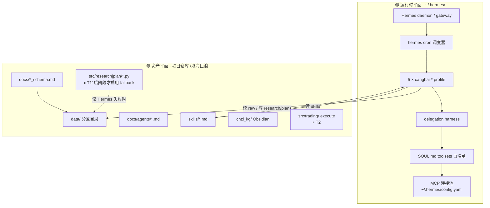

| 平面 | 路径 | 职责 | T1' 状态 |
|------|------|------|----------|
| **运行时** | `~/.hermes/profiles/canghai-*/` | LLM 会话、delegation、tool 拦截、cron | 🔴 名义存在，research/plan **未接线** |
| **资产** | `/Users/chenyang/Downloads/demo/沧海巨浪/` | schema、skill、artifact I/O、（延后）fallback | 🟡 fetch 脚本 ✅；research/plan Python ⚠️ **冻结不扩展** |

### 1.1 当前偏离 vs 目标（对照）

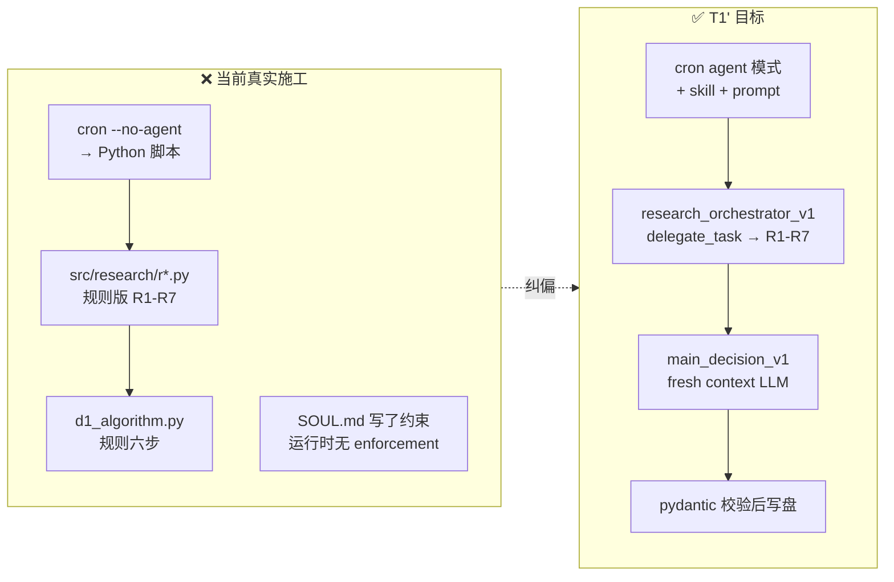

---

## 2. 五 Profile 总览（类脑映射 + 载体）

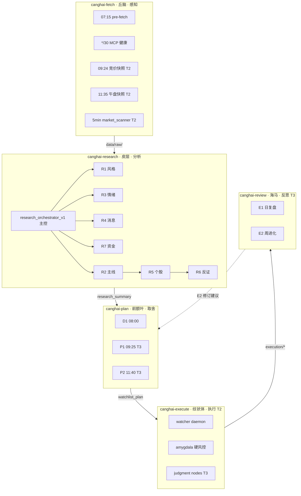

| Profile | 类脑 | 载体 | LLM 会话/日 | T1' |
|---------|------|------|-------------|-----|
| `canghai-fetch` | 丘脑 | Python 脚本为主 | 0–1 | ✅ 保持 `--no-agent` |
| `canghai-research` | 皮层 | **主控 LLM + 7×delegation** | 1 + 7 | 🔴 **T1' 核心** |
| `canghai-plan` | 前额叶 | **fresh context LLM ×3** | 3（D1 先通） | 🔴 **T1' 核心** |
| `canghai-execute` | 纹状体 | Python daemon + 受控 LLM 节点 | 视触发 | ⬜ T2 |
| `canghai-review` | 海马 | fresh context LLM | 1–2 | ⬜ T3 |

**关键宪法（不可违反）**:

- D1 / P1 / P2 / E1 / E2 必须 **fresh context**（07-03 分散持仓教训）
- R6 `hard_reject` 对 D1 有 **唯一硬否决权**
- Execute **不做研究、不选股** — 只消费 plan artifact

---

## 3. 每日数据流时间轴（CANONICAL §3.3）

```mermaid
gantt
  title 交易日数据流（Mon–Fri）
  dateFormat HH:mm
  axisFormat %H:%M

  section Fetch
  pre-fetch 公众号/WeFlow/群聊     :f1, 07:15, 10m
  MCP 健康 manifest               :f2, 07:15, 10m
  竞价快照 (T2)                   :f3, 09:24, 1m
  午盘快照 (T2)                   :f4, 11:35, 5m

  section Research
  R1/R3/R4/R7 并行 delegation     :r1, 07:30, 15m
  R2/R5 串行 delegation           :r2, 07:45, 10m
  R6 反证 delegation              :r6, 07:55, 5m
  research_summary 落盘           :rs, 08:00, 1m
  R7 午盘增量 (T2)                :r7, 11:35, 10m

  section Plan
  D1 watchlist_plan + 盘前 md     :d1, 08:00, 20m
  P1 竞价校准 (T3)                :p1, 09:25, 4m
  P2 午盘修订 (T3)                :p2, 11:40, 25m

  section Execute
  watcher 启动 (T2)               :e1, 09:15, 350m
  reload amendment (T2)           :e2, 09:29, 1m

  section Review
  E1 日复盘 (T3)                  :e1r, 15:10, 30m
  E2 周进化 (T3 Fri)              :e2r, 15:30, 45m
  
```

### 3.1 盘前主链路（T1' 验收范围）

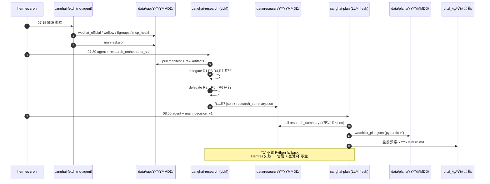

---

## 4. Artifact 链与 Schema 契约

**原则**: Schema-first, prompt-second — LLM 只负责「填 schema」，契约在 `docs/` 定义。

```mermaid
flowchart LR
  subgraph RAW["data/raw/YYYYMMDD/"]
    m[manifest.json]
    w1[wechat_official_20.jsonl]
    w2[weflow_snapshot.json]
    w3[wechat_cli_5groups.jsonl]
    h[mcp_health.json]
  end

  subgraph RES["data/research/YYYYMMDD/"]
    r1[R1_style.json]
    r2[R2_main_sectors.json]
    r3[R3_sentiment.json]
    r4[R4_news.json]
    r5[R5_stock_profiles.json]
    r6[R6_devil_advocate.json]
    r7[R7_capital_flow.json]
    rs[research_summary.json]
  end

  subgraph PLN["data/plans/YYYYMMDD/"]
    wp[watchlist_plan.json]
    aa[auction_amendment.json]
    ma[midday_amendment.json]
    ld[watchlist_plan.loaded.json]
  end

  subgraph EXE["data/execution/YYYYMMDD/ T2"]
    ev[events.jsonl]
    od[orders.jsonl]
  end

  RAW --> RES
  RES --> PLN
  PLN --> EXE
```

| 契约 | 文件 | 生产者 | 消费者 | Schema 文档 |
|------|------|--------|--------|-------------|
| 契约 3 | `research_summary.json` | research 主控 | D1, E1 | `docs/research_summary_schema.md` |
| R* 单元 | `R1_style.json` … `R7_*.json` | R1–R7 sub-agent | 主控 / D1 pull | `docs/agents/R*-*.md` |
| 契约 1 | `watchlist_plan.json` | D1 | execute | `docs/watchlist_plan_schema.md` |
| 契约 2 | `*_amendment.json` | P1/P2 | execute | `docs/amendment_schema.md` |

**写盘铁律**:

1. pydantic 校验 **不过 → 不写盘**（沿用上一版 + 告警）
2. 各 profile **只能写 SOUL Ownership 白名单目录**
3. artifact 之间 **只通过磁盘 pull**，不共享 LLM context

---

## 5. Delegation 机制（CANONICAL §2.3）

```mermaid
flowchart TB
  subgraph MAIN["canghai-research · 主控会话"]
    ORCH[research_orchestrator_v1]
    ORCH -->|delegate_task| D1
    ORCH -->|delegate_task| D3
    ORCH -->|delegate_task| D4
    ORCH -->|delegate_task| D7
    ORCH -->|delegate_task| D2
    ORCH -->|delegate_task| D5
    ORCH -->|delegate_task| D6
  end

  subgraph D1["Sub-agent R1 · analyze_style_v1"]
    T1["toolsets: file, tushare, xtick"]
    O1[R1_style.json]
  end

  subgraph D3["Sub-agent R3 · analyze_sentiment_resonance_v1"]
    T3["toolsets: file, weflow, hotlist"]
    O3[R3_sentiment.json]
  end

  subgraph D4["Sub-agent R4 · analyze_news_impact_v1"]
    T4["toolsets: file, wechat, tushare"]
    O4[R4_news.json]
  end

  subgraph D7["Sub-agent R7 · analyze_capital_flow_v1"]
    T7["toolsets: file, tushare, xtick, datapro"]
    O7[R7_capital_flow.json]
  end

  subgraph D2["Sub-agent R2 · analyze_main_sectors_v1"]
    T2["toolsets: file, tushare, datapro, hithink"]
    O2[R2_main_sectors.json]
  end

  subgraph D5["Sub-agent R5 · analyze_stock_profile_v1"]
    T5["toolsets: file, tushare, serenity-alpha, valuation"]
    O5[R5_stock_profiles.json]
  end

  subgraph D6["Sub-agent R6 · analyze_devil_advocate_v1"]
    T6["toolsets: file ONLY · 禁 MCP"]
    O6[R6_devil_advocate.json]
  end

  O1 & O3 & O4 & O7 & O2 & O5 & O6 --> SUM[research_summary.json]
```

### 5.1 调度时序（硬约束）

| 时点 | 动作 | 依赖 |
|------|------|------|
| 07:30 | 并行 delegate: **R1, R3, R4, R7** | `data/raw/` + manifest |
| 07:45 | 串行 delegate: **R2**（读 R1/R3/R4/R7 artifact） | 上一步产出 |
| 07:45 | 串行 delegate: **R5**（读 R2 龙头列表） | R2 |
| 07:55 | delegate: **R6**（读 R1–R5 + R7，**禁 MCP**） | 全部上游 |
| 08:00 | 主控写 `research_summary.json` | 全部 R* 路径 + confidence |

**主控禁止**:

- 直接调用 MCP（必须 delegation）
- 修改 `user_preferences.yaml` / `human_thesis/`（只读）

**Sub-agent 隔离**:

- 中间 tool call **不进主控 context**
- 只回传 **最终 artifact 路径 + schema 校验结果**

---

## 6. 节点级：LLM 主路径 vs Python（T1' 范围）

| 单元 | 主路径 | 需要 LLM 的原因 | Python fallback |
|------|--------|-----------------|-----------------|
| **Fetch** | Python `--no-agent` | 确定性采集 | N/A（本身就是 Python） |
| **R1** | LLM + MCP | 五模式识别 + 情绪浓度语义 | ⏸ 后置 `r1_style.py` |
| **R2** | LLM + MCP | 需消费 R3/R4 叙事共振 | ⏸ 后置 `r2_main_sectors.py` |
| **R3** | **LLM 必须** | WeFlow/群聊/热榜 = 非结构化 | ⏸ 后置，不扩展关键词版 |
| **R4** | **LLM 必须** | 公众号事件抽取 + 板块映射 | ⏸ 后置 |
| **R5** | LLM + MCP/KB | 六维画像 + serenity 链 | ⏸ 后置 |
| **R6** | **LLM 必须** | 对抗性反证 / hard_reject | ⏸ 后置 |
| **R7** | LLM + MCP | 资金解读 + 跷跷板叙事 | ⏸ 后置 |
| **D1** | **LLM fresh context** | 全局唯一裁决 | ⏸ 后置 `d1_algorithm.py` |
| **P1/P2** | LLM fresh (T3) | 竞价/午盘打脸判断 | T3 后 |
| **E1/E2** | LLM fresh (T3) | 诚实复盘 / 进化 | T3 |
| **Execute L1/L2** | 纯 Python (T2) | 纪律 / 硬风控 | — |
| **Execute L3** | 受控 LLM (T3) | confirm/reject/defer 枚举 | Python 默认 reject |

---

## 7. MCP 与工具层（全局拓扑）

### 7.1 MCP Server 注册（`~/.hermes/config.yaml`）

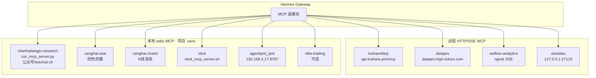

| MCP Server | 传输 | 主要能力 | α/β/γ/δ 层 |
|------------|------|----------|-------------|
| `tushareMcp` | HTTP | 热榜/连板/资金/板块/公告 | α β γ |
| `xtick` | stdio | 实时行情/情绪/新闻聚合 | α β γ |
| `weflow-analytics` | SSE | 群聊情绪量化 snapshot | α |
| `chenhailangju-research` | stdio | 20 号公众号 + wechat-cli 5 群 | α γ |
| `datapro` | HTTP | 板块资金备源 | β |
| `canghai-sise` | stdio | 四色四量/KB 技术 | β |
| `canghai-charts` | stdio | K 线/分时出图 | 图表 |
| `agentqmt_qmt` | HTTP | 持仓/下单/成交 | **δ 仅 execute/review** |
| `obsidian` | HTTP | KB 读写（可选） | 辅助 |

> **研究端红线**（`docs/11-数据源分层与降级.md`）: α β γ 进 research；**δ 执行层数据不进 R1–R7**（QMT 报价不给 research agent）。

### 7.2 SOUL Toolsets 别名 → MCP 映射

SOUL.md 里的 toolsets 是 **逻辑别名**；Hermes harness 将其映射到具体 MCP / 内置 tool：

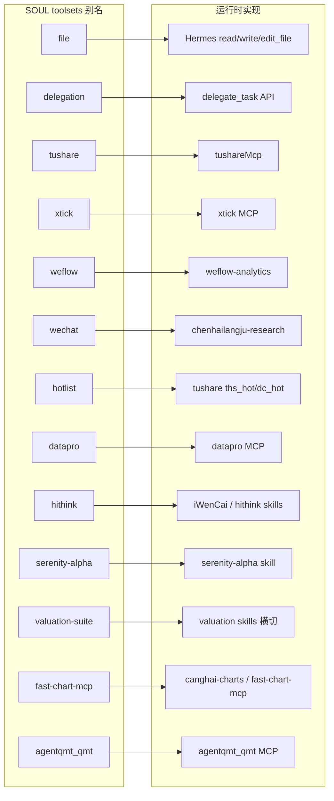

### 7.3 各 Profile 的 Toolsets 白名单

| Profile | SOUL Toolsets | 说明 |
|---------|---------------|------|
| **canghai-fetch** | `file, tushare, xtick, weflow, wechat, qmt-quote` | 只读采集；**不做分析** |
| **canghai-research 主控** | `file, delegation` | **禁止直接 MCP** |
| **R1** | `file, tushare, xtick` | |
| **R2** | `file, tushare, datapro, hithink` | + `filter_leader_v1` |
| **R3** | `file, weflow, hotlist` | + `hotlist_rank_signal_v1` |
| **R4** | `file, wechat, tushare` | |
| **R5** | `file, tushare, serenity-alpha, valuation-suite` | |
| **R6** | **`file` only** | 反证禁 MCP |
| **R7** | `file, tushare, xtick, datapro` | + seesaw / hot_money skills |
| **canghai-plan D1** | `file, fast-chart-mcp` | **不直接调数据源** |
| **canghai-plan P1/P2** | `file` only | 4min/30min 硬时限 |
| **canghai-execute** | `agentqmt_qmt, xtick` | 无 tushare/公众号/WeFlow |
| **canghai-review** | `tushareMcp, agentqmt_qmt, xtick` | 只回看，不下单 |

### 7.4 数据源三层与 Agent 消费关系

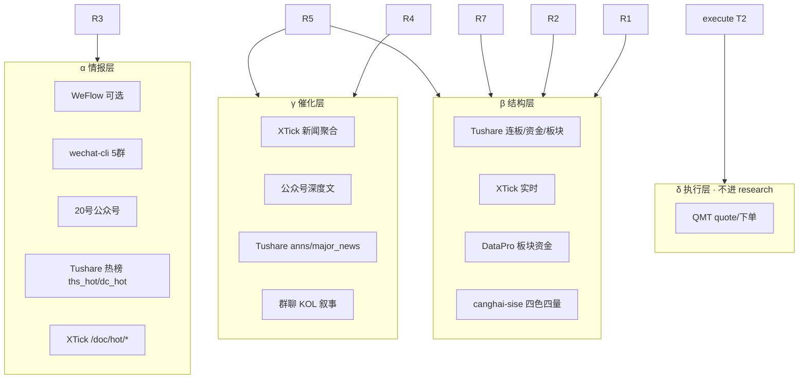

降级策略详见 `docs/11-数据源分层与降级.md` — **T1' 由 LLM skill 内实现 fallback 描述**（写进 `SKILL.md`），不是 Python 规则链。

---

## 8. Skill 资产模型（方案 B · T1'）

Hermes **只认 `SKILL.md` 入口**。CANONICAL §4.1 的双层结构是 **项目组织约定**，T1' 阶段 **全部塞进 SKILL.md**，跑通后再拆：

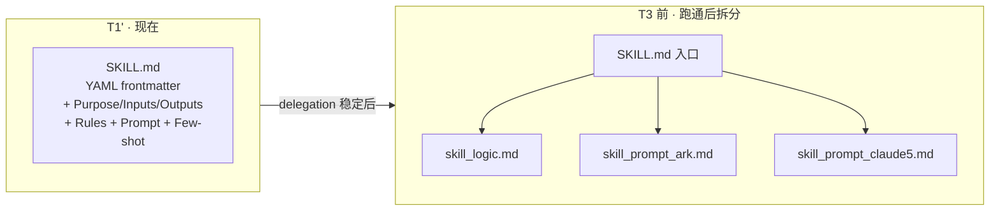

### 8.1 T1' 必须实装内容的 Skill（优先级）

| 优先级 | Skill | Profile | 说明 |
|:------:|-------|---------|------|
| P0 | `research_orchestrator_v1` | research | 主控调度 + 收集 summary |
| P0 | `analyze_sentiment_resonance_v1` | research R3 | 非结构化核心 |
| P0 | `analyze_news_impact_v1` | research R4 | 非结构化核心 |
| P0 | `analyze_devil_advocate_v1` | research R6 | hard_reject |
| P0 | `main_decision_v1` | plan D1 | fresh context 裁决 |
| P1 | `analyze_style_v1` | research R1 | |
| P1 | `analyze_main_sectors_v1` + `filter_leader_v1` | research R2 | |
| P1 | `analyze_stock_profile_v1` | research R5 | |
| P1 | `analyze_capital_flow_v1` | research R7 | |
| P1 | `exit_rules_derivation_v1` | plan D1 | exit_rule 生成 |
| P2 | fetch 系列 / P1/P2 / E1/E2 | 各 profile | T2/T3 |

### 8.2 Skill 与 Agent Spec 映射

| Sub-agent | Skill(s) | Agent Spec |
|-----------|----------|------------|
| R1 | `analyze_style_v1` | `docs/agents/R1-风格Agent.md` |
| R2 | `analyze_main_sectors_v1`, `filter_leader_v1` | `docs/agents/R2-主线板块Agent.md` |
| R3 | `analyze_sentiment_resonance_v1`, `hotlist_rank_signal_v1` | `docs/agents/R3-情绪与热度Agent.md` |
| R4 | `analyze_news_impact_v1` | `docs/agents/R4-消息面Agent.md` |
| R5 | `analyze_stock_profile_v1`, `serenity_analyst` | `docs/agents/R5-情报深挖Agent.md` |
| R6 | `analyze_devil_advocate_v1` | `docs/agents/R6-反证Agent.md` |
| R7 | `analyze_capital_flow_v1`, `detect_seesaw_pairs_v1`, `hot_money_synergy_v1` | `docs/agents/R7-资金面Agent.md` |
| D1 | `main_decision_v1`, `exit_rules_derivation_v1` | `docs/agents/D1-主决策Agent.md` |

---

## 9. Cron 拓扑（纠正版）

### 9.1 Mode 分类

| 类型 | Hermes cron 参数 | 适用 Profile | 示例 |
|------|------------------|--------------|------|
| **Script-only** | `--script xxx.sh --no-agent` | canghai-fetch | 07:15 pre-fetch ✅ |
| **Agent + Skill** | `--skill xxx_v1` + prompt（**无** `--no-agent`） | research, plan, review | 07:30 research ⏳ |
| **Daemon** | 系统服务 + keepalive cron | canghai-execute | T2 watcher |

### 9.2 目标 Cron 一览（CANONICAL §7.7）

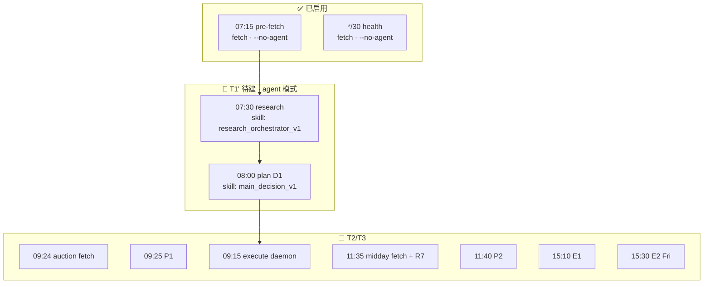

**Agent 模式 cron 示例（T1' 目标，非 `--no-agent`）**:

```bash
ROOT="/Users/chenyang/Downloads/demo/沧海巨浪"

# 07:30 research — LLM 主控 + delegation
hermes cron create "30 7 * * 1-5" \
  --name "canghai-research · 盘前分析(research-orchestrator)" \
  --skill research_orchestrator_v1 \
  --workdir "$ROOT" \
  --deliver local \
  "执行 research_orchestrator_v1：读取 data/raw/YYYYMMDD/manifest.json，按 SOUL 时序 delegate R1-R7，产出 research_summary.json。trade_date=今日。"

# 08:00 D1 — fresh context LLM
hermes cron create "0 8 * * 1-5" \
  --name "canghai-plan · 主决策(D1)" \
  --skill main_decision_v1 \
  --workdir "$ROOT" \
  --deliver local \
  "执行 main_decision_v1：pull research_summary.json，fresh context 综合裁决，产出 watchlist_plan.json + 盘前预案 md。"
```

> **注意**: cron job 与 profile 的绑定方式需在 T1' 施工第一步验证（`hermes profile use canghai-research` 或在 job 元数据中指定）。旧 `cron/crontab.txt` 里 research/plan 的 `--no-agent` 模板 **作废**。

### 9.3 Hermes 边界（薄脚本原则）

`~/.hermes/scripts/*.sh` **≤10 行**，只做 `cd → source .venv → exec 项目脚本`（见 `docs/hermes-project-boundary.md`）。

- ✅ fetch 继续用薄脚本 + `--no-agent`
- ❌ research/plan **不应**再新增 Python orchestrator cron 作为主路径

---

## 10. Execute 层（T2 · 用户拍板 30–60s）

CANONICAL §5.1 描述秒级 tick + 分钟级全市场；**用户拍板 T2.1 用 30–60s 轮询**，秒级/分钟级为后续增强。

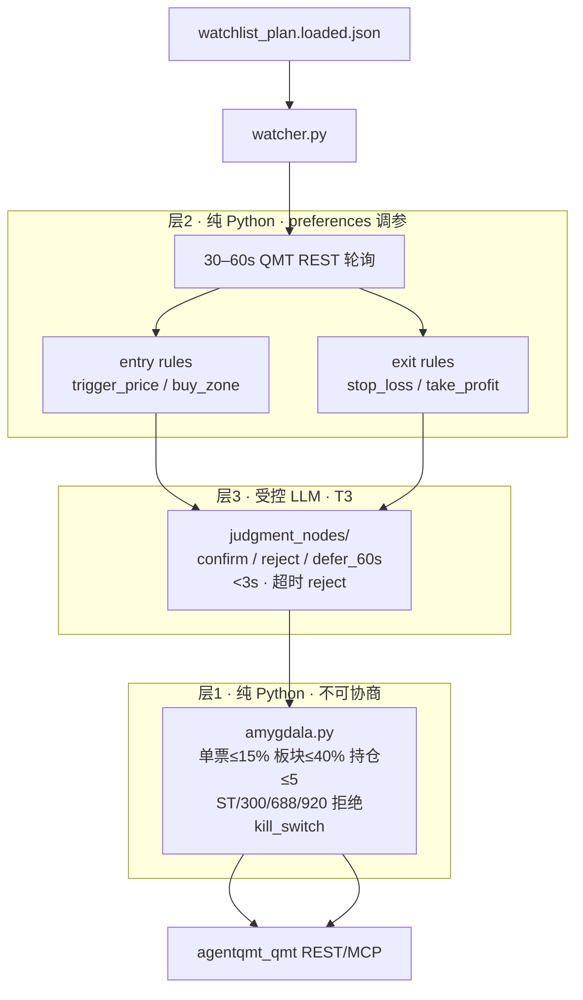

| 频率 | CANONICAL | 用户 T2.1 | 说明 |
|------|-----------|-----------|------|
| execution_pool 轮询 | 1–5s | **30–60s** | 无打板，纪律优先 |
| 全市场横截面 | 1min | T2.2 可选 | 板块共振 |
| market_scanner | 5min | T2.3 | iLink 异动 |
| plan reload | 10min | 10min | amendment 合并 |

---

## 11. Review 层（T3 · 预览）

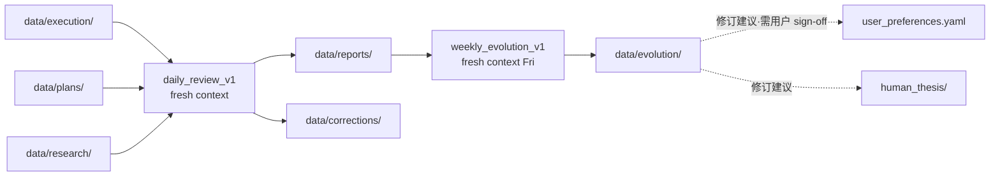

**E2 宪法**: 可提 preferences/thesis/skill 修订建议，**不能自动改** — 用户是唯一变更触发者。

---

## 12. 用户三重角色与输入通道

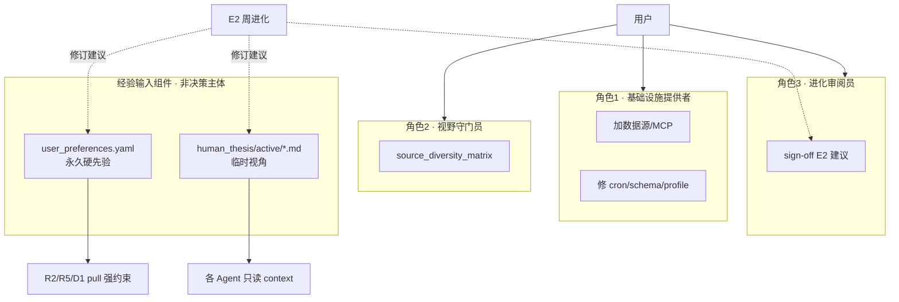

---

## 13. T1' 施工顺序（Hermes 优先 · 零 Python 扩展）

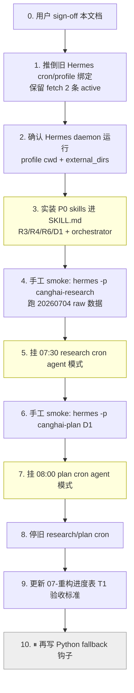

### 13.1 T1' 验收标准（替换旧进度表）

- [ ] 07:30 Hermes agent 会话完成 R1–R7 delegation
- [ ] `research_summary.json` 由 LLM 产出（非 Python orchestrator）
- [ ] R3/R4 artifact 含 **语义分析字段**（非关键词计数）
- [ ] 08:00 D1 fresh context 产出 **pydantic 校验通过** 的 `watchlist_plan.json`
- [ ] 盘前 md 落盘 `chzl_kg/投研交易/盘前预案/`
- [ ] 旧 research/plan cron **已停止**
- [ ] **未新增** Python 规则代码行（fallback 阶段除外）

### 13.2 明确不做（防误入歧途）

| ❌ 不做 | 原因 |
|---------|------|
| 扩展 `src/research/r3_*.py` / `r4_*.py` 关键词规则 | 非结构化必须 LLM |
| 扩展 `d1_algorithm.py` 六步 | D1 主路径是 LLM |
| research/plan cron 用 `--no-agent` | 偏离 CANONICAL |
| 在 T1' 写 Python fallback | **Hermes 全部做完之后** |
| 把「R1–R7 规则版 ✅」当 T1 完成 | 进度表需重写 |

---

## 14. 目录物理隔离（写权限）

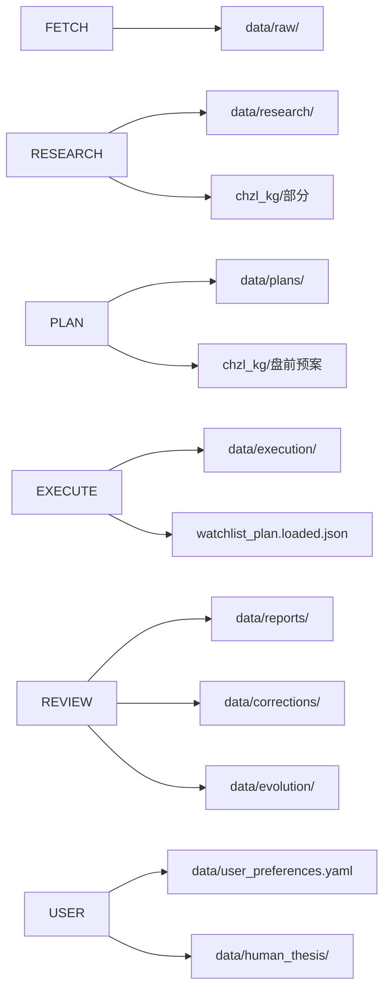

| 目录 | 唯一 Writer | Reader |
|------|-------------|--------|
| `data/raw/` | fetch | research, plan(P1/P2) |
| `data/research/` | research | plan, review |
| `data/plans/` | plan（D1/P1/P2 写 json；execute 只写 loaded） | execute, review |
| `data/execution/` | execute | review |
| `data/reports/` `corrections/` `evolution/` | review | 用户, E2 |
| `user_preferences.yaml` | **用户** | 全员只读；E2 只建议 |
| `human_thesis/` | **用户** | 全员只读；E2 可建议撤销 |

---

## 15. 多基座策略（T4 后 · 预览）

| Profile | 建议基座 | 原因 |
|---------|----------|------|
| canghai-plan (D1/P1/P2) | 最强推理模型 | 全局裁决 |
| canghai-review (E1/E2) | 最强 + 诚实倾向 | 打破 confidence bias |
| canghai-research (R1–R7) | 快/便宜模型 | 广域信息 |
| canghai-execute 判断节点 | 最快模型 | 3s 硬限 |
| canghai-fetch | 几乎无 LLM | 脚本为主 |

T1' 统一用 profile 默认 `ark-code-latest` 即可；换基座 = 只改 prompt（方案 B 拆分后改 `skill_prompt_*.md`）。

---

## 16. Sign-off 清单

审阅时请逐项确认：

| # | 审阅项 | ☐ |
|---|--------|---|
| 1 | 双平面划分（Hermes 运行时 vs 项目资产）是否正确 | |
| 2 | Research/Plan 主路径 = Hermes LLM + delegation | |
| 3 | Fetch 暂保持 `--no-agent` script | |
| 4 | T1' 不写 Python fallback，Hermes 做完再说 | |
| 5 | Skill 方案 B：先充实 SKILL.md | |
| 6 | Execute T2.1 = 30–60s 轮询 | |
| 7 | R6 hard_reject 对 D1 硬否决 | |
| 8 | MCP 映射与 research 禁 δ 层 | |
| 9 | Cron agent 模式模板（§9.2） | |
| 10 | 旧 cron/profile 可推倒重写 | |

**Sign-off 后下一步**: 按 §13 顺序施工 — **不写新 Python 规则代码**。

---

## 附录 A · 相关文档索引

| 文档 | 关系 |
|------|------|
| `docs/00-CANONICAL-ARCHITECTURE-v1.md` | 唯一权威原文 |
| `docs/07-重构进度表.md` | 待 T1' 完成后重写验收项 |
| `docs/hermes-project-boundary.md` | Hermes 薄脚本边界 |
| `docs/11-数据源分层与降级.md` | MCP 降级策略 |
| `docs/research_summary_schema.md` | 契约 3 |
| `docs/watchlist_plan_schema.md` | 契约 1 |
| `docs/amendment_schema.md` | 契约 2 |
| `~/.hermes/profiles/canghai-*/SOUL.md` | Profile 约束原文 |
| `skills/*/SKILL.md` | T1' 施工主战场 |

## 附录 B · 当前 Hermes 运行时快照（2026-07-05）

| 项 | 状态 |
|----|------|
| `hermes profile list` | canghai-fetch/research/plan/execute/review 均存在；research **running**，其余 **stopped** |
| Active cron | 2 条：07:15 pre-fetch + */30 health（均 `--no-agent`） |
| research/plan cron | **未建**（旧模板 `--no-agent` 作废） |
| delegation | config 中 `delegation.orchestrator_enabled: true`，`max_spawn_depth: 1` |
| skills external_dirs | 指向项目 `skills/` |

---

*本文档由架构纠偏讨论生成。修改请先改本文档并 re-sign-off，再动代码。*
