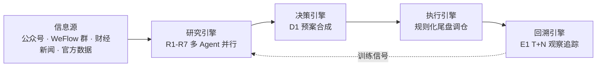
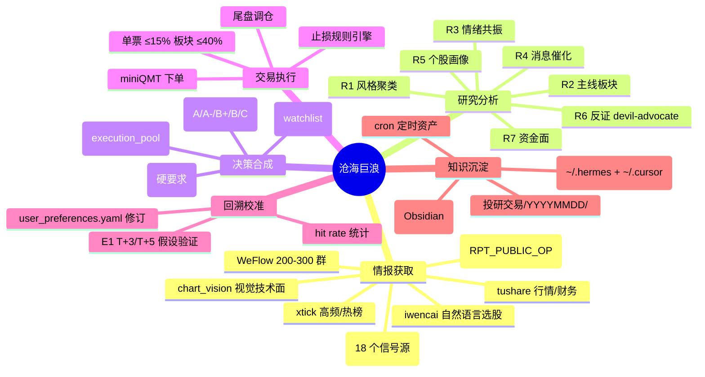
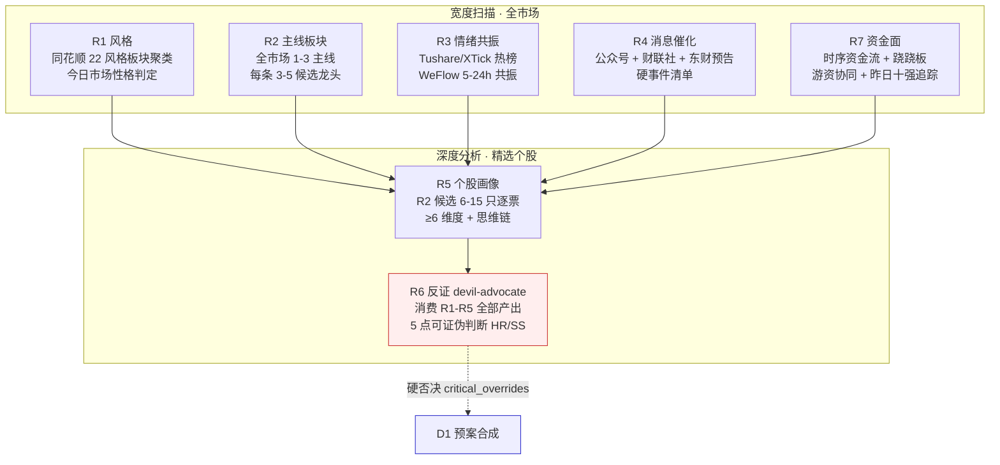
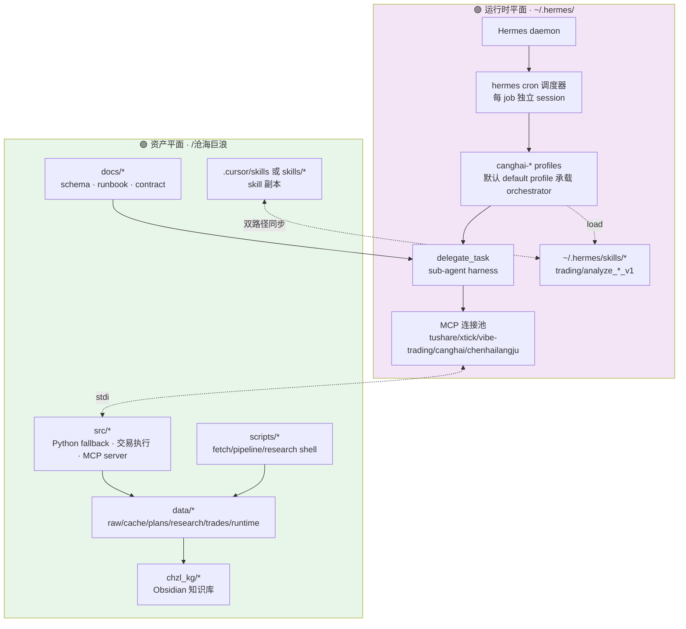
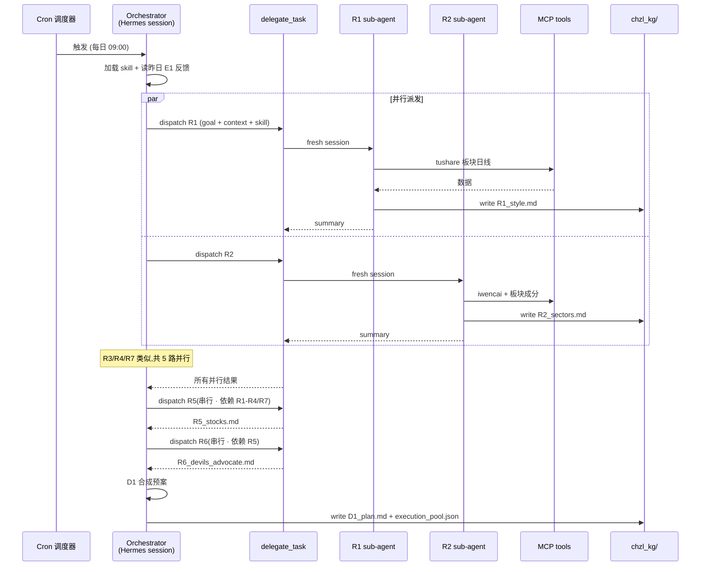
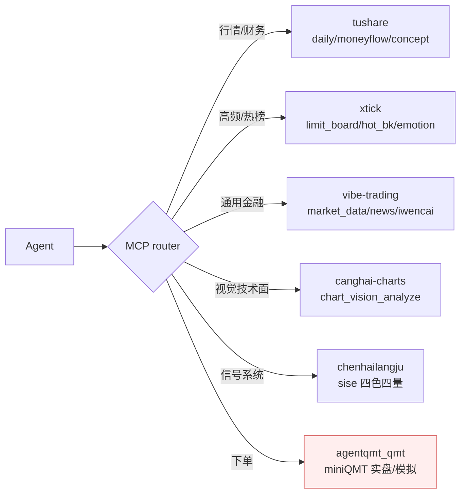
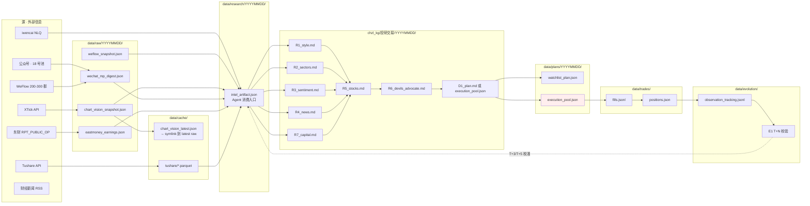
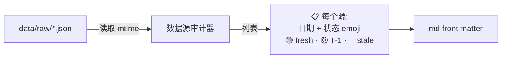
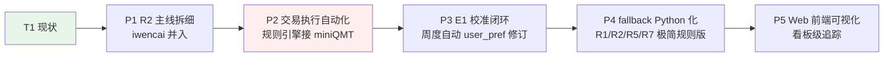

# 沧海巨浪 · 系统架构全景 v1

> **一句话**:沧海巨浪 = 一套**信息驱动 A 股短线研究/预案/交易**的多 Agent 系统 · 由 **Hermes 运行时** + **项目资产** 两平面组成 · 研究侧全 LLM(R1-R7 + D1 + E1)· 交易侧全规则(miniQMT + 尾盘调仓)· 契约靠 markdown/JSON schema 冻结,不靠代码耦合。

**阅读路径**:§1 宏观定位 → §2 功能层 → §3 技术架构层 → §4 数据流层 → §5 每日运行时线 → §6 已知边界与演进

---

## §1 宏观定位

### 1.1 系统在做什么



**核心命题**:A 股是**协调游戏**,alpha 主要来自"叙事阶段识别 + 集体信念动力学",不来自基本面掘金 → 系统聚焦**信息处理 + 主力行为建模**,而非因子模型。

**主 alpha 源**:WeFlow 200-300 群 + 财经公众号 messaging 层的多源印证。

### 1.2 关键设计边界

| 维度 | 决策 | 原因 |
|---|---|---|
| **研究 vs 交易** | 完全分离(信息不入下单路径) | 研究要发散 · 交易要纪律 · 情报关系图谱不进 log |
| **研究 Agent 模式** | **LLM sub-agent** (delegate_task) | 叙事分析需要语义 · 规则版做 fallback |
| **交易 Agent 模式** | **规则引擎(纯 Python)** | 盘中非理性 · 不能 LLM 建模 · 契约驱动 |
| **市场覆盖** | 仅 A 股 · 不接 IBKR/加密/美股期权 | 焦点资源 · WeFlow 是中文场 |
| **执行时间** | 尾盘 14:30-15:00 | 情绪冷静 · 避开日内博弈 |

---

## §2 功能层视角

### 2.1 六大功能域



### 2.2 研究 R1-R7 分工



**协作契约**:
- R1-R4/R7 **并行** · 各写一份 markdown 到 `chzl_kg/投研交易/YYYYMMDD/`
- R5 **串行消费** R1-R4/R7 输出
- R6 **串行消费** R5 · 输出 `HR{n}`(硬风险)/`SS{n}`(软信号)ID
- D1 **串行合成** · R6 的 critical_overrides 有硬否决权

### 2.3 决策分档语义

| 档位 | 语义 | 处置 | 今日示例 (2026-07-08) |
|---|---|---|---|
| **A** | 高信心 · 主线正相关 · 无反证 | execution_pool 主推 | 000938 紫光股份 +6.80% |
| **A-** | 主线相关 · 有小瑕疵 | execution_pool | 000977 浪潮 +10% · 002396 星网 +10% |
| **B+/B** | 边缘主线 · 或 R6 SS 软信号命中 | watchlist_pool | 001339 智微 -4.80% |
| **C** | 逻辑勉强 · 弱信心 | 不入池 | 300017 网宿 +19.97%(踏空) |
| **C 否决** | R6 HR 硬否决 | 严格排除 | 301308 江波龙 -5.60%(HR4 印证) |

---

## §3 技术架构层视角

### 3.1 双平面结构



**关键约束**:
- **skill 双路径**:`~/.hermes/skills/` 是 Hermes 加载源 · `~/.cursor/skills/` 是编辑源 · 必须同步(patch 后 rsync)
- **cron 是无状态触发器**:每次 fire 起一个 fresh Hermes session · 不继承任何上下文 → prompt 必须自包含
- **MCP 是数据平面**:所有外部数据通过 MCP tool 调用 · Agent 不直连 API(除非 fallback)

### 3.2 Agent 编排模型



**边界规则**:
- sub-agent **不能** 再 delegate(max_spawn_depth=1)
- sub-agent **不能** 用 clarify/memory/send_message(leaf role)
- sub-agent 有独立 terminal session 与 MCP 连接
- 只有 summary 回到 orchestrator · 中间 tool 输出不进主上下文(省 token)

### 3.3 五类核心 MCP 服务



**新鲜度红线**:
- 行情 tick 数据 · **≤ 15 min** = fresh
- chart_vision 视觉分析 · **≤ 4h** = fresh · 4-24h T-1 标注 · >24h stale(cron 07:30/15:30 保鲜)
- WeFlow 情绪快照 · **≤ 4h** = fresh(cron 08/12/20)
- 财报数据 · **T-1** 可接受

---

## §4 数据流层视角

### 4.1 全链路数据流



### 4.2 关键 schema 冻结点

| Schema | 位置 | 消费方 | 作用 |
|---|---|---|---|
| `watchlist_plan.json` | `docs/watchlist_plan_schema.md` | D1 写 · 交易端读 | 观察池契约 · block_prefixes 仅约束自动买入 |
| `execution_pool` | 同上 | D1 写 · miniQMT 读 | 尾盘调仓入口 · 5-8 只 |
| `research_summary` | `docs/research_summary_schema.md` | R5/R6 → D1 | 六维画像 + 思维链结构 |
| `event_amendment` | `docs/amendment_schema.md` | E1 → user_preferences | 每周校准包 |
| `chart_vision cache` | latest.json 硬约定 | R5 读 · cron 写 | bias/confidence/summary/action |

### 4.3 provenance / 新鲜度审计

**用户核心交付标准** — 每份研究 md 必须包含**数据源审计表**:



规则:**日期 + 来源 + 状态 emoji · 无时分秒 · 群名匿名化**(行业分析师群/机构群/游资群)。

---

## §5 每日运行时线

### 5.1 一天里系统在跑什么

```mermaid
gantt
  title 沧海巨浪 · 一日运行时线 (T = 交易日)
  dateFormat HH:mm
  axisFormat %H:%M

  section 盘前
  chart_vision cron (07:30)      :done, 07:30, 5m
  weflow snapshot (08:00)        :done, 08:00, 3m
  fetch_all_sources              :done, 08:05, 10m
  R1-R4/R7 并行 (delegate)       :active, 08:30, 30m
  R5 六维画像                    :09:00, 20m
  R6 反证                        :09:20, 15m
  D1 预案合成                    :crit, 09:35, 15m
  竞价观察                       :09:15, 10m

  section 盘中
  盘中简报 (11:30-12:00)         :11:30, 30m
  weflow snapshot (12:00)        :12:00, 3m
  盘中监控 (event schema)        :09:30, 5h30m

  section 尾盘
  chart_vision cron (15:30)      :15:30, 5m
  尾盘调仓窗口                   :crit, 14:30, 30m

  section 盘后
  E1 T+N 观察回填                :15:30, 30m
  周度进化 (周五)                 :16:00, 60m
  weflow snapshot (20:00)        :20:00, 3m
```

### 5.2 关键 cron 契约

| cron job | 时刻 | 目的 | 沉淀物 |
|---|---|---|---|
| `chart_vision_snapshot_2x_daily` | 07:30 / 15:30 | 12 只候选视觉技术面 | `data/raw/*/chart_vision_snapshot.json` |
| `weflow_snapshot_3x_daily` | 08/12/20 | 群聊情绪快照 | `data/raw/*/weflow_snapshot.json` |
| `canghai_fetch_all_sources` | 08:00 | 全源合并 | `data/research/*/intel_artifact.json` |
| `canghai_research_daily` | 09:00 | 研究链主入口 | `chzl_kg/投研交易/*/R*.md` |
| `canghai_sise_daily_sync` | 15:35 | 四色四量信号 | `data/patterns/*` |

---

## §6 已知边界与演进

### 6.1 当前系统的边界

1. **交易侧还在过渡** — miniQMT 已接线但**尾盘调仓完全人工确认**,规则引擎还未挂到自动执行
2. **E1 校准闭环未通** — T+N 假设验证 md 已产出,但 `user_preferences.yaml` 修订建议还是手工审核
3. **R2 主线粒度粗** — 今日 20260708 复盘暴露:"存储"应拆成"算力/服务器"vs"存储颗粒"两条(待 patch)
4. **iwencai 补池未并入 R2 常规流程** — 今日证明有效(3/4 兑现) · 待纳入 R2 skill
5. **skill 双路径同步靠 rsync** — 未来考虑单源

### 6.2 演进优先级



### 6.3 反脆弱设计

- **Agent 侧失败** → 保留 Python fallback(src/research/r*.py 极简版) · degraded=true 标记 · D1 当天不新开仓
- **MCP 侧失败** → 多源冗余(tushare/xtick/iwencai/vibe-trading 相互 backup)
- **cron 侧失败** → 每 job 独立 session · 单点失败不传染
- **skill 侧漂移** → 双路径同步 + git commit 兜底

---

## 附录 · 术语速查

| 缩写 | 全称 | 说明 |
|---|---|---|
| R1-R7 | Research Agent 1-7 | 研究侧七大 sub-agent |
| D1 | Decision 1 | 预案合成 agent |
| E1 | Evaluation 1 | T+N 回溯校准 agent |
| HR{n} | Hard Risk n | R6 反证硬风险(有硬否决权) |
| SS{n} | Soft Signal n | R6 反证软信号(仅降档) |
| WeFlow | 200-300 群聊监控 | 核心 alpha 源 |
| miniQMT | 迅投 QMT | A 股实盘交易客户端 |
| 主线 | 今日市场共识板块 | R2 每日 1-3 条 |
| execution_pool | 执行池 | D1 输出 · 5-8 只 |
| watchlist_pool | 观察池 | D1 输出 · 15-25 只 |

---

**Sign-off**:本文档为**沧海巨浪 T1 阶段架构快照** · 2026-07-08 · 与 `00-CANONICAL-ARCHITECTURE-v1.md`(宪法)和 `09-架构审阅图-T1prime.md`(施工审阅)形成三角:**宪法定原则 · 审阅图定纠偏 · 全景图定当前状态**。
