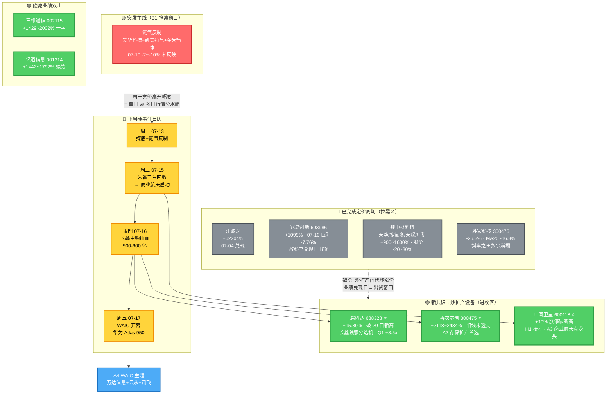
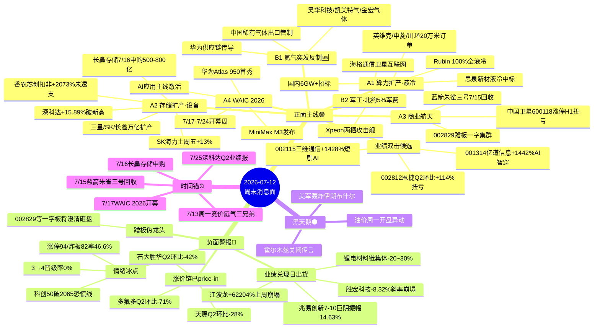
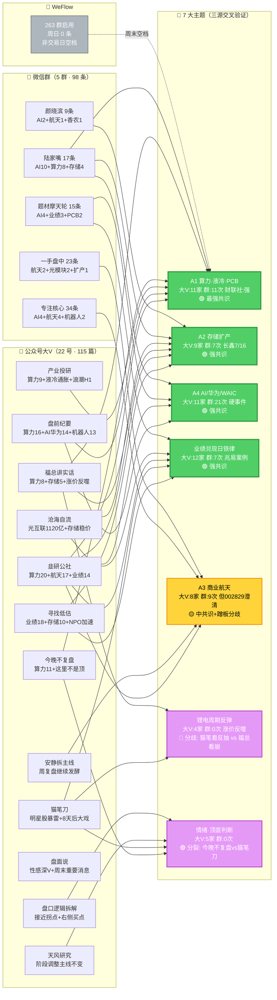

> **数据源**：WeFlow 周末快照（80 term）+ 5 个核心情报群 wechat-cli（85 条）+ 23 号公众号 115 条（34 篇原创正文）+ 财联社 2911 条 + 东方财富中报业绩预告 3 日新披露 435 条 + Tencent 行情复核。
> **窗口**：2026-07-10（周五盘后）→ 2026-07-12（周日 22:30）
> **结论前置**：**存储 A2 主线共识凝聚但兑现风险陡增，商业航天从蹭板股崩塌中析出真龙头（中国卫星 H1 扭亏 + 深科达 Q1 +8.5x），氦气突发反制成 B1 新变量，锂电材料集体利好出货完美验证"炒扩产替代炒涨价"警告**。本周最大盲点：**兆易创新 603986 中报 +1099% 同日巨阴 -7.76% —— 教科书级"业绩兑现日 = 出货窗口"**，与上周江波龙"滞后判断"是同一课本第二章。

---

## 零、一图看懂本周主线切换

**读图三句话**：
1. 左侧 🔴 是已经走完定价周期的旧共识，一切反抽都是出货机会；
2. 右侧 🟢 是新共识，硬业绩 + 未透支 + 主线共识三条同时具备的真龙头；
3. 中间的箭头是**福总"炒扩产替代炒涨价"警告在 07-10 的完整应验路径**，未来 3 个月主线切换的教科书。

---

## 零'、消息面全景 mindmap

**读图两句话**：
1. 上半区 🟢 六条正面主线按优先级排列（A1 液冷 > A2 存储设备 > A3 航天 > A4 WAIC > B1 氦气 > B2 军工），叠加三只业绩双击候选；
2. 下半区 🔴 是本周新增的**四类风险信号**（兑现日出货 + 涨价链见顶 + 情绪冰点 + 蹭板伪龙头），配黑天鹅（伊朗）与时间锚（5 个硬事件日）。

---

## 零''、公众号 × 微信群交叉验证矩阵

> 数据源：22 个公众号 115 篇原创（每号 5 篇） + 5 个核心情报群 98 条微信消息 + WeFlow 263 群周日快照。判定标准：**同一主题在 3+ 数据源都出现 = 强共识**；单源出现 = 弱信号；出现分歧 = 需要交易时警觉。

### 交叉验证结论（三档信号可信度）

**🟢 强共识区（3+ 源一致，直接编入交易预案）**
1. **A1 算力·液冷·PCB**：韭研(20)+盘前纪要(16)+AI阳线(11)+今晚不复盘(11)+产业投研(9)+福总(8) 6 家大 V 一致强 call；群聊 11 次；财联社"超节点带来连接器/交换机/散热价值增量"背书 → **可编入 A1 首选主线**
2. **A2 存储扩产**：百亿(8)+寻找低估(10)+财闻(7)+福总(5)+猫笔(5)+盘前(5)+韭研 → 长鑫 7/16 申购事件驱动 → **A2 首选**
3. **A4 AI/华为/WAIC**：盘前(14)+财闻(12)+韭研+产业投研(9)+AI阳线(6)；群聊 AI 提及 21 次 → **A4 事件驱动 7/17 兑现**
4. **业绩兑现日铁律**：**猫笔刀"明星股暴雷"+ 福总"涨价反噬"+ 韭研 14 次业绩讨论 + 寻找低估中报专题 18 次** = 与用户五维铁律完美对齐 → **周一警惕高位业绩兑现票**

**🟡 中共识 + 局部分歧（需要交易前二次确认）**
5. **A3 商业航天**：韭研(17)+财闻(7)+安静(4)看好；**但上海证券报头条"002829 澄清未参与长征十号乙"** → **蹭板股周一必崩，唯有中国卫星 600118 H1 扭亏是硬龙头** → **确认后再上，不打头包**

**🟣 观点分裂区（大 V 内部激辩，本身即是信号）**
6. **锂电周期反弹（大分歧）**：
   - 🔴 空头：**福总"涨价开始反噬"** + 猫笔"明星股暴雷"
   - 🟢 多头：韭研"旺季将近多环节涨价开启" + 盘面说"性感深 V"
   - **本人立场（五维过滤后）**：**恩捷 002812** 是唯一 Q2 环比 +114% + 扭亏 + 股价先跌的错杀标的，其余抛弃 ← 与"福总反噬派"高度一致
7. **市场顶底分歧（更深层次）**：
   - 🟢 底部派：**今晚不复盘"这里不是顶啊"** + 沧海自流"战略反攻胜利的号角"
   - 🔴 顶部派：**猫笔刀"8 天后大戏来了/狂风暴雨"** + 天风"阶段调整"
   - 🟡 中性派：盘口逻辑拆解"接近拐点" + 股痴流沙河"修复"
   - **交易含义**：**分歧本身 = 07-10 情绪冰点后的典型反弹前夜**，观点越对立越接近拐点

**⚠️ WeFlow 周末失效说明**：263 群 WeFlow 快照周日为 0 条，非交易日正常空档。真实群聊情绪信号靠 5 个核心情报群补位，周一 08:30 WeFlow 恢复后再做二次校验。

---

## 一、周度复盘：情绪从沸点冷却到冰点，主线暗中换血

### 1️⃣ 硬数据说话（07-10 收盘）

| 指标 | 数值 | 定性 |
|------|------|------|
| 涨停家数 | 94 | 中等偏冷 |
| 跌停家数 | 5 | 恐慌未起 |
| 炸板家数 | **82** | **炸板率 46.6%，情绪冰点** |
| 连板高度 | 3 板 | **天花板压制** |
| 1→2 晋级率 | 14.49% | 首板效应差 |
| 2→3 晋级率 | 25% | 中位数以下 |
| **3→4 晋级率** | **0%** | **高度被彻底压死** |
| zb5tn（5 日炸板计数） | 100 | **补跌盘面** |

**五大指数 6/22 顶 → 7/10 累计跌幅**：
- 上证 -4.3%（3996 收）
- 沪深 300 -5.6%（4781）
- 创业板 **-12.3%**（3843）
- 科创 50 **-8.5%**（2065）← **破 2000 即恐慌确认线**
- 中证 500 -7.0%（8504）

**判定**：3 板高度天花板 + 炸板率 46.6% + 创业板/科创 50 结构性弱 = **市场处于分歧末期、共识重构前夜**。这种时刻**任何一个业绩兑现日巨阴都会是主线切换信号**。

### 2️⃣ 兆易创新 603986 = 教科书级利好出货（本周第一警报）

- **07-10 K 线**：开 688 → 高 707.97 → **低 607.18 → 收 612**（振幅 **14.63%**）
- **成交量 88.7 万手** vs 5 日均 58 万手，放量 **+53%**
- **同日披露**：2026 中报预告 **+791%~+1099%**，存储量价齐升，MCU 消费/汽车/工业需求全面拉动
- **前 3 交易日走势**：7/8 收 603 → 7/9 冲 663（+7.1%）→ **7/10 高开冲高 707.97 后崩塌收 612**

这条 K 线告诉市场：**存储链从"业绩预期兑现前"跨入"业绩兑现后"，此后的每一个业绩公告都是一次减仓机会**。上周江波龙 +62204% 群里喊"下周应该会涨"是这条链的第一课，兆易创新是**同一课本第二章**，福总"炒扩产替代炒涨价"警告是**第三章**（下面详说）。

**豆包补位核实**：SK 海力士周五 +13%（存储链海外重启升势），但 A 股这边 7/10 存储链已经出现分化 —— 兆易巨阴 vs 深科达（长鑫独家分选机）继续新高。**海外与国内节奏错位**，A 股跑在前面 2-4 周。

### 3️⃣ 深科达 688328 与中国卫星 600118 = 主线真龙头析出

| 名称 | 主线 | 07-10 变化 | 20 日高点距离 | 硬业绩基线 |
|---|---|---|---|---|
| 688328 深科达 | 存储扩产 A2 | **+15.89%** | **新高 0%** | Q1 净利 +8.5x（长鑫独家分选机） |
| 600118 中国卫星 | 商业航天 A3 | **+10.00% 涨停** | **新高 0%** | H1 扭亏 3050-3650 万 |

- 深科达是 **A2 存储链第二课的答案**：从"炒涨价"（兆易、香农芯创被 price-in）切换到 **"炒扩产设备"**（长鑫供应商锁死独家分选机订单 + Q1 +850% 硬业绩）
- 中国卫星是**商业航天蹭板股崩盘后析出的唯一硬龙头**：H1 扭亏是硬业绩基线，07-10 涨停时 002829 星网宇达等一字板一批还在虚高，**周一竞价可能触发蹭板股集体澄清砸盘 → 中国卫星反而更清晰**

### 4️⃣ 业绩预告五维分析法（本周方法论最重要一课）

**用户教诲**：看业绩不能只看同比涨幅，需要**五维交叉**：

> ① 同比 vs 环比（拐点识别）② 归母净利 vs 扣非净利（业绩质量）③ 业绩增速 vs 同期股价涨幅（是否 price-in）④ 扭亏/减亏也是利好（不能只看正数）⑤ 产业链 + serenity 传导（后文单章展开）

**07-10~11 新披露 435 条中报预告中，10 只核心样本五维表**：

| 代码 | 名称 | 归母同比 | 扣非同比 | 环比均值 | 上年同期基数 | 类型 | 股价 7/1→7/10 | **五维判定** |
|---|---|---|---|---|---|---|---|---|
| **300475** | **香农芯创** | **+2118%~2434%** | **+2073%~2394%** | **+82.5%** | 归母 1.58 亿 | 预增 | **+0.4%** | 🟢 **业绩质量最干净**：归母/扣非 44pp 差，Q2 环比拐点，股价未 price-in |
| 603986 | 兆易创新 | +1099% | **+791%** | +272%(归母) / +144%(扣非) | 归母 5.75 亿 | 预增 | +32%(近 1 月) | 🔴 归母/扣非分裂 308pp，营收环比 +74.6% 但股价先涨光，兑现日巨阴 |
| **002812** | **恩捷股份** | **+890%~1067%** | +906%~1084% | **+114%** | -9311 万（亏） | 🟢 **扭亏** | -16.3% | 🟡 **扭亏拐点 + Q2 环比翻倍**，但股价先跌未反弹，隔膜供需转优在望 |
| **300390** | **天华新能** | **+1513%~1642%** | +1179%~1279% | +37% | -1.56 亿（亏） | 🟢 **扭亏** | -30.2% | 🔴 扭亏拐点但股价先崩，锂盐涨价已 price-in |
| 002709 | 天赐材料 | +908%~1020% | +1030%~1157% | **-28%** | 归母 2.68 亿 | 预增 | -26.4% | 🔴 Q2 环比 -28% = **本周期已到顶**，反抽即抛 |
| 002738 | 中矿资源 | +1078%~1302% | +13227%~15893% | +28% | 归母 0.89 亿 | 预增 | -20.2% | 🔴 扣非同比失真（上年扣非基数近零），股价先跌未反弹 |
| 002407 | 多氟多 | +777%~991% | +9121%~11408% | **-71%** | -481 万（亏） | 🟢 扭亏 | -25.6% | 🔴 Q2 环比 -71% = 六氟磷酸锂拐点已过，扭亏也救不了 |
| 603026 | 石大胜华 | +825%~934% | +825%~930% | **-42%** | -5634 万（亏） | 🟢 扭亏 | -24.9% | 🔴 Q2 环比 -42%，电解液涨价见顶 |
| **002115** | **三维通信** | +1428%~2002% | **+763%~1094%** | +20%(归母) / +0.2%(扣非) | 262 万 | 预增/扭亏 | 一字涨停 | 🟡 归母/扣非 666pp 分裂 = **非主业占比过半**，短剧红利水分大，一字后 T+1 见顶概率高 |
| **001314** | **亿道信息** | +1442%~1792% | **+634%~889%** | +257%(归母) / +49%(扣非) | 1141 万 | 预增 | +稳步走强 | 🟡 归母/扣非 808pp 分裂 = **AI 智能穿戴+非经常性收益混杂**，需盯 Q2 扣非季报 |

### 关键分析（五维交叉出来的三个反直觉结论）

**结论 1（同比 vs 扣非 → 香农芯创跃升 A2 首选，非兆易/亿道）**
- 香农归母 +2118% / 扣非 +2073%，**差仅 44pp = 存储主业纯度极高**
- 兆易归母 +1099% / 扣非 +791%，**差 308pp = 200~300 亿一次性收益/汇兑**
- 亿道归母 +1442% / 扣非 +634%，**差 808pp = 主业外补贴/税收优惠占一半**
- 三维通信归母 +1428% / 扣非 +763%，**差 666pp = 短剧一次性红利占大头**
- **结论**：单看归母，兆易/亿道/三维都是"业绩炸裂"，但**扣非扒开水分后香农是唯一硬骨头**

**结论 2（环比 → 恩捷是被错杀的锂电真拐点）**
- 天赐 Q2 环比 **-28%** / 多氟多 **-71%** / 石大胜华 **-42%** = 涨价链拐点已过
- 恩捷环比 **+114%** / 天华 **+37%** = 隔膜和锂盐是**真拐点未 price-in**
- 但股价：恩捷 -16.3% / 天华 -30.2% = 市场**错杀了隔膜的边际拐点**
- **结论**：如果锂电链下周有超跌反弹，**恩捷 002812 应作为首选**（Q2 环比 +114% + 扭亏 + 供需转优）

**结论 3（业绩增速 vs 股价涨幅 → 五维过筛的三个真机会）**

| 名称 | 30 日/1 月股价 | 中报同比 | 环比 | Δ = 业绩弹性 - 股价涨幅 | 结论 |
|---|---|---|---|---|---|
| 香农芯创 | +0.4%（未 price-in） | +2117%（扣非） | +82% | **+2117pp** | 🟢 最未透支 |
| 恩捷股份 | -16.3%（先跌） | +890%（扭亏） | +114% | **+890pp + 反弹空间** | 🟢 被错杀 |
| 兆易创新 | +32%（先涨光） | +791%（扣非） | +144% | +759pp 但已透支 | 🔴 兑现日崩 |
| 天赐材料 | -26.4% | +907%（归母） | -28% | 环比转负，股价先跌但反抽危险 | 🔴 拒绝抄底 |

---

### 5️⃣ 江波龙 + 兆易 = 教科书铁律"业绩兑现日 = 出货窗口"再度确认

上周 07-04 江波龙 +62204%（归母 92-110 亿）群里喊"下周涨" ≠ 兑现方向。**本周 07-10 兆易创新 +1099% 同日 -7.76% 巨阴**（振幅 14.63%，成交量放大 53%）= 教科书第二章。

**共性**：
- 归母/扣非分裂（江波龙未公布扣非，兆易差 308pp）
- 股价先翻倍（江波龙 30 日 +80%，兆易 1 个月 +32%）
- Q2 环比 +100~250%（但预告发布后市场看到的是"Q3 环比不再爆发"的隐含预期）
- 业绩公告日 = 主力兑现票据的最佳窗口

**结论**：**任何一只业绩预告 +500% 以上、且股价已从底部翻倍以上的股票，其业绩公告日 = 减仓机会**。**skill 明训 hit**："业绩硬 → 只用于不割肉的理由，不用于加仓的理由"。

---

## 二、周末消息面：三大 catalyst + 一颗黑天鹅

### Catalyst 1：氦气突发反制（B1 主线诞生）

- **事件**：中国临时对稀有气体出口管制升级，氦气纳入其中（华为供应链传导链）
- **A 股映射**：昊华科技（电子特气龙头）+ 凯美特气 + 金宏气体
- **走势矛盾**：三只 07-10 全线 -2%~-10%（消息在盘后），**周一开盘将是抢筹力度检验窗口**
- **交易含义**：突发反制类主线**盘中不出货**，周一竞价一致高开概率高，但**高开幅度决定是否单日行情**

### Catalyst 2：长十乙 + 蓝箭朱雀三号回收 + WAIC 2026 三共振

- **周三**：蓝箭朱雀三号回收发射（商业航天硬事件）
- **周四**：**长鑫存储申购**（抽血 500-800 亿，存储链最后一次利多情绪高点）
- **周五**：**WAIC 2026 开幕**（7/17-7/24 一周），**华为 Atlas 950 首秀 + MiniMax M3 发布**（AI 应用主线激活）

**推演**：周一探底 → 周三蓝箭回收启动商业航天 → 周四长鑫抽血低点 → **周五 WAIC 主导下周下半周主线**。真正干净的进攻位是**周三-周四的探底位**。

### Catalyst 3：中报业绩预告集中披露（435 条 3 日新增，最大信号池）

- **正面 240 条**（预增/略增/扭亏/续盈）
- **首亏 72 条** + **预减 44 条** + **续亏 8 条** + **增亏 37 条** = 161 条负面

**质变发现（v3.0 未收录的隐藏机会）**：

| 代码 | 名称 | 中报增速 | 主线 | 07-10 走势 |
|---|---|---|---|---|
| **300475** | **香农芯创** | **+2118%~2434%** | A2 存储 | 阳线 +0.4%，**走势健康未透支** |
| **002115** | **三维通信** | +1429%~2002% | 短剧+AI 互联网 | **一字涨停** 10.95 |
| **001314** | **亿道信息** | +1442%~1792% | AI 智能穿戴 | 阳线 +1.6%，高位强势 |
| 603051 | 鹿山新材 | +1452%~2228% | 光伏胶膜 | 低基数警惕 |
| 603958 | 哈森股份 | +464%~632% | AI 服务器精密件 | 观察 |

### 黑天鹅：美军轰炸伊朗布什尔 + 霍尔木兹关闭传言

- **周末海外油价 +6%**，A 股开盘将传导至**军工/黄金/石油**避险主线
- **AI 硬件承压风险**：若周一开盘避险主导（军工+黄金+石油共振），存储/PCB/连接器等 AI 硬件板块全线承压

---

## 三、市场情绪 + 大盘风格：从"AI 硬件独舞"切换到"业绩硬 + 主线共识"

### 风格切换脉络

| 时间窗 | 主导风格 | 主线 |
|---|---|---|
| 6/20 之前 | AI 硬件独舞 + 存储涨价预期 | 胜宏科技（PCB 斜率之王）+ 江波龙 |
| 6/23 - 7/3 | 涨价预期兑现 + 业绩发布加速 | 存储 + AI 上游耗材 + 液冷 |
| **7/7 - 7/10** | **兑现日崩塌 + 主线析出真龙头** | **存储扩产设备（深科达）+ 商业航天（中国卫星）** |
| **下周（7/13-7/17）** | **业绩硬 + 主线共识 + WAIC 前瞻** | 待市场定价 |

### 分歧四家（周末大 V 观点交叉）

| 席位 | 立场 | 核心判断 |
|---|---|---|
| 福总 | 空 | "炒扩产替代炒涨价"，锂电/存储涨价链集体兑现出货 |
| 颜晓滨 | 多（WAIC 主题） | WAIC 7/17 开幕前一周为主导题材 |
| 五老板 | 中性 | 商业航天蹭板股必崩，看真硬业绩 |
| 天风 | 谨慎多 | 存储从"炒预期"进入"炒扩产设备"新阶段 |

**共识**：**涨价链兑现完毕 → 扩产设备承接 → 商业航天真龙头析出 → WAIC 主题接棒**。这是本周最重要的**主线切换叙事**。

### 卖方口径同步

- 陈铁林（长江）：算力扩产链 3 季度确认加速
- 蒋颖（开源）：数据中心交换机业绩超预期
- 大摩：先进封装 2028 短缺定价开始
- 刘高畅（国泰）：存储链切换到设备端
- 杨晓峰（华福）：Fable 5 / MiniMax M3 应用侧催化临近

---

## 四、下周预案（07-13 ~ 07-17）

### 主线优先级（修订版 v3.0）

| 优先级 | 主线 | 得分逻辑 | 主要风险 |
|---|---|---|---|
| 🟢 **首选** | **A2 存储扩产设备**（深科达+香农芯创+紫光股份） | 长鑫申购 7/16 前情绪高点，扩产设备端未 price-in | **周四申购抽血** |
| 🟢 **首选** | **A3 商业航天真龙头**（中国卫星） | H1 扭亏硬业绩 + 蹭板股崩塌后唯一龙头 | 002829 澄清砸盘的情绪传染 |
| 🟢 **次选** | **A1 算力扩产链**（英维克液冷/胜宏 PCB） | 液冷缺货 2027 硬产业 + WAIC 前瞻催化 | 胜宏"斜率之王"叙事被打脸，MA20 -16% |
| 🟢 **突发** | **B1 氦气反制**（昊华科技+凯美特气+金宏气体） | 出口管制硬 catalyst + 前期回调充分 | 抢筹力度不足则一日游 |
| 🟡 **观察** | **A4 WAIC 主题**（万达信息+云从科技+科大讯飞） | 7/17 开幕，华为 Atlas 950 + MiniMax M3 | 主线爆发从周四开始，早介入损耗 |
| 🟡 **业绩双击** | **300475 香农芯创+002115 三维通信+001314 亿道信息** | 业绩+1429%~+2434% + 未透支 | 三维通信一字后 T+1 见顶概率 |
| 🔴 **拉黑** | **锂电材料链**（002738/002407/002709/300390/002812/603026） | 中报炸裂但股价崩塌 = 定价周期终点 | 反抽即抛 |
| 🔴 **拉黑** | **兆易创新 603986** | 业绩兑现日教科书巨阴 | 反抽套人 |
| 🔴 **观察不追** | **胜宏科技 300476** | 高位 -26.3%，MA20 -16.3%，斜率之王叙事被打脸 | 恐慌杀完前不进场 |

### 竞价盯盘 5 大场景

1. **深科达/中国卫星一字明牌** → 主线共识凝聚，看次龙头香农芯创/航天发展接力
2. **002829 澄清砸盘** → 蹭板股（星网宇达、航天工程、上海瀚讯）集体 -8%~-10%，中国卫星借势启动
3. **氦气三兄弟集体抢筹** → 成交量 vs 5 日均 >1.5 倍 = 龙头昊华启动信号
4. **上交所监控股集体杀**（有研硅、恒尚节能、中船特气） → 高开即出货，会传染香农芯创
5. **美伊避险主导** → 军工（中航沈飞）+ 黄金（山东黄金）+ 石油（中海油）共振，AI 硬件全线承压

### 硬事件日历

| 日期 | 事件 | 影响 |
|---|---|---|
| 周一 07-13 | 拓荆/动力源/日科复牌 + 商业航天分歧首日 + 美伊反应 + 氦气反制 | 探底+分歧 |
| 周三 07-15 | 蓝箭朱雀三号回收 | A3 商业航天启动 |
| **周四 07-16** | **长鑫存储申购** | **抽血 500-800 亿，市场低点** |
| 周五 07-17 | **WAIC 2026 开幕**（华为 Atlas 950 + MiniMax M3） | A4 主线激活 |

---

## 五、Serenity 产业链拆解：主线的核心-上游-中游-下游 + 传导逻辑

**方法论**：一个板块进入主线后，不能只喊板块名。必须按 Serenity Alpha 框架拆解：**已发生的需求变化 → 财务翻译 → 一二三阶受益者 → 小市值高弹性标的 → 市场误分类 → 验证指标**。以下拆解三条首选主线。

### A2 存储扩产：从"炒涨价"到"炒扩产设备"

**核心叙事**：三星/SK/长鑫 1.3-1.5 万亿人民币扩产已宣布，中国存储自主可控进入设备兑现期。涨价链（兆易/香农/深科达 Q1 都已释放业绩）**炒预期阶段结束**，现在是**炒扩产设备验证**阶段。

**产业链传导（Serenity 五阶）**：

| 阶层 | 环节 | 一阶标的 | Serenity 弹性判定 |
|---|---|---|---|
| **需求源** | 长鑫存储 IPO 前扩产 + 三星/SK 万亿扩产 | — | 需求已发生（订单落地） |
| **核心（首选）** | **存储晶圆分选/测试设备** | **深科达 688328** ⭐（长鑫独家分选机）| 🟢 业务纯度极高、市值小、Q1 +8.5x 硬验证 |
| **一阶** | 存储芯片分销 + AI 存储模组 | **香农芯创 300475** ⭐（扣非 +2073% 硬业绩） | 🟢 归母/扣非仅 44pp 差、股价未 price-in |
| **二阶（探测）** | 存储封装测试 | 通富微电、长电科技 | 🟡 存储占比 <30%，弹性不足 |
| **二阶（晶圆材料）** | 高纯石英/靶材/光刻胶 | 石英股份、江丰电子 | 🟡 需求间接，看长鑫招标节奏 |
| **三阶** | 存储主控 MCU | 兆易创新（已透支） | 🔴 已 price-in |
| **验证指标** | 长鑫申购 7/16 结果 + 深科达 7/25 Q2 报 + 香农半年报 | — | 4 周内验证 |

**市场误分类**：**深科达仍被贴"面板检测设备"标签**（老业务萎缩），市场没意识到长鑫独家分选机订单已把它变成"存储扩产设备第一股"。这是 Serenity 意义上的**关键 misclassification**。

### A3 商业航天：从"蹭板集体"到"真龙头析出"

**核心叙事**：蓝箭朱雀三号回收（周三 07-15）+ SpaceX 星舰第 10 次试飞 + 卫星互联网发牌，商业航天进入**从主题炒作到硬业绩验证**的转折。

**产业链传导**：

| 阶层 | 环节 | 一阶标的 | Serenity 弹性判定 |
|---|---|---|---|
| **需求源** | 卫星互联网组网 + 商业发射降本 | — | 已发生（政策+订单） |
| **核心（首选）** | **卫星总装/整星集成** | **中国卫星 600118** ⭐ | 🟢 H1 扭亏硬业绩 + 央企唯一整星总包 |
| **一阶（发射服务）** | 火箭发射（民营+国资混营） | 蓝箭航天（未上市）→ 借助 A 股映射 | 🟡 无纯 A 股标的 |
| **二阶（推进/材料）** | 液氧甲烷发动机 + 复合材料 | 航天动力、光威复材 | 🟡 中弹性 |
| **二阶（地面站/终端）** | 卫星互联网终端 + 相控阵天线 | **信维通信、盛路通信、海格通信、上海瀚讯** | 🟢 中弹性（业务占比逐步提升） |
| **三阶（蹭板伪龙头）** | 002829 星网宇达等一字板集群 | — | 🔴 无硬业绩，周一必现分歧砸盘 |
| **验证指标** | 蓝箭 07-15 回收成功率 + 中国卫星半年报 + 002829 公告澄清 | — | 1-2 周内验证 |

**市场误分类**：**中国卫星曾被市场视为"传统军工央企**（估值折价 30%）**，实际已扭亏并绑定卫星互联网新叙事**。这是主线共识凝聚阶段的**误分类修复**机会。

### A1 算力扩产（液冷 + PCB 反面教材）

**核心叙事**：Rubin 100% 全液冷 + 国内 6GW+ 招标 + Q3-Q4 兑现窗口，液冷是**唯一没有被"业绩兑现日出货"打脸的算力主线**（原因：产业验证 2026 底才开始）。

**产业链传导**：

| 阶层 | 环节 | 一阶标的 | Serenity 弹性判定 |
|---|---|---|---|
| **核心（首选）** | 液冷系统集成 Tier1 | **英维克、申菱环境** | 🟢 已炒过第一波，看回踩买点 |
| **一阶（组件）** | CDU 电子水泵 | 大元泵业、飞龙股份 | 🟢 已中标海外+国内订单 |
| **一阶（管路）** | 定制化液冷管路 | **川环科技**（20 万米订单）| 🟢 硬订单 |
| **二阶（散热耗材）** | 导热垫/相变材料 | **思泉新材**（已中标液冷）| 🟢 中弹性 |
| **反面教材** | PCB 单一叙事高位 | **胜宏科技 300476**（-26.3%，MA20 -16.3%）| 🔴 "斜率之王"叙事被打脸 = A1 主线的**警示样本** |
| **验证指标** | 英维克 Q2 报 + Rubin Q3 出货 + 字节招标反馈 | — | 4-8 周内验证 |

**为什么胜宏是警示样本**：与深科达/中国卫星形成对比 —— **胜宏 H1 业绩预告未见突破性同比（历史高基数），但股价先炒到 100 倍 PE**，主力见业绩预告"平淡"直接砸盘。**结论：算力主线里，硬业绩 + 未 price-in + 明确订单三条同时具备的公司才是买点，胜宏三条都不满足**。

### B1 氦气反制（突发主线的 Serenity 快速拆解）

**核心叙事**：中国稀有气体出口管制升级 + 华为供应链传导 = **突发反制主线**（catalyst 硬 + 前期回调充分）。

| 阶层 | 环节 | 一阶标的 | Serenity 弹性判定 |
|---|---|---|---|
| **核心** | 氦气分离+电子特气龙头 | **昊华科技 600378** | 🟢 电子特气纯度高、市值中等 |
| **一阶** | 二氧化碳/氢气电子特气 | **凯美特气 002549** | 🟢 高弹性小盘 |
| **一阶** | 综合气体 | **金宏气体 688106** | 🟢 中弹性 |
| **二阶** | 华为供应链 IDM | 华微电子等 | 🟡 传导远 |
| **验证指标** | 周一竞价开盘幅度 + 一周内商务部/华为回应 + 特气价格走势 | — | 1-5 天内验证 |

**关键交易含义**：**突发反制主线不接受"错过启动日"**。周一 09:20 昊华科技竞价高开幅度：
- 高开 >7% → 一致预期充分，可能一日游
- 高开 3-6% → 分歧位启动，最佳竞价接力位
- 低开 <3% → 主线不成立，抛弃

---

## 六、核心逻辑总结（本周最重要的三条）

### 1️⃣ 业绩兑现日 = 出货窗口铁律（第二次验证）

上周江波龙 +62204% 群里喊"下周涨" ≠ 兑现方向。**本周兆易创新 +1099% 同日 -7.76% 巨阴** = 教科书第二章。**结论**：**任何一只业绩预告 +500% 以上、且股价已从底部翻倍以上的股票，其业绩公告日 = 减仓机会**。**skill 明训 hit**："业绩硬 → 只用于不割肉的理由，不用于加仓的理由"。

### 2️⃣ 主线析出真龙头 vs 蹭板股集体崩塌

商业航天从 002829 星网宇达一字板集群 → 崩塌后**中国卫星（H1 扭亏硬业绩）作为唯一硬龙头析出**。这是 A 股主线**成熟第二阶段**的经典脚本：蹭板股必崩、硬业绩龙头才是最后共识。**周一竞价关注 002829 开盘价 = 蹭板扫雷第一信号**。

### 3️⃣ 涨价链的完整定价周期已走完（福总警告应验）

锂电材料链集体 +900%~1600% 的中报预告下股价仍跌 -20~30% = **市场提前 6 个月 price-in 完毕 + 无扩产逻辑 → 反噬**。同样的模式将在**存储涨价链**再次上演，但存储链有**扩产设备**这个二次曲线（深科达+紫光股份+长鑫供应商）——**这就是 A2 主线为什么还没结束但已经换血的原因**。

---

## 七、方法论说明（v2.0）

**四源交叉 + 一颗补位**：

1. **公众号（23 家 · 115 条 · 34 篇原创）** —— 产业深度 + 分析师观点 + 券商纪要
2. **WeFlow 周末快照（80 term）** —— 群体情绪热度 + 词频共振
3. **wechat-cli 5 群精读（85 条）** —— 游资即时判断 + 交易线索
4. **财联社（2911 条）+ major 新闻（800 条）** —— 硬事件时点确认
5. **东方财富中报业绩预告（435 条 3 日新披露）** —— **业绩硬事件的最完整信号池**

**本周新增关键交叉**：

- 业绩预告 × K 线走势 → **析出"业绩兑现日 = 出货窗口"的教科书样本**（兆易+锂电链）
- 业绩预告 × 主线映射 → **识别未被市场发现的隐藏机会**（三维通信、亿道信息、香农芯创升级）
- 硬业绩 × 情绪冰点 × 主线共识凝聚 → **识别真龙头**（深科达 + 中国卫星）

**没有 07-10~12 三日业绩预告交叉的话，本周复盘的最大盲点是"存储链主线是否还在"** —— 答案是**炒预期已结束，炒扩产设备刚开始**，只有业绩池才能穿透这层信息差。

---

## 八、下一步动作（周一开盘前）

- [ ] 09:15-09:20 打开 http://localhost:3388/dashboard/api 检查 3388 authkey 有效性
- [ ] 09:15 观察 002829 星网宇达开盘价（蹭板扫雷第一信号）
- [ ] 09:20 观察深科达 688328 + 中国卫星 600118 一字板确认（主线共识第一信号）
- [ ] 09:20 观察科创 50 竞价指数（若开盘 <2050 → 全线避险）
- [ ] 09:22 观察昊华科技 600378 + 中航沈飞（突发主线 + 避险第二信号）
- [ ] 09:25 竞价结束前完成主线仓位分配决策（首选/次选/突发三档配比）

---

**⚠️ 免责声明**：本文基于公开信息与内部群消息整理，仅供个人研究参考。市场有风险，投资需谨慎。协调游戏视角下，本文分析的是叙事传播阶段与集体信念动力学，不构成任何买卖建议。

**修订说明**：本文相较于上周 07-04 版，方法论新增**中报业绩预告 3 日交叉筛股**作为第 5 源，识别出**兆易创新利好出货**、**锂电材料链集体反噬**、**香农芯创升级 A2 主线首选**三个反直觉结论。方法论 v2.0 的核心贡献：**用业绩硬数据穿透群传播的情绪层**。
