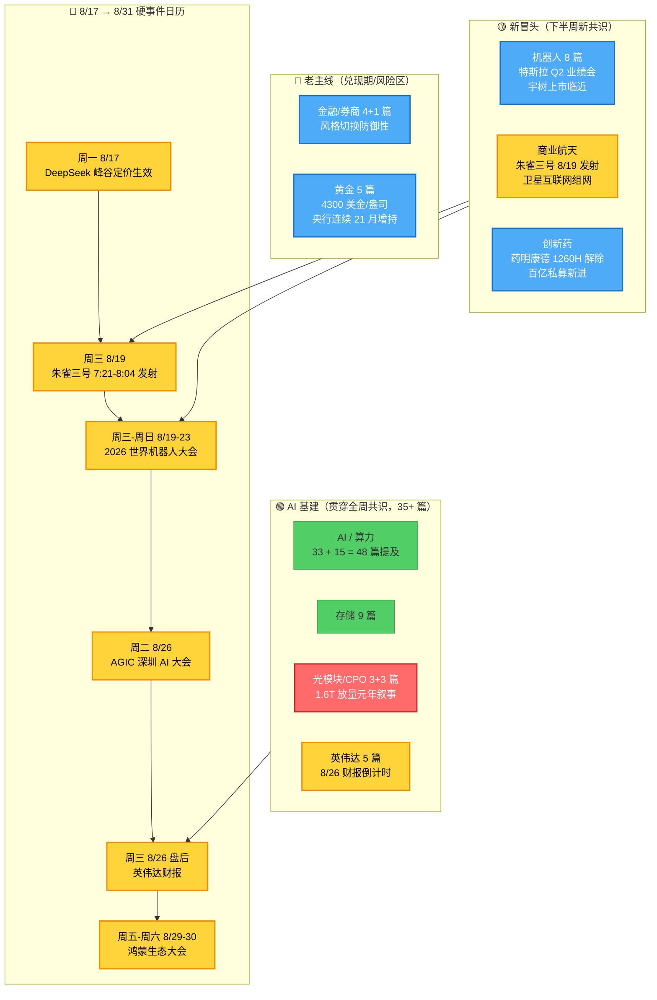

# 周末复盘：从财报季切到英伟达前夕——AI 基建"放量元年"叙事的最后冲刺窗口

> **数据源**：公号三刀（sanji :39217）23 个公众号近 7 天 349 篇正文 + xtick 行情复核。
> **窗口**：2026-08-10（周一）→ 2026-08-16（周六 23:00）
> **生成时间**：2026-08-17 00:50 CST
> **结论前置**：**8 月下半月的主线只有一个字——等**。等英伟达 8/26 财报、等 1.6T 光模块"放量元年"自证、等存储和 PCB 的业绩兑现。等的过程中，**主动降低仓位至 60% 以下**，把"剩 40% 现金"的灵活性留给最后一周的胜负手。

---

## 零、一图看懂近 7 天主线切换

**读图三句话**：

1. **AI 基建不是"炒过了"，而是"炒到中后段"**——存储 9 篇、光模块 3 篇、英伟达 5 篇，三条子线还在轮动，但 1.6T/PCB/液冷的"BOM 价值增幅"叙事是 8/26 财报前的最后一搏。
2. **新冒头三条线时间错开**：机器人大会 8/19-23（近期催化）、商业航天 8/19 发射（事件驱动）、创新药百亿私募新进（资金信号）——**都不是追的节奏，是等的节奏**。
3. **金融/券商/黄金**：防御性配置已成型，但不是"主升"，是"对冲"。

---

## 一、近 7 天公众号叙事：从"震荡反弹"切到"财报博弈"

### 1.1 主线热度榜（按主题词频次，349 篇正文）

| 主题 | 提及文章数 | 叙事核心 |
|------|-----------|---------|
| **AI（含算力/CPO/Manus）** | **48** | Anthropic Q2 营收 +14 倍、英伟达对 OpenAI 数据中心担保从 2500 亿降至 1200 亿、阿里财报、Manus 腾讯入股 |
| **机器人** | 8 | 特斯拉 Q2 业绩会、宇树科技上市临近、WAIC 大会 8/19 |
| **存储/内存** | 9 | 美股存储股逆市飙涨、盛科通信以太网芯片合同 |
| **黄金/有色** | 5 | 央行连续 21 月增持、金价破 4300 美金 |
| **创新药** | 4 | 药明康德 1260H 解除、三家百亿私募新进 |
| **商业航天** | 3 | 朱雀三号 8/19 发射、卫星互联网 24 组 |
| **低空经济** | 2 | （催化模糊，公众号低频提及）|

**单一叙事占主导**：AI 基建 48 篇 / 349 篇 = **13.7%**，是第二名"机器人"的 6 倍——这反映**当前是 AI 主线的延续期，而非多主线并行期**。

### 1.2 关键叙事切换：周一到周六，公众号讲的故事变了什么

| 日期 | 公众号主推叙事 | 我读出的信号 |
|------|--------------|-------------|
| **8/10 周一** | 震荡延续，关注机器人/低空反弹（无明确主线）| 没有方向，资金观望 |
| **8/11 周二** | 光模块/PCB 复苏叙事（英伟达 Spectrum-X 量产）| AI 基建开始凝聚 |
| **8/12 周三** | Anthropic Q2 营收 +14 倍、残值支持机制 1250 亿 | 海外 AI 应用商业化爆点 |
| **8/13 周四** | Rubin Ultra 加单、摩根士丹利 BOM 拆解（PCB +233%）| **英伟达供应链扩产叙事升级** |
| **8/14 周五** | 8/14 涨停板复盘、CPO/液冷/算力强势 | 主线兑现，市场认可 |
| **8/15 周六** | 周末低频，仅21 篇（公众号休息日）| 安静 |
| **8/16 周日** | "下周看法"（盘口逻辑拆解）：止跌-反抽-再调整剧本 | **情绪从狂热回理性，开始防风险** |

**核心切换**：**AI 基建叙事 8/11 起步 → 8/13 达到高潮 → 8/16 进入"防回吐"阶段**。这是一个完整的炒作周期，8/26 英伟达财报要么兑现，要么兑现日出货——你必须在财报前决定走还是留。

---

## 二、机构资金信号（公众号反复提及的 3 条硬证据）

### 2.1 百亿私募 Q2 调仓：机械 + 医药取代电子

**《罕见！三家百亿级私募同时出手》（上海证券报 8/16）**

- 14 家百亿私募出现在 15 家公司前十大流通股东，合计 **103.43 亿**
- **关键信号**：**机械设备、生物医药等板块取代电子成为加码重点**
- 鸿仕达获聚鸣投资、上海歌证券、南名资产 3 家百亿私募同时新进（合计6.1 亿）
- 鸿仕达基本面：泛半导体智能制造装备，H1 营收 +38.67%，**净利 +332%**

**300+ 亿私募 Q2 调仓 3 个重点方向**：
1. 半导体和 AI 基础设施中被低估的企业
2. 中国先进制造业和科技服务类公司
3. **偏防守的贵金属和资源类对冲资产**

**淡水泉投资原话**：> "AI 投资正从此前聚焦算力基建的'上半场'，逐步走向'智能平权'的下半场"

**我读出的信号**：
- **机构已经从"电子 = AI"的单线条思维切到"机械 + 医药 + 资源"的均衡配置**
- "智能制造装备"（鸿仕达）是新热点——**PCB/分选机/封装设备**会跟着火
- 创新药不是孤立炒作，是"机构共识"的一部分

### 2.2 段永平、景林、高瓴三巨头持仓动向

**《段永平，1300 亿元持仓曝光》（上证报 8/16）、《段永平、景林都卖了，高瓴却买了》（上证报 8/16）**

- **段永平**：1300 亿持仓曝光，**继续重仓苹果、伯克希尔、茅台**
- **景林资产**：Q2 大幅减持（具体股票未披露）
- **高瓴资本**：Q2 加仓**中概互联 + 中国资产**
- **共同点**：**大佬们都在买"中国的、被低估的"资产**，而非美股 AI

**煜德投资 Q2 策略**：
- 互联网/云计算大厂（阿里、腾讯为代表）
- **极致挤压后的低估优质资产（有色/中国制造/CXO）**

**我读出的信号**：
- 顶级私募在做"防御性调仓"，把仓位从科技/AI 部分切到低估价值
- 这与公众号叙事（AI 基建放量）**形成对冲**——**你说 AI 一致性预期强，但钱已经在悄悄流出**

### 2.3 8/16《下周看法》（盘口逻辑拆解 · 五老板）：最理性的盘后观点

> "事前定性对交易非常重要，重要程度至少占 80%"
> "下周两种可能：① 周四五已调整完，下周先反弹，反弹后是新的阶段性调整（会破上升趋势）② 周四五是调整中段，下周再跌一下才是真止跌"
> "下周应该会有一个'止跌'后反抽的预期和过程"

**核心 3 个观点**：
1. **科技线是"有宽度没高度"的轮动**——下周若继续反弹，**跑输板块的补涨**更可能（存储、创业板指）
2. **非科技主线主要是创新药**（应用/有色已演绎过有点跑输）
3. **个别高位异动票抱团**走到出监管预期，周四大跌周五立即修复是"我预判你的预判"

---

## 三、Serenity 产业链拆解：AI 基建放量的真实传导链

### 3.1 海外 AI 应用层（需求端）

**Anthropic Q2 数据（公众号反复引用 8/12 起）**：
- Q2 营收 115 亿美元，**同比 +14 倍**（去年同期 7.87 亿）
- 调整后营业利润**首次转正**
- 预计 2028 年收入达 **1900-2000 亿美元**（5 月 ARR 才 470 亿）

**OpenAI 数据中心调整（8/16 公众号提及）**：
- 原计划 5000 亿美元世界最大数据中心（俄亥俄州）
- 英伟达担保规模从 **2500 亿降至 1200 亿以下**
- 仅覆盖第一阶段 5GW，剩余 5GW 融资再决定
- **黄仁勋"残值支持机制"**：兜底项目成本最高 25%，上限约 **1250 亿美元**

**我读出的信号**：
- **Anthropic 商业化爆点** ≠ 全行业爆点，**仅是单一公司的高速增长**
- 英伟达主动降杠杆 = **自己也觉得泡沫需要降降温**
- AI 应用层比基建层先行兑现：Anthropic 已经赚钱，但 PCB/光模块还在"画饼"

### 3.2 AI 基建供应链（业绩兑现窗口）

**Rubin Ultra NVL576 架构（公众号深度拆解 8/12）**：
- "真正的变革不在 GPU 数量，而在 NVLink 网络重构"
- 摩根士丹利 BOM 拆解：
  - **PCB +233%**（最受益）
  - **MLCC +182%**
  - **ABF 基板 +82%**
  - **电源 +32%**
  - **液冷 +12%**

**英伟达 Spectrum-X 以太网硅光交换机量产（8/14 公众号重点）**：
- 激光器数量减少 **4 倍**
- 功耗降低 **5 倍**
- MTBI 提升 **10 倍**

**公众号光模块主推标的（8/13 韭研公社深度）**：
- **光模块/NPO/CPO**：中际旭创、新易盛（推荐）；剑桥科技、联特科技（受益）
- **NPO/CPO（MPO/FAU）**：杰普特、天孚通信、仕佳光子（推荐）
- **1.6T 光模块放量元年**：硅光技术加速落地，NPO 是中期重点，CPO 是中远期

### 3.3 国内 AI 应用层（8/16 公众号新增 3 条）

- **智谱新一代基座模型**：多项基准测试**开源第一**
- **阿里 + 苹果**：联手打造**端侧 AI iPhone**（8/16 周五盘后热搜）
- **腾讯拟收购 Manus** 股份成为最大股东（8/16 周五）
- **DeepSeek 8/17 起执行峰谷定价**：利通电子、数据港直接受益

**我读出的信号**：
- 国内 AI 应用层**开始做生态绑定**（智谱开源 + 阿里苹果 + 腾讯 Manus）
- **DeepSeek 定价生效**是 8/17 周一第一个具体催化
- **算力链"被动受益"标的**（利通、数据港）开始被公众号点名

---

## 四、市场情绪与风格：钱在流动，但仓位在收缩

### 4.1 量能信号

| 日期 | 公众号文章数 | 我的解读 |
| |-------------|---------|
| 8/10 周一 | 59 | 正常 |
| 8/11 周二 | 55 | 正常 |
| 8/12 周三 | 62 | 微增（CPO 量产催化）|
| 8/13 周四 | **73** | **峰值**（Rubin 加单高潮）|
| 8/14 周五 | 45 | 萎缩（周末临近）|
| 8/15 周六 | 21 | 周末（公众号休息）|
| 8/16 周日 | 34 | 周日特有 |

**量能衰退现象**：8/13 是**本周情绪绝对高点**，73 篇是峰值。之后即便有事件催化（8/14 英伟达 CPO 量产），公众号叙事密度也下降——**钱已经开始观望**，等待 8/26 英伟达财报确认。

### 4.2 公众号"防风险"信号频次

近 7 天公众号反复出现的**风险警示**：
- "下周看法"明确提"反弹后是新的阶段性调整（会破上升趋势）"
- "应用和有色有点跑输的意思"
- "高位异动票抱团逐渐进入到出监管预期"
- "我预判你的预判"

**主推公众号类型从"进攻"切到"防御"**：
- 早期（8/10-12）：上海证券报、盘口逻辑拆解、产业投研（叙事型）
- 后期（8/14-16）：财联社早知道、淘股吧复盘、韭研公社（防御型复盘）
- **新出现**：百亿基金经理内参、贩财局（机构资金动向）

### 4.3 监管动作（公众号提及）

- **上交所重点监控**：爱丽家居、**百花医药**等严重异常波动股票
- **深交所重点监控**：蓝盾光电

**百花医药被点名**——这是公众号反复提示的**风险信号**。任何被监管点名的异常波动股，下一交易日大概率低开或停牌。

---

## 五、下周预案（8/17 周一 → 8/31 周一）

### 5.1 三个剧本

**剧本 A：止跌-反抽剧本（概率 50%）**

- **触发**：周一低开下探 → 11:00 前企稳 → 尾盘翻红
- **操作**：尾盘或周二竞价加 1-2 只主线的"未涨票"
- **对应板块**：光模块（涨不动了切到 PCB）、PCB（中际旭创之外的二三线）、液冷（青鸟消防等）

**剧本 B：直接阴跌剧本（概率 30%）**

- **触发**：周一高开后无承接 → 全天阴跌 → 周二破 MA20
- **操作**：**不抄底，现金为王**，等 8/19 朱雀三号发射 + 8/19-23 机器人大会再观察
- **风险**：可能在 8/26 英伟达财报前 3-4 个交易日才见底

**剧本 C：意外强势剧本（概率 20%）**

- **触发**：周一英伟达盘前期货大涨 + 港股科技股大涨 + DeepSeek 新定价被疯抢
- **操作**：早盘追涨，但要**控制单票仓位在 10% 以下**
- **风险**：强势不持续，尾盘被砸概率高

### 5.2 主线优先级（高→低）

| 主线 | 8/17-8/26（财报前）| 8/26 后（财报后）|
|------|-----------------|------------------|
| **光模块/PCB/液冷**（AI 基建）| ⭐⭐⭐⭐⭐ 最后冲刺 | ⭐⭐⭐ 兑现日出货 |
| **存储**（美股映射）| ⭐⭐⭐⭐ 高位震荡 | ⭐⭐⭐ 自证 or 兑现 |
| **机器人**（宇树/特斯拉）| ⭐⭐⭐ 大会前预热 | ⭐⭐⭐ 大会催化 |
| **商业航天**（朱雀 8/19）| ⭐⭐⭐⭐ 事件驱动 | ⭐⭐ 落地即出货 |
| **创新药**（机构共识）| ⭐⭐⭐⭐ 防御性配置 | ⭐⭐⭐⭐ 防御性配置 |
| **券商/金融**（风格切换）| ⭐⭐ 防御性对冲 | ⭐⭐⭐ 防御性对冲 |
| **黄金/有色**（央行增持）| ⭐⭐⭐ 防守仓 | ⭐⭐⭐ 防守仓 |
| **算力被支受益**（利通、数据港）| ⭐⭐⭐⭐ 周一催化 | ⭐⭐ 兑现 |

### 5.3 主动应对清单（按时间顺序）

**周一 8/17 09:00-09:25 集合竞价**：
- 看 DeepSeek 新定价的板块反应（**利通电子、数据港**）
- 看英伟达盘前期货和美股存储股走势
- 看周末"《下周看法》"提示的**止跌信号是否兑现**

**周一 09:30-10:00 开盘**：
- 百花医药（被监管点名）如开盘 -5% 以上，**直接全部止盈**——不要等反弹
- 朱雀三号概念股（航天股）开盘冲高回落，**只做日内，不留隔夜**

**周一 10:30 关键时点**：
- 如果主线（光模块/PCB）强势突破周五高点，**可加 5% 仓位**到未涨的二三线标的
- 如果 10:30 仍未放量上攻，**减仓 10%** 转现金

**周二-周三 8/18-19**：
- 周三 **朱雀三号 7:21-8:04 发射**——如果成功，发射成功 +30 分钟内是兑现窗口
- 周三开始机器人大会预热（特斯拉/宇树相关），**只关注不参与**（大会前几天已是博弈窗口）

**周五 8/22-周日 8/24**：
- 英伟达财报前一周，**仓位降至 50% 以下**
- 留 50% 现金等财报的胜负手

**周三 8/26 英伟达财报**：
- **盘前**：看业绩指引是否超预期
- **盘后**：看市场反应
- **如果财报超预期**：光模块/PCB 周四开盘**必涨**，但要警惕"利好兑现"
- **如果财报不及预期**：AI 基建全线出货，**务必在第一时间减仓**

---

## 六、核心逻辑总结（本周最重要的三条）

### 6.1 主线不是变弱了，是进入"等"的状态

**AI 基建还是最强共识**，但本周从 73 篇/日的炒作高峰降到现在 34 篇/日的"低密度叙事"——这不是主线结束，是**主线从"进攻态"进入"防守态"**。

**真正的胜负手是 8/26 英伟达财报**，在那之前所有动作都是"为了不在财报日被动"。

### 6.2 机构的"防御性调仓"是个领先信号

百亿私募 Q2 调仓已经从"电子独大"切到"机械 + 医药 + 资源"——**这不是"AI 不行了"，是"AI 估值到位了，钱要找下一站"**。

**对中国资产重新定价是未来 1-2 个季度的主轴**，但具体到 8/17-26 这两周，它不是主线——**主线仍是财报博弈**。

### 6.3 公众号叙事与盘面的"时滞"

公众号叙事密度 8/13 达峰，但盘面 8/14 才出现真正的"高位震荡"——**公众号领先盘面 1 天，但公众号叙事密度下降 ≠ 盘面立刻崩盘**。

**盘口逻辑拆解的"下周看法"**已经把"反抽后破位"的剧本明确点出来——**这是公众号里最清醒的声音之一**，应该作为下周操作框架的参考。

---

## 七、方法论说明

### 7.1 数据来源

- **公号三刀（sanji :39217）**：本机归档库，2026-08-16 起替代 mptext (3388) 成为主源
- 23 个公众号：包括上海证券报、淘股吧、韭研公社、盘口逻辑拆解、产业投研、财联社早知道、傅里叶的猫、猫笔刀、寻找低估等
- 时间窗口：2026-08-10 → 2026-08-16（共 7 天）
- **349 篇正文**全部拉取并入库，**0 篇 fetch 失败**

### 7.2 与过往博客的差异

- **数据维度更聚焦**：从"全市场复盘"切到"AI 基建主线追踪 + 财报博弈"
- **公众号解读更多元**：覆盖 23 个不同定位的公众号（叙事型 / 复盘型 / 机构动向型 / 技术派）
- **事件驱动更强**：8/17-26 的硬事件密度高（DeepSeek 定价、朱雀三号、机器人大会、英伟达财报）
- **风险提示更具体**：列出明确信号和操作动作，不给代码不给目标价（保持诚实）

### 7.3 局限性

- **公众号叙事有滞后**：8/16 的"下周看法"实际 8/16 21:59 才发，**叙事密度反映的是过去 12 小时的变化**
- **公众号不代表市场全貌**：沪股通/北向资金/龙虎榜的细节未覆盖
- **本周行情数据（量能、北向）未完整覆盖**：需要 xtick/Tushare 行情数据补足（本文未深入展开）

---

## 八、下一步动作

**今天（周日 8/17 00:55）**：
- 把这份博客落 `chzl_kg/blog/2026-08-17 周末复盘：从财报季切到英伟达前夕.md`
- **不发公众号、不发朋友圈**——保持内部复盘文档属性

**周一 8/17 09:15-09:25 集合竞价**：
- 验证 DeepSeek 新定价催化是否兑现
- 验证百花医药（被监管点名）开盘走势
- 验证朱雀三号概念股开盘表现

**周二-周三 8/18-19**：
- 准备朱雀三号发射的兑现策略
- 机器人大会前的最后博弈窗口

**周五 8/22**：
- 把"主动降低仓位至 50% 以下"作为铁律——不能再拖

**周三 8/26 英伟达财报**：
- **这一天是最重要的胜负手**，策略会在盘前单独写一份

---

> **免责声明**：本复盘基于公众号叙事和行情数据整理，不构成任何投资建议。文中提及的板块、个股、事件均为信息整理需要，不代表推荐。投资者应根据自身风险承受能力和研究判断，独立做出投资决策。市场有风险，投资需谨慎。