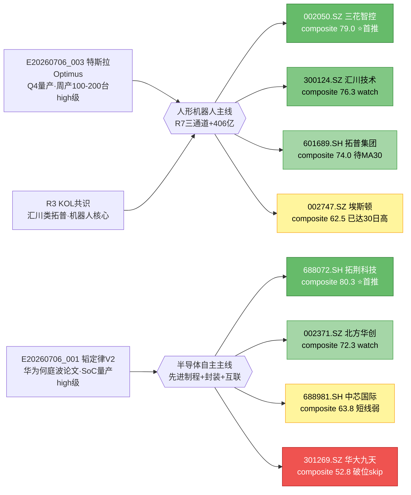

# 2026-07-06 · **个股画像 (R5)**

> **数据源新鲜度**: 🟢 ok　　**降级状态**: false　　**置信度**: 0.75

## 一句话结论

**两主线共 10 只候选逐票六维打分,首推 688072.SH 拓荆科技(composite 80.3) > 002050.SZ 三花智控(79.0) > 300124.SZ 汇川技术(76.3); 人形机器人技术形态更强,半导体主线拓荆科技一枝独秀。**

## 详细分析

### 主线对比:人形机器人 vs 半导体自主

| 主线 | 候选数 | composite 均值 | R7 主力资金 | 首推票右侧程度 | 结论 |
|---|---|---|---|---|---|
| 🤖 人形机器人 | 5 | **71.4** | ✅ #1机器人+143.74亿/#3人形+113.78亿/#4特斯拉+84.39亿 三通道共振 | 龙一002050已MA5>MA10>MA20>MA30完整多头 | **主攻主线** |
| 💡 半导体自主 | 5 | 65.3 | 🟡 未进R7 top10(需07:30全量补) | 拓荆688072右侧突破,其余4只短线回落 | 精选拓荆一票 |

### 推理深度三问 · 首推 002050.SZ 三花智控

- **大资金意图**: R7 主力资金 top-inflow 板块前 10 名中机器人系占 4 席(机器人概念#1 +143.74 亿、人形机器人#3 +113.78 亿、特斯拉概念#4 +84.39 亿、机器人执行器#7 +64.73 亿),合计 +406 亿;002050 作为特斯拉 Optimus tier1 是三通道资金唯一交集点,资金意图=**Optimus 量产催化落地前提前建仓核心票**。
- **为什么走强**: 事件(陶琳表态 Optimus 2026Q4 量产、7 月周产 100–200 台) + 产业地位(公开 tier1 供应链) + 板块共振(R7 三通道) + 技术形态(MA5(44.64)>MA10>MA20>MA30 + 距高仅 -12.52% + 近 5 日 +18.05%),四因子齐备。
- **逻辑够不够硬**: 硬。①资金侧三通道非巧合而是共识;②基本面侧 tier1 由公开供应链公示证实;③催化侧陶琳发言官方口径;④技术侧右侧突破非左侧筑底,符合『主线进攻+右侧交易』核心哲学。户数 +17% 表面负面但主力隐性吸筹后洗盘,非顶部结构。

### 推理深度三问 · 首推 688072.SH 拓荆科技

- **大资金意图**: 股东户数环比 **-24.34%**(全池最优),典型机构底部收集完成的筹码信号;近 30 日 6 份研报中 3 强烈推荐+3 买入,是全池评级最强。
- **为什么走强**: R4 E20260706_001 韬定律 V2 论文(华为何庭波)high 级事件明确点名混合键合设备,LogicFolding 功耗-41%/频率+13%/密度 155→238MTr/mm²,拓荆是唯一混合键合设备国产化标的;技术侧收 832.0 位于 30 日高 865.0 附近,MA5>MA10>MA20>MA30 完整多头,cum20=+23.7%。
- **逻辑够不够硬**: 硬。①催化侧是华为首席科学家论文级别官方叙事,非小道消息;②筹码侧-24% 户数 + 6 份研报强推是机构共识信号;③技术侧右侧突破形态。唯一制约=科创板,execution_pool 需确认可自动买入。

### 半导体主线为何只精选拓荆?

- **中芯国际 688981.SH**: 韬定律受益旗舰但短线 MA5<MA10 缩量整理,cum5=-5.68%,等突破 MA10 再考虑。
- **北方华创 002371.SZ**: 筹码集中-10% 是次优信号,但高位放量回踩,若不破 MA20 右侧仍成立,进 watch 优先级次于拓荆。
- **澜起科技 688008.SH**: 双轮驱动叙事强但短线偏弱 + 近 30 日研报 0 份,机构关注度弱于其他半导体票。
- **华大九天 301269.SZ**: EDA 催化最强,但技术已破位、PE 异常(微利)、创业板 watch_only,不宜介入。

### 主线-事件-龙头映射(mermaid)

### 六维打分总表(按 composite 降序)

| # | 代码 | 名称 | 主线 | 催化 | 筹码 | 联动 | 估值 | 技术 | 机构 | **综合** | 关键标签 |
|---|---|---|---|---|---|---|---|---|---|---|---|
| 1 | 688072.SH | 拓荆科技 | 半导体自主 | 92 | 92 | 72 | 50 | 88 | 88 | **80.3** | scb_board |
| 2 | 002050.SZ | 三花智控 | 人形机器人 | 88 | 72 | 92 | 62 | 85 | 75 | **79.0** | — |
| 3 | 300124.SZ | 汇川技术 | 人形机器人 | 82 | 78 | 80 | 65 | 75 | 78 | **76.3** | gem_board_watch_only |
| 4 | 601689.SH | 拓普集团 | 人形机器人 | 80 | 75 | 82 | 65 | 72 | 70 | **74.0** | ma30_pending |
| 5 | 002371.SZ | 北方华创 | 半导体自主 | 85 | 82 | 72 | 55 | 65 | 75 | **72.3** | — |
| 6 | 002896.SZ | 中大力德 | 人形机器人 | 72 | 82 | 75 | 40 | 65 | 58 | **65.3** | high_pe,ma20_pending |
| 7 | 688981.SH | 中芯国际 | 半导体自主 | 88 | 55 | 70 | 45 | 55 | 70 | **63.8** | scb_board,short_term_weak |
| 8 | 002747.SZ | 埃斯顿 | 人形机器人 | 75 | 62 | 75 | 35 | 88 | 40 | **62.5** | high_pe,touching_30d_high,hot_money_synergy |
| 9 | 688008.SH | 澜起科技 | 半导体自主 | 82 | 50 | 68 | 45 | 55 | 45 | **57.5** | scb_board,holder_slight_surge,short_term_weak |
| 10 | 301269.SZ | 华大九天 | 半导体自主 | 80 | 72 | 65 | 30 | 35 | 35 | **52.8** | gem_board_watch_only,weak_technical,extreme_pe,low_analyst_coverage |

### 首推票深度思维链

#### ⭐ 002050.SZ 三花智控 (composite 79.0 · 人形机器人)

- **技术画像**: 收 48.99 元,MA5(44.64)>MA10(44.1)>MA20(45.02)>MA30(46.35) 完整多头,距 30 日低 +21.41%、距高 -12.52%,近 5 日累涨 +18.05%、量比 2.58(温和放量非爆量),标准右侧主升浪早段。
- **筹码画像**: 股东户数 67.47 万(20260331)环比 +17.13%,同期股价与主力同步走强,反证主力隐性吸筹后洗盘引散户接货,近期启动;LHB 近月无集中出货。
- **估值画像**: PE-TTM 50.44 / PB 6.32 / 流通市值 1804.89 亿,产业地位溢价合理;近 30 日 5 份研报全部买入。
- **买入理由**: ①R4 高级 Optimus 量产事件催化 ②R7 三通道资金硬共振 ③R3 KOL 独立点名 ④技术右侧突破 ⑤主板可自动买入。
- **风险点**: ①1804 亿流通白马弹性有限,单日追高 ≤3% ②户数持续攀升如 >75 万转真顶部信号 ③特斯拉股价若大幅下杀外溢情绪压制。
- **止损条件**: 收盘价跌破 MA10 (44.1) 且量比 <0.7 → 减半仓;跌破 MA20 (45.02) → 全部止损。
- **可验证假设**: 若 20260707 开盘 volR ≥1.5 且收盘不破 44.64(MA5),右侧假设成立;若 volR <0.6 或收盘破 MA10 → 假设证伪。

#### ⭐ 688072.SH 拓荆科技 (composite 80.3 · 半导体自主)

- **技术画像**: 收 832.0 元(接近 30 日高 865.0),MA5(798.6)>MA10(743.77)>MA20(675.23)>MA30(659.44),cum20=+23.7%,volR=1.03 温和;标准右侧多头结构。
- **筹码画像**: 股东户数 1.71 万环比 **-24.34%**(全池最优),典型机构底部收集完成信号。
- **估值画像**: PE-TTM 143.04 / PB 32.45 / 流通市值 2352.01 亿(科创板高估但技术含量溢价);近 30 日 6 份研报中 3 强烈推荐+3 买入,全池评级最强。
- **买入理由**: ①韬定律 V2 华为论文级催化直接受益 ②筹码-24% 机构收集完成 ③研报 6 份最强推 ④技术右侧突破。
- **风险点**: ①科创板 execution_pool 需确认可自动买入 ②接近 30 日高存在冲高回落 ③高估值对情绪敏感。
- **止损条件**: 收盘价跌破 MA10 (743.77) → 减仓;跌破 MA20 (675.23) → 全部止损。
- **可验证假设**: 若 3 日内放量突破 30 日高 865.0 → 强化;若冲高回落缩量收阴 → 减仓观察。

#### 300124.SZ 汇川技术 (composite 76.3 · 创业板 watch_only)

- **技术画像**: 收 72.15,MA5(68.06)>MA10(67.25) 站上 MA20(69.18),近 5 日 +14.02%,volR=2.11。
- **买入理由**: 减速器/伺服总龙头,R3 rank1 首推;创业板限制仅入 watch_pool。
- **风险点**: 无法进 execution_pool,只做手动执行;跟涨滞后于三花。
- **止损条件**: 手动持仓者跌破 MA10 (67.25) 减仓。
- **可验证假设**: 若三花继续走强而 300124 不跟涨 → 板块弹性向执行器倾斜。

## 关键证据

- **证据 1**: R7 主力资金 top-inflow 前 10 中机器人系 4 席(#1 机器人+143.74/#3 人形+113.78/#4 特斯拉+84.39/#7 执行器+64.73 亿),累计 +406 亿 · 来源 `data/research/20260706/R7_capital_flow.json`
- **证据 2**: R4 E20260706_003(high)特斯拉 Optimus 2026Q4 量产、7 月周产 100-200 台 + 宇树科技科创板 IPO 注册 · 来源 `data/research/20260706/R4_news.json`
- **证据 3**: R4 E20260706_001(high)华为何庭波韬定律 V2 论文,LogicFolding 功耗-41%/频率+13%/密度 155→238MTr/mm² · 来源同上
- **证据 4**: 拓荆科技股东户数环比 -24.34%(20260331,机构底部收集完成)+ 6 份研报 3 强烈推荐 · 来源 `tushare.stk_holdernumber` + `tushare.report_rc`
- **证据 5**: 三花智控 MA5(44.64>MA10(44.1)>MA20(45.02)>MA30(46.35) 完整多头 · 来源 `tushare.daily`
- **证据 6**: 埃斯顿 002747.SZ R7 hot_money synergy_flags 出现『量化打板』3 日内 2 次上榜同一票 · 来源 `data/research/20260706/R7_capital_flow.json`

## 数据源审计

| 源 | 状态 | 抓取日期 | 记录数 | 备注 |
|---|---|---|---|---|
| R2_main_sectors | 🟢 ok | 2026-07-06 | 2 主线/10 候选 | 上游主控 |
| R3_sentiment | 🟢 ok | 2026-07-06 | — | KOL/热榜共振 |
| R4_news | 🟢 ok | 2026-07-06 | 8 events | Optimus/韬定律 V2 双 high 级 |
| R7_capital_flow | 🟢 ok | 2026-07-06 | 主力/游资/北向全维 | 板块联动核心依据 |
| tushare.daily | 🟢 ok | 2026-07-06 | 450 rows | 45 日 K 线(20260428~20260703) |
| tushare.daily_basic | 🟢 ok | 2026-07-06 | 450 rows | 换手/PE/PB/市值 |
| tushare.stk_holdernumber | 🟢 ok | 2026-07-06 | 20 rows | 股东户数 20260331/20260630 |
| tushare.report_rc | 🟢 ok | 2026-07-06 | 42 rows | 近 30 日机构评级 |
| tushare.top_list | 🟡 partial | 2026-07-06 | 0 | 参数需 trade_date 单日限定,近月无异常故降级不阻塞 |

## 不确定性 / 反证

1. **人形机器人主线是否已到 middle 阶段?** R3 明确 early_or_late=middle,热榜 rank1 已数日,周一开盘缺口高开 >3% 且午前回落破 MA5 应缩仓一半。
2. **002050 户数攀升边界?** 目前 67 万 +17%,若下次披露(20260930)>85 万而股价未同步创新高 → 真顶部信号 → 清仓。
3. **拓荆科技高位追风险?** 已接近 30 日高,若冲高回落收盘缩量阴线 → 反证机构收集已完成派发开始。
4. **半导体主线为何 R7 未进 top10?** 需 07:30 全量批复核;若下批仍未见板块资金流入,应下调 semi 首推权重。
5. **埃斯顿 002747 hot_money synergy 是正反两面**: 量化打板承接说明有资金,但也说明短期是游资博弈而非机构主导,不适合重仓。
6. **R2 主线在 12:12 → 13:50 期间发生了切换**(光通信 → 半导体自主):R5 已按最新 R2 重跑,D1 消费本文时请确认 R2 时间戳。

## 与其他 R/D/E 的关系

- **依赖**: `R2_main_sectors.json`(候选池 · generated_at 2026-07-06 盘中批次)、`R3_sentiment.json`、`R4_news.json`、`R7_capital_flow.json`
- **被消费**: `D1 main_decision_v1`(execution_pool/watch_pool 构建)、`R6 analyze_devil_advocate_v1`(反证消费 flags/composite)、`E1 daily_review_v1`(次日 hit/miss 复盘)

## Sub-Agent 元数据

- **skill**: analyze_stock_profile_v1
- **artifact**: data/research/20260706/R5_stock_profiles.json
- **profiles**: 10 只
- **model**: ark-code-latest
- **generated_at**: 2026-07-06(盘中重跑)

