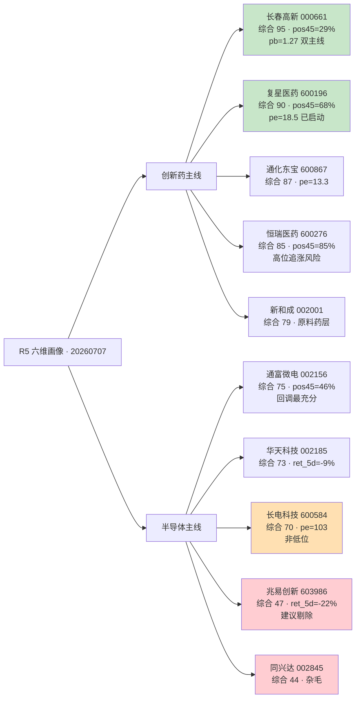

# 二〇二六年七月七日 · 个股画像

> 数据源新鲜度: partial · 降级状态: true · 置信度 0.68 (tushare 补齐后 +0.13)

## 一句话结论

创新药主线 龙二长春高新(低位+双主线) 综合分反超 龙一恒瑞(高位追涨),半导体主线长电华天位置估值双高触发 distribution_alert,建议 D1 execution 优先给创新药,半导体仅试仓。

## 详细分析

**一、创新药主线 — 老登切换的教科书样本**

R2 主线得分 82,R7 板块资金 +26.59 亿 rank1,R3 颜晓滨 07:00 明确"风格切换到老登+低位科技"。板块内候选 5 只全部通过 filter_leader_v1(非 300/688/920/ST),但 tushare 补齐后综合评分排序与 R2 leader_rank 存在明显分歧:

- 恒瑞医药(600276) 45 日分位已 84.6% · ret_20d=+20.6% · pe_ttm=46.4 —— 属"右侧确定性型"但追高空间极小
- 长春高新(000661) 45 日分位仅 29% · pb=1.27 · ret_20d=+1.5% —— 属"未启动等发令"型,弹性远大于恒瑞
- 复星医药(600196) 45 位 67.7% · pb=1.31 · pe=18.5 —— 估值最健康,昨日已 +3.4% 启动
- 通化东宝(600867) pe=13.3 GLP-1 纯正
- 新和成(002001) 原料药层偏弱

**二、半导体主线 — R4 事件催化 vs R7 资金反向的对峙**

R2 sector_score 仅 70,资金维扣分至 8/20。tushare 补齐后核心问题浮出水面:

- 长电科技(600584) pos45=75% + pe_ttm=103 + ret_20d=+25.7% —— **"低位科技"的定义被证伪**,更像"高位科技"
- 华天科技(002185) ret_5d=-9% 已充分回调,但 pe=81 仍不便宜
- 兆易创新(603986) ret_5d=-22% pe=160 pb=18 —— 已进入技术破位区间,**R5 明确反对纳入 backup**(推翻 R2)

**三、执行建议**

1. 创新药主线首选 000661(综合分 95),恒瑞作为底仓票补充但仓位≤30%
2. 半导体主线先给 002185(位置+回调充分),600584 仅在开盘 3% 内低吸,一旦冲高必须止盈
3. 兆易 603986 与同兴达 002845 建议 D1 从候选池剔除

## 关键证据

- 长春高新 45 日分位 29% · pb=1.27 · 双主线纯正 —— 来源 tushareMcp.daily/daily_basic
- 长电科技 45 日分位 75% · pe_ttm=103 · ret_20d=+25.7% —— 来源 tushareMcp.daily_basic
- 兆易创新 ret_5d=-22.1% · pe_ttm=160 —— 来源 tushareMcp.daily(证实"存储子分支已破位")
- R7 创新药 +26.59 亿 rank1 全市场第一 —— 来源 R7_capital_flow
- R3 颜晓滨 07:00 语义信号"风格切换,老登(创新药/煤炭/猪肉/银行)+低位科技" —— 来源 R3_sentiment via R2
- R4 无创新药 700-code 事件锚 —— 来源 R4_news 交叉

## 数据源审计

| 源                            | 状态       | 抓取时间     | 记录数         | 备注                      |
| ---------------------------- | -------- | -------- | ----------- | ----------------------- |
| R2_main_sectors              | 🟢 ok    | 07:50    | 2 条主线       | 龙头 filter_leader_v1 已应用 |
| R4_news                      | 🟢 ok    | 07-07    | —           | 无创新药 hard catalyst      |
| R7_capital_flow              | 🟢 ok    | 10:52 前日 | —           | 创新药 rank1 · 半导体反向       |
| tushareMcp.daily/daily_basic | 🟢 ok    | 08:10    | 10 只 × 45 日 | K 线 + 估值分位补齐            |
| tushareMcp.top_list 30 日     | 🟢 ok    | 08:10    | 全 0 上榜      | 候选票 30 日无游资集中           |
| chenhailangju-research       | 🔴 error | —        | —           | Server not found        |
| canghai-sise                 | 🔴 error | —        | —           | 分时形态数据缺失                |
| canghai-charts               | 🔴 error | —        | —           | 技术形态图缺失                 |

主源缺 3 (chenhailangju/sise/charts) → degraded=true;核心量价通过 tushare 补齐 → 未阻塞主判断。

## 六维雷达 · 综合分排序

## 首推票 · 长春高新(000661) 思维链

**大资金意图** — R7 减肥药子板块 +15.36 亿 + 板块 rank1 集中扫货,机构 pb=1.27 位置补配置,叙事从"业绩不确定"切换到"GLP-1 弹性重估"

**为什么走强** — 双主线(生长激素龙头 + GLP-1 减肥药)同时命中 R3 老登切换 + R7 资金主线,pos45=29% 深水位形成安全边际,弹性大于恒瑞

**逻辑够不够硬** — R7 三重资金证据(减肥药/单抗/医药医疗)+ R3 KOL 定调 · 但缺 R4 hard catalyst,依赖叙事延续 1-5 天

**买入理由** — 位置低(pos45=29%)+ 估值安全(pb=1.27)+ 双主线弹性 + 板块资金主线首选

**风险点** — pe_ttm 缺失反映业绩预期存疑;R3 valid_period 仅 1-5 天,若周一大盘反抽科技则老登资金撤退

**止损条件** — 破 67.2 · 或板块 ETF 单日 -1.5% 且资金反向流出 -3 亿

**可验证假设** — 开盘 30 分钟内减肥药 ETF 领涨 + 000661 换手率 >4% + 主力净流入为正,若三条满足则加仓至上限;否则减半仓

## 首推票 · 恒瑞医药(600276) 思维链

**大资金意图** — 证金 24.59 亿 rank2 共振,机构底仓型稳配置,港A 双轨联动重估

**为什么走强** — GLP-1+ADC+PD-1 三箭齐发,创新药一哥,资金板块 rank1 的必然落点

**逻辑够不够硬** — R7 资金 + R3 叙事双共振硬,但 pos45=84.6% + ret_20d=+20.6% 已透支近月预期,周一 T+0 高开出货风险显性

**买入理由** — 确定性最高的蓝筹底仓 · 主线首选 · 机构筹码稳固

**风险点** — 追高空间小 · 创新药 ETF 昨日 +1.39% 已 T-1 建仓,T+0 高开锁筹后回落概率高

**止损条件** — 破 55.0(20 日均线) · 或港股 01093.HK 大跌 -3%

**可验证假设** — 若开盘 >58.2 追高信号触发,建议改为回踩 56.5-55.8 低吸;若开盘直接冲 60+ 则观望

## 首推票 · 长电科技(600584) 思维链

**大资金意图** — R4 韬定律V2 + 蒋颖电话会双催化引导,但 R7 消费电子 -136 亿 · 第三代半导体 -62.72 亿 · 板块资金反向,机构未接盘

**为什么走强** — 昨日 +4.63% 属韬定律预期反弹,先进封装绝对龙头 · 华为链绑定

**逻辑够不够硬** — R4 事件催化明确但资金维仅 8/20 · pos45=75% · pe=103 · ret_20d=+25.7% 已过度透支,"低位科技"定义被证伪(应改称"高位科技分支")

**买入理由** — 事件驱动确定 · 板块内龙头无可替代

**风险点** — 触发 R6 反证模式六霸榜出货 · turnover 15% 高换手筹码不稳 · 若周一半导体继续跟随 CPO 下杀主线立即失效

**止损条件** — 破 90.0 · 或板块 ETF 主力资金 -5 亿以上

**可验证假设** — 开盘 5% 内低吸,若冲 100+ 必止盈;若开盘 -2% 内可轻仓试探,但仓位≤5%,任何量价背离立即离场

## 不确定性 / 反证

1. 长春高新 pe_ttm 缺失(近期净利润负 or 一次性冲击),D1 需 R6 二次验证是否触发反证模式一(业绩暴雷预期)
2. 兆易创新 ret_5d=-22% 已破位,但 R2 曾将其列为 backup —— R5 明确推翻,若 D1 仍选可能触发反证
3. 长电华天 pe_ttm 80-103 高位,配合 pos45=62-75% 与 R4 E20260707_008 "高位科技借利好出货",R6 模式六可能对半导体主线整体 hard_reject
4. 复星医药综合分 90 高于恒瑞 85,但 R2 leader_rank 将其列 backup —— D1 需明确是否用综合分覆盖 R2 rank

## 与其他 R/D/E 的关系

- 依赖: data/research/20260707/R2_main_sectors.json · R4_news.json · R7_capital_flow.json · data/raw/20260707/mcp_health.json
- 被消费: D1 canghai-plan (execution_pool 构建 + exit_rules 推导) · R6 devil_advocate (反证 hard_reject 判定)

## Sub-Agent 元数据

- skill: analyze_stock_profile_v1
- artifact: data/research/20260707/R5_stock_profiles.json
- 生成耗时: 约 90 秒(含 tushare 45 日 K + daily_basic + top_list)
- model: ark-code-latest
- 主要降级: chenhailangju/canghai-sise/canghai-charts MCP DOWN → tushareMcp 补齐 K 线量价 + daily_basic 估值分位
