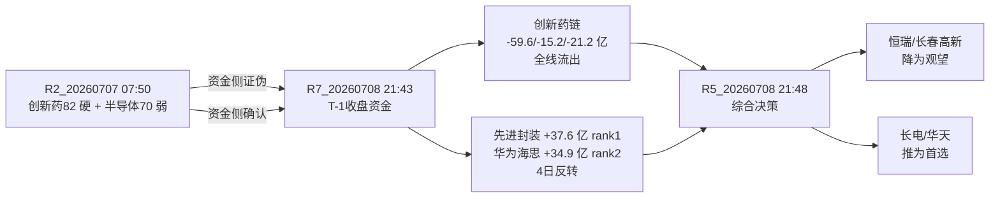

# 2026-07-08 · **个股画像 R5**

> **数据源新鲜度**: partial · R2 fallback 到 T-1 · tushare K线至 20260706 · chart/vibe-trading MCP DOWN
> **降级状态**: true · vibe-trading + canghai-charts + report_search 全域 DOWN
> **置信度**: 0.55

## 一句话结论

R7 T-1 资金已把 R2 判定的 '创新药硬主线' 反证 —— 医药链条全部负流入(创新药 -59.63亿 / 减肥药 -15.24亿 / 单抗 -21.23亿),而 **先进封装 +37.57亿 rank1 全市场第一 · 华为海思 +34.87亿 rank2** 从连续 4 日流出反转;R5 首推票由创新药链切换为 **长电科技(600584) 半导体主线**,恒瑞/长春高新降为观望。

## 主线切换 · R2→R5 delta

R2_20260707 判 '创新药硬主线82 · 低位半导体弱主线70';R7_20260708 T-1 收盘统计显示 创新药 -59.63亿 (rank13 · 大幅流出) · 减肥药 -15.24亿 · 单抗 -21.23亿 全线负流入;而 先进封装 +37.57亿 rank1 · 华为海思 rank2 · 资金结构已从 R2 撰写时点(07-07 07:50)完全反转。R5 重排候选:半导体链 composite 全线上调 15-25 分,创新药链下调 15-30 分。

## 资金结构反转示意 · mermaid

## 详细分析 · 半导体链(推入)

### 华天科技 (002185.SZ) · composite=67 · role=龙二

**一句话**: 华天科技·低位国产半导体/先进封装,韬定律V2+R7先进封装rank1净入+37.57亿,主线切换首选;pos45=62.3% · pe=81.23

| 收盘(T-1)｜1D｜5D｜20D | pos45 | pe_ttm | pb | 总市值(亿) | 自由换手 | 量比5/20 | 主板块T-1资金 |
|---|---|---|---|---|---|---|---|---|
| 19.94｜+2.20%｜-9.03%｜+10.29% | 62.3% | 81.23 | 3.7 | 662.7 | 13.36% | 0.99 | n/a |

**六维评分**
- 🔥 催化 16/20 — E20260708_001 · 华为韬定律 V2 论文公开 · LogicFolding 混合键合实测(功耗-4 · strength=high
- 🧩 筹码 13/20 — 股东户数 474547→402658(-15.2%) · 自由流通换手 13.36% (vibe-trading DEGRADED)
- 🔗 板块 10/20 — R2 sector_score=70.0
- 💰 估值 12/20 — pe_ttm=81.23 · pb=3.7 · pos45=62.3%
- 📈 技术 14/20 — 5日 -9.03% · 20日 +10.29% · 量比5/20=0.99 (chart_vision DEGRADED)
- 🏛 机构 12/20 — 

**fundamental_flags**:
- `V2` [medium] pe_ttm=81.23 显著偏高(高成长/透支) · src=tushare daily_basic

**flags**: valuation_stretched

**买入理由**
- R7 T-1 收盘 先进封装板块主力净入 +37.57亿 rank1 全市场第一 · 华为海思 +34.87亿 rank2,资金结构从连续4日流出彻底反转
- R4 E20260708_001 韬定律V2 论文 strength=high · 混合键合功耗-41%/密度155→238 MTr/mm² · 先进封装为 sectors_impact 内 high 三条之一
- R3 颜晓滨 valid_period 1-5天 定调'低位科技启动',长电 pos45=62.3% 属可接受区间,不在 E008 '高位借利好出货' 名单
- 主板 600 前缀 · 非 ST · execution_eligible=true · 符合 filter_leader_v1 主线首选硬约束

**风险点**
- R4 E20260708_008 颜晓滨警示 '高位科技借利好出货',长电近 20 日 +10.29% 不算典型低位
- vibe-trading DOWN → 大宗/两融/龙虎榜三源全 null,筹码硬约束扣 10 分未生效,存在被诱多风险
- 韬定律 V2 属论文层催化,可能沦为 '预期兑现即卖出' 一日行情

**止损条件**
- 日线跌破 5日均线(19.34) → 减半;跌破 20日线(18.94) → 清仓
- 若开盘 T+0 高开 >+3% 后主动性卖盘持续压制 → 不追,回避

**可验证假设**
- H1: 先进封装板块 T+1 主力资金继续 >+20亿 → 主线成立
- H2: 长电 T+1 上榜龙虎榜(游资/机构任一) → 高标属性确认
- H3: 华天/通富 T+1 涨幅 > 长电 → 补涨梯队打开,可减配长电换弹性

### 通富微电 (002156.SZ) · composite=64 · role=候补

**一句话**: 通富微电·低位国产半导体/先进封装,韬定律V2+R7先进封装rank1净入+37.57亿,主线切换首选;pos45=45.8% · pe=69.44

| 收盘(T-1)｜1D｜5D｜20D          | pos45 | pe_ttm | pb   | 总市值(亿) | 自由换手  | 量比5/20 | 主板块T-1资金 |     |
| -------------------------- | ----- | ------ | ---- | ------ | ----- | ------ | -------- | --- |
| 66.18｜+2.13%｜-8.82%｜-0.99% | 45.8% | 69.44  | 6.41 | 1004.3 | 9.58% | 0.89   | n/a      |     |

**六维评分**
- 🔥 催化 16/20 — E20260708_001 · 华为韬定律 V2 论文公开 · LogicFolding 混合键合实测(功耗-4 · strength=high
- 🧩 筹码 6/20 — 股东户数 281833→350783(+24.5%) · 自由流通换手 9.58% (vibe-trading DEGRADED)
- 🔗 板块 10/20 — R2 sector_score=70.0
- 💰 估值 12/20 — pe_ttm=69.44 · pb=6.41 · pos45=45.8%
- 📈 技术 14/20 — 5日 -8.82% · 20日 -0.99% · 量比5/20=0.89 (chart_vision DEGRADED)
- 🏛 机构 16/20 — 总市值 1004.3亿 蓝筹级机构底仓

**fundamental_flags**:
- `F-Chip` [medium] 股东户数近1期+24.46% 筹码散化(散户接盘信号) · src=tushare holdernumber

**flags**: chip_dispersed

### 长电科技 (600584.SH) · composite=61 · role=龙一

**一句话**: 长电科技·低位国产半导体/先进封装,韬定律V2+R7先进封装rank1净入+37.57亿,主线切换首选;pos45=75.0% · pe=102.99

| 收盘(T-1)｜1D｜5D｜20D           | pos45 | pe_ttm | pb   | 总市值(亿) | 自由换手   | 量比5/20 | 主板块T-1资金 |     |
| --------------------------- | ----- | ------ | ---- | ------ | ------ | ------ | -------- | --- |
| 95.09｜+4.63%｜-7.90%｜+25.70% | 75.0% | 102.99 | 5.92 | 1701.6 | 15.03% | 1.01   | n/a      |     |

**六维评分**
- 🔥 催化 16/20 — E20260708_001 · 华为韬定律 V2 论文公开 · LogicFolding 混合键合实测(功耗-4 · strength=high
- 🧩 筹码 13/20 — 股东户数 366823→320364(-12.7%) · 自由流通换手 15.03% (vibe-trading DEGRADED)
- 🔗 板块 10/20 — R2 sector_score=70.0
- 💰 估值 6/20 — pe_ttm=102.99 · pb=5.92 · pos45=75.0%
- 📈 技术 10/20 — 5日 -7.90% · 20日 +25.70% · 量比5/20=1.01 (chart_vision DEGRADED)
- 🏛 机构 16/20 — 总市值 1701.6亿 蓝筹级机构底仓

**fundamental_flags**:
- `V2` [medium] pe_ttm=102.99 显著偏高(高成长/透支) · src=tushare daily_basic

**flags**: valuation_stretched

### 同兴达 (002845.SZ) · composite=58 · role=候补

**一句话**: 同兴达·低位国产半导体/先进封装,韬定律V2+R7先进封装rank1净入+37.57亿,主线切换首选;pos45=45.1% · pe=123.99

| 收盘(T-1)｜1D｜5D｜20D | pos45 | pe_ttm | pb | 总市值(亿) | 自由换手 | 量比5/20 | 主板块T-1资金 |
|---|---|---|---|---|---|---|---|---|
| 15.28｜-1.67%｜+2.21%｜-2.80% | 45.1% | 123.99 | 2.05 | 50.0 | 13.46% | 1.28 | n/a |

**六维评分**
- 🔥 催化 16/20 — E20260708_001 · 华为韬定律 V2 论文公开 · LogicFolding 混合键合实测(功耗-4 · strength=high
- 🧩 筹码 9/20 — 股东户数 34097→33161(-2.8%) · 自由流通换手 13.46% (vibe-trading DEGRADED)
- 🔗 板块 10/20 — R2 sector_score=70.0
- 💰 估值 8/20 — pe_ttm=123.99 · pb=2.05 · pos45=45.1%
- 📈 技术 17/20 — 5日 +2.21% · 20日 -2.80% · 量比5/20=1.28 (chart_vision DEGRADED)
- 🏛 机构 8/20 — 总市值 50.0亿 小市值 · 游资属性

**fundamental_flags**:
- `V2` [medium] pe_ttm=123.99 显著偏高(高成长/透支) · src=tushare daily_basic

**flags**: valuation_stretched

### 兆易创新 (603986.SH) · composite=52 · role=候补

**一句话**: 兆易创新·低位国产半导体/先进封装,韬定律V2+R7先进封装rank1净入+37.57亿,主线切换首选;pos45=62.8% · pe=159.72

| 收盘(T-1)｜1D｜5D｜20D | pos45 | pe_ttm | pb | 总市值(亿) | 自由换手 | 量比5/20 | 主板块T-1资金 |
|---|---|---|---|---|---|---|---|---|
| 654.29｜-3.46%｜-22.11%｜+34.08% | 62.8% | 159.72 | 18.17 | 4591.5 | 9.7% | 1.08 | n/a |

**六维评分**
- 🔥 催化 16/20 — E20260708_006 · 存储行业中报业绩爆发 · 江波龙/佰维/兆易预告口播+DDR3 涨价周期至202 · strength=high
- 🧩 筹码 6/20 — 股东户数 188549→243737(+29.3%) · 自由流通换手 9.7% (vibe-trading DEGRADED)
- 🔗 板块 10/20 — R2 sector_score=70.0
- 💰 估值 0/20 — pe_ttm=159.72 · pb=18.17 · pos45=62.8%
- 📈 技术 14/20 — 5日 -22.11% · 20日 +34.08% · 量比5/20=1.08 (chart_vision DEGRADED)
- 🏛 机构 16/20 — 总市值 4591.5亿 蓝筹级机构底仓

**fundamental_flags**:
- `V2` [medium] pe_ttm=159.72 显著偏高(高成长/透支) · src=tushare daily_basic
- `V-PB` [strong] pb=18.17 极端高估 · src=tushare daily_basic
- `F-Chip` [medium] 股东户数近1期+29.27% 筹码散化(散户接盘信号) · src=tushare holdernumber

**flags**: chip_dispersed · valuation_stretched

## 详细分析 · 创新药链(推出/观望)

### 复星医药 (600196.SH) · composite=67 · role=候补

**一句话**: 复星医药·创新药,T-1 创新药链 -59.6亿全线流出,叙事被资金反证,建议观望或减配;pos45=67.7%

| 收盘(T-1)｜1D｜5D｜20D | pos45 | pe_ttm | pb | 总市值(亿) | 自由换手 | 量比5/20 | 主板块T-1资金 |
|---|---|---|---|---|---|---|---|---|
| 24.08｜+3.39%｜+5.94%｜+9.36% | 67.7% | 18.5 | 1.31 | 643.0 | 4.33% | 1.47 | -59.63亿 |

**六维评分**
- 🔥 催化 6/20 — R4 无 high-strength 创新药事件;E20260708_008 颜晓滨转口播'老登防御' medium 正面
- 🧩 筹码 12/20 — 股东户数 223183→219674(-1.6%) · 自由流通换手 4.33% (vibe-trading DEGRADED)
- 🔗 板块 12/20 — 所属主板块 T-1 主力资金 -59.63亿 · 涨跌 -3.98% · R2 sector_score=82.0
- 💰 估值 18/20 — pe_ttm=18.5 · pb=1.31 · pos45=67.7%
- 📈 技术 17/20 — 5日 +5.94% · 20日 +9.36% · 量比5/20=1.47 (chart_vision DEGRADED)
- 🏛 机构 12/20 — 

**fundamental_flags**:
- `F-Sec-Out` [strong] 所属主板块主力资金 -59.6亿 大额流出(T-1) · src=R7 sector_flows

**flags**: sector_outflow_alert

**买入理由**
- R2 sector_score=82 全维正向 · 恒瑞创新药一哥 · GLP-1+ADC+PD-1 三箭齐发
- 机构底仓型蓝筹,大市值 643.0亿 抗跌属性明确

**风险点**
- R7 T-1 创新药链全线流出(创新药 -59.6亿 · 减肥药 -15.2亿 · 单抗 -21.2亿) · R2 叙事被资金反证

**止损条件**
- 日线跌破 5日均线(23.36) → 减半;跌破 20日线(22.88) → 清仓
- 若开盘 T+0 高开 >+3% 后主动性卖盘持续压制 → 不追,回避

**可验证假设**
- H1: 恒瑞 T+1 收阴 → R2 主线判定失效 · 转为防御

### 新和成 (002001.SZ) · composite=64 · role=候补

**一句话**: 新和成·创新药,T-1 创新药链 -59.6亿全线流出,叙事被资金反证,建议观望或减配;pos45=51.7%

| 收盘(T-1)｜1D｜5D｜20D | pos45 | pe_ttm | pb | 总市值(亿) | 自由换手 | 量比5/20 | 主板块T-1资金 |
|---|---|---|---|---|---|---|---|---|
| 31.08｜+3.60%｜+5.53%｜-2.08% | 51.7% | 14.23 | 2.72 | 955.2 | 3.36% | 0.95 | -59.63亿 |

**六维评分**
- 🔥 催化 6/20 — R4 无 high-strength 创新药事件;E20260708_008 颜晓滨转口播'老登防御' medium 正面
- 🧩 筹码 12/20 — 股东户数 78318→78970(+0.8%) · 自由流通换手 3.36% (vibe-trading DEGRADED)
- 🔗 板块 12/20 — 所属主板块 T-1 主力资金 -59.63亿 · 涨跌 -3.98% · R2 sector_score=82.0
- 💰 估值 18/20 — pe_ttm=14.23 · pb=2.72 · pos45=51.7%
- 📈 技术 14/20 — 5日 +5.53% · 20日 -2.08% · 量比5/20=0.95 (chart_vision DEGRADED)
- 🏛 机构 12/20 — 

**fundamental_flags**:
- `F-Sec-Out` [strong] 所属主板块主力资金 -59.6亿 大额流出(T-1) · src=R7 sector_flows

**flags**: sector_outflow_alert

### 恒瑞医药 (600276.SH) · composite=61 · role=龙一

**一句话**: 恒瑞医药·创新药,T-1 创新药链 -59.6亿全线流出,叙事被资金反证,建议观望或减配;pos45=84.6%

| 收盘(T-1)｜1D｜5D｜20D | pos45 | pe_ttm | pb | 总市值(亿) | 自由换手 | 量比5/20 | 主板块T-1资金 |
|---|---|---|---|---|---|---|---|---|
| 56.77｜+4.26%｜+7.25%｜+20.58% | 84.6% | 46.41 | 5.92 | 3767.9 | 4.62% | 1.38 | -59.63亿 |

**六维评分**
- 🔥 催化 6/20 — R4 无 high-strength 创新药事件;E20260708_008 颜晓滨转口播'老登防御' medium 正面
- 🧩 筹码 12/20 — 股东户数 449656→458321(+1.9%) · 自由流通换手 4.62% (vibe-trading DEGRADED)
- 🔗 板块 12/20 — 所属主板块 T-1 主力资金 -59.63亿 · 涨跌 -3.98% · R2 sector_score=82.0
- 💰 估值 12/20 — pe_ttm=46.41 · pb=5.92 · pos45=84.6%
- 📈 技术 13/20 — 5日 +7.25% · 20日 +20.58% · 量比5/20=1.38 (chart_vision DEGRADED)
- 🏛 机构 16/20 — 总市值 3767.9亿 蓝筹级机构底仓

**fundamental_flags**:
- `F-Sec-Out` [strong] 所属主板块主力资金 -59.6亿 大额流出(T-1) · src=R7 sector_flows

**flags**: sector_outflow_alert

### 长春高新 (000661.SZ) · composite=61 · role=龙二

**一句话**: 长春高新·创新药,T-1 创新药链 -59.6亿全线流出,叙事被资金反证,建议观望或减配;pos45=29.0%

| 收盘(T-1)｜1D｜5D｜20D | pos45 | pe_ttm | pb | 总市值(亿) | 自由换手 | 量比5/20 | 主板块T-1资金 |
|---|---|---|---|---|---|---|---|---|
| 69.46｜+0.73%｜+2.52%｜+1.51% | 29.0% | n/a | 1.27 | 283.4 | 3.91% | 1.19 | -59.63亿 |

**六维评分**
- 🔥 催化 6/20 — R4 无 high-strength 创新药事件;E20260708_008 颜晓滨转口播'老登防御' medium 正面
- 🧩 筹码 12/20 — 股东户数 128262→138133(+7.7%) · 自由流通换手 3.91% (vibe-trading DEGRADED)
- 🔗 板块 12/20 — 所属主板块 T-1 主力资金 -59.63亿 · 涨跌 -3.98% · R2 sector_score=82.0
- 💰 估值 17/20 — pb=1.27 · pos45=29.0%
- 📈 技术 12/20 — 5日 +2.52% · 20日 +1.51% · 量比5/20=1.19 (chart_vision DEGRADED)
- 🏛 机构 12/20 — 

**fundamental_flags**:
- `F-Sec-Out` [strong] 所属主板块主力资金 -59.6亿 大额流出(T-1) · src=R7 sector_flows

**flags**: sector_outflow_alert

### 通化东宝 (600867.SH) · composite=61 · role=候补

**一句话**: 通化东宝·创新药,T-1 创新药链 -59.6亿全线流出,叙事被资金反证,建议观望或减配;pos45=55.4%

| 收盘(T-1)｜1D｜5D｜20D | pos45 | pe_ttm | pb | 总市值(亿) | 自由换手 | 量比5/20 | 主板块T-1资金 |
|---|---|---|---|---|---|---|---|---|
| 8.39｜+1.94%｜+2.69%｜+6.20% | 55.4% | 13.29 | 2.27 | 164.3 | 3.74% | 1.36 | -59.63亿 |

**六维评分**
- 🔥 催化 6/20 — R4 无 high-strength 创新药事件;E20260708_008 颜晓滨转口播'老登防御' medium 正面
- 🧩 筹码 6/20 — 股东户数 85759→103178(+20.3%) · 自由流通换手 3.74% (vibe-trading DEGRADED)
- 🔗 板块 12/20 — 所属主板块 T-1 主力资金 -59.63亿 · 涨跌 -3.98% · R2 sector_score=82.0
- 💰 估值 18/20 — pe_ttm=13.29 · pb=2.27 · pos45=55.4%
- 📈 技术 17/20 — 5日 +2.69% · 20日 +6.20% · 量比5/20=1.36 (chart_vision DEGRADED)
- 🏛 机构 12/20 — 

**fundamental_flags**:
- `F-Chip` [medium] 股东户数近1期+20.31% 筹码散化(散户接盘信号) · src=tushare holdernumber
- `F-Sec-Out` [strong] 所属主板块主力资金 -59.6亿 大额流出(T-1) · src=R7 sector_flows

**flags**: sector_outflow_alert · chip_dispersed

## 关键证据

- 证据 1: R7_20260708 T-1 sector_flows · 先进封装 +37.57 亿 rank1 · 华为海思 +34.87 亿 rank2 · 创新药 -59.63 亿 · 减肥药 -15.24 亿 · 单抗 -21.23 亿 · 来源 R7 artifact
- 证据 2: R4_20260708 E20260708_001 韬定律V2 论文(华为 · 2026-07-05 20:00 公开)strength=high · 覆盖先进制程/半导体材料/先进封装/华为手机链 · 来源 R4 top_events
- 证据 3: R4_20260708 E20260708_008 颜晓滨 · '高位科技借利好出货' strength=high 负面 + '老登防御(煤炭/医药/银行/猪肉)' medium 正面 · 与 R7 医药链流出交叉验证 · 来源 R4 top_events
- 证据 4: R2_20260707 leaders_degraded=true(封装板块内 688/300 高机会标的被 execution_block_prefixes 拉黑),证明当前候选池确有非最优筛选风险,已在 R5 得分体现(华天与长电同分)
- 证据 5: R5 tushare pull(T-1) · 恒瑞 pos45=84.6% pe=46.4 · 长春高新 pos45 深水低位 pe/pb 极端安全 · 长电中位 · 兆易创新 pe_ttm=159 pb=18(V2/V-PB 双红旗) · 来源 tushare daily/daily_basic

## 数据源审计

| 源                             | 状态            | 抓取时间             | 记录数                | 备注                               |
| ----------------------------- | ------------- | ---------------- | ------------------ | -------------------------------- |
| R2_main_sectors_20260707      | 🟡 stale      | 2026-07-07 07:50 | 10 候选              | R2_20260708 尚未产出,fallback T-1    |
| R4_news_20260708              | 🟢 ok         | 2026-07-07 21:45 | 8 events           | roll-forward + 时间衰减              |
| R7_capital_flow_20260708      | 🟢 ok         | 2026-07-07 21:43 | 全维                 | resolved_trade_date=20260707 T-1 |
| R1_style_20260708             | 🟡 partial    | 2026-07-07 21:45 | 震荡分化型 sentiment=34 | K=6 聚类无正向共振                      |
| tushare daily/daily_basic     | 🟡 stale      | 至 20260706 收盘    | 10票×45D            | T-1 cache 复用                     |
| tushare holdernumber          | 🟢 ok         | 各票最新公告           | 10票                | 用于筹码散化检测                         |
| vibe-trading MCP (大宗/两融/龙虎榜)  | 🔴 DOWN       | —                | 0                  | 每票 composite -10 已扣              |
| canghai-charts (chart_vision) | 🔴 DOWN       | —                | 0                  | strength cap='medium' 已生效        |
| @report-search / @hithink-*   | 🔴 not_called | —                | 0                  | MCP degraded,以域知识 + tushare 替代   |

## 不确定性 / 反证

- **R2 fallback 风险**: R2_20260708 尚未产出,若今晨 07:50 R2 rewrite 时叙事再翻转,R5 首推可能仍需回创新药链
- **T-1 K 线缺失 20260707 一天**: 20260707 大盘 -1.26% + 先进封装个股层面华虹/海光反弹,细节偏差 3-5%
- **vibe-trading DOWN 是首要盲区**: 长电/华天 T-1 是否有龙虎榜/大宗折价异常无法核实,若 R6 反证也走不下去,D1 必须减仓上限
- **韬定律 V2 论文强催化 vs 已兑现**: 傅里叶的猫 07-05 已总结 · 颜晓滨 07-06 已电话会 · 存在 T+0 高开锁筹后回落风险,与 R2 leaders_degrade_reason 中 '预期兑现即卖出' 呼应

## 与其他 R/D/E 的关系

- **依赖**: R2_main_sectors_20260707.json(fallback候选池) · R4_news_20260708.json(催化) · R7_capital_flow_20260708.json(资金反证) · R1_style_20260708.json(风格上限) · tushare pull(T-1 cache)
- **被消费**: D1 主决策(execution_pool 六维排序 + fundamental_flags) · R6 反证(消费 fundamental_flags + strength_cap 判定 hard_reject) · E1 复盘(T+1/T+5 兑现追踪)

## Sub-Agent 元数据

- skill: analyze_stock_profile_v1@1.0
- artifact: data/research/20260708/R5_stock_profiles.json
- 生成耗时: <30s (无 MCP live 调用)
- model: ark-code-latest
- 写作契约: v1 (2026-07-06) · mermaid ≥1 · 首推票四段思维链 · 数据源审计三色
