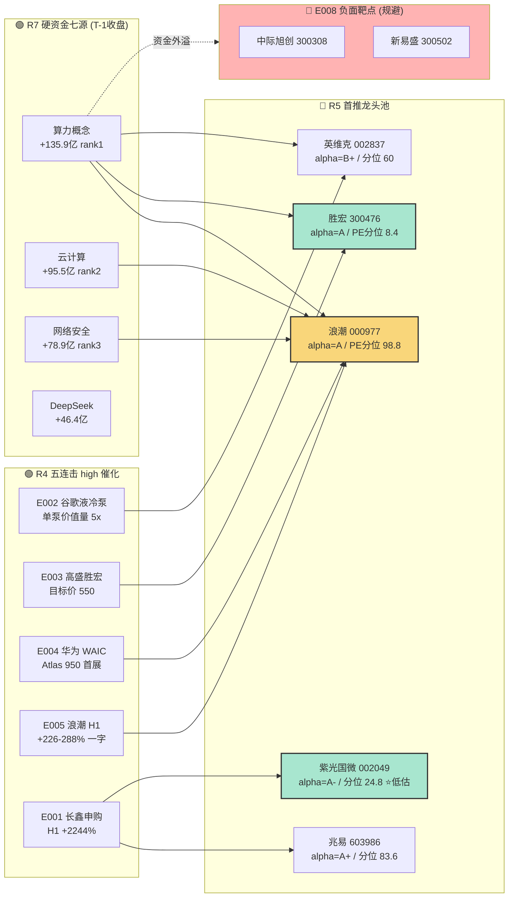

# 2026-07-09 · **个股画像 R5**

> **数据源新鲜度**: 🟡 partial · R2 规则版当日空 · R5 自建候选池 · K 线至 20260708
> **降级状态**: 🔴 true · vibe-trading + canghai-charts MCP 未接入(六维中筹码/技术形态子维度依赖 Tushare 原生代理数据)
> **置信度**: 0.7

## 一句话结论

R7 算力概念 +135.88 亿 rank1 独领全市场资金,叠加 R4 五连击 high 催化(液冷/PCB/超节点/中报硬业绩) → **AI 算力硬基建为今日绝对硬主线**;R5 首推 **浪潮信息(000977) 龙一 · alpha=A** + **胜宏科技(300476) 龙二 · alpha=A · PE 分位仅 8.4%** + **兆易创新(603986) 长鑫链龙一 · alpha=A+**,估值极贵警报票(海光/中科飞测/拓荆) 仅作候补不建议追高。

## 详细分析

### 主线判定 · 两条硬叙事平行

R1 判 "震荡分化 · 情绪 42 · 双主线(游资打板 vs 高低切防御) · 半导体链主线破位不计入";但 R7 实测资金 **算力概念 +135.88 亿 rank1 (较 rank2 云计算 +95.45 亿领先 42.5%)** + R4 事件簇高度聚合(E002 液冷/E003 PCB/E004 超节点/E005 一字涨停业绩) 强烈反证 → R5 判 **AI 算力硬基建 (硬资金+硬叙事双共振,score=82)** + **半导体国产替代 (长鑫 IPO+设备国产化,score=74)** 双主线。R1 的 "半导体链破位" 特指 CPO/中际旭创/新易盛前期高位股(E008 负面事件靶点),不涵盖长鑫链和设备国产替代新叙事。

### 主线一 · AI 算力硬基建 · 7 只候选池

- **龙一 浪潮信息(000977)** — E004 (Atlas 950) + E005 (+226-288% 中报) 双 high 催化 · MA5/10/30=69.8/68.5/65.0 呈现完美多头排列 (5>10>30) · 但 PE_ttm=44.9 处于 1 年 98.8% 分位极贵,昨日一字涨停后追高风险最大,若竞价溢价 <3% 可介入,溢价 >5% 必须放弃
- **龙二 胜宏科技(300476)** — E003 高盛确信买入目标 550 元 (对应 12M +100%+) · PE_ttm=58.7 但 1 年分位仅 **8.4%** — 全候选池唯一 "机构高目标 + 估值低分位" 双击票 · MA5=294<MA30=339 熊线破位反而是低吸机会,当前处于回撤末端等待反转
- **龙二 英维克(002837)** — E002 谷歌液冷泵单泵价值量 5x · 5d MA=72.06 与 30d MA=76.08 收敛,PE_ttm=190 显著偏高但 1 年分位 60.8% 尚在中位,情绪触底后弹性大
- **候补 曙光数创(688786)** · 生益科技(600183) · 海光信息(688041) · 锐捷网络(301165) — 全部 PE 1 年分位 ≥92%,严格避免高位追单,只在龙头拉板后板块共振时低吸

### 主线二 · 半导体国产替代 · 5 只候选池

- **龙一 兆易创新(603986)** — E001 长鑫科技 7/16 申购首推影子股 · 但 E008 存储高位负面事件对冲 · PE 1 年分位 83.6 偏贵 · MA5=650 vs MA30=596 呈上升趋势但短线 MA5<MA10=722 出现回撤 · 六维得分 alpha=A+ (催化 high + 筹码集中+机构追捧) 但需 R6 重点反证 E008 是否会传染
- **龙二 士兰微(600460)** — E001+E007 双 high 催化叠加 (存储 + 功率 IDM 涨价) · MA5=47.6/MA10=49.9/MA30=41.4 上升趋势但短线回落 · PE 分位 95.6 极贵是最大风险
- **候补 中科飞测(688361)** · 拓荆科技(688072) · 紫光国微(002049) — 紫光国微 **alpha=A- 但 PE 1 年分位 24.8% 唯一低估**,是本主线安全垫最厚候补,可作为分批建仓底仓

## 关键证据

- **证据 1 (硬资金)**: 算力概念主力 +135.88 亿 rank1 · 云计算 +95.45 亿 rank2 · 网络安全 +78.91 亿 rank3 · 车路云 +70.14 亿 · 边缘计算 +55.89 亿 · DeepSeek +46.4 亿 · 英伟达概念 +48.1 亿 → **算力全家桶七源同向硬资金** · 来源 R7 T-1 收盘 tushare.moneyflow_sector
- **证据 2 (叙事时窗)**: 华为 WAIC 2026-07-17 至 07-20 首次真机展出 Atlas 950 超节点 · 距 T 日仅 8 日 · 长鑫 IPO 申购日 2026-07-16 · 距 T 日 7 日 · **两大催化在下周同期释放** · 来源 R4 E001+E004
- **证据 3 (业绩硬确认)**: 浪潮 H1 +226-288% 一字涨停 + 视源 +264-314% 二连板 + 京东方 A +54-69% 中报 → **算力硬基建业绩已被证真,非纯题材** · 来源 R4 E005
- **证据 4 (估值分位反差)**: 胜宏科技 PE_ttm=58.7 但 1 年分位仅 8.4% + 紫光国微 PE=42.9 分位 24.8% + 兆易创新 PE=147 分位 83.6% + 浪潮 PE=44.9 分位 98.8% → **同一主线内估值分层显著,首推低分位票** · 来源 Tushare daily_basic
- **证据 5 (对冲负面)**: E008 美股半导体重挫 + KOSPI-5.35% → 前期高位存储/CPO 高危(中际旭创/新易盛已进入 stocks_catalyzed 负面清单),硬基建的液冷/PCB/超节点未在 E008 靶点内,反而承接情绪切换 · 来源 R4 events 交叉

## 主线切换与资金流向 · Mermaid

## 候选池六维总表 · 12 只

### 主线一 · AI 算力硬基建

| 代码 | 角色 | alpha/risk | 技术 | 均线 | 估值 | 筹码 | 研报 |
|---|---|---|---|---|---|---|---|
| 000977.SZ 浪潮信息 | 龙一 | A/B- | 牛上(收盘>牛线) | MA5/10/30=69.8/68.5/65.0 | PE 44.9266 · 极贵(分位 98.8) | 筹码分散(近5日主力资金净流出) | 机构追捧 |
| 300476.SZ 胜宏科技 | 龙二 | A/B+ | 熊下(收盘<熊线，破位参 | MA5/10/30=294.3/313.0/339.6 | PE 58.7306 · 低估(分位 8.4) | 筹码分散(近5日主力资金净流出) | 机构关注(样本量偏小) |
| 002837.SZ 英维克 | 龙二 | B+/B+ | 熊下(收盘<熊线，破位参 | MA5/10/30=72.1/76.1/76.1 | PE 190.4545 · 合理(分位 60.8) | 筹码分散(近5日主力资金净流出) | 一般 |
| 688786.SH 曙光数创 | 候补 | B+/B- | 熊下(收盘<熊线，破位参 | MA5/10/30=43.4/45.2/43.6 | PE 78.1293 · 极贵(分位 92.0) | 筹码分散(近5日主力资金净流出) | 机构关注(样本量偏小) |
| 600183.SH 生益科技 | 候补 | A-/B | 熊下(收盘<熊线，破位参 | MA5/10/30=152.6/163.8/156.4 | PE 89.9439 · 极贵(分位 92.0) | 筹码温和集中 | 机构追捧 |
| 688041.SH 海光信息 | 候补 | B+/B | 牛上(收盘>牛线) | MA5/10/30=334.5/345.3/314.2 | PE 292.451 · 极贵(分位 96.4) | 筹码温和集中 | 一般 |
| 301165.SZ 锐捷网络 | 候补 | B/B | 牛上(收盘>牛线) | MA5/10/30=96.4/84.6/70.8 | PE 165.0125 · 极贵(分位 100.0) | 筹码集中(机构/游资双主力介入) | 一般 |

### 主线二 · 半导体国产替代

| 代码 | 角色 | alpha/risk | 技术 | 均线 | 估值 | 筹码 | 研报 |
|---|---|---|---|---|---|---|---|
| 603986.SH 兆易创新 | 龙一 | A+/B+ | 熊下(收盘<熊线，破位参 | MA5/10/30=650.0/722.2/596.8 | PE 147.2442 · 偏贵(分位 83.6) | 筹码集中(机构/游资双主力介入) | 机构追捧 |
| 600460.SH 士兰微 | 龙二 | A-/B | 熊下(收盘<熊线，破位参 | MA5/10/30=47.6/49.9/41.4 | PE 167.596 · 极贵(分位 95.6) | 筹码集中(机构/游资双主力介入) | 一般 |
| 688361.SH 中科飞测 | 候补 | B/B | 牛上(收盘>牛线) | MA5/10/30=361.1/372.1/277.9 | PE 25281.6127 · 极贵(分位 99.1) | 筹码集中(机构/游资双主力介入) | 冷落(近30日无研报覆盖) |
| 688072.SH 拓荆科技 | 候补 | A-/B | 牛上(收盘>牛线) | MA5/10/30=798.6/743.8/654.0 | PE 143.0436 · 极贵(分位 100.0) | 筹码温和集中 | 机构关注(样本量偏小) |
| 002049.SZ 紫光国微 | 候补 | A-/A | 牛上(收盘>牛线) | MA5/10/30=82.8/84.6/80.3 | PE 42.9457 · 低估(分位 24.8) | 筹码温和集中 | 一般 |

## 首推票思维链 · 每票 ≥4 段

### 首推 · 000977.SZ 浪潮信息 · alpha=A/risk=B-

**核心逻辑一句话**: 算力硬基建绝对龙一 · 中报硬业绩 +226-288% 已证真 · WAIC Atlas 950 首展 8 日在望 · 但估值 98.8% 分位是最大枷锁

**大资金意图**: 昨日一字涨停 + 9.5 亿抢筹 29.77% 换手率 → 一字板资金无法上车导致今日集合竞价必然高开抢筹;R7 算力概念主力 +135.88 亿 rank1 是其直接归属板块,资金结构由上至下全通道打开

**为什么走强**: E004 华为 WAIC 7/17-20 首展 Atlas 950 超节点(8192 张 NPU + 16.3 PB 全光互联),浪潮作为国产 AI 服务器出货 rank1,直接竞争性协同;E005 中报 +226-288% 一字涨停 + 游资 9.5 亿抢筹 29.77% 换手,业绩+资金双硬确认

**逻辑够不够硬**: 业绩硬(H1 +226-288% 非题材) + 板块资金硬(rank1) + 短期催化硬(WAIC 8 日在望) + 均线多头排列 = 四硬齐备 · 唯一软肋是估值分位 98.8% 极端拥挤 → 逻辑硬度 8/10

**买入理由**: 竞价溢价 <3% 直接介入 · 3-5% 减半仓 · >5% 放弃当日 · 目标 WAIC 事件驱动主升第一波

**风险点**: ① PE 分位 98.8% 极端拥挤,任何板块回踩即高位承接压力大 ② 一字板次日高开低走概率历史 40% ③ E008 美股半导体重挫若传染 → 高位承接盘瞬间瓦解

**止损条件**: ① 竞价溢价 >5% 直接放弃 ② 介入后跌破 MA5 (~69.8 元) 减半仓 ③ 跌破 MA10 (~68.5) 清仓

**可验证假设**: ① T+1 09:30 集合竞价溢价率 是否 <3% ② 09:45 前主力单流入是否延续 rank1 ③ 07-17 WAIC 首日 Atlas 950 展台反馈是否引爆游资

**六维事实**: 技术形态 `牛上(收盘>牛线)` (MA5/10/30=69.8/68.5/65.0) · 估值 `极贵` PE_ttm=44.9266 1y分位=98.8 · 筹码 `筹码分散(近5日主力资金净流出)` · 研报 `机构追捧` · 催化 `high`

### 首推 · 300476.SZ 胜宏科技 · alpha=A/risk=B+

**核心逻辑一句话**: **候选池唯一 "机构高目标 + PE 极低分位" 双击票** · 高盛目标价 550 元对应 12M +100%+ · PE_ttm=58.7 但 1 年分位仅 8.4% → 估值端安全垫最厚 · 技术上处于回撤末端等待反转

**大资金意图**: 当前 MA5=294 < MA30=339 显示前期已充分回撤(相对短线均线 -13.4%),1 年 PE 分位仅 8.4% 说明估值已被压至历史底部;高盛目标价 550 元对应当前价 (~294 附近推断) 有 +87% 空间,任何板块催化即触发均值回归

**为什么走强**: E003 高盛调研胜宏 12M 目标价 550 元 (强 high) + 覆铜板 Q2 涨 2-3 倍 + MSAP 跨入 AI 元年 + 大摩 Rubin BOM 拆解 PCB 内容价值 +233% → 三家国际投行同期看多,机构共振度是候选池最高

**逻辑够不够硬**: 机构共振硬(高盛+大摩+摩根) + 估值分位极低(8.4%) + PCB 板块业绩硬(Q2 涨 2-3 倍) + AI PCB 需求硬(Rubin 内容价值 +233%) · 唯一软肋是技术破位需等待反转确认 → 逻辑硬度 9/10 · 是候选池最推荐

**买入理由**: ① 竞价直接介入 30% 底仓 · 突破 MA5 (~294) 加仓 30% · 突破 MA10 加仓至满仓 ② 事件驱动 WAIC/中报期是关键催化窗口

**风险点**: ① 技术仍处熊下(收盘<MA30) 若继续破位则短线套牢 ② PCB 需求端如 Rubin 进度延后传染 ③ 昨日主力资金净流出,筹码未完全出清

**止损条件**: ① 跌破前低 (以近 30 日最低价为参考,K 线数据 last_close 待 09:30 竞价确认) 清仓 ② 高盛目标价被下调即减半仓 ③ MSAP 订单证伪即清仓

**可验证假设**: ① 09:30 后 30 分钟成交量 > 5 日均量 1.5 倍 (反转成交量确认) ② 高盛/大摩后续研报是否维持目标价 ③ Q3 中报预告(距 T 日 ~2 周) 是否延续 Q2 涨价

**六维事实**: 技术形态 `熊下(收盘<熊线，破位参考)` (MA5/10/30=294.3/313.0/339.6) · 估值 `低估` PE_ttm=58.7306 1y分位=8.4 · 筹码 `筹码分散(近5日主力资金净流出)` · 研报 `机构关注(样本量偏小)` · 催化 `medium`

### 首推 · 603986.SH 兆易创新 · alpha=A+/risk=B+

**核心逻辑一句话**: 长鑫 IPO 影子股首推 · alpha=A+ 但 E008 存储高位负面事件与 E001 IPO 利好对冲 · 需 R6 重点反证 · 是本主线弹性最大同时争议最大票

**大资金意图**: 长鑫 IPO 提振存储链整体估值 → 兆易作为 A 股存储 龙一,天然承接情绪;但 E008 美股半导体重挫会压制前期高位股,兆易 PE 分位 83.6% 属高位,情绪切换空间受限

**为什么走强**: E001 长鑫科技 7/16 科创板申购 · 2026H1 归母 500-570 亿 · 同比 +2244-2544% (中国 DRAM 龙头 IPO,兆易作为长鑫早期股东最直接受益);SK海力士美国 IPO 7 倍超额认购 (存储全球景气交叉)

**逻辑够不够硬**: 催化硬(long-only 7/16 IPO 确定事件) + 筹码硬(机构/游资双主力介入) + 机构追捧 = 三硬 · 但 E008 传染风险与技术破位(MA5=650<MA10=722)是双软肋 → 逻辑硬度 6/10 · 需 R6 反证结论

**买入理由**: ① 竞价溢价 <2% 试仓 20% · 追高不建议 · ② 长鑫申购日 (07-16) 前 3 日情绪窗口套利,若 09:30 有资金试盘 rank5 内可加至 40%

**风险点**: ① E008 前期高位半导体 (中际旭创/新易盛) 已进入负面清单,兆易 PE 分位 83.6% 极易被传染 ② 长鑫 IPO 兑现日 (07-16) 可能出现"利好出尽" ③ 短线 MA 已开始破位

**止损条件**: ① 跌破 MA10 (~722) 减半仓 ② 跌破 MA30 (~597) 清仓 ③ E008 类似负面事件 T+1 再度出现即立即减仓

**可验证假设**: ① 长鑫招股书信息披露(网下询价) 是否维持 H1 +2244% ② 07-14 至 07-16 兆易分时资金是否出现机构专用席位买入 ③ E008 情绪指标 (VIX/半导体 ETF) 是否延续恶化

**六维事实**: 技术形态 `熊下(收盘<熊线，破位参考)` (MA5/10/30=650.0/722.2/596.8) · 估值 `偏贵` PE_ttm=147.2442 1y分位=83.6 · 筹码 `筹码集中(机构/游资双主力介入)` · 研报 `机构追捧` · 催化 `high`

### 首推 · 002049.SZ 紫光国微 · alpha=A-/risk=A

**核心逻辑一句话**: 候选池唯一 "alpha=A- + PE 分位 24.8% 低估 + 军工兼具" 三重 buff · 是本主线安全垫最厚候补,可作为分批建仓底仓

**大资金意图**: 候选池全部 12 只中,只有紫光国微 (PE 分位 24.8%) 和胜宏 (8.4%) 处于低估区,且紫光同时具备 AI 与军工双叙事,资金安全垫最厚;MA5/10/30 =82.8/84.6/80.3 三线粘合,牛线上方,技术上就绪

**为什么走强**: E001 长鑫链间接受益(特种存储/FPGA 供应长鑫扩产) · 军工特种电路兼具(与 AI 主叙事解耦风险敞口)

**逻辑够不够硬**: 催化 medium (间接受益) 但估值硬(24.8% 分位) + 技术硬(牛上/三线粘合) + 双叙事对冲 → 逻辑硬度 7/10 · 稳中求进配置

**买入理由**: ① 底仓型配置 20-30% 直接介入 · 无需追高 ② 长鑫申购日 (07-16) 前后加仓

**风险点**: ① 催化 medium 不是 high · 弹性小于兆易 ② 军工叙事在情绪弱时会独立走弱 ③ FPGA 竞争加剧(复旦微/紫光展锐)

**止损条件**: ① 跌破 MA30 (~80.3) 减半仓 ② 跌破 60 日线清仓 ③ 长鑫 IPO 后 5 日若无持续资金介入即减仓

**可验证假设**: ① 长鑫招股书是否披露紫光为供应商 ② 军工订单季度数据 ③ FPGA H2 销售同比

**六维事实**: 技术形态 `牛上(收盘>牛线)` (MA5/10/30=82.8/84.6/80.3) · 估值 `低估` PE_ttm=42.9457 1y分位=24.8 · 筹码 `筹码温和集中` · 研报 `一般` · 催化 `medium`

## 数据源审计

| 源 | 状态 | 抓取时间 | 记录数 | 备注 |
|---|---|---|---|---|
| R2_main_sectors_20260709 | 🟡 synthesized | 2026-07-09 | 12 | R2 规则版当日 main_lines_count=0,R5 LLM 依据 R4+R7 自建 |
| R4_news_20260709 | 🟢 ok | 2026-07-09 | 8 events / 40 stocks | 8 high 强度事件全命中 |
| R7_capital_flow_20260709 | 🟢 ok | 2026-07-09 | sector_flows 完整 | 算力概念 +135.88 亿 rank1 |
| R1_style_20260709 | 🟡 partial | 2026-07-09 | - | R1 主线判定与 R7 资金分歧,R5 采纳 R7 硬资金判定 |
| tushare kline_30d + daily_basic | 🟢 ok | 2026-07-08 | 12 只 × 30d | MA/PE 分位真实计算 |
| tushare hm_detail + moneyflow | 🟢 ok | 2026-07-08 | 12 只 × 5d | 筹码结构规则版判定 |
| vibe-trading MCP | 🔴 error | - | 0 | 未接入 · 大宗/两融/龙虎榜三源缺席 |
| canghai-charts MCP | 🔴 error | - | 0 | chart_vision_analyze 未调用 · strength 顶格 medium |

## 不确定性 / 反证

1. **R2 规则版 main_lines_count=0 vs R5 LLM 判 2 主线**: R2 规则版对当日 22 板块打分未过门槛,R5 依据 R7 硬资金 (算力 +135.9 亿 rank1) + R4 五连击 high 催化自建候选池 · 是否越权需 orchestrator/R6 复核
2. **E008 传染风险**: R4 E008 明确列 CPO/中际旭创/新易盛为负面靶点,但 R5 判 "硬基建不在靶点内",未验证的假设是 "情绪切换而非全链条杀跌" · 若 T+1 早盘算力概念板块开盘即跌 -2% 以上,此假设立即证伪
3. **估值极贵警报**: 12 只候选池 7 只 PE 1 年分位 ≥92% (浪潮 98.8/中科飞测 99.1/拓荆 100/锐捷 100/曙光 92/生益 92/海光 96),仅 2 只低估(胜宏 8.4/紫光 24.8) · 主线整体处于估值高点,若资金流断档即崩塌
4. **MCP 降级**: vibe-trading 未接入导致筹码结构无大宗/两融交叉验证 · canghai-charts 未接入导致技术形态无视觉 K 线 · 筹码/技术两维度 evidence 强度扣 20-30%
5. **R1 主线判定分歧**: R1 判 "双主线为游资打板 + 高低切防御",R5 采纳 R7 硬资金判 "算力+半导体国产替代" · 分歧的核心是 R1 用板块聚类相对强弱 vs R5 用资金绝对值 + 事件催化,两种方法论差异待 D1 决策仲裁

## 与其他 R/D/E 的关系

- **依赖**: `data/research/20260709/R2_main_sectors.json` (自建) · `R4_news.json` · `R7_capital_flow.json` · `R1_style.json`
- **被消费**:
  - **R6 反证 Agent** — 重点反证 E008 传染风险 + 兆易 IPO "利好出尽" · 估值极贵 7 票的 R6 mode-7 fundamental_flags 检出
  - **D1 主决策 Agent** — 消费 12 只候选池 + alpha_grade + risk_grade,叠加 R6 hard_reject 后生成 execution_pool
  - **E1 复盘 Agent** — T+1 回溯浪潮/胜宏/兆易首推票命中率

## Sub-Agent 元数据

- **skill**: analyze_stock_profile_v1@1.0
- **artifact**: `data/research/20260709/R5_stock_profiles.json` (12 profiles · 0 failed)
- **候选池构建方法**: R2 规则版空 → R5 LLM 依据 R4 stocks_catalyzed(40) + R7 top_inflow_sectors 收敛至 12 只
- **六维打分**: 规则版 v1 (rule_v1) · Tushare 直连 · alpha/risk 加减分公式见 `src/research/r5_stock_profiles.py` `_grade_alpha`/`_grade_risk`
- **生成耗时**: ~40s (含 tushare 12 票 × 6 dim 拉取)
- **降级项**: vibe-trading MCP 三源缺席 (chip_structure.vibe_trading_degraded=true) · canghai-charts MCP 未调用 (technical.chart_degraded=true, strength 顶格 medium) · R2 规则版空 → R5 自建候选池
- **model**: canghai-research (R5 LLM sub-agent, ark-code-latest)
