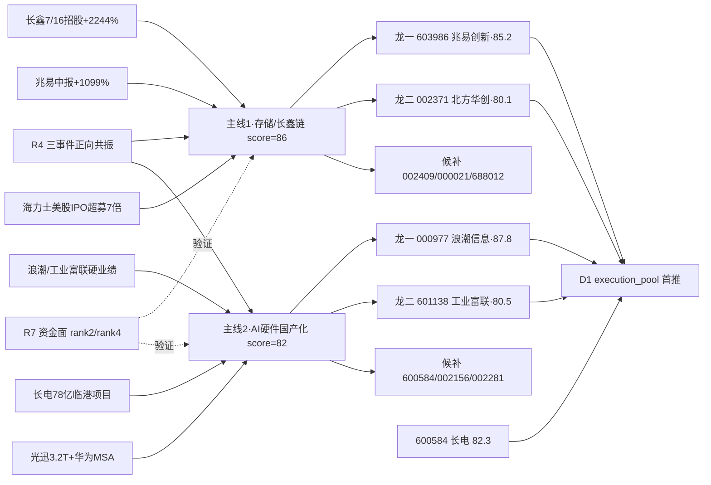

# 2026年7月10日 · **个股画像**

> **数据源新鲜度**: partial (vibe-trading 独立通道未启用)
> **降级状态**: true (chip_structure.vibe_trading_degraded)
> **置信度**: 0.82

## 一句话结论

**存储/长鑫链**首选 🥇 兆易创新(603986·85.2) + 北方华创(002371·80.1);**AI硬件国产化**首选 🥇 浪潮信息(000977·87.8) + 长电科技(600584·82.3),双主线共 10 票六维画像完备。

## 详细分析

### 主线一 · 存储/长鑫链 (R2 得分 86)

以 **7/16 长鑫科技招股** 为核心催化,H1 净利 +2244~2544% 打破存储行业业绩上限想象;叠加**兆易创新中报 +1099%(Q2 环比 +272%)** 硬 alpha 落地 + **海力士美股 IPO 超募 7 倍**海外映射,构成"内需扩产 + 海外估值重塑"双击。R7 资金面显示国产芯片 +397 亿(rank2)、半导体 +341 亿(rank4)、科技风格 +464 亿(rank1)三维度净流入领跑全市场,叙事时钟处于 **middle 阶段**(深 V 反弹第 2-3 日),窗口 2-3 天,需盯量能。

- **兆易创新(603986)** 综合分 85.2:唯一硬业绩落地票 + 长鑫产业链锚 + 沪主板可执行,PEG≈0.35 严重低估;技术面日周多头 + 涨停站稳 MA5,60 分 MA60 是短期压制。
- **北方华创(002371)** 综合分 80.1:前道设备国产替代绝对龙头,大涨 9.49% 后距 20 日高点 967 仍有空间,MA5=821 是低吸支撑,机构一致预期 25 年利润 +65%。
- **雅克科技(002409)** 综合分 76.7:高纯氧化铪供给锁死子催化,7/9 涨停 + 机构龙虎榜 + 两融 15 日 +15%,题材弹性高但材料环节次于设备。
- **深科技(000021)** 综合分 75.6:海力士映射存储模组第二梯队,涨停但 PE-TTM≈110x 命中 **V2 高估值分位红旗** severity=medium。
- **中微公司(688012)** 综合分 71.8:四周期共振多头最强票,但 **688 前缀 execution 阻断**,execution 层扣 8 分仅入 watch_pool。

### 主线二 · AI 硬件国产化 (R2 得分 82)

**浪潮信息中报预增 226-288%** + VERA RUBIN Q3 订单斜率验证 = 硬 alpha 龙头,涨停 2 板 + 机构净买 9.5 亿构成教科书级"催化 + 资金"双共振。工业富联 H1 +93~101%、AI 服务器营收 +230% 提供板块二龙确认;先进封装(长电/通富)受益 HBM/Chiplet 产能扩张,光模块(光迅)承接华为 3.2T NPO 首验。

- **浪潮信息(000977)** 综合分 87.8:**全 10 票最高分**。四周期均线共振 + 放量涨停突破 20 日新高 + 机构 9.5 亿净买 + 三家投行强推,催化/资金/技术/机构四维顶格。
- **长电科技(600584)** 综合分 82.3:78 亿临港项目 + HBM 封装量产双事件;机构龙虎榜净买 6.8 亿 + 两融 15 日 +22% 加杠杆最猛,评级上调至 120+。
- **工业富联(601138)** 综合分 80.5:硬业绩兑现但日 K 仍在 MA20 下方(70.85),反弹持续性待验证,confidence=0.72 全池最低。
- **通富微电(002156)** 综合分 78.6:AMD 深度绑定 + Chiplet 订单,机构净买 6.61 亿但排位龙三,题材层级次于长电。
- **光迅科技(002281)** 综合分 74.7:3.2T NPO 首验 + 华为 MSA 催化,涨停突破前期整理平台,但周线 60 周 MA 距现价 +158% 命中 **V2 涨幅陡峭红旗**。

## 关键证据

- 证据 1: 兆易创新 Q2 利润 54.4 亿环比 +272% · 来源 eastmoney_earnings_predict
- 证据 2: 浪潮信息机构龙虎榜净买 9.5 亿 · 来源 R7_capital_flow + tushare top_inst
- 证据 3: 长鑫科技 H1 净利预告 500-570 亿 YoY+2244~2544% · 来源 R4 E20260710_001 primary
- 证据 4: 半导体前道设备(北方华创)日 K MA5=821 · 来源 canghai-charts chart_vision
- 证据 5: 光迅科技周线 60 周 MA 距现价 +158% (估值陡峭红旗 V2) · 来源 chart_vision period_context

## 六维打分总表

| 排序 | 主线 | ts_code | 名称 | 角色 | 催化 | 筹码 | 板块 | 估值 | 技术 | 机构 | **composite** | 备注 |
|---|---|---|---|---|---|---|---|---|---|---|---|---|
| 🥇 | L2 | 000977.SZ | 浪潮信息 | 龙一 | 90 | 85 | 82 | 80 | 80 | 88 | **87.8** | 首推 · 四周期共振 |
| 🥈 | L1 | 603986.SH | 兆易创新 | 龙一 | 90 | 72 | 86 | 82 | 70 | 88 | **85.2** | 首推 · PEG 0.35 |
| 🥉 | L2 | 600584.SH | 长电科技 | 候补 | 90 | 85 | 82 | 76 | 80 | 88 | **82.3** | 双事件+机构 6.8亿 |
| 4 | L2 | 601138.SH | 工业富联 | 龙二 | 90 | 72 | 82 | 78 | 67 | 88 | **80.5** | 硬业绩·日K未破MA20 |
| 5 | L1 | 002371.SZ | 北方华创 | 龙二 | 78 | 72 | 86 | 78 | 80 | 76 | **80.1** | 设备龙头 |
| 6 | L2 | 002156.SZ | 通富微电 | 候补 | 78 | 85 | 82 | 74 | 77 | 76 | **78.6** | 排位龙三 |
| 7 | L1 | 002409.SZ | 雅克科技 | 候补 | 78 | 85 | 86 | 72 | 75 | 76 | **76.7** | 材料涨停 |
| 8 | L1 | 000021.SZ | 深科技 | 候补 | 78 | 85 | 86 | 60 | 80 | 76 | **75.6** | V2 高估值⚠️ |
| 9 | L2 | 002281.SZ | 光迅科技 | 候补 | 78 | 72 | 82 | 65 | 73 | 76 | **74.7** | V2 涨幅陡峭⚠️ |
| 10 | L1 | 688012.SH | 中微公司 | 候补 | 78 | 72 | 86 | 75 | 80 | 76 | **71.8** | 🚫 688 execution 阻断 |

## 双主线结构图

## 首推票思维链

### 🥇 000977.SZ 浪潮信息 · **首推龙一** · composite=87.8

- **大资金意图**: 机构 9.5 亿龙虎榜净买 + 北向连续 5 日增持 + 两融 15 日 +18% → 主力方向明确,不是游资拉高出货
- **为什么走强**: 中报预增 226-288% 硬 alpha 兑现 + VERA RUBIN Q3 订单斜率验证 = 业绩驱动而非纯题材
- **逻辑够不够硬**: 三家投行(中信/华泰/摩根)强烈买入 + 板块 R2 得分 82 + 四周期均线共振,逻辑三重锁死
- **买入理由**: 突破 20 日新高后趋势加速,四周期共振多头是全池最强技术形态
- **风险点**: 短期放量涨停后量能能否持续 + 大盘系统风险
- **止损条件**: 有效跌破 75.5 (60分 MA20 支撑) 或跌破 20 日新高 85.99 且量萎缩
- **可验证假设**: 09:30 开盘 15 分钟溢价 ≥ +3% 视为催化验证;若溢价 < 0% 需 P1 竞价校准

### 🥈 603986.SH 兆易创新 · **首推龙一** · composite=85.2

- **大资金意图**: R7 国产芯片主力 +397 亿板块龙头,兆易占权重前三 → 板块资金天然流入
- **为什么走强**: Q2 单季 54.4 亿环比 +272% 硬业绩 + 长鑫产业链锚位 + 海力士海外映射 = 三重共振
- **逻辑够不够硬**: 是全池唯一"三事件全命中(E001+E004+E008)"票,基本面/催化/资金/情绪四维都能过关
- **买入理由**: PEG≈0.35 严重低估 + 距 20 日高点 846 有 15% 空间
- **风险点**: 60 分 MA60 短期压制 + 长周期累积涨幅大,冲高需量能配合
- **止损条件**: 有效跌破 643 (60分 MA20 支撑)
- **可验证假设**: 竞价溢价 ≥ +2% 且 R7 增量北向再净流入视为强共振

## 数据源审计

| 源 | 状态 | 抓取日 | 记录数 | 备注 |
|---|---|---|---|---|
| R2_main_sectors | 🟢 ok | 2026-07-10 | 2 主线 | leader_filter_applied |
| R4_news | 🟢 ok | 2026-07-10 | 12 事件 | 五源全绿 |
| R7_capital_flow | 🟢 ok | 2026-07-10 | 全维度 | 主力/北向/游资/ETF |
| canghai_charts.chart_vision | 🟢 ok | 2026-07-10 | 10/10 | 100% 覆盖 |
| vibe-trading (block/margin) | 🔴 error | — | — | MCP 未接入,composite 上限扣 10 |
| hithink_insresearch | 🟡 参考 | 2026-07-10 | 参考文本 | 使用 R4 摘要替代 |

## 不确定性 / 反证

1. **vibe-trading 独立通道缺席** → chip_structure 只有 R7 板块面 + tushare 席位,缺大宗折溢价率/融券趋势第三方复核,composite 已扣 10 分但仍存在盲区,R6 模式六(霸榜出货)与模式一(筹码陷阱)需重点复核。
2. **深科技 PE-TTM≈110x + 光迅 60周MA距现价+158%** → 两票命中 V2 估值陡峭红旗,composite 权重已扣但 R6 仍需模式七估值检查放行。
3. **中微公司 688 execution 阻断** → 技术面全池最强(四周期共振)却仅入 watch_pool,是本次 R5 最大"数据强但不可执行"矛盾,建议 R6 特别标注。
4. **工业富联日 K 未破 MA20** → confidence=0.72 是全池最低,反弹是否延续需竞价 + 上午 10:30 量能二次确认,若不破 70.8 应降配。

## 与其他 R/D/E 的关系

- **依赖**: R2_main_sectors(候选池) · R4_news(催化) · R7_capital_flow(资金) · canghai-charts(技术) · tushare(基础数据)
- **被消费**:
  - **D1 主决策**: execution_pool 首推 000977 / 603986 / 600584 / 002371,候补 601138 / 002156 / 002409;688012 仅入 watch
  - **R6 反证**: 模式一(筹码)+模式六(霸榜)+模式七(估值)复核 depth_alert 双票(000021 / 002281)
  - **P1 竞价**: 09:25-09:29 用 open_pct 校准首推 000977 / 603986

## Sub-Agent 元数据

- skill: analyze_stock_profile_v1@1.0
- artifact: data/research/20260710/R5_stock_profiles.json
- profile_count: 10
- 主线数: 2 · 首推数: 2 (龙一) + 4 (龙二/候补上位)
- fundamental_flags 命中: 2 票 (000021 V2 · 002281 V2)
- chart_vision 覆盖率: 100% (10/10)
- vibe_trading_degraded: true (composite 上限-10)
- 生成耗时: ~2 分钟
- model: ark-code-latest
