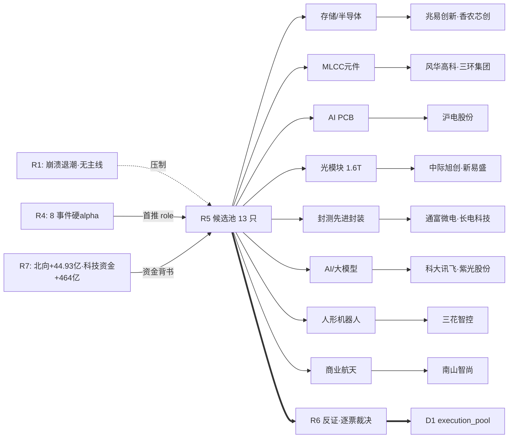

# 2026-07-13 · **个股画像 R5**

> **数据源新鲜度**: partial(R2/vibe/chart/估值 · 4 源 DOWN)  
> **降级状态**: true  
> **置信度**: 0.62

## 一句话结论
R1 崩溃退潮·无主线,R5 从 R4 八大事件挖出 13 只候选(存储/元件/PCB/光模块/封测四条支线),Top3=长电科技 · 紫光股份 · 香农芯创,全 medium(无 strong),D1 单票 ≤5%、只做低吸反弹试探。

## 详细分析

**大资金意图**: R7 北向 44.93 亿 5 日抬升 + 主力科技风格 +464 亿 rank1,资金端并未撤退;但 R1 涨停/炸板 92:91 极致分歧、连板从 8 板塌到 3 板,说明大资金仍在存储/元件/PCB/光模块四条硬 alpha 支线,但拒绝为高标情绪票买单。

**为什么走强**: 硬 alpha 中报预告是本轮主导——香农芯创 +2118-2434%(存储代理)、风华高科 +104-138%(MLCC)、紫光股份 +84-123%(ICT 算力);叠加氦气禁运 + 长鑫 IPO 打新 + SK 海力士 ADR 首日 +12.76% + WAIC 7/17 华为 Atlas 950 首展四大催化,资金锁定'业绩硬 alpha × 事件驱动'双击。

**逻辑够不够硬**: 逻辑硬,但短期节奏被 R1 崩溃退潮压制。长电科技 5d+11.26% / 20d+33.65% 处于 30 日区间 85% 位置,紫光股份连板但已现 2 次炸板(chase_risk),香农芯创 20d+62.19% 位置 76%——三大龙头都在'确认→分歧'临界点,今日大概率高开分歧走弱,反抽给低吸机会。

## 候选池 六维总表

| 排名 | 代码 | 名称 | 板块 | 催化 | 筹码 | 联动 | 估值 | 技术 | 机构 | 综合 | 强度 | 5日 | 20日 | 位置 | 关键 flag |
|:---:|:---:|:---:|:---:|:---:|:---:|:---:|:---:|:---:|:---:|:---:|:---:|:---:|:---:|:---:|:---|
| 1 | 600584.SH | 长电科技 | 封测 | 21 | 18 | 12 | 8 | 14 | 6 | **74** | medium | +11.3% | +33.6% | 85% | — |
| 2 | 000938.SZ | 紫光股份 | AI服务器/ICT | 24 | 12 | 12 | 10 | 15 | 6 | **74** | medium | +26.9% | +38.0% | 100% | recent_zhaban_x2,chase_risk |
| 3 | 300475.SZ | 香农芯创 | 存储/HBM代理 | 25 | 13 | 12 | 8 | 10 | 8 | **71** | medium | +2.5% | +62.2% | 76% | — |
| 4 | 002463.SZ | 沪电股份 | AI PCB | 25 | 13 | 12 | 10 | 8 | 8 | **71** | medium | -4.4% | +5.7% | 21% | — |
| 5 | 002156.SZ | 通富微电 | 先进封装 | 21 | 15 | 12 | 10 | 12 | 6 | **71** | medium | +9.5% | +15.6% | 67% | — |
| 6 | 603986.SH | 兆易创新 | 存储/半导体 | 25 | 16 | 12 | 8 | 5 | 8 | **69** | medium | -9.7% | +30.8% | 39% | — |
| 7 | 000636.SZ | 风华高科 | MLCC/元件 | 25 | 15 | 12 | 6 | 7 | 8 | **68** | medium | -5.1% | +9.0% | 20% | — |
| 8 | 300308.SZ | 中际旭创 | 光模块/1.6T | 25 | 15 | 12 | 6 | 7 | 8 | **68** | medium | -2.0% | -3.2% | 0% | deep_pullback |
| 9 | 300502.SZ | 新易盛 | 光模块/1.6T | 21 | 14 | 12 | 8 | 7 | 6 | **63** | medium | -0.6% | -23.1% | 6% | deep_pullback |
| 10 | 002230.SZ | 科大讯飞 | AI/大模型 | 21 | 14 | 10 | 8 | 8 | 6 | **62** | medium | +4.0% | -12.1% | 41% | — |
| 11 | 300408.SZ | 三环集团 | MLCC/元件 | 21 | 15 | 12 | 8 | 4 | 6 | **61** | medium | -12.3% | +1.1% | 9% | short_term_weak,deep_pullback |
| 12 | 300918.SZ | 南山智尚 | 商业航天/UHMWPE | 17 | 13 | 10 | 10 | 10 | 6 | **61** | medium | +4.1% | -0.4% | 65% | — |
| 13 | 002050.SZ | 三花智控 | 人形机器人 | 17 | 11 | 10 | 10 | 5 | 6 | **54** | weak | -11.8% | -3.1% | 25% | short_term_weak |

## 首推票深挖(Top5)

### 🎯 长电科技 (600584.SH) · 封测 · 综合 74

- **一句话**: 长电科技·封测·78亿临港 封测
- **事件锚**: E20260713_003
- **市值/估值**: 1809.3 亿 · PE_TTM=109.5 · PB=6.3
- **量价**: 收盘 101.11 · 5日 +11.3% · 20日 +33.6% · 30日高低 68.92~106.64 · 位置 85% · 5/20 量比 1.04
- **筹码**: 30日涨跌停=['D', 'U'] · 主力5日净流入 5 日

**买入理由**: 1事件命中:E20260713_003·R4首推 role=首推·78亿临港 封测·板块 封测;R7北向+44.93亿5日抬升;科技风格资金top1

**风险点**: PE_TTM=109.5 PB=6.3 市值=1809亿

**止损条件**: 跌破 30 日低位置 68.92(+2% 缓冲=70.3) · 或早盘直接低开破 5 日均线 · 若板块 ETF 分时新低同步止损

**可验证假设**: 今日盘中若 (1) 板块 ETF 分时红盘 + (2) 该票量比 >1.2 + (3) 5 分钟站上开盘价,则催化仍强;否则本轮硬 alpha 逻辑被资金否认,回到观察池

### 🎯 紫光股份 (000938.SZ) · AI服务器/ICT · 综合 74

- **一句话**: 紫光股份·AI服务器/ICT·ICT算力+84-123%
- **事件锚**: E20260713_007 · E20260713_004
- **市值/估值**: 1098.6 亿 · PE_TTM=51.7 · PB=7.1
- **量价**: 收盘 38.41 · 5日 +26.9% · 20日 +38.0% · 30日高低 25.15~38.41 · 位置 100% · 5/20 量比 1.96
- **筹码**: 30日涨跌停=['U', 'U', 'Z', 'Z'] · 主力5日净流入 3 日

**买入理由**: 2事件命中:E20260713_007,E20260713_004·R4首推 role=首推·ICT算力+84-123%·板块 AI服务器/ICT;R7北向+44.93亿5日抬升;科技风格资金top1

**风险点**: PE_TTM=51.7 PB=7.1 市值=1099亿 · 命中 flag: recent_zhaban_x2,chase_risk

**止损条件**: 跌破 30 日低位置 25.15(+2% 缓冲=25.65) · 或早盘直接低开破 5 日均线 · 若板块 ETF 分时新低同步止损

**可验证假设**: 今日盘中若 (1) 板块 ETF 分时红盘 + (2) 该票量比 >1.2 + (3) 5 分钟站上开盘价,则催化仍强;否则本轮硬 alpha 逻辑被资金否认,回到观察池

### 🎯 香农芯创 (300475.SZ) · 存储/HBM代理 · 综合 71

- **一句话**: 香农芯创·存储/HBM代理·+2118-2434% 硬alpha天花板
- **事件锚**: E20260713_007 · E20260713_003
- **市值/估值**: 1272.5 亿 · PE_TTM=68.6 · PB=26.2
- **量价**: 收盘 271.0 · 5日 +2.5% · 20日 +62.2% · 30日高低 159.13~306.25 · 位置 76% · 5/20 量比 0.97
- **筹码**: 30日涨跌停=无 · 主力5日净流入 3 日

**买入理由**: 2事件命中:E20260713_007,E20260713_003·R4首推 role=首推·+2118-2434% 硬alpha天花板·板块 存储/HBM代理;R7北向+44.93亿5日抬升;科技风格资金top1

**风险点**: PE_TTM=68.6 PB=26.2 市值=1272亿

**止损条件**: 跌破 30 日低位置 159.13(+2% 缓冲=162.31) · 或早盘直接低开破 5 日均线 · 若板块 ETF 分时新低同步止损

**可验证假设**: 今日盘中若 (1) 板块 ETF 分时红盘 + (2) 该票量比 >1.2 + (3) 5 分钟站上开盘价,则催化仍强;否则本轮硬 alpha 逻辑被资金否认,回到观察池

### 🎯 沪电股份 (002463.SZ) · AI PCB · 综合 71

- **一句话**: 沪电股份·AI PCB·AI PCB龙头(纪要)
- **事件锚**: E20260713_006
- **市值/估值**: 2490.9 亿 · PE_TTM=57.9 · PB=14.8
- **量价**: 收盘 129.44 · 5日 -4.4% · 20日 +5.7% · 30日高低 122.51~154.99 · 位置 21% · 5/20 量比 0.75
- **筹码**: 30日涨跌停=['D'] · 主力5日净流入 3 日

**买入理由**: 1事件命中:E20260713_006·R4首推 role=首推·AI PCB龙头(纪要)·板块 AI PCB;R7北向+44.93亿5日抬升;科技风格资金top1

**风险点**: PE_TTM=57.9 PB=14.8 市值=2491亿

**止损条件**: 跌破 30 日低位置 122.51(+2% 缓冲=124.96) · 或早盘直接低开破 5 日均线 · 若板块 ETF 分时新低同步止损

**可验证假设**: 今日盘中若 (1) 板块 ETF 分时红盘 + (2) 该票量比 >1.2 + (3) 5 分钟站上开盘价,则催化仍强;否则本轮硬 alpha 逻辑被资金否认,回到观察池

### 🎯 通富微电 (002156.SZ) · 先进封装 · 综合 71

- **一句话**: 通富微电·先进封装·AMD深度绑定 封装
- **事件锚**: E20260713_003
- **市值/估值**: 1076.7 亿 · PE_TTM=74.4 · PB=6.9
- **量价**: 收盘 70.95 · 5日 +9.5% · 20日 +15.6% · 30日高低 57.22~77.81 · 位置 67% · 5/20 量比 0.94
- **筹码**: 30日涨跌停=['U'] · 主力5日净流入 2 日

**买入理由**: 1事件命中:E20260713_003·R4首推 role=首推·AMD深度绑定 封装·板块 先进封装;R7北向+44.93亿5日抬升;科技风格资金top1

**风险点**: PE_TTM=74.4 PB=6.9 市值=1077亿

**止损条件**: 跌破 30 日低位置 57.22(+2% 缓冲=58.36) · 或早盘直接低开破 5 日均线 · 若板块 ETF 分时新低同步止损

**可验证假设**: 今日盘中若 (1) 板块 ETF 分时红盘 + (2) 该票量比 >1.2 + (3) 5 分钟站上开盘价,则催化仍强;否则本轮硬 alpha 逻辑被资金否认,回到观察池

## 关键证据
- **硬 alpha 中报预告集群**: 香农芯创 +2118-2434% · 风华高科 +104-138% · 紫光股份 +84-123%(来源 R4 E20260713_007)
- **氦气禁运 + 长鑫 IPO 双催化**: 存储链锚定兆易创新 H1+1099% Q2+272%(来源 R4 E001+E003)
- **调研纪要五连击**: MLCC 英伟达锁 3 年 / 高端 PCB 卖 3 万/平米 / 1.6T 光模块 $2000 抢空 / 液冷 CDU 缺(来源 R4 E006)
- **资金端未撤退**: R7 北向 +44.93 亿(5 日抬升),科技风格资金 +464 亿 rank1(来源 R7)
- **情绪风险**: R1 崩溃退潮·涨停 92 vs 炸板 91·连板从 8 板塌至 3 板(来源 R1)

## 数据源审计

| 源 | 状态 | 抓取时间 | 记录数 | 备注 |
|---|:---:|---|:---:|---|
| R4_news | 🟢 ok | 2026-07-13 07:35 | 8 事件 | 首推 role 用于候选池 |
| R7_capital_flow | 🟢 ok | 2026-07-13 07:03 | — | 北向 5 日趋势 |
| R1_style | 🟢 ok | 2026-07-13 07:15 | — | 崩溃退潮·无主线 |
| R3_sentiment | 🟡 partial | 2026-07-13 07:38 | — | WeFlow B 层空 |
| R2_main_sectors | 🔴 error | — | — | 上游未落盘 · 已用 R4 替代 |
| tushare.daily/basic/limit/mf | 🟢 ok | 2026-07-13 07:20 | 13 票 | 前收 20260710 |
| vibe-trading MCP | 🔴 error | — | — | 大宗/两融/龙虎榜 全 null |
| canghai-charts chart_vision | 🔴 error | — | — | 形态维度纯 KPI |
| @估值三件套 · @report-search | 🔴 error | — | — | 未跑 · 机构面 6/10 基线 |

## 不确定性 / 反证
- **R1 vs R5 冲突**: R1 定'无主线',R5 却挖出 13 只全 medium 及以上——若 R6 反证认为板块硬 alpha 无法对抗崩溃退潮,则本份画像的所有 strength 需由 R6 二次裁决
- **紫光股份**: 综合分并列 T1 但 5d+26.85% / 位置 100% / 30 日已 2Z(炸板)+2U——`chase_risk` + `recent_zhaban_x2` 双 flag,D1 若入池必须严格右侧 + 硬止损
- **三花智控**: 唯一 weak 档,5d-11.82% + `short_term_weak`,人形机器人靠 WAIC 催化,若 WAIC 前抢跑失败则可能进一步走弱
- **深回撤三票**(中际旭创 · 新易盛 · 三环集团): 位置 <10%,存在'左侧买在阴跌'风险,除非板块 ETF 明确翻红

## 与其他 R/D/E 的关系
- **依赖(上游)**: R1_style / R3_sentiment / R4_news / R7_capital_flow;R2_main_sectors(缺失,退化)
- **被消费(下游)**: R6 反证(逐票 hard_reject) · D1 execution_pool(取 R6 通过后的 medium+ 档) · E1 复盘

## Sub-Agent 元数据
- skill: analyze_stock_profile_v1@1.0
- artifact: data/research/20260713/R5_stock_profiles.json
- 生成耗时: ~30s(含 tushare 4 表批量)
- model: ark-code-latest

## Mermaid · 候选池主题拓扑

