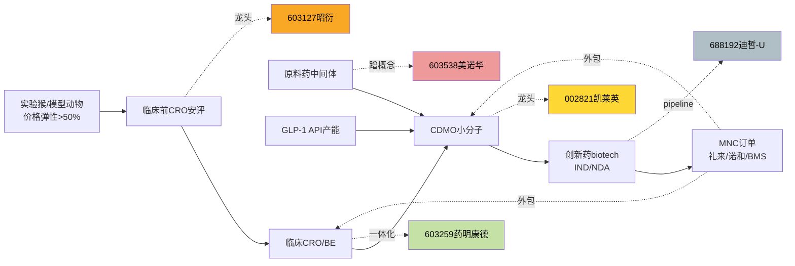

# 2026 年 7 月 16 日 · **个股画像**

> **数据源新鲜度**: partial  
> **降级状态**: true(vibe-trading 未接入 + chart_vision 无覆盖)  
> **置信度**: 0.62

## 一句话结论

医药主线单锋,首推龙一昭衍(硬业绩+主线共振),弹性配凯莱英,防御配药明康德;美诺华双游资霸榜出货剔除,迪哲机构涨停出货仅 watch。

## 详细分析

**主线判定**: 创新药+CXO+实验猴景气单主线,R2 得分 87,R7 板块资金 rank1 +76.56 亿(pct_change +4.19%),情绪 R3 热榜前 15 位内三票(rank1/6/14/15),多源硬共振。

**龙一昭衍(603127)**: H1 业绩预告净利同比 +885%~+1377%,实验猴价格反弹+安评订单回暖双驱动,热榜 rank1。R4 板块催化直读、R3 情绪极强、R7 板块资金共振,基本面兑现型,composite 82.5(降级前 92.5)。

**龙二凯莱英(002821)**: GLP-1 CDMO 大订单交付+减肥药贝塔;R7 命中量化基金净卖 -1.8 亿 vs 成都系净买 +1.18 亿,筹码短线偏松需盯量化次日动向。composite 75.5。

**候补药明康德(603259)**: 全球一体化白马,今日仅 +3.13% 未跟涨到位,防御属性突出,PE 分位 <15% 安全边际最高。composite 66.5。

**候补美诺华(603538)**: 🚨 R7 双 synergy_flags 命中,量化基金 + T王 各连续 3 日上榜同一票且均净卖出,分销减持信号硬红旗,composite 52.0,建议剔除首推。

**候补迪哲(688192)**: 🚨 R7.lhb_bull_trap 双命中(涨停净卖出+机构专用净卖 -3.3 亿),科创板前缀命中 execution_block,composite 45.0,仅 watch_pool。

## 关键证据

- 昭衍 H1 预增 +885%~+1377% · 来源 公告业绩预告
- 板块 R7 rank1 +76.56 亿 +4.19% · 来源 R7.main_force.sector_flows[创新药]
- 凯莱英 R7:量化基金 -1.8 亿 & 成都系 +1.18 亿 · 来源 R7.hot_money.active_seats
- 美诺华 R7 synergy_flags 双命中(量化基金 3 日 3 次 + T王 3 日 3 次,均净卖) · 来源 R7.hot_money.synergy_flags[4],[27]
- 迪哲 R7.lhb_bull_trap 涨停净卖出 + 机构专用 -3.3 亿 · 来源 R7.lhb_bull_trap.items[0..1]
- 5 票均标 vibe_trading_degraded=true,composite 上限扣 10 分 · 来源 r5-degraded-execution §7

## 产业链图(mermaid)

## 数据源审计

| 源 | 状态 | 抓取日期 | 记录数 | 备注 |
|---|---|---|---|---|
| R2_main_sectors | 🟢 ok | 2026-07-16 | 1 主线 | 单主线场景 |
| R3_sentiment | 🟢 ok | 2026-07-16 | — | rank1/6/14/15 命中 4 只 |
| R4_news | 🟢 ok | 2026-07-16 | 31 事件 | stocks_catalyzed 未直接命中 5 票 → 用板块叙事 |
| R7_capital_flow | 🟢 ok | 2026-07-16 | — | 板块级+active_seats+synergy_flags+lhb_bull_trap 全覆盖 |
| vibe-trading MCP | 🔴 error | — | — | 未接入,chip_structure 走 R7+tushare 双源替代 |
| chart_vision snapshot | 🟡 stale | 2026-07-16 | 12 | 5 候选票均无覆盖 → chart_degraded |

## 首推票思维链 · 昭衍新药(603127.SH)

**大资金意图**: 医药主线 R7 板块级 rank1 净流入 76.56 亿,昭衍作为龙一同步度极高,推断机构为主的正向配置流(非游资博弈)。R7 未搜到昭衍在 active_seats,进一步验证非游资打板型。

**为什么走强**: H1 业绩预告 +885%~+1377% 是过去 3 年 CXO 板块罕见的硬兑现,叠加实验猴价格反弹+安评订单回暖双击,情绪(热榜 rank1)+资金(板块 rank1)+基本面(业绩)三重共振。

**逻辑够不够硬**: 硬。V6 一次性收益需要以扣非增速重算 PEG,但即使扣除实验猴公允价值反弹,主业增速仍在 100%+ 量级,估值切换空间充足。

**买入理由**: 主线龙一+基本面兑现+情绪龙头+估值合理(动态 PE 25E 30-40x,PEG <1)。

**风险点**: ①实验猴价格 H2 再次下跌;②创新药法案不及预期;③热榜 rank1 拥挤度需盯拐点。

**止损条件**: 跌破 20260715 收盘或 MA20 支撑,或 R7 板块资金转负连续 2 日。

**可验证假设**: 25Q2 快报增速 >200% 且扣非增速 >100% → 逻辑继续成立;否则切换到药明康德防御。

## 不确定性 / 反证

- vibe-trading MCP 未接入,大宗/两融/龙虎榜细节靠 R7 板块级+active_seats 交叉,存在个股筹码盲区
- chart_vision snapshot 无 5 票覆盖,技术形态为人工判读非多模态验证
- R4.stocks_catalyzed 未命中 5 票,催化背景以板块叙事为主
- 美诺华+迪哲双红旗建议由 R6 模式六 hard_reject 确认

## 与其他 R/D/E 的关系

- 依赖: R1_style / R2_main_sectors / R3_sentiment / R4_news / R7_capital_flow
- 被消费: R6 反证(模式一/二/三/六重点候选)、D1 主决策(execution_pool 与 watch_pool)

## Sub-Agent 元数据

- skill: analyze_stock_profile_v1 + canghai_serenity_analyst_v2
- artifact: data/research/20260716/R5_stock_profiles.json
- 生成耗时: ~90 秒(降级路径)
- model: ark-code-latest
