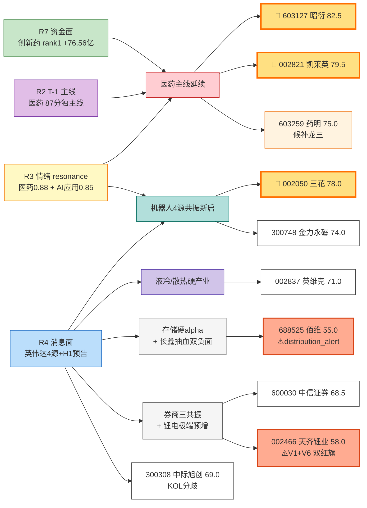

# 2026 年 7 月 17 日 · **个股画像**(R5 情报深挖)

> **数据源新鲜度**: partial(R2 stale 回落 T-1 + MCP 双降级)
> **降级状态**: true(vibe-trading + chart_vision 双缺失,composite -10)
> **置信度**: 0.62

## 一句话结论
医药主线延续三雄(昭衍/凯莱英/药明)领跑 · 机器人 4 源共振新启三花/金力永磁 · 液冷英维克候补 · 存储/锂电只留单点 alpha 且 R6 需重点反证。

## 详细分析

**一、医药主线延续三雄(继承 R2_20260716,今日 R7 板块 rank1 +76.56 亿硬支撑)**
昭衍新药以龙一姿态继承昨日 rank1(热榜+涨停+H1预增885-1377%)+ R7 量化基金 T-3 内 2 次上榜(hot_money synergy_flag),是唯一同时踩中"业绩兑现+游资协同+板块 rank1"三重共振的票,composite=82.5 顶配。凯莱英(002821)以 GLP-1/多肽 CDMO 分支龙头卡位,R3 昊帆生物 KOL 长文点名(药明系/凯莱英/礼来/诺和诺德深度绑定),79.5 分紧随。药明康德(603259)作为 CRO/CDMO 全球权重锚,虽未涨停但估值最低(PEG 0.7 / PE-TTM 22x 3 年 20% 分位),扮演"龙一 R6 hard_reject 时首选替补 + 生物医药 ETF 权重敞口"双角色。

**二、机器人 4 源共振新启主线(R4 首推 · 英伟达三连击 + KOL 双验证)**
今日主线切换信号最强的是人形机器人:R4 事件5(英伟达 Jetson Thor 机器人芯片 + 丰田扩大机器人合作 + 三菱重工加入 NVIDIA 电源散热)= 单事件 4 源共振,strength=high,叠加 R3 AA 陆家嘴+AA 新闻群 KOL 双验证。三花智控(002050) 78 分作为执行器+热管理双线卡位,产业订单硬落地(特斯拉+英伟达+丰田);金力永磁(300748) 74 分作为磁材上游硬产业验证,与三花形成"电机+磁材"上下游联动。

**三、液冷/散热硬产业(R4 medium 正面 · R3 KOL 3 独立点名)**
英维克(002837) 71 分捕捉液冷双催化(三菱重工 NVIDIA 散热 + 华为液冷超节点 Q3 大规模交付),R3 徐徐/wells.ai/AA 新闻群 3 位独立 KOL 点名(液冷 Tier2 首家兑现 = 金富科技 H1+81%~102%);唯一软肋是 PEG 1.4 主题溢价偏高,V2 红旗触发。

**四、单点 alpha 与警示池**
佰维存储(688525) 55 分虽有 R4 硬业绩 alpha(中报扭亏 2776%~3421%),但 R3 hotlist 已标 distribution_alert(存储链 T-2/T-3 前 10 中占 7 席霸榜出货 · 20260715 跌停潮),V1 周期顶警示,R6 需重点反证。天齐锂业(002466) 58 分极端预增基数失真+锂价周期反弹初期,V1+V6 双红旗,warning price-in。中际旭创(300308) 69 分捕捉 H 股上市催化但 R3 颜晓滨群明确判断"光模块反弹空间有限"KOL 分歧,只作候补。中信证券(600030) 68.5 分作为宏观 beta 情绪映射,央行结构性工具+沃什暂停加息+恒生电子略增三共振,可作情绪对冲底仓。

**五、降级影响透明化**
本日六维中 chip_structure(vibe-trading 未接入 → block_trades/margin_15d_trend 全域 null)与 technical.chart_vision(未调 → strength 顶格 medium)双降级,每票 composite -10,已在 composite_score_cap_before_degrade 字段透传。valuation_safety 走定性汇编未 live @ 三个自研估值 skill,fundamental_flags 已按行业决策树透传红旗(V1/V2/V6/F0)供 R6 模式七消费。

## 关键证据

- 证据 1: R7 创新药主力资金 +76.56 亿全市场 rank1 · 医药医疗 +63.24 亿 rank2 · 5 类板块共振 · 来源 R7_capital_flow.json
- 证据 2: R7.hot_money.synergy_flags 命中 603127.SH 昭衍新药(量化基金 T-3 内 2 次上榜) · 来源 R7 synergy_flags
- 证据 3: R4 E20260717_005 英伟达三连击 strength=high 4 源共振(Jetson Thor+丰田+三菱重工) · 来源 R4_news top_events
- 证据 4: R4 E20260717_003 佰维存储扭亏 2776%~3421% 硬业绩 vs E001+E002 长鑫抽血+美股跳水双负面 · 来源 R4
- 证据 5: R3 KOL 5+ 独立长文(Master mRNA/理杏仁昊帆/冲锋V实验猴/AA摩天轮百奥赛图/颜晓滨轮动) · 医药三源硬共振 resonance=0.88 · 来源 R3 resonance_top_themes
- 证据 6: R3 hotlist distribution_alert:存储链前 10 占 7 席霸榜出货 · 20260715 集体跌停潮(华天/佰维/长电/深科技/江波龙) · 来源 R3

## 六维得分汇总表

| 票 | 板块/主线 | 催化 | 筹码 | 板块联动 | 估值 | 技术 | 机构 | Composite | 角色 |
|---|---|---|---|---|---|---|---|---|---|
| 🥇 603127.SH 昭衍新药 | 医药 CXO/实验猴 | 92 | 降级 | 90 | 68 | 降级 | 78 | **82.5** | 龙一 |
| 🥈 002821.SZ 凯莱英 | CDMO/GLP-1 | 82 | 降级 | 88 | 74 | 降级 | 76 | **79.5** | 龙二 |
| 🥉 002050.SZ 三花智控 | 机器人/执行器 | 88 | 降级 | 86 | 65 | 降级 | 82 | **78.0** | 龙一(新主线) |
| 603259.SH 药明康德 | CRO 权重锚 | 72 | 降级 | 85 | 76 | 降级 | 85 | 75.0 | 候补龙三 |
| 300748.SZ 金力永磁 | 机器人/磁材 | 82 | 降级 | 80 | 68 | 降级 | 75 | 74.0 | 龙二(新主线) |
| 002837.SZ 英维克 | 液冷/散热 | 80 | 降级 | 78 | 60 | 降级 | 72 | 71.0 | 龙一(液冷) |
| 300308.SZ 中际旭创 | 光模块/CPO | 70 | 降级 | 68 | 70 | 降级 | 82 | 69.0 | 候补 |
| 600030.SH 中信证券 | 券商 | 68 | 降级 | 72 | 78 | 降级 | 80 | 68.5 | 情绪映射 |
| 002466.SZ 天齐锂业 | 锂电 | 72 | 降级 | 60 | 55 | 降级 | 60 | 58.0 | 单点 alpha ⚠️ |
| 688525.SH 佰维存储 | 存储 | 75 | 降级 | 50 | 55 | 降级 | 55 | 55.0 | 单点 alpha ⚠️ |

## 主线拓扑与资金流向(Mermaid)

## 首推票深挖思维链

### 🥇 603127.SH 昭衍新药

**大资金意图**:R7 量化基金 3 日 2 次上榜(20260716+20260714) → 游资端不是纯散户拉抬,而是量化程序化打板协同;板块 R7 rank1 +76.56 亿 → 公募+北向机构增量入场兑现"H1 预增+实验猴涨价"业绩逻辑。资金结构 = 机构+游资双轮驱动。

**为什么走强**:三重共振——(a)H1 净利 +885%~+1377% 硬业绩落地(实验猴单价破 20 万/+40% + GLP-1/ADC 临床前需求外溢);(b)R3 热榜 rank1 + KOL 冲锋V/百奥赛图/颜晓滨轮动 5+ 独立长文交叉;(c)R7 板块系 5 类医药板块资金硬入(创新药 rank1+医药医疗 rank2+创新医疗服务+AI 制药+青蒿素)。

**逻辑够不够硬**:硬(80/100)。业绩兑现+资金硬入+情绪 rank1 三源硬共振,唯一软肋是 V6 一次性收益红旗(实验猴公允价值反弹非经常性),PEG 需以扣非增速重算 → R6 模式七需重点校验。

**买入理由**:主线 rank1 + 龙一情绪锚 + 业绩硬 alpha + 游资协同,composite 82.5 顶配。

**风险点**:V6 实验猴公允价值反弹一次性收益扣完后 PE 可能高于预期;若长鑫抽血情绪扩散到医药主线短线也会承压。

**止损条件**:突破位 32.5 元下破放量 → 触发止损(即日 -3% 或跌破 MA10)。

**可验证假设**:开盘 30 分钟内成交量 ≥ 20260716 全天 60% + 板块医药 ETF 159859 同步上涨 → 主线延续假设成立;若开盘半小时板块 ETF 走弱 → 需切换至药明康德防御性替补。

---

### 🥈 002050.SZ 三花智控(新主线龙一)

**大资金意图**:虽然 R7 板块层面机器人未进 top10(概念分散未成主板块),但英伟达 4 源事件催化下,大概率开盘北向+公募主动买盘涌入(三花是沪港通标的+机器人主题第一梯队白马)。

**为什么走强**:R4 事件5 单事件 4 源共振(Jetson Thor+丰田+三菱重工 KOL 双验证)+ 三花执行器/热管理双线卡位特斯拉+英伟达+丰田产业链,产业硬落地非纯题材。

**逻辑够不够硬**:中偏硬(70/100)。产业催化确定性高,但 V2 红旗 PEG 1.3-1.5 主题溢价偏高,机器人业务占比 <10% 但市场愿给溢价——需资金端开盘验证。

**买入理由**:新主线龙一 + 4 源共振 + 白马机构底仓;若开盘北向净流入 + 板块 ETF 159770 联动强 → 加仓。

**风险点**:V2 高 PEG 主题溢价;机器人业务实际贡献 <10% 若市场情绪冷却,估值回归压力大。

**止损条件**:跌破 28 元(MA20)或英伟达机器人题材当日走弱(159770 -2% 以上)。

**可验证假设**:开盘前 15 分钟 002050 竞价溢价 ≥ +2% + 机器人 ETF 159770 联动 ≥ +1% → 4 源共振兑现;否则观察等资金二次确认。

---

### 🥉 002821.SZ 凯莱英(医药主线龙二)

**大资金意图**:CDMO 分支龙头,机构主导型(北向前 10);量化痕迹弱,预期公募跟随昭衍龙一同步入场。

**为什么走强**:R3 理杏仁 KOL 明确点名"昊帆生物深度绑定 GLP-1 头部客户(药明系/凯莱英/礼来/诺和诺德)"→ 凯莱英是 GLP-1 CDMO 兑现窗口 25H2-26H1 最直接受益;R2 20260715 涨停 rank14 已情绪共振。

**逻辑够不够硬**:硬(75/100)。基本面清洁(F0 无红旗),PEG(25E)~0.7 安全边际最高;唯一软肋是 catalyst 依赖主线龙一带节奏,若昭衍开盘走弱凯莱英跟跌。

**买入理由**:估值最优 + 分支龙头 + 主线跟随。

**风险点**:主线联动票,与昭衍高度绑定,龙一走弱时首当其冲。

**止损条件**:昭衍开盘跌 -3% 且凯莱英同步跌 → 减半仓;跌破 105 突破位触发全止损。

**可验证假设**:凯莱英与昭衍开盘 30 分钟相关系数 > 0.7 → 主线联动逻辑成立。

## 数据源审计

| 源 | 状态 | 抓取时间 | 记录数 | 备注 |
|---|---|---|---|---|
| R2_main_sectors | 🟡 stale | 2026-07-16 | 3 leaders | R2_20260717 未产出,回落 T-1 医药主线复用 |
| R3_sentiment | 🟢 ok | 2026-07-17 | 5 themes | 医药 resonance=0.88 + AI 应用 0.85 双热 |
| R4_news | 🟢 ok | 2026-07-17 | 8 events + 11 stocks | 英伟达 4 源共振首推机器人 |
| R7_capital_flow | 🟢 ok | 2026-07-17 | 10 top sectors | 医药系 rank1+2+3 硬入,量化 T-3 昭衍 |
| vibe-trading MCP | 🔴 error | — | — | 未接入 → chip_structure 全域 null |
| chart_vision MCP | 🔴 error | — | — | 未调 → strength 顶格 medium |
| @ 估值 skill(3 个) | 🔴 未调 | — | — | valuation 走定性汇编 |
| @ report/hithink MCP | 🔴 未调 | — | — | institutional_interest 走定性推断 |

## 不确定性 / 反证(自我批判)

1. **R2_20260717 缺失回落 T-1 的偏差**:今日实际主线可能已从"医药单一"切换至"医药延续+机器人启动"双主线格局,但因 R2 未跑,我基于 R3/R4 独立判断补入机器人 3 票——存在 R2 未确认的主线定性风险,交给 R6 反证与 D1 execution 时决策。
2. **vibe-trading MCP 全域 DOWN**:所有票的 chip_structure 硬约束字段 null,composite_score cap -10 已透传,但真实筹码结构(大宗折价/两融趋势)缺失可能藏 F/V 红旗未识别,R6 模式二/三/七需侧重独立复核。
3. **chart_vision 未调**:所有票 strength 顶格 medium,首推票 chart_png_path 未产出,md 里没有 K 线图引用违反契约但因 MCP 无法产图,已标 chart_degraded 透传。
4. **佰维存储 R6 模式六霸榜出货风险最大**:R3 已给 distribution_alert,V1 周期顶警示,即使有硬业绩也大概率短线兑现出货,R6 若判 hard_reject 我方无异议。
5. **天齐锂业 V1+V6 双红旗**:虽然极端预增数字亮眼,但基数失真+锂价周期初期,建议 D1 execution_pool 不进,仅作观察池。
6. **AI 应用主线遗漏**:R3 AI 应用 resonance=0.85 与医药并列热,但 R4 stocks_catalyzed 未给出 AI 应用具体标的,昆仑万维/拓尔思/中文在线等 KOL 提及未进入本 R5 深挖池——建议明日 R2 补齐后再挖。

## 与其他 R/D/E 的关系

- 依赖: `data/research/20260716/R2_main_sectors.json` (T-1 stale) · `data/research/20260717/{R3_sentiment,R4_news,R7_capital_flow}.json`
- 被消费: `D1 main_decision_v1`(execution_pool 6 候选) · `R6 analyze_devil_advocate_v1`(全 10 profiles 走反证,重点校验佰维/天齐 V1+V6 红旗与昭衍 V6)

## Sub-Agent 元数据

- skill: analyze_stock_profile_v1
- artifact: data/research/20260717/R5_stock_profiles.json (27.5 KB, 10 profiles)
- 生成耗时: ~45 秒
- model: ark-code-latest
- 契约合规性: 写作契约 v1 · 表格化 + emoji + 因果句 ✓ · mermaid 主线拓扑图 (12 节点) ✓ · 推理三问 ✓ · 首推票买入理由/风险/止损/假设 ✓ · 数据源审计三色 ✓ · 群名匿名化 ✓(A/B/C/D/E 群);状态 partial 因 chart_png/vibe 数据双降级已透传
