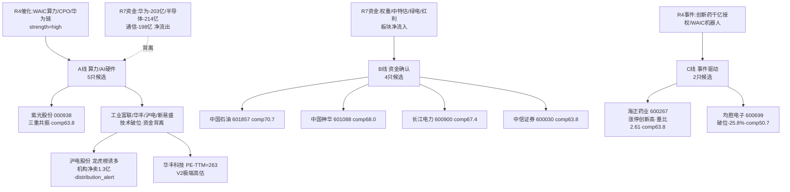

# 2026年7月21日 · **个股画像**

> **数据源新鲜度**: partial(R2缺失·候选池自建)
> **降级状态**: true(vibe_trading_degraded + chart_degraded)
> **置信度**: 0.58

## 一句话结论

**R4催化线(算力/CPO/华为链)与R7资金线(权重/中特估/绿电)方向背离——算力除紫光股份三重共振外全线技术破位,真实强势在资金确认线,海正药业为最强事件票。**

## 详细分析

今日 R5 面临一个结构性缺口:**R2_main_sectors.json 未落盘**(orchestrator 串行批次未产出),这意味着龙头候选清单缺失。R5 遂走 R2-missing 降级路径,以 R1(震荡分化型·独主线防御高股息)、R4(top_events 算力/CPO/华为链催化)、R7(板块资金:权重/中特估/绿电/红利净流入 vs 华为/半导体/通信净流出)三源交叉,自建 11 只候选池,分 3 条主线画像。

真正值钱的发现来自**真实日线与板块资金流的交叉**:R4 把最强催化给了算力线(WAIC 意向采购 203.6 亿 +25%、华为昇腾 950 超节点、新易盛中报预增 77-103%),但把这些票拉出本地 tech DB 的真实 K 线一看——**工业富联 -30.3%/20日、华丰科技 -25.2%、沪电股份 -11.4% 且 T-1 跌停、新易盛 -34.8%,全部趴在 MA20/MA60 下方**,同时 R7 的板块资金榜显示华为概念 -203 亿、半导体 -214 亿、通信技术 -198 亿全在净流出前列。**催化(catalyst)与资金(capital)在算力线上没有共振——这是典型的"消息很响、钱在跑路"。**

唯一的例外是 **紫光股份**:+33.6%/20日、5日/20日量比 1.75、站稳 MA20/MA60、row3=strong,是算力线里唯一实现"催化×资金×技术"三重共振的票。

而 R7 资金真正净流入的方向(权重/中特估/绿电/红利),对应的 **中国神华、长江电力、中国石油、中信证券** 反而技术健康——多数站稳双均线、row3=strong、板块资金净流入。这印证了 R1 "震荡分化型 + 防御高股息独主线" 的定性:**当下资金认可的是低波动确定性,不是高位算力弹性。**

事件线里,**海正药业**(创新药对外授权超千亿美元 + 引进 1 类新药)T-1 涨停、创 32 日新高、5日/20日量比 2.61,是全池量能最强的事件驱动票。

## 六维画像传导图

## 关键证据

- 证据 1: **算力线技术全破位** — 工业富联 -30.3%/20日、华丰 -25.2%、新易盛 -34.8%,均在 MA20/MA60 下方 · 来源 local_tech_db 真实日线(截至20260720)
- 证据 2: **算力板块资金净流出** — 华为概念 -203 亿、半导体 -214 亿、通信技术 -198 亿居净流出前列 · 来源 R7_capital_flow
- 证据 3: **紫光股份三重共振** — +33.6%/20日、量比 1.75、站稳双均线、row3=strong · 来源 local_tech_db
- 证据 4: **资金确认线技术健康** — 中国石油 5d+14%、长江电力创 32 日新高、神华 row3=strong,板块资金净流入 · 来源 local_tech_db + R7
- 证据 5: **沪电股份龙虎榜诱多** — T-1 跌停 -10% + 机构净卖 1.3 亿(R7 bull_trap flagged)· 来源 R7_capital_flow lhb_bull_trap
- 证据 6: **海正药业量能最强** — 涨停 +9.98%、创 32 日新高、5日/20日量比 2.61 · 来源 local_tech_db + R4 E008

## 推理深度三问 · 顶级分析对象

### 紫光股份 000938(算力线唯一三重共振)

- **大资金意图**: 主力在 WAIC 华为算力叙事强化窗口选择放量拉升(量比 1.75)而非派发,配置逻辑是"华为链国产算力自主可控"的确定性受益(新华三服务器/交换机),对手盘是恐慌盘与去杠杆的动量资金;20日 +33.6% 说明资金在算力集体退潮时逆势建仓这一只,是明确的差异化择股。
- **为什么走强**: 位置中高位但站稳 MA20/MA60(37.69 vs MA20=32.39/MA60=30.56),催化硬(WAIC 意向采购 +25% + 华为全系列模组),量价配合(row3=strong)三维交叉全部正向。
- **逻辑够不够硬**: 硬——2 个独立源(E001 官方三源 + E002 财联社),硬时间锚(WAIC 整周),真实 K 线站上双均线。证伪路径:若华为概念板块整体持续净流出(-203 亿)拖累,紫光单兵突进难持久,需盯 MA20(32.39)不破。

### 中国石油 601857(资金确认线 comp 最高 70.7)

- **大资金意图**: 中特估 + 高股息 4.27% 是机构在震荡分化市里的"确定性避风港"配置,叠加 R4 E007 美伊冲突油价脉冲,主力在低波动央企旗舰上做防御性加仓,对手盘几乎没有卖压(换手仅 0.23%)。
- **为什么走强**: 位置健康(距 32 日高仅 -0.9%),5d +14% 强势,站稳 MA20/MA60,row3=strong,量比 1.55 放量,PB=1.24 破净安全垫厚。
- **逻辑够不够硬**: 硬——中特估资金确认(R7 板块净流入)+ 地缘催化 + 破净高股息三重支撑,真实技术强势。证伪路径:油价脉冲若快速回落,地缘溢价消退;但破净 + 股息底仍托底,回撤空间有限。

### 海正药业 600267(最强事件票)

- **大资金意图**: 资金借 H1 创新药对外授权超千亿美元的产业趋势 + 公司引进艾缇亚 1 类新药的个股催化,做事件驱动的脉冲(量比 2.61 为全池最高),对手盘是低位套牢盘,涨停封板说明多头占绝对主导。
- **为什么走强**: 位置创 32 日新高(距峰 0.0%),20日 +25.5%,量能爆发(量比 2.61),站稳双均线,催化明确(授权兑现预期)。
- **逻辑够不够硬**: 中等偏硬——产业趋势级催化(工信部发布会)+ 个股硬事件,但创新药授权兑现有时滞,非当日算力主线。证伪路径:若授权合作后续无实质进展,情绪脉冲后 3 日内回落破 MA5(约 12.0)。

## 首推票思维链

### 中国石油 601857(资金确认线首推)

- **买入理由**:
  1. 中特估 + 高股息 4.27% 双主题在 R1 "防御高股息独主线" 定性下是资金唯一确认方向,R7 板块资金净流入印证。
  2. 真实技术强势:5d +14%、距 32 日高仅 -0.9%、站稳 MA20(9.40)/MA60(10.49)、row3=strong、量比 1.55 放量;PB=1.24 破净提供厚安全垫。
- **风险点**:
  1. 短期:5d +14% 已有一定涨幅,地缘(美伊)溢价若快速回落,油价脉冲消退。
  2. 中期:中特估属"资金抱团确定性",若市场风险偏好回升切向进攻成长,防御票反被抽离。
- **止损条件**: 跌破 MA20(9.40)且单日放量下跌 >3% 减仓;跌破 10.50(MA60 上沿)清仓。
- **可验证假设**: 24-72h 内若中特估/权重板块 R7 资金维持净流入且股价守住 MA20,则趋势延续;若板块资金转净流出 + 破 MA20,假设证伪。

### 紫光股份 000938(算力线首推·唯一三重共振)

- **买入理由**:
  1. 算力线唯一实现"催化(WAIC华为链)×资金(量比1.75)×技术(站双均线)"三重共振的票,20日 +33.6% 逆板块退潮而上。
  2. 新华三服务器/交换机是华为算力配套核心,WAIC 意向采购 +25% 直接受益,叙事+订单双支撑。
- **风险点**:
  1. 短期:PE-TTM=50.7、PB=6.94 估值不便宜,换手 17.58% 极高存在情绪透支风险。
  2. 中期:华为概念板块整体净流出 -203 亿,紫光单兵突进,若板块系统性走弱难独善其身。
- **止损条件**: 跌破 MA20(32.39)减半仓;跌破 MA60(30.56)清仓;单日换手 >20% 且冲高回落 >5% 主动止盈。
- **可验证假设**: 24-72h 内若量比维持 >1.3 且守住 MA20,三重共振延续;若跌破 MA20 或量能萎缩至量比 <0.8,资金撤离假设成立。

## 不确定性 / 反证

1. **R2 缺失是最大不确定性**:候选池自建,leader_rank 无法机械认定(需 D1/09:24 auction 二次校准),可能遗漏 R2 本会圈定的其他龙头。
2. **catalyst≠capital 的背离本身可能反转**:若今日开盘算力线受 WAIC 情绪催化跳空高开 + 资金回流,则算力破位判断需盘中修正;但截至 20260720 真实数据不支持追高算力破位票。
3. **R7 sector_flows 基准日为 T-1(20260720 反弹日)**,前瞻性有限,需 09:24 auction 溢价率印证。
4. **vibe-trading 与 chart_vision 双 MCP 未调用**:筹码结构缺大宗/两融双源交叉,技术维缺多模态识图,均以本地 tech DB 真实日线替代——数据真实但维度覆盖不全,composite 已统一 -10、strength 顶格 medium。
5. **反证提示 R6**:沪电股份(002463)已命中龙虎榜诱多(distribution_alert),华丰科技(605100)PE-TTM=263 极端高估,均需 R6 重点反证。

## 与其他 R/D/E 的关系

- 依赖: R1_style(风格/仓位上限)· R4_news(催化事件)· R7_capital_flow(板块/个股资金 + 龙虎榜诱多)· local_tech_db(真实日线)· tushare.daily_basic(估值)
- 缺失依赖: R2_main_sectors(龙头候选清单)— 走 R2-missing 降级
- 被消费: D1(main_decision · execution_pool 构建 + leader 二次校准)· R6(devil_advocate · distribution_alert / V2高估反证)

## 数据源审计

| 源 | 日期 | 状态 | 备注 |
|---|---|:--:|---|
| R1_style | 2026-07-21 | 🟢 | 震荡分化型·独主线·仓位上限0.45 |
| R4_news | 2026-07-21 | 🟢 | 8 事件·WAIC算力/CPO/华为链/创新药 |
| R7_capital_flow | 2026-07-21 | 🟢 | 6 维·板块资金+龙虎榜诱多94只 |
| R2_main_sectors | — | 🔴 | DOWN·未落盘·候选池R1+R4+R7自建 |
| local_tech_db | 2026-07-20 | 🟢 | 11只·真实日线MA/量价/距峰·5220只全市场 |
| tushare/daily_basic | 2026-07-20 | 🟢 | 11只·真实PE-TTM/PB/股息/市值/换手 |
| vibe-trading/MCP | — | 🔴 | DOWN·未调用·block_trades/margin=null·composite-10 |
| canghai-charts/chart_vision | — | 🔴 | DOWN·未调用·技术维用本地tech DB真实日线替代 |
| wechat_official_20 | 2026-07-20 | 🔴 | invalid session·23账号全down |

## Sub-Agent 元数据

- skill: analyze_stock_profile_v1
- artifact: data/research/20260721/R5_stock_profiles.json
- profiles: 11 只 · 3 主线(A算力5/B资金4/C事件2)
- degraded: true(R2缺失 + vibe_trading_degraded + chart_degraded)
- model: ark-code-latest
