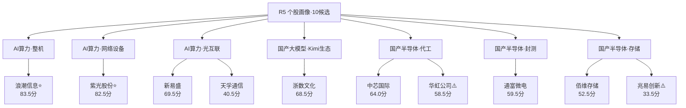

# 2026年7月22日 · **个股画像**

> **数据源新鲜度**: partial(R2缺失,降级挖掘)
> **降级状态**: true
> **置信度**: 中(主线框架清晰,个股α分层明确;资金'末日翻红'仅一日待竞价确认)

## 一句话结论
AI算力主线(整机/网络/光互联)业绩+资金双硬,浪潮信息、紫光股份为右侧首推;存储/封装高位分化,兆易创新遭减持、华虹机构净卖出应回避。

## 候选池全景(主线 → 龙头)

## 六维打分总表

| 个股 | 综合 | 催化 | 筹码 | 板块 | 估值 | 技术 | 机构 | 旗标 |
|---|---|---|---|---|---|---|---|---|
| 浪潮信息 | 83.5 | 9 | 7 | 8 | 7 | 10 | 8 | — |
| 紫光股份 | 82.5 | 8 | 8 | 8 | 7 | 10 | 8 | — |
| 新易盛 | 69.5 | 9 | 7 | 7 | 6 | 4.5 | 8 | — |
| 浙数文化 | 68.5 | 7 | 6 | 6 | 8 | 7.5 | 6 | — |
| 中芯国际 | 64.0 | 6 | 6 | 7 | 5 | 7.5 | 7 | — |
| 通富微电 | 59.5 | 7 | 6 | 6 | 6 | 4.5 | 6 | — |
| 华虹公司 | 58.5 | 6 | 4 | 6 | 3 | 10 | 4 | ⚠️distribution_alert |
| 佰维存储 | 52.5 | 8 | 4 | 5 | 6 | 2 | 6 | — |
| 天孚通信 | 40.5 | 6 | 3 | 4 | 4 | 2 | 5 | — |
| 兆易创新 | 33.5 | 4 | 3 | 4 | 4 | 2 | 3 | ⚠️distribution_alert |

> 权重: 催化25% / 技术20% / 筹码15% / 板块15% / 估值15% / 机构10%

## 首推票思维链(综合≥80)

### 浪潮信息 (000977.SZ) · 83.5分 · AI算力·整机

> **一句话**: Kimi熔断=算力刚需实锤,整机龙头直接受益

**大资金意图**: ret20+38.5%强势,近10日2板,量比放大vr5/20=1.51;流通盘大机构主导 [close88.66,ret20 38.53%,量比vr5/20=1.51]
**为什么走强**: Kimi K3(2.8T)登顶开源第一即算力熔断,算力需求逻辑坐实;浪潮千卡主力整机直接承接推理需求,群点名
**逻辑够不够硬**: PE_ttm51 PB5.84,AI服务器高成长,估值在算力链中相对不贵 机构面—机构主力整机认证,券商算力链首推;北向流入受益

- **买入理由**: Kimi K3(2.8T)登顶开源第一即算力熔断,算力需求逻辑坐实;浪潮千卡主力整机直接承接推理需求,群点名… 叠加板块共振(8/10)与技术就绪(10/10)。
- **风险点**: 估值7/10;当前距30日高-0.96%。
- **止损条件**: 有效跌破MA20=75.62(现价88.66),或催化证伪(业绩/超节点逻辑破裂)。
- **可验证假设**: 09:25竞价溢价承接 + 板块资金'末日翻红'次日延续(非一日游);T+1若板块资金回落则右侧不成立。

### 紫光股份 (000938.SZ) · 82.5分 · AI算力·网络设备

> **一句话**: 超节点电话会核心标的

**大资金意图**: close41.46涨停封板,ret20+54%全场最强,创30日新高ddHi=0;量比vr5/20=1.67放量;近10日1板 [close41.46,ret20 54.07%,量比vr5/20=1.67]
**为什么走强**: 开源蒋颖超节点电话会点名(盛科/紫光/锐捷),新华三交换网络受益超节点大时代;WAIC催化
**逻辑够不够硬**: PE_ttm55.8 PB7.64,ICT设备成长股,相对光模块估值温和 机构面—开源证券电话会点名,机构覆盖密集;北向持续流入ICT

- **买入理由**: 开源蒋颖超节点电话会点名(盛科/紫光/锐捷),新华三交换网络受益超节点大时代;WAIC催化… 叠加板块共振(8/10)与技术就绪(10/10)。
- **风险点**: 估值7/10;当前距30日高0.0%。
- **止损条件**: 有效跌破MA20=33.11(现价41.46),或催化证伪(业绩/超节点逻辑破裂)。
- **可验证假设**: 09:25竞价溢价承接 + 板块资金'末日翻红'次日延续(非一日游);T+1若板块资金回落则右侧不成立。

## 详细分析

**主线一·AI算力(整机/网络/光互联)** —— 本日最硬象限。Kimi K3(2.8T)登顶开源第一即触发算力熔断暂停新用户,把"算力刚需"从预期变为实锤。浪潮信息(千卡整机,83.5)、紫光股份(超节点网络,涨停创新高ret20+54%,82.5)量价资金三共振,是右侧进攻首选。新易盛(1.6T放量+中报预增,69.5)催化最硬但股价距30日高-29.8%仍在修复,右侧未完全立起,列次选。

**主线二·国产大模型/Kimi生态** —— 浙数文化(68.5)参股月之暗面+富春云IDC,是Kimi生态最纯正参股标的,PE24/PB1.36全场最低+低位放量启动,攻守兼备的补涨弹性核心。

**主线三·国产半导体(代工/封装)** —— 板块β为主。中芯国际(64.0)缩量慢牛机构配置型;通富微电(59.5)先进封装情绪票波动大;华虹公司(58.5)20cm涨停但龙虎榜机构专用净卖-3.24亿(bull_trap)+PE1400失真,列distribution_alert回避。

**主线四·存储** —— 业绩景气但个股分化严重。佰维存储(52.5)中报扭亏+3200%硬alpha,但股价深调-46.5%右侧未立且科创可交易性受限;兆易创新(33.5)遭险资套现6.82亿+深跌-43%,催化被利空对冲,列distribution_alert回避。

## 关键证据
- 证据1: Kimi K3登顶即算力熔断,算力需求逻辑坐实 · 来源 R4(news_major+wechat_cli三源)
- 证据2: 紫光股份涨停创30日新高、ret20+54%、量比1.67 · 来源 tushare.daily
- 证据3: 华虹公司20cm涨停但机构专用净卖-3.24亿 · 来源 R7.lhb_bull_trap
- 证据4: 兆易创新险资套现6.82亿减持 · 来源 R4.stocks_catalyzed(negative)
- 证据5: 科技风格/国产芯片板块资金21日翻红(rank2/rank10)但属"末日翻红"前4日净流出 · 来源 R7.sector_5d_tracking

## 数据源审计
| 源 | 状态 | 抓取日期 | 记录数 | 备注 |
|---|---|---|---|---|
| R4 消息面 | 🟢 ok | 2026-07-22 | 16 | 催化事件+个股映射 |
| R7 资金面 | 🟢 ok | 2026-07-22 | 495板块 | 主力/北向/龙虎榜 |
| R3 情绪 | 🟡 degraded | 2026-07-22 | 4主题 | 公众号池down/热榜未生成 |
| tushare 日线 | 🟢 ok | 2026-07-21 | 440行 | 30+日K+量价 |
| tushare 每日指标 | 🟢 ok | 2026-07-21 | 10 | PE/PB/换手/市值 |
| R2 主线板块 | 🔴 error | — | — | 缺失,候选池降级挖掘 |
| vibe-trading 大宗/两融 | 🔴 未接入 | — | — | chip_structure单源(tushare) |
| charts 出图 | 🔴 未出图 | — | — | technical用量价代理 |

## 不确定性 / 反证
- **资金"末日翻红"陷阱**: 十大流入板块21日均为`reversal_up`且`positive_days=1`,前段大幅净流出,单日翻红能否延续存疑,须09:25竞价+盘中确认,否则右侧证伪。
- **高位泡沫区**: 先进封装(通富)/存储(兆易/佰维)/光模块二线(天孚)属R6反证关注的高位泡沫,深度回撤票(天孚-53%/佰维-46%/兆易-43%)左侧抄底风险高,不符右侧纪律。
- **降级盲区**: R2缺失使主线权威排序缺位;vibe-trading大宗/两融未接入,chip_structure缺独立交叉源;charts未出图,technical纯量价代理,形态判断精度下降。
- **移交R6**: 华虹bull_trap、兆易减持、高位泡沫三项建议R6反证复核是否触发hard_reject。

## 与其他 R/D/E 的关系
- 依赖: R4_news / R7_capital_flow / R3_sentiment / tushare(daily+daily_basic) / (R2缺失降级)
- 被消费: D1(execution_pool 构建) / R6(反证复核)

## Sub-Agent 元数据
- skill: analyze_stock_profile_v1
- artifact: data/research/20260722/R5_stock_profiles.json
- 候选池来源: R4催化+R3主题+R7资金(R2 fallback)
- model: ark-code-latest
