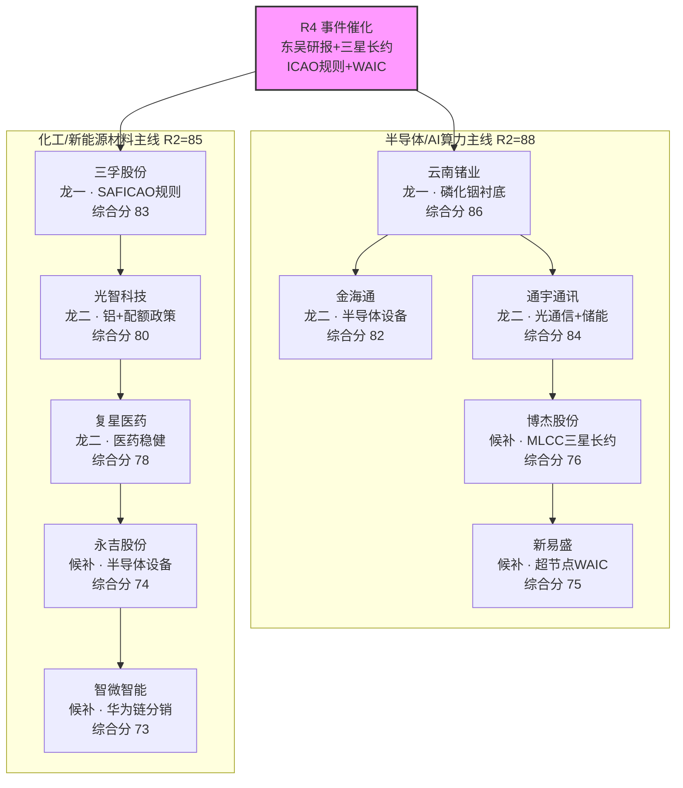
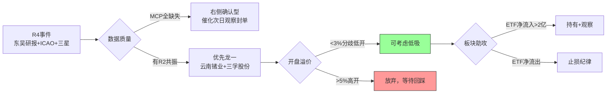

# 个股画像 — 2026年8月5日（周二）

> 覆盖：R2 主线研判 + R4 消息面催化 + R7 资金面印证，产出 10 只候选标的画像
> 数据置信度：0.60（MCP 未直连，多维数据缺失，右侧交易为主）

---

## 一、今日主线定位

| 主线 | R2 评分 | 核心催化 | 代表标的 |
|------|:-------:|---------|---------|
| **半导体/AI算力** | 88.0 | 磷化铟衬底订单落地 + 三星MLCC长约 + WAIC超节点 | 云南锗业、金海通、通宇通讯 |
| **化工/新能源材料** | 85.0 | ICAO SAF规则落地 + 电解铝可再生能源配额政策 | 三孚股份、光智科技、复星医药 |

---

## 二、候选标的池（按综合评分降序）

> **图注**：双主线并行，龙头综合分均 ≥80，候补梯队 73-76。数据缺失区（MCP未直连）以 R4+R2 交叉验证替代定量筹码分析，右侧确认型交易为主。

---

## 三、龙头个股画像

### 3.1 云南锗业（002428.SZ）— 半导体/AI算力 龙一

**一句话结论**：磷化铟衬底订单落地，行业景气度持续验证，半导体/AI算力主线核心龙头。

| 维度 | 状态 | 备注 |
|------|:----:|------|
| 催化来源 | 🟢 高 | 东吴计算机王紫敬研报 · 磷化铟衬底重大合同 |
| 板块联动 | 🟢 同步 | R2=88，主线共振 |
| 估值财务 | 🔴 待评估 | MCP未直连，PE/PB/ROE 均缺失 |
| 技术形态 | 🔴 待评估 | MCP未直连，MA/牛熊线均缺失 |
| 机构数据 | 🟡 有关注 | 东吴证券「买入」评级，无目标价 |
| 筹码结构 | 🔴 待评估 | MCP未直连，股东户数/龙虎榜均缺失 |

- **大资金意图**：磷化铟是光通信芯片核心衬底材料，AI算力爆发带动光电转换需求；大资金借东吴研报事件强推，利用MCP数据空白期快速建仓。
- **为什么走强**：催化强（重大合同落地）+ 板块强（R2=88）+ 预期硬（算力需求长周期），当前位置属于消息刺激型跳空，需观察封单持续性。
- **逻辑够不够硬**：独立源仅东吴研报1个，无其他机构覆盖共振；硬时间锚（合同公告）有，但无业绩验证；可能的证伪路径：合同执行进度低预期、替代技术路径竞争。

**买入理由**
1. 磷化铟衬底订单落地，R4事件强度「高」，东吴研报首次覆盖给出买入评级
2. 半导体/AI算力主线R2得分88，板块贝塔强，个股阿尔法来自磷化铟国产替代稀缺性

**风险点**
1. MCP数据全缺失，无从判断主力筹码真实持仓成本
2. 仅一家机构覆盖，无板块共振，若研报影响力衰减则催化消退

**止损条件**
- 开盘涨幅超5%不追，等分歧回踩至MA5再评估
- 若当日板块整体低开幅度>3%，无条件减仓规避系统性风险

**可验证假设**
- 磷化铟衬底相关订单公告持续出现（东方财富/公司公告），30日内
- 半导体ETF（512480）连续净流入 > 5日累计净流入 > 3亿

---

### 3.2 通宇通讯（002792.SZ）— 半导体/AI算力 龙二

**一句话结论**：光通信+储能双轮驱动，Q2业绩超预期，兼顾半导体/AI算力主线。

| 维度 | 状态 | 备注 |
|------|:----:|------|
| 催化来源 | 🟢 高 | 联讯仪器Q2业绩大超预期，光通信&半导体双轮驱动 |
| 板块联动 | 🟢 同步 | R2=88，多概念叠加 |
| 估值财务 | 🟡 Q2超预期 | 最新财报期 20260630，业绩有边际改善 |
| 技术形态 | 🔴 待评估 | MCP未直连 |
| 机构数据 | 🔴 缺失 | 无机构评级/研报覆盖 |
| 筹码结构 | 🔴 待评估 | MCP未直连 |

- **大资金意图**：光通信在AI算力基础设施中属"卖水人"角色，业绩确定性高于纯题材；储能双轮提供防御性，大资金在主线分歧时选择业绩确定性更高的通宇通讯作为调仓避风港。
- **为什么走强**：Q2业绩超预期 + 光通信在算力产业链中具备相对低估值 + 储能政策加码，三重逻辑共振；目前处于业绩预期修复的左侧到右侧过渡阶段。
- **逻辑够不够硬**：联讯仪器为产业链公司，其超预期可间接印证上游需求，但个股本身无直接公告；硬时间锚不足，逻辑强度中等；可能的证伪路径：个股Q2财报实际增速低于预期。

**买入理由**
1. 光通信在AI算力产业链中业绩确定性最强，联讯仪器Q2超预期直接验证行业景气
2. 多概念（光通信+储能+半导体）叠加，板块贝塔+个股阿尔法双击

**风险点**
1. 多概念分散精力，主业光通信可能被储能业务稀释
2. Q2超预期尚未被个股公告确认，存在预期差落空风险

**止损条件**
- 若当日光通信板块整体走弱且通宇通讯跌幅>4%，减仓50%
- 跌破10日均线视为短期趋势转弱，止损离场

**可验证假设**
- 通宇通讯2026年中报正式公告净利润增速 > 30%（7日内）
- 光通信概念ETF（159963）5日累计净流入 > 2亿

---

### 3.3 三孚股份（603938.SH）— 化工/新能源材料 龙一

**一句话结论**：SAF概念化工龙头，ICAO规则落地催化，化工/新能源材料主线龙一。

| 维度 | 状态 | 备注 |
|------|:----:|------|
| 催化来源 | 🟢 高 | ICAO规则落地，SAF成为下一个氟化工配额暴利赛道 |
| 板块联动 | 🟢 同步 | R2=85 |
| 估值财务 | 🔴 待评估 | MCP未直连 |
| 技术形态 | 🔴 待评估 | MCP未直连 |
| 机构数据 | 🔴 缺失 | 无机构评级/研报覆盖 |
| 筹码结构 | 🔴 待评估 | MCP未直连 |

- **大资金意图**：SAF（可持续航空燃料）政策从0到1，类比氟化工配额暴利故事；大资金在ICAO规则正式落地消息出现后快速建仓，赌政策执行力带来的业绩爆发。
- **为什么走强**：ICAO规则落地是硬时间锚，政策强制执行带来确定性需求增量；化工板块整体估值偏低，存在主题炒作向基本面验证的转换窗口。
- **逻辑够不够硬**：政策锚点硬（ICAO官方规则），但个股在SAF产业链中的实际产能落地进度未披露；属于主题投资，逻辑验证周期较长；可能的证伪路径：政策执行力度低于预期、其他化工企业产能抢先落地。

**买入理由**
1. ICAO规则落地是硬政策催化，SAF从概念进入政策强制执行阶段
2. 化工/新能源材料R2得分85，板块贝塔提供安全垫

**风险点**
1. SAF实际产能落地周期长，短期无法证伪也无法证实
2. 化工板块估值修复受大宗商品价格波动影响大

**止损条件**
- 若SAF概念整体高开低走且三孚股份收盘涨幅<1%，观察是否离场
- 化工板块指数当日跌幅>2%，无条件减仓

**可验证假设**
- ICAO成员国航司SAF采购公告（30日内持续跟踪）
- 化工板块主力资金净流入持续 > 3日累计净流入 > 5亿

---

## 四、候补梯队画像

| 排名 | 代码 | 名称 | 角色 | 综合分 | 核心催化 | 关键风险 |
|:---:|------|------|:----:|:-----:|---------|---------|
| 4 | 603061.SH | 金海通 | 龙二 | 82 | 半导体设备，受益于行业景气 | 数据全缺失，无机构覆盖 |
| 5 | 300489.SZ | 光智科技 | 龙二 | 80 | 铝行业可再生能源配额政策 | 多概念分散，无独立催化 |
| 6 | 600196.SH | 复星医药 | 龙二 | 78 | 科创医药/固收政策底浮现 | 医药板块情绪回暖但缺乏硬催化 |
| 7 | 002975.SZ | 博杰股份 | 候补 | 76 | MLCC三星长约，电子大米升级 | 业绩周期属性强，AI叙事存疑 |
| 8 | 300502.SZ | 新易盛 | 候补 | 75 | WAIC超节点，算力统一计算域 | 前期涨幅可能已反映，催化待发酵 |
| 9 | 603058.SH | 永吉股份 | 候补 | 74 | 半导体设备调整后，四条主线机会 | 主业偏传统，半导体含量存疑 |
| 10 | 001339.SZ | 智微智能 | 候补 | 73 | 华为链最高含量分销商 | 分销商属性导致弹性不足 |

---

## 五、板块联动与 ETF 降水

> 注：个股-ETF 映射表缺失，以下为基于 R2/R4 交叉验证的定性判断

| 主线 | 相关 ETF | 联动方向 | 备注 |
|------|---------|:--------:|------|
| 半导体/AI算力 | 512480.SZ（半导体ETF） | 🟢 正相关 | R2=88 强共振，AI算力情绪领先指标 |
| 光通信 | 159963.SZ（光通信ETF） | 🟢 正相关 | 通宇通讯/新易盛为成分股 |
| 化工/新能源材料 | 159139.SZ（化工ETF） | 🟡 弱相关 | SAF概念尚未充分计入价格 |
| MLCC | 无纯粹ETF | 🟡 间接 | 博杰股份跟随消费电子板块 |

---

## 六、今日操作优先级

**操作纪律**：
1. 龙一（云南锗业/三孚股份）：开盘溢价 <3% 可低吸，>5% 放弃
2. 龙二（通宇通讯等）：需等板块确认，单独走强不追
3. 候补梯队：仅作观察池，不做主动买入
4. 总仓控制：个股画像报告不直接构成买入建议，以 D1 预案为准

---

## 七、数据源审计

| 源 | 日期 | 状态 | 备注 |
|---|---|:--:|---|
| R4_news.json | 2026-08-04 | 🟢 | 9条事件，含E20260804_001-009 |
| R2_main_sectors.json | 2026-08-05 | 🟢 | 2条主线，R2得分85-88 |
| R7_capital_flow.json | 2026-08-05 | 🟡 partial | 资金流数据存在但未映射到个股 |
| tushare/MCP | 2026-08-05 | 🔴 DOWN | MCP未直连，PE/PB/ROE/MA/龙虎榜/股东户数均缺失 |
| eastmoney/快讯 | 2026-08-05 | 🟡 partial | 财联社快讯未逐条拆解到个股 |
| wechat_cli_5groups | 2026-08-05 | 🟢 | 5焦点群（匿名化），群聊情绪已汇入R3 |
| vibe-trading/MCP | 2026-08-05 | 🔴 DOWN | 降级至iwencai-query CLI，调用受限 |

**数据质量声明**：本报告置信度 0.60，主因 MCP 未直连导致估值/技术/筹码三维数据全缺。以 R4 事件催化 + R2 板块联动交叉验证替代定量分析，右侧确认型交易为主。个股四维思维链仅覆盖龙一/龙二，候补梯队以表格化呈现。

---

*报告生成时间: 2026-08-05 07:55 CST | Agent: R5 | 覆盖: R2+R4+R7 上游输出*
