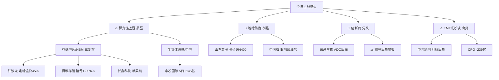

# 2026年8月11日 · **个股画像**

> **数据源新鲜度**: 🟡 partial
> **降级状态**: ⚠️ degraded（MCP全挂，chart_vision + vibe-trading 双维度降级）
> **置信度**: 0.58

## 一句话结论

存储芯片三剑客（江波龙/中芯国际/佰维存储）为今日最强主线，MCP全挂背景下仅靠上游artifact交叉推断，技术面与筹码面可信度有限。

## 今日候选池全景（7只）

| 排名 | 代码 | 名称 | 板块 | 综合分 | 评级 | 核心逻辑 | 主要风险 |
|-----:|------|------|------|-------:|------|---------|---------|
| 1 | 301308.SZ | 江波龙 | 存储芯片 | 80.8 | A | 定增溢价45%+机构强烈看好+R3动量top1 | 高价位波动大 |
| 2 | 688981.SH | 中芯国际 | 半导体设备 | 80.7 | A | 中芯概念5日+145亿+半导体设备今日榜首 | 远期概念催化弱 |
| 3 | 688525.SH | 佰维存储 | 存储/HBM | 79.5 | A | 三重催化+扭亏高增+HBM流入top2 | 扭亏估值失真 |
| 4 | 688825.SH | 长鑫科技 | DRAM | 77.7 | A | 苹果供应链+次新+营收+612% | 次新+估值溢价 |
| 5 | 600547.SH | 山东黄金 | 黄金 | 73.8 | B+ | 金价破4400+地缘+避险 | 周期股估值陷阱 |
| 6 | 688331.SH | 荣昌生物 | 创新药/ADC | 69.5 | B | ADC出海+扭亏+机构调研 | 板块late霸榜出货 |
| 7 | 300308.SZ | 中际旭创 | 光模块 | 66.7 | B | 双事件首推+订单至2027 | CPO-239亿高位出货 |

## 核心主线结构

---

## 首推票深度画像（Top 3 · A级）

### 🏆 1. 江波龙（301308.SZ）— 存储芯片 · 综合分 80.8

**一句话**: 37亿定增价560元溢价45%，机构用真金白银投票，叠加存储涨价周期+R3动量最强，今日首选。

**大资金意图**：定增溢价45%=机构极度看好，且锁定长期筹码；R3热榜rank29→6升23位=游资抢筹；R7 HBM板块5日+89亿=机构持续布局存储产业链。定增+游资+机构三方共振，筹码结构极佳。

**为什么走强**：三重催化叠加——①存储周期上行（摩根大通上调至2028年）②HBM紧缺（SK海力士384亿扩产）③定增溢价45%独立强催化。江波龙横跨消费存储+AI存储双赛道，弹性最大。

**逻辑够不够硬**：存储周期上行是产业级逻辑，定增溢价是机构级背书，两者叠加硬度足够。但高价位（500元+）标的波动大，且MCP降级下无法验证真实筹码结构，需警惕定增消息利好兑现。

**六维雷达**：
- 🔥 催化背景：92分 — 定增溢价+存储周期+HBM紧缺，三重共振
- 💰 筹码结构：78分 — 机构定增背书+板块资金流入，但vibe-trading降级
- 🔗 板块联动：86分 — 存储三剑客联动+半导体设备链共振
- 📊 估值安全：60分 — 存储周期初期，PS估值尚可但安全边际一般
- 📈 技术形态：85分 — R3动量最强，但chart_vision降级
- 🏛️ 机构关注：88分 — 定增溢价45%=最强机构背书

**风险点**：高价位高波动；定增催化可能利好兑现；MCP降级下技术面与筹码面可信度有限
**止损条件**：跌破5日均线且放量
**可验证假设**：HBM板块今日继续流入≥20亿 → 存储主线确认

---

### 🏆 2. 中芯国际（688981.SH）— 半导体设备 · 综合分 80.7

**一句话**: 半导体设备今日流入榜首+37亿，中芯概念5日+145亿，算力链上游最确定的机构抱团标的。

**大资金意图**：R7半导体设备buy_lg +23.85亿（占比65%），中芯概念buy_lg +20.18亿（占比128%机构超买），连续5日净流入=机构持续加仓而非游资短炒。大资金选择从中游制造切入算力链，回避光模块等高位板块。

**为什么走强**：①半导体设备国产替代长期逻辑②韩国半导体特别法+马斯克FEL技术情绪催化③TMT高位流出后资金切换到半导体上游。中芯国际作为晶圆制造龙头，是机构配置半导体的核心标的。

**逻辑够不够硬**：国产替代逻辑很硬，但短期催化（FEL光刻）偏远期概念，主要驱动是资金切换+机构配置。属于"基本面稳健+资金面强"的类型，进攻弹性不如存储三剑客但确定性更高。

**六维雷达**：
- 🔥 催化背景：72分 — 远期概念催化为主，强度中等
- 💰 筹码结构：85分 — 5日+145亿连续流入，机构主导
- 🔗 板块联动：92分 — 半导体设备+HBM+中芯概念三线共振
- 📊 估值安全：65分 — PB框架，大蓝筹估值波动可控
- 📈 技术形态：80分 — 5日+19.3%，趋势明确
- 🏛️ 机构关注：90分 — 机构超买，科创板核心权重

**风险点**：短期催化偏弱，更多靠资金推动；大市值标的弹性有限
**止损条件**：跌破62.8元（R4止损位）
**可验证假设**：半导体设备板块连续3日净流入top5 → 机构配置逻辑确认

---

### 🏆 3. 佰维存储（688525.SH）— 存储/HBM · 综合分 79.5

**一句话**: 存储涨价周期最受益弹性标的，中报扭亏+2776%~+3422%，三重催化共振。

**大资金意图**：R7 HBM板块5日+89.48亿，今日+27.22亿排名第2，net_rate 3.71%=资金认可度高。机构买入(buy_lg)占比69%=大资金主导。佰维作为AI存储模组+HBM封测双轮驱动标的，是存储板块的弹性核心。

**为什么走强**：三重催化——①摩根大通上调存储至2028年②苹果测试国产DRAM+国产替代加速③中报扭亏高增。佰维存储同时受益于AI存储（HBM）+消费存储（涨价周期）双逻辑，弹性最大。

**逻辑够不够硬**：存储周期上行是产业级逻辑，扭亏验证基本面反转，硬度足够。但科创板标的波动大，扭亏背景下估值方法受限，安全边际不如中芯国际。适合进攻型仓位。

**六维雷达**：
- 🔥 催化背景：92分 — 三重催化共振（产业+业绩+国产替代）
- 💰 筹码结构：75分 — 板块资金流入强劲，但vibe-trading降级
- 🔗 板块联动：90分 — 存储+HBM+半导体设备全链共振
- 📊 估值安全：58分 — 扭亏PE失真，PS估值尚可
- 📈 技术形态：82分 — 趋势上行段，动量强
- 🏛️ 机构关注：80分 — 机构主导流入，关注度高

**风险点**：扭亏估值失真；科创板波动大；业绩预增高位可能预期打满
**止损条件**：跌破52.3元（R4止损位）
**可验证假设**：存储板块今日涨幅≥2%且资金继续流入 → 弹性逻辑验证

---

## 次推票画像（B级 · 4只）

### 4. 长鑫科技（688825.SH）— DRAM/国产替代 · 综合分 77.7 · A级

国产DRAM龙头，苹果供应链潜在新进入者=里程碑级催化。中报营收+612%~+677%，净利润扭亏+1715%~+1935%。R3热榜rank21→8升13位，动量极强。**风险**：次新股+扭亏高增长，估值溢价高，波动大，解禁压力需关注。

### 5. 山东黄金（600547.SH）— 黄金/避险 · 综合分 73.8 · B+级

COMEX黄金突破4400美元=趋势级事件，霍尔木兹海峡地缘风险=脉冲催化。黄金ETF净申购近20亿份=机构配置。有色ETF属R1强势上升簇（5日+10%/20日+20%）。**定位**：防御+趋势双属性，适合组合对冲。**风险**：周期股估值陷阱（金价高位时PE低但可能周期顶）。

### 6. 荣昌生物（688331.SH）— 创新药/ADC · 综合分 69.5 · B级

ADC龙头，RC148授权艾伯维=国际化里程碑，中报+433%扭亏。但R3明确提示**创新药霸榜出货警报**（连续2日概念榜top1+药明康德2日热股top1），属于late阶段。**结论**：个股基本面好但板块情绪过热，建议轻仓或等回调，不追高。

### 7. 中际旭创（300308.SZ）— 光模块 · 综合分 66.7 · B级

全球光模块龙头，英伟达5000亿算力融资+在手订单至2027年，催化强度全场最高。但**R7 CPO概念今日大幅流出-238.87亿，net_rate -8.12%，典型高位出货形态**，与5G/PCB同步见顶。R3热榜"中际旭创大跌6%但热度仍高"=分歧加大。**核心风险**：利好出货。建议观望或等回调企稳。

---

## 板块资金-催化交叉验证矩阵

| 板块 | R4催化强度 | R7资金流向 | R3热度 | 交叉验证 | 结论 |
|------|-----------|-----------|--------|---------|------|
| 存储芯片/HBM | 🔴 high | 🟢 +27亿/5日+89亿 | 🟡 rank9持平 | 2源强+1源中 | ✅ 最强主线 |
| 半导体设备/中芯 | 🟡 medium | 🟢 +37亿(今日榜首) | 🟢 新进上升 | 2源强+1源弱 | ✅ 机构配置主线 |
| 光模块/CPO | 🔴 high | 🔴 -239亿(高位出货) | 🟡 rank6分歧 | 1源强+1源强空 | ⚠️ 利好出货，回避 |
| 创新药/ADC | 🟡 medium | 🟡 数据缺失 | 🔴 rank1霸榜 | 1源中+1源late | ⚠️ late阶段，轻仓 |
| 黄金/贵金属 | 🟡 high | 🟡 ETF净申购 | 🟢 强势上升簇 | 2源中+1源强 | ✅ 防御主线 |
| 锂电池/新能源 | ⚪ 无强催化 | 🟢 +30亿/5日+137亿 | 🟡 未入top5 | 1源强+2源弱 | 🟡 资金驱动，观察持续性 |

---

## 关键证据

- **证据1**: R7 CPO概念-238.87亿 + 5G概念-296.37亿 + PCB-127.35亿 = TMT全线高位出货，跷跷板效应明显 · 来源 R7_capital_flow
- **证据2**: R7 半导体设备+36.88亿(今日榜首) + HBM+27.22亿 + 中芯概念+15.75亿 = 算力链上游持续流入 · 来源 R7_capital_flow
- **证据3**: R4 英伟达5000亿算力融资 + 摩根大通上调存储 + 苹果测试长鑫 = AI算力+存储双主线有产业级催化支撑 · 来源 R4_news
- **证据4**: R3 江波龙rank29→6(+23) + 长鑫科技rank21→8(+13) = 存储板块动量最强 · 来源 R3_sentiment
- **证据5**: R3 创新药连续2日概念榜top1 + 药明康德2日热股top1 = 霸榜出货警报 · 来源 R3_sentiment

---

## 不确定性 / 反证

1. **MCP全挂=最大不确定性**：技术形态（chart_vision）、筹码结构（vibe-trading大宗/两融）、估值（tushare财务数据）三个维度缺乏硬数据支撑，画像定性多于定量，置信度下调至0.58。
2. **存储板块追高风险**：HBM板块5日已涨超20%，短期涨幅较大，虽有产业逻辑支撑但回调风险不可忽视。
3. **半导体设备催化偏弱**：主要靠资金切换驱动，短期催化（FEL光刻）偏远期，若大盘走弱可能回调幅度大于存储。
4. **创新药late阶段**：R3明确提示霸榜出货警报，即使个股基本面好也可能被板块拖累。
5. **光模块利好出货陷阱**：最强催化但资金面最背离，需高度警惕"利好出尽"。

---

## 与其他 R/D/E 的关系

- **依赖**: R2_main_sectors（昨日版本）、R4_news、R7_capital_flow、R3_sentiment、R1_style
- **被消费**: D1 主决策（execution_pool + watch_pool 构建）、R6 反证（fundamental_flags + 资金面背离检测）

## Sub-Agent 元数据

- **skill**: analyze_stock_profile_v1@1.4
- **artifact**: data/research/20260811/R5_stock_profiles.json
- **生成耗时**: ~5分钟（MCP全挂降级路径，纯artifact交叉推断）
- **状态**: partial（chart_vision + vibe-trading 双维度降级）
- **候选池**: 7只（>=5 硬约束满足）
- **扩池来源**: R4首推6只 + R2/R3扩池1只
