# 2026年8月12日 · **个股画像**

> **数据源新鲜度**: 🟡 partial
> **降级状态**: ⚠️ degraded（R2 缺失，候选池基于 R3+R4+R7 交叉构建）
> **置信度**: 68%

## 一句话结论

药明康德（胜诉+指引上调双催化+估值合理）与中国石油（油价上行+趋势稳健）为今日 A 级首选；风华高科/三花智控 A- 级弹性标的；中际旭创虽消息面最强但板块资金大幅流出降为 C+ 谨慎。

---

## 总览排名

| 排名 | 股票 | 板块 | 综合分 | 等级 | 核心逻辑 |
|------|------|------|--------|------|----------|
| 1 | 药明康德 | 创新药/CRO | 80.5 | ⭐ A | 禁令胜诉+指引上调，估值修复空间大 |
| 2 | 中国石油 | 油气开采 | 79.8 | ⭐ A | 油价中枢上移+趋势稳健，防御进攻双属性 |
| 3 | 三花智控 | 人形机器人 | 72.0 | 🔶 A- | 宇树IPO催化+执行器龙头，机构持仓稳 |
| 4 | 风华高科 | MLCC/被动元件 | 71.0 | 🔶 A- | MLCC涨价30%周期反转，R3共振Top1 |
| 5 | 太极实业 | 存储/先进封装 | 68.7 | 🔵 B+ | SK海力士四期合同+热榜跳升，游资主导 |
| 6 | 佰维存储 | AI存储 | 64.5 | 🔵 B | 回购+预增32倍，但腰斩后反弹波动率高 |
| 7 | 长鑫科技 | DRAM | 63.3 | 🔵 B | 国产DRAM龙头，新股筹码整理期 |
| 8 | 中际旭创 | 光模块 | 57.2 | ⚪ C+ | 消息面三催化但板块资金出逃，下降通道 |

---

## 六维雷达对比（Top4 首推）

```mermaid
graph TD
    subgraph 药明康德 80.5[A]
        C1[催化 86]
        CH1[筹码 78]
        S1[板块 82]
        V1[估值 72]
        T1[技术 75]
        I1[机构 90]
    end
    subgraph 中国石油 79.8[A]
        C2[催化 78]
        CH2[筹码 80]
        S2[板块 82]
        V2[估值 78]
        T2[技术 76]
        I2[机构 85]
    end
    subgraph 三花智控 72.0[A-]
        C3[催化 65]
        CH3[筹码 72]
        S3[板块 70]
        V3[估值 65]
        T3[技术 78]
        I3[机构 82]
    end
    subgraph 风华高科 71.0[A-]
        C4[催化 88]
        CH4[筹码 70]
        S4[板块 85]
        V4[估值 35]
        T4[技术 80]
        I4[机构 68]
    end

    C1 --> CH1 --> S1 --> V1 --> T1 --> I1
    C2 --> CH2 --> S2 --> V2 --> T2 --> I2
    C3 --> CH3 --> S3 --> V3 --> T3 --> I3
    C4 --> CH4 --> S4 --> V4 --> T4 --> I4
```

---

## 深度分析

### ⭐ 首选 1：药明康德（603259.SH）— CRO龙头困境反转

**大资金意图**：禁令胜诉解除最大尾部风险后，机构资金加速回补。融资余额15日+10.5%至56.8亿，量能放大至149亿（8月7日），典型的机构建仓特征。但融券余额同样飙升77.7%，说明有空头认为利好已price in，多空博弈加剧。

**为什么走强**：① 美国生物安全法案初步胜诉=2年多悬顶之剑落地；② 上调全年业绩指引至585-605亿=管理层确认基本面拐点；③ 创新药License-out爆发（上半年997亿美元）=产业趋势向上。三因素叠加形成戴维斯双击起点。

**逻辑够不够硬**：够硬。禁令胜诉是从"不确定性折价"到"正常估值"的估值修复逻辑（PE从22x向30x+修复），叠加业绩增长，空间可观。但需警惕二审风险和地缘政治反复。

**买入理由**：CRO绝对龙头估值底部+风险解除+业绩拐点三重确认，机构资金回补趋势明确。
**风险点**：① 二审败诉尾部风险；② 地缘政治反复；③ 创新药融资环境变化。
**止损条件**：跌破145元（20日线附近）且放量。
**可验证假设**：Q3业绩超预期+机构持仓回升+北向资金持续流入。

---

### ⭐ 首选 2：中国石油（601857.SH）— 油价上行慢牛

**大资金意图**：从7月8.7元稳步攀升至11元，沿20日均线匀速上行，没有加速放量=机构持续吸筹而非游资爆炒。低换手率（<1%）+高机构持仓=典型的配置型资金推动。

**为什么走强**：① EIA上调布油均价预测6.1%；② 中东石油供应中断或持续至2027年=油价中枢上移非短期；③ R1强势进攻簇（石油石化20日mom 6.94%）。地缘冲突+供需缺口双逻辑。

**逻辑够不够硬**：硬但需关注反向信号。EIA预测+供应中断是强支撑，但伊朗天然气产能回升=潜在对冲。不过"供应中断持续至2027"=中长期逻辑，不是一日游题材。

**买入理由**：油价中枢上移确定性高+趋势稳健+估值合理+高股息，攻守兼备。
**风险点**：① 全球经济衰退压制需求；② 伊朗/中东局势缓和；③ 美元走强。
**止损条件**：跌破10.5元（20日线）且油价大跌。
**可验证假设**：Q3业绩超预期+油价维持高位+北向持续流入。

---

### 🔶 弹性 1：风华高科（000636.SZ）— MLCC涨价周期反转

**大资金意图**：两连板+换手率22.7%=游资主导+散户跟风，短期博弈性质强。融资余额15日+14.3%快速攀升=杠杆资金进场。但7月31日大宗交易机构卖出=机构有分歧。空头同步加仓（融券+43.6%），多空剧烈博弈。

**为什么走强**：① 三星电机MLCC全线涨价30%=行业拐点信号；② 村田/太阳诱电跟进涨价=全行业趋势；③ AI高容MLCC需求爆发=需求端支撑。R3三源共振Top1主题，群聊+热榜+研报一致看多。

**逻辑够不够硬**：中期硬但短期过热。MLCC是典型周期品，涨价趋势一旦形成持续6-12个月。但短期两连板后估值248倍PE=完全是预期驱动，业绩兑现尚需时间。

**买入理由**：MLCC周期反转+国内龙头弹性最大+R3三源共振，短期催化强烈。
**风险点**：① 涨价持续性存疑；② 估值过高（PE 248x）；③ 机构减持压力。
**止损条件**：跌破58元（5日线）且量能萎缩。
**可验证假设**：Q3业绩验证涨价传导+国内同行跟随涨价+机构研报密集上调。

---

### 🔶 弹性 2：三花智控（002050.SZ）— 机器人执行器中军

**大资金意图**：从7月底部37.5元企稳回升，量能温和放大，融资融券双降=筹码稳定，机构主导而非游资爆炒。相比高位49元仍有50%以上空间，处于上升趋势早期。

**为什么走强**：① 宇树科技科创板上市=人形机器人产业里程碑事件；② 上半年人形机器人新设企业11.6万户=产业热度；③ 特斯拉机器人核心供应商+执行器/灵巧手布局领先。R3人形机器人rank13→3（+10名跳升）。

**逻辑够不够硬**：主题性机会，业绩兑现尚早。机器人板块整体处于早期（early阶段），宇树IPO是情绪催化剂而非业绩催化剂。但三花的热管理基本盘稳健，机器人业务是免费期权，下行风险有限。

**买入理由**：热管理基本盘+机器人期权双轮驱动，机构持仓稳健，趋势上行早期。
**风险点**：① 机器人业务占比低；② 主题性炒作退潮；③ 新能源车销量不及预期。
**止损条件**：跌破37.5元（前低）。
**可验证假设**：机器人业务订单落地+特斯拉Optimus进展+宇树上市后板块持续发酵。

---

## 关键证据

- 证据 1：药明康德美国禁令初步胜诉+上调全年指引至585-605亿 · 来源 R4_news + R3_sentiment
- 证据 2：EIA上调布油均价预测6.1%，中东供应中断或持续至2027年 · 来源 R4_news（财联社/华尔街见闻）
- 证据 3：三星MLCC全线涨价30%，R3三源共振Top1 · 来源 R3_sentiment + R4_news
- 证据 4：R7半导体设备板块主力净流入36.88亿（Top1），存储链资金面强 · 来源 R7_capital_flow
- 证据 5：CPO/光通信板块主力净流出超200亿，中际旭创下降通道明确 · 来源 R7_capital_flow + tushare_daily
- 证据 6：太极实业8月11日涨停，龙虎榜净买入2.84亿（游资主导）· 来源 tushare_top_list
- 证据 7：佰维存储7月24日大宗交易2亿折价9.95% · 来源 vibe-trading block_trades

---

## 数据源审计

| 源 | 状态 | 抓取时间 | 记录数 | 备注 |
|---|---|---|---|---|
| R1_style.json | 🟢 ok | 2026-08-12 | 22板块 | 风格/仓位基准 |
| R3_sentiment.json | 🟡 partial | 2026-08-12 | 5主题 | WeFlow降级，用热榜+研报替代 |
| R4_news.json | 🟢 ok | 2026-08-12 | 8事件 | 公众号/群聊缺失，仅官方媒体源 |
| R7_capital_flow.json | 🔴 degraded | 2026-08-12 | 12只 | MCP全断，推演值 |
| tushare daily | 🟢 ok | 2026-08-11 | 240行 | 8只×30日K线 |
| tushare top_list | 🟢 ok | 2026-08-11 | 62只 | 龙虎榜数据 |
| vibe block_trades | 🟡 partial | 2026-08-12 | 5笔 | 仅采样3只 |
| vibe margin_trading | 🟡 partial | 2026-08-12 | 75行 | 5只×15日 |

---

## 不确定性 / 反证

1. **R2 缺失风险**：今日 R2_main_sectors.json 未能生成，候选池基于 R3+R4+R7 交叉构建，可能遗漏 R2 标准流程会筛选出的真正龙头。D1 消费时需注意 `r2_missing_degraded=true` 标记。

2. **MLCC 涨价持续性存疑**：三星涨价可能是试探性动作，若需求端不支撑，同行未必跟进。248倍PE的风华高科一旦涨价逻辑证伪，回调空间巨大。

3. **中际旭创的消息面 vs 资金面背离**：消息面三事件全是正面，但板块资金大幅流出+股价下降通道。这种背离要么是市场错杀（左侧机会），要么是领先指标（机构先知先觉出货）。当前选择信任资金面，降为C+。

4. **存储板块分化**：半导体设备/HBM净流入但存储模组（佰维）仍处下降通道。存储链内部有分化，设备强于模组/设计。

5. **地缘政治黑天鹅**：中东局势变化既可能推高油价（利好中国石油），也可能引发全球risk-off（利空成长股），多空影响交织。

---

## 与其他 R/D/E 的关系

- **依赖上游**: R1_style.json（风格/仓位基准）、R3_sentiment.json（情绪共振主题）、R4_news.json（事件催化）、R7_capital_flow.json（资金验证）
- **被消费**: D1（main_decision_v1 构建 execution_pool + watch_pool）、R6（analyze_devil_advocate_v1 反证六模式）
- **特殊说明**: R2_main_sectors.json 缺失，本产出为降级版本。D1 消费时应将 `provenance.source != r2_leader_pool` 的票优先放入 watch_pool

## Sub-Agent 元数据

- skill: analyze_stock_profile_v1@1.4
- artifact: data/research/20260812/R5_stock_profiles.json
- 生成耗时: ~8 分钟（含 MCP 数据拉取）
- model: doubao-seed-2-0-code
- 候选池方法: R3共振Top5 + R4事件首推票 + R7流入板块龙头，三源去重后8只
