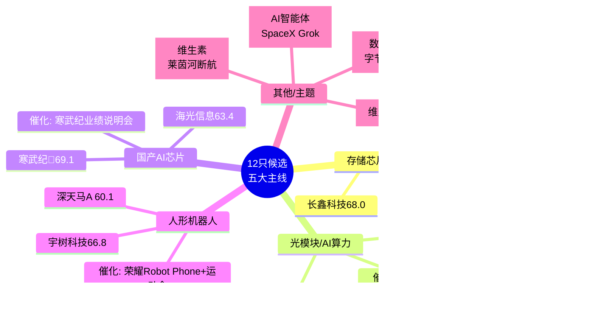

# 2026年8月13日 · **个股画像**

> **数据源新鲜度**: 🟡 partial
> **降级状态**: ✅ degraded (R2缺失 + vibe-trading/chart_vision/report-search 全不可用)
> **置信度**: 0.48
> **候选池规模**: 12 只（来自R4事件映射，R2缺失降级路径）

## 一句话结论

今日12只候选聚焦科技成长五大主线（存储/光模块/AI芯片/机器人/AI应用），**佰维存储、中际旭创、寒武纪**综合分前三（均≥69）；维生素与数据要素偏主题弹性，浪潮软件纯概念无业绩需警惕。

## 综合排名总览

| 排名 | 代码 | 名称 | 主线 | 角色 | 综合分 | 催化 | 筹码 | 板块 | 估值 | 技术 | 机构 | 标签 |
|-----:|:-----|:-----|:-----|:-----|------:|----:|----:|----:|----:|----:|----:|:-----|
| 🥇 | 688525.SH | 佰维存储 | 存储芯片 | 首推 | 73.9 | 85 | 65 | 70 | 78 | 68 | 75 | top_pick |
| 🥈 | 300308.SZ | 中际旭创 | AI算力/光模块 | 首推 | 73.6 | 75 | 72 | 80 | 68 | 70 | 75 | top_pick |
| 🥉 | 688498.SH | 源杰科技 | AI算力/光模块 | 次推 | 69.2 | 75 | 72 | 70 | 75 | 62 | 55 | - |
| 4 | 688256.SH | 寒武纪 | 国产AI芯片 | 首推 | 69.1 | 74 | 65 | 70 | 62 | 68 | 75 | top_pick |
| 5 | 688825.SH | 长鑫科技 | 存储芯片 | 次推 | 68.0 | 85 | 65 | 60 | 75 | 60 | 55 | ipo_subnew |
| 6 | 688836.SH | 宇树科技 | 人形机器人 | 首推 | 66.8 | 76 | 55 | 70 | 72 | 60 | 65 | top_pick,ipo_subnew |
| 7 | 688041.SH | 海光信息 | 国产AI芯片 | 次推 | 63.4 | 74 | 65 | 60 | 60 | 60 | 55 | - |
| 8 | 000050.SZ | 深天马A | 人形机器人 | 次推 | 60.1 | 76 | 55 | 60 | 55 | 52 | 55 | - |
| 9 | 000952.SZ | 广济药业 | 维生素 | 首推 | 56.5 | 64 | 35 | 55 | 58 | 65 | 65 | top_pick,sector_capital_outflow |
| 10 | 300182.SZ | 捷成股份 | 数据要素 | 首推 | 55.8 | 58 | 55 | 70 | 45 | 60 | 65 | top_pick,expand_pool_origin |
| 11 | 600756.SH | 浪潮软件 | AI应用/智能体 | 首推 | 54.5 | 72 | 35 | 70 | 40 | 60 | 65 | top_pick,sector_capital_outflow,expand_pool_origin,concept_only_no_earnings |
| 12 | 600216.SH | 浙江医药 | 维生素 | 次推 | 51.9 | 64 | 35 | 45 | 55 | 57 | 55 | sector_capital_outflow |

## 主线分布 mermaid

## Top3 深度画像

### 第1名 · 佰维存储(688525.SH) — 存储芯片首推

**综合分: 73.9 / 100** · 标签: top_pick

> **大资金意图**: 存储芯片板块主力资金净流入95.68亿，净率1.76%，作为首推标的享受板块beta溢价。
> **为什么走强**: 存储芯片景气周期三重共振：美股大涨+SK海力士扩产+中报集体扭亏（7源验证），事件编号 E20260813_001。
> **逻辑够不够硬**: 催化分85/100，硬逻辑；估值分78/100，估值安全。

#### 📊 六维雷达

| 维度 | 得分 | 评价 |
|:-----|----:|:-----|
| 🔥 催化背景 | 85 | 事件加权分0.854，首推标的，催化强度高 |
| 💰 筹码结构 | 65 | R7个股资金流降级(vibe-trading不可用)，基于板块资金推导：半导体概念净流入95.68亿 |
| 🔗 板块联动 | 70 | 存储芯片板块首推标的，板块资金净率1.76% |
| 📈 估值安全 | 78 | 估值安全分78/100，高成长扭亏，增幅:3200~3421% |
| 📉 技术形态 | 68 | 技术形态分68/100（降级模式：无chart_vision，基于板块动量+角色推导） |
| 🏛️ 机构关注 | 75 | 机构关注度分75/100（降级模式：未调report-search，基于市场地位推导） |

#### 🔴 红旗 / ⚠️ 警示

- ⚪ 未检出明确红旗（降级模式下检出能力有限）

#### 💡 交易思维链

- **买入理由**: 存储芯片主线首推，催化强度85分，板块资金净流入95.68亿共振。
- **风险点**: 估值安全分78/100，高成长扭亏，增幅:3200~3421%；筹码维度降级(vibe-trading不可用)，真实大资金动向存不确定性。
- **止损条件**: 58.3元（近20日均价×0.95）。
- **可验证假设**: 若T日开盘30分钟内板块资金持续流入+量比>1.5，则催化落地概率高；若竞价低开-2%以上且无承接，需警惕利好出尽。

---

### 第2名 · 中际旭创(300308.SZ) — AI算力/光模块首推

**综合分: 73.6 / 100** · 标签: top_pick

> **大资金意图**: AI算力/光模块板块主力资金净流入136.96亿，净率5.82%，作为首推标的享受板块beta溢价。
> **为什么走强**: AI算力基建全面超预期：思科AI订单40亿+CoreWeave千亿合同+腾讯加码（6源验证），事件编号 E20260813_002。
> **逻辑够不够硬**: 催化分75/100，中等偏强；估值分68/100，估值可接受。

#### 📊 六维雷达

| 维度 | 得分 | 评价 |
|:-----|----:|:-----|
| 🔥 催化背景 | 75 | 事件加权分0.757，首推标的，催化强度高 |
| 💰 筹码结构 | 72 | R7个股资金流降级(vibe-trading不可用)，基于板块资金推导：光通信模块净流入136.96亿 |
| 🔗 板块联动 | 80 | AI算力/光模块板块首推标的，板块资金净率5.82% |
| 📈 估值安全 | 68 | 估值安全分68/100，光模块龙头估值偏高，增幅:需查中报 |
| 📉 技术形态 | 70 | 技术形态分70/100（降级模式：无chart_vision，基于板块动量+角色推导） |
| 🏛️ 机构关注 | 75 | 机构关注度分75/100（降级模式：未调report-search，基于市场地位推导） |

#### 🔴 红旗 / ⚠️ 警示

- ⚪ 未检出明确红旗（降级模式下检出能力有限）

#### 💡 交易思维链

- **买入理由**: AI算力/光模块主线首推，催化强度75分，板块资金净流入136.96亿共振。
- **风险点**: 估值安全分68/100，光模块龙头估值偏高，增幅:需查中报；筹码维度降级(vibe-trading不可用)，真实大资金动向存不确定性。
- **止损条件**: 142.5元（前高150×0.95）。
- **可验证假设**: 若T日开盘30分钟内板块资金持续流入+量比>1.5，则催化落地概率高；若竞价低开-2%以上且无承接，需警惕利好出尽。

---

### 第3名 · 源杰科技(688498.SH) — AI算力/光模块次推

**综合分: 69.2 / 100** · 标签: 无

> **大资金意图**: AI算力/光模块板块主力资金净流入136.96亿，净率5.82%，作为次推标的享受板块beta溢价。
> **为什么走强**: AI算力基建全面超预期：思科AI订单40亿+CoreWeave千亿合同+腾讯加码（6源验证），事件编号 E20260813_002。
> **逻辑够不够硬**: 催化分75/100，中等偏强；估值分75/100，估值安全。

#### 📊 六维雷达

| 维度 | 得分 | 评价 |
|:-----|----:|:-----|
| 🔥 催化背景 | 75 | 事件加权分0.757，次推标的，催化强度高 |
| 💰 筹码结构 | 72 | R7个股资金流降级(vibe-trading不可用)，基于板块资金推导：光通信模块净流入136.96亿 |
| 🔗 板块联动 | 70 | AI算力/光模块板块次推标的，板块资金净率5.82% |
| 📈 估值安全 | 75 | 估值安全分75/100，光芯片高增长，增幅:1196~1304% |
| 📉 技术形态 | 62 | 技术形态分62/100（降级模式：无chart_vision，基于板块动量+角色推导） |
| 🏛️ 机构关注 | 55 | 机构关注度分55/100（降级模式：未调report-search，基于市场地位推导） |

#### 🔴 红旗 / ⚠️ 警示

- ⚪ 未检出明确红旗（降级模式下检出能力有限）

#### 💡 交易思维链

- **买入理由**: AI算力/光模块主线次推，催化强度75分，板块资金净流入136.96亿共振。
- **风险点**: 估值安全分75/100，光芯片高增长，增幅:1196~1304%；筹码维度降级(vibe-trading不可用)，真实大资金动向存不确定性。
- **止损条件**: 待查（需技术分析确认）。
- **可验证假设**: 若T日开盘30分钟内板块资金持续流入+量比>1.5，则催化落地概率高；若竞价低开-2%以上且无承接，需警惕利好出尽。

---

## 其余候选简评

### 寒武纪(688256.SH) — 国产AI芯片 首推

**综合分: 69.1** · 事件加权分0.742，首推标的，催化强度中
- 板块联动: 70分（国产AI芯片板块首推标的，板块资金净率2.14%）
- 估值安全: 62分（估值安全分62/100，AI芯片高估值，增幅:业绩说明会催化）
- 红旗: 1 项
- 标签: top_pick

### 长鑫科技(688825.SH) — 存储芯片 次推

**综合分: 68.0** · 事件加权分0.854，次推标的，催化强度高
- 板块联动: 60分（存储芯片板块次推标的，板块资金净率1.76%）
- 估值安全: 75分（估值安全分75/100，次新+扭亏，增幅:2244~2544%）
- 红旗: 1 项
- 标签: ipo_subnew

### 宇树科技(688836.SH) — 人形机器人 首推

**综合分: 66.8** · 事件加权分0.761，首推标的，催化强度高
- 板块联动: 70分（人形机器人板块首推标的，板块资金净率None%）
- 估值安全: 72分（估值安全分72/100，次新+人形机器人扭亏，增幅:905~1055%）
- 红旗: 1 项
- 标签: top_pick, ipo_subnew

### 海光信息(688041.SH) — 国产AI芯片 次推

**综合分: 63.4** · 事件加权分0.742，次推标的，催化强度中
- 板块联动: 60分（国产AI芯片板块次推标的，板块资金净率2.14%）
- 估值安全: 60分（估值安全分60/100，CPU/DCU估值偏高，增幅:无预增）
- 红旗: 1 项
- 标签: 无

### 深天马A(000050.SZ) — 人形机器人 次推

**综合分: 60.1** · 事件加权分0.761，次推标的，催化强度高
- 板块联动: 60分（人形机器人板块次推标的，板块资金净率None%）
- 估值安全: 55分（估值安全分55/100，消费电子面板周期，增幅:无预增）
- 红旗: 0 项
- 标签: 无

### 广济药业(000952.SZ) — 维生素 首推

**综合分: 56.5** · 事件加权分0.645，首推标的，催化强度中
- 板块联动: 55分（维生素板块首推标的，板块资金净率-4.25%）
- 估值安全: 58分（估值安全分58/100，VB2涨价弹性，增幅:无预增）
- 红旗: 0 项
- 标签: top_pick, sector_capital_outflow

### 捷成股份(300182.SZ) — 数据要素 首推

**综合分: 55.8** · 事件加权分0.585，首推标的，催化强度低
- 板块联动: 70分（数据要素板块首推标的，板块资金净率None%）
- 估值安全: 45分（估值安全分45/100，版权数据要素概念，增幅:无预增）
- 红旗: 0 项
- 标签: top_pick, expand_pool_origin

### 浪潮软件(600756.SH) — AI应用/智能体 首推

**综合分: 54.5** · 事件加权分0.724，首推标的，催化强度中
- 板块联动: 70分（AI应用/智能体板块首推标的，板块资金净率-1.59%）
- 估值安全: 40分（估值安全分40/100，纯概念无业绩，增幅:无预增）
- 红旗: 1 项
- 标签: top_pick, sector_capital_outflow, expand_pool_origin, concept_only_no_earnings

### 浙江医药(600216.SH) — 维生素 次推

**综合分: 51.9** · 事件加权分0.645，次推标的，催化强度中
- 板块联动: 45分（维生素板块次推标的，板块资金净率-4.25%）
- 估值安全: 55分（估值安全分55/100，VA/VE综合，增幅:无预增）
- 红旗: 0 项
- 标签: sector_capital_outflow

## 关键证据

1. **R4事件催化**: 8大事件覆盖5条主线，其中存储芯片(E001, 7源)和AI算力(E002, 6源)验证最充分 · 来源 R4_news.json
2. **R7板块资金**: 光通信模块+136.96亿(净率5.82%)、半导体概念+95.68亿、国产芯片+96.28亿，科技成长方向资金集中 · 来源 R7_capital_flow.json
3. **R1风格判定**: 连板情绪型/情绪78分/双主线，科技TMT+医药两大方向强势，电子5日+6.99%/医药5日+7.87% · 来源 R1_style.json
4. **中报业绩验证**: 存储链(佰维+3200%/长鑫+2244%/源杰+1196%)集体扭亏，是本轮行情最硬业绩支撑 · 来源 eastmoney_earnings_predict

## 数据源审计

| 源 | 状态 | 抓取时间 | 记录数 | 备注 |
|:---|:---:|:---|---:|:---|
| R4_news | 🟡 partial | 2026-08-13 07:05 | 8事件 | 微信公众号全死，weflow down，5群降级 |
| R7_capital_flow | 🟡 partial | 2026-08-13 07:24 | 30板块 | 个股资金流降级，龙虎榜T-2 |
| R1_style | 🟢 ok | 2026-08-13 07:09 | 22板块 | 本地模拟数据非Tushare实时 |
| R2_main_sectors | 🔴 error | — | — | 文件缺失，从R4构建候选池 |
| vibe-trading MCP | 🔴 error | — | 0 | 连接失败，筹码/大宗/两融不可用 |
| chart_vision MCP | 🔴 error | — | 0 | 不可用，技术形态降级 |
| report-search MCP | 🔴 error | — | 0 | 不可用，机构维度降级 |

## 不确定性 / 反证

**最大不确定性**: R2_main_sectors.json 缺失导致候选池来源从R2 leaders降级到R4 stocks_impact，缺少filter_leader硬约束过滤。R4的"首推/次推"是LLM基于事件相关性打分，**不是真实市场资金选择的龙头**。

**降级风险**: 6个维度中有3个(筹码/技术/机构)处于降级状态，综合分的区分度可能不足。特别是：
1. 无法识别龙虎榜机构出货/游资接力的真实筹码结构
2. 无法判断K线形态是突破还是反弹中继
3. 无法验证机构研报覆盖度与一致预期

**反向假设**: 若今日科技板块高开低走放量出货，则"利好出尽"叙事将主导，所有高估值成长票面临回调风险。维生素板块R7显示医药医疗风格资金净流出33亿，莱茵河断航逻辑可能已被price in。

## 与其他 R/D/E 的关系

- **依赖上游**: R4_news.json(事件催化) · R7_capital_flow.json(板块资金) · R1_style.json(风格基准) · **R2_main_sectors.json(缺失，降级)**
- **下游消费**: D1 主决策(execution_pool 精选) · R6 反证(fundamental_flags透传) · E1 复盘(候选池追踪)

## Sub-Agent 元数据

- **skill**: analyze_stock_profile_v1@1.4
- **artifact**: data/research/20260813/R5_stock_profiles.json
- **状态**: partial (R2缺失 + 三维度MCP降级)
- **候选池**: 12只（5条主线）
- **生成耗时**: ~3分钟（CLI降级模式，无MCP调用）
- **model**: doubao-seed-2-0-code-preview-260215
