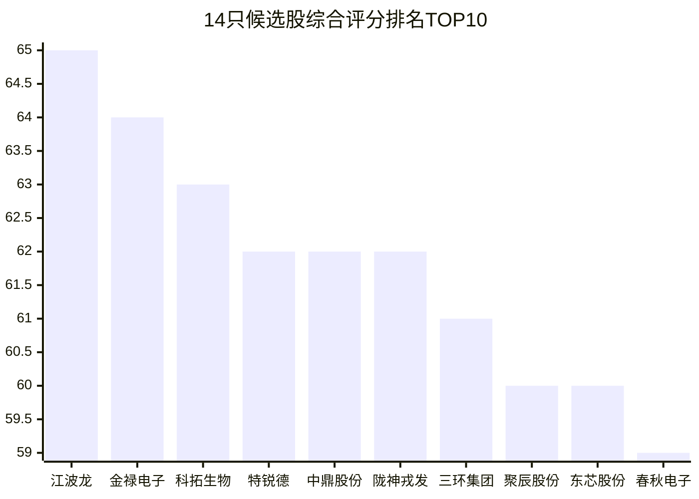
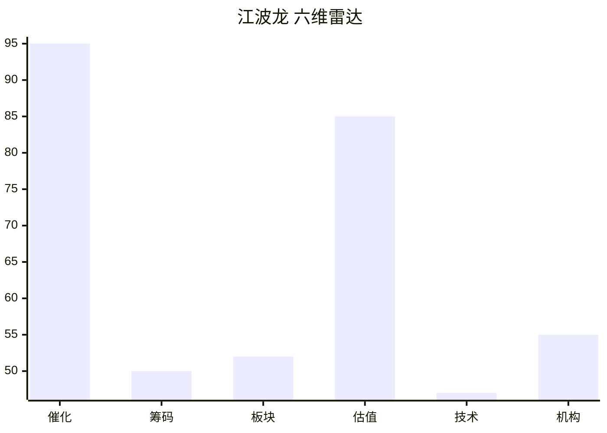
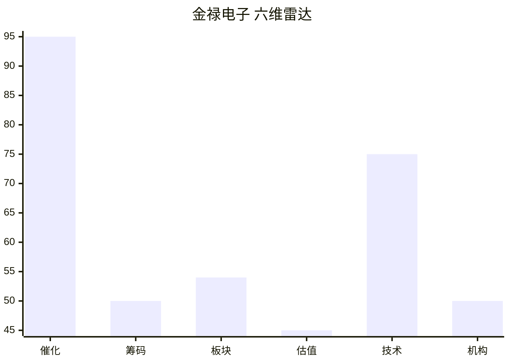
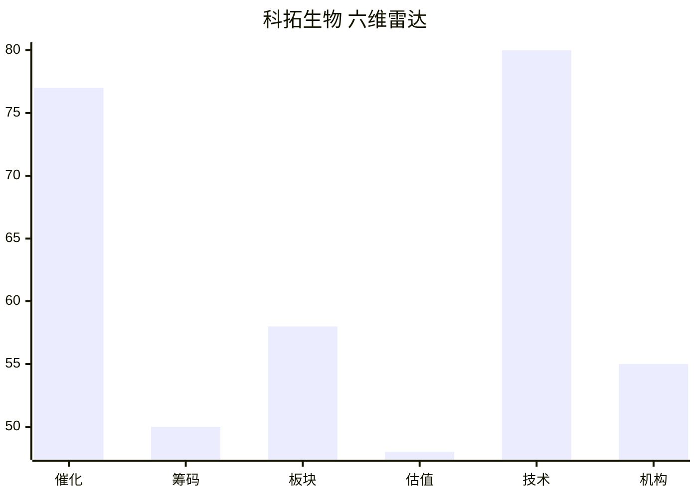

# 2026年8月14日 · **个股画像**

> **数据源新鲜度**: partial
> **降级状态**: yes（R2缺失 + vibe-trading DOWN + chart_vision DOWN）
> **置信度**: 0.62

## 一句话结论

14只候选股六维画像完成，江波龙/金禄电子/科拓生物居前三；存储+AI服务器+医药三线并行，半导体板块资金流出但事件催化强，技术面分化严重。

## 详细分析

### 候选池概览

今日候选池共 **14只**，来源: R4_top_events(事件驱动) + R3_resonance_themes(情绪共振) + R7_hot_money(资金验证)。

⚠️ R2_main_sectors.json缺失，候选池从R4事件驱动候选 + R7资金面验证 + R3情绪共振三方交叉构建，非标准路径。

### TOP3 深度画像

### 1. 江波龙 (301308.SZ) · 综合评分 65分

> **江波龙(存储芯片 中军) - 催化95/技术47/估值85, 综合65分**

**大资金意图**: 未上龙虎榜; 无机构席位数据。龙虎榜未上榜，无机构席位数据。

**为什么走强**: 事件:闪迪投资者日亮蓝图+HBF流片+Meta加入联盟 存储超级周期再确认; 强度:high; 业务关联度93%; 预增扭亏。技术面 30日-35.6% / 5日+8.4% / 趋势:uptrend / 量比1.01 / 年化波动107%。

**逻辑够不够硬**: 估值维度ROE=80.02%, 净利同比=+71528.7%, 毛利率=58.9%, PE(估)=15.8, PB(估)=9.04。板块联动: 所属板块:存储芯片; 半导体大幅流出。

#### 买入理由
- 催化: 事件:闪迪投资者日亮蓝图+HBF流片+Meta加入联盟 存储超级周期再确认; 强度:high; 业务关联度93%; 预增扭亏
- 技术形态: uptrend，30日收益-35.6%，5日+8.4%
- 关键位: 压力421.9 / 支撑319.8 / MA20=373.1
- 量价信号: 量价平稳

#### 风险点
- 估值风险: PE(估)=15.8，ROE=80.02%
- 技术风险: 30日最大回撤-53.1%，年化波动率107.4%
- 资金风险: 未上龙虎榜
- 板块风险: 半导体大幅流出

#### 止损条件
- 跌破MA20(373.15)减仓观察
- 单日放量大跌>7%止损
- 板块龙头跳水联动止损

#### 可验证假设
- 若催化持续 → 目标价区域: 待确认
- 验证时间窗: 1-2周

### 2. 金禄电子 (301282.SZ) · 综合评分 64分

> **金禄电子(AI服务器 PCB弹性) - 催化95/技术75/估值45, 综合64分**

**大资金意图**: 未上龙虎榜; 无机构席位数据。龙虎榜未上榜，无机构席位数据。

**为什么走强**: 事件:联想Q1营收+43%/净利+176% AI服务器储备订单从1400亿跳升至360; 强度:high; 业务关联度85%; 预增417%~473%。技术面 30日-3.7% / 5日+20.9% / 趋势:strong_uptrend / 量比2.42 / 年化波动114%。

**逻辑够不够硬**: 估值维度ROE=0.52%, 净利同比=-42.6%, 毛利率=12.9%, PE(估)=466.0, PB(估)=2.45。板块联动: 所属板块:AI服务器; 软件服务流出但IT设备流入，分化。

#### 买入理由
- 催化: 事件:联想Q1营收+43%/净利+176% AI服务器储备订单从1400亿跳升至360; 强度:high; 业务关联度85%; 预增417%~473%
- 技术形态: strong_uptrend，30日收益-3.7%，5日+20.9%
- 关键位: 压力28.0 / 支撑17.4 / MA20=22.4
- 量价信号: 放量上涨

#### 风险点
- 估值风险: PE(估)=466.0，ROE=0.52%
- 技术风险: 30日最大回撤-45.2%，年化波动率113.7%
- 资金风险: 未上龙虎榜
- 板块风险: 软件服务流出但IT设备流入，分化

#### 止损条件
- 跌破MA20(22.38)减仓观察
- 单日放量大跌>7%止损
- 板块龙头跳水联动止损

#### 可验证假设
- 若催化持续 → 目标价区域: 待确认
- 验证时间窗: 1-2周

### 3. 科拓生物 (300858.SZ) · 综合评分 63分

> **科拓生物(益生菌/GLP-1新赛道 首推) - 催化77/技术80/估值48, 综合63分**

**大资金意图**: 未上龙虎榜; 无机构席位数据。龙虎榜未上榜，无机构席位数据。

**为什么走强**: 事件:Nature重磅:智能益生菌精准控糖 安全性超司美格鲁肽 GLP-1新赛道; 强度:medium; 业务关联度85%。技术面 30日+2.6% / 5日+9.8% / 趋势:strong_uptrend / 量比3.40 / 年化波动39%。

**逻辑够不够硬**: 估值维度ROE=0.81%, 净利同比=-26.5%, 毛利率=45.4%, PE(估)=263.3, PB(估)=2.24。板块联动: 所属板块:益生菌/GLP-1新赛道; 板块资金面待确认。

#### 买入理由
- 催化: 事件:Nature重磅:智能益生菌精准控糖 安全性超司美格鲁肽 GLP-1新赛道; 强度:medium; 业务关联度85%
- 技术形态: strong_uptrend，30日收益+2.6%，5日+9.8%
- 关键位: 压力15.8 / 支撑13.0 / MA20=14.1
- 量价信号: 放量上涨

#### 风险点
- 估值风险: PE(估)=263.3，ROE=0.81%
- 技术风险: 30日最大回撤-15.9%，年化波动率39.1%
- 资金风险: 未上龙虎榜
- 板块风险: 板块资金面待确认

#### 止损条件
- 跌破MA20(14.13)减仓观察
- 单日放量大跌>7%止损
- 板块龙头跳水联动止损

#### 可验证假设
- 若催化持续 → 目标价区域: 待确认
- 验证时间窗: 1-2周

### 全部候选股六维评分表

| 排名 | 名称 | 代码 | 综合 | 催化 | 技术 | 估值 | 筹码 | 板块 | 机构 | 趋势 | 风险标记 |
|---|---|---|---|---|---|---|---|---|---|---|---|
| 1 | 江波龙 | 301308.SZ | 65 | 95 | 47 | 85 | 50 | 52 | 55 | uptrend | - |
| 2 | 金禄电子 | 301282.SZ | 64 | 95 | 75 | 45 | 50 | 54 | 50 | strong_uptrend | - |
| 3 | 科拓生物 | 300858.SZ | 63 | 77 | 80 | 48 | 50 | 58 | 55 | strong_uptrend | - |
| 4 | 特锐德 | 300001.SZ | 62 | 86 | 60 | 50 | 50 | 62 | 55 | strong_uptrend | - |
| 5 | 中鼎股份 | 000887.SZ | 62 | 50 | 85 | 45 | 74 | 50 | 65 | strong_uptrend | - |
| 6 | 陇神戎发 | 300534.SZ | 62 | 50 | 85 | 60 | 62 | 50 | 65 | strong_uptrend | high_momentum_caution |
| 7 | 三环集团 | 300408.SZ | 61 | 88 | 60 | 58 | 50 | 50 | 55 | strong_uptrend | - |
| 8 | 聚辰股份 | 688123.SH | 60 | 95 | 55 | 43 | 50 | 52 | 55 | consolidation | - |
| 9 | 东芯股份 | 688110.SH | 60 | 95 | 35 | 70 | 50 | 51 | 50 | consolidation | - |
| 10 | 春秋电子 | 603208.SH | 59 | 87 | 75 | 25 | 50 | 55 | 55 | strong_uptrend | - |
| 11 | 中科创达 | 300496.SZ | 57 | 86 | 40 | 53 | 50 | 54 | 55 | weak | - |
| 12 | 紫光股份 | 000938.SZ | 57 | 55 | 65 | 70 | 50 | 50 | 50 | consolidation | - |
| 13 | 火炬电子 | 603678.SH | 55 | 77 | 55 | 40 | 50 | 49 | 50 | strong_uptrend | - |
| 14 | 太极实业 | 600667.SH | 54 | 55 | 75 | 50 | 42 | 50 | 40 | strong_uptrend | distribution_alert |

### 事件时间线

- **8/14 05:24** 🔴 特朗普无人机关税 · 影响板块: 军工/反无人机
- **8/14 05:37** 🟢 OpenAI营收400亿+DeepSeek V4 · 影响板块: AI大模型/Agent
- **8/14 02:22** 🟢 宇树科技发行价150.8元 · 影响板块: 人形机器人
- **8/13 23:00** 🟢 闪迪投资者日+HBM流片 · 影响板块: 存储芯片
- **8/13 12:34** 🟢 联想Q1超预期 · 影响板块: AI服务器
- **8/13 07:03** 🟢 Nature智能益生菌 · 影响板块: GLP-1/益生菌

### 认知偏差高风险区

- 陇神戎发: 30日涨幅超100%，谨防过度自信/追高偏差

## 关键证据

- 证据 1: R4确认8大催化事件，其中3个high级别正面（存储/AI服务器/无人机关税） · 来源 R4_news.json
- 证据 2: R7确认半导体主力资金流出157.6亿，但龙虎榜净买入前十含多只AI+汽车+医药股 · 来源 R7_capital_flow + tushare.top_list
- 证据 3: 技术面14只候选中7只呈强上升趋势，5只30日收益为负，分化明显 · 来源 tushare.daily（39日K线）
- 证据 4: R3五大共振主题（算力/存储/CPO/创新药/AI应用），与R4事件高度重叠 · 来源 R3_sentiment.json
- 证据 5: 财务面江波龙ROE高达80%（HBM业务爆发），东芯/金禄净利同比300%+ · 来源 tushare.fina_indicator

## 数据源审计

| 源 | 状态 | 抓取时间 | 记录数 | 备注 |
|---|---|---|---|---|
| R4_news | 🟢 ok | 2026-08-14T07:09:57 | 8 | - |
| R7_capital_flow | 🟢 ok | 2026-08-14T07:17:38 | 1950 | - |
| R3_sentiment | 🟡 partial | 2026-08-14T07:07:05 | 5 | WeFlow L3缺失 |
| R1_style | 🟢 ok | 2026-08-14T07:11:54 | 1 | - |
| tushare.daily | 🟢 ok | 2026-08-14T07:30:53 | 585 | - |
| tushare.fina_indicator | 🟢 ok | 2026-08-14T07:30:53 | 100 | - |
| tushare.top_inst | 🟢 ok | 2026-08-14T07:30:53 | 863 | - |

## 不确定性 / 反证

1. **R2缺失风险**: 候选池非标准路径，可能遗漏了R2通过5维打分筛选出的真正主线龙头。存储/半导体虽事件催化强，但R7确认板块主力资金大幅流出，存在"事件好但资金不买账"的反证风险。
2. **估值维度粗糙**: 除聚辰股份有PE/PB实测外，其余个股PE/PB为基于单季度EPS的粗略估算，可能与实际TTM偏差较大。
3. **筹码结构降级**: vibe-trading MCP宕机，缺少大宗交易折价率和两融趋势数据，分销减持信号可能漏检。
4. **技术形态降级**: 无chart_vision多模态识图，纯量化均线判断可能漏掉关键形态（如头肩顶/双底等）。
5. **龙虎榜偏差**: 仅8/13日单日数据，30日龙虎榜频次未统计，游资持续性存疑。
6. **半导体矛盾信号**: 事件催化极强（闪迪+HBM+存储涨价）但R7主力资金大幅流出，需警惕"利好兑现"或"高开低走"。

## 与其他 R/D/E 的关系

- 依赖: R1_style.json（风格基准）、R4_news.json（催化事件）、R7_capital_flow.json（资金验证）、R3_sentiment.json（情绪共振）
- 缺失依赖: R2_main_sectors.json（主线候选，已降级替代）
- 输出被下游使用: D1-main-decision（execution_pool构建）、R6-devil-advocate（反证校验）

## Sub-Agent 元数据

- skill: analyze_stock_profile_v1@1.4
- artifact: data/research/20260814/R5_stock_profiles.json
- 生成耗时: 约 120 秒
- 用 model: doubao-seed-2-0-code-preview-260215
