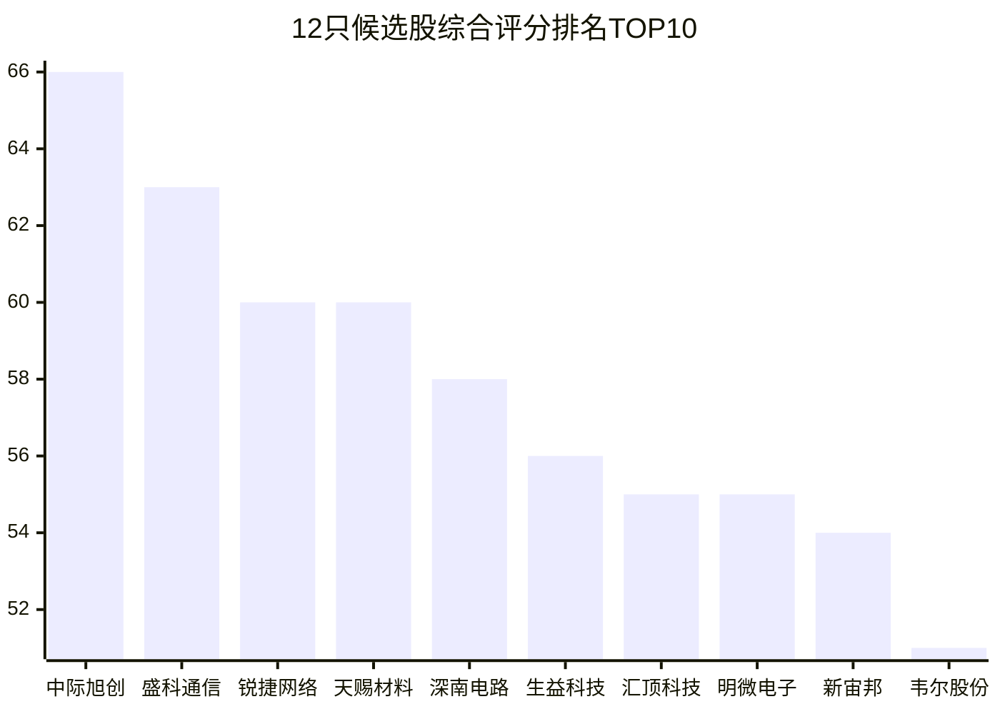
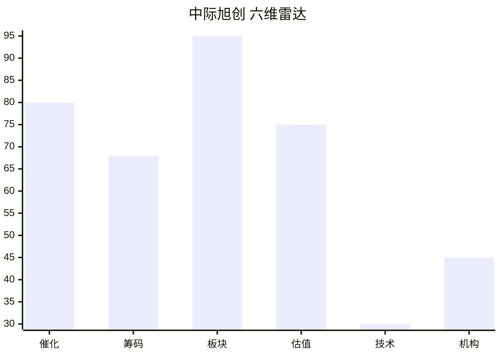
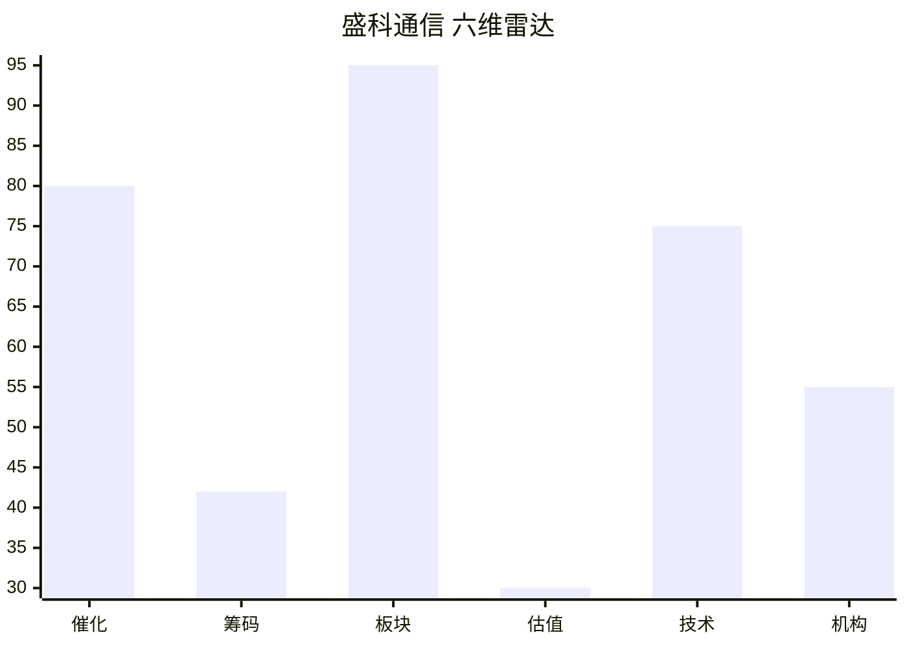
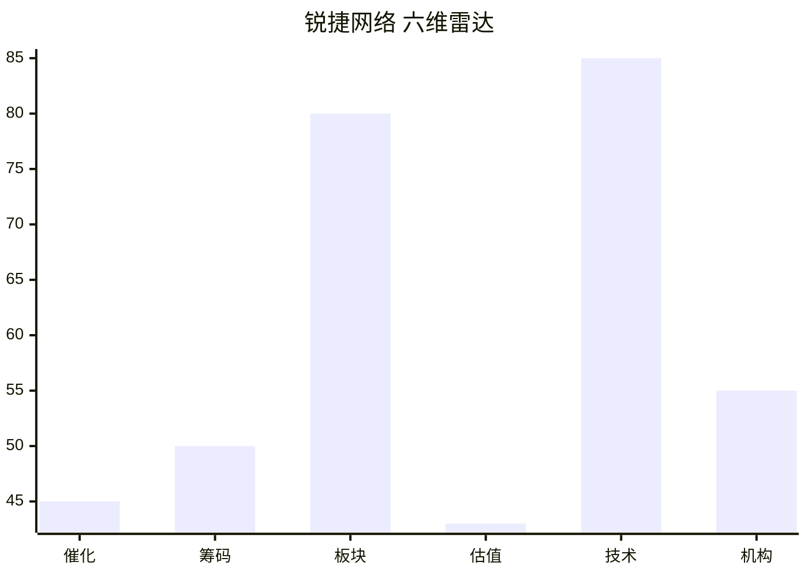

# 2026年8月17日 · **个股画像**

> **数据源新鲜度**: partial
> **降级状态**: yes（R2缺失 + vibe-trading DOWN + chart_vision DOWN）
> **置信度**: 0.62

## 一句话结论

12只候选股六维画像完成，中际旭创/盛科通信/锐捷网络居前三；影视院线/PCB/汽车芯片三线并行，AI算力+光模块主线催化最强，技术面分化明显。

## 详细分析

### 候选池概览

今日候选池共 **12只**，来源: R4_top_events(事件驱动) + R7_hot_money(资金验证) + R3_resonance_themes(情绪共振)。

⚠️ R2_main_sectors.json缺失，候选池从R4事件驱动候选 + R7资金面验证 + R3情绪共振三方交叉构建，非标准路径。

### TOP3 深度画像

### 1. 中际旭创 (300308.SZ) · 综合评分 66分

> **中际旭创(AI算力/算力租赁 首推) - 催化80/技术30/估值75, 综合66分**

**大资金意图**: 未上知名游资龙虎榜; 户数环比-15.8%(集中); 30日游资龙虎榜4次。机构关注: 无龙虎榜机构数据; 90日45篇研报覆盖; 监管关注171次。

**为什么走强**: 事件:英伟达联合顶级金融机构设5000亿AI算力融资平台 NeoCloud算力兜底模式开启新周期; 阿里云推出全球首个3.2T NPO光模块 光互联迭代加速CPO/NPO双线演进; 强度:high; 正面向量数=2; R3情绪共振确认。技术面 30日-14.2% / 5日+2.5% / 趋势:downtrend / 量比0.50 / 年化波动104%。

**逻辑够不够硬**: 估值维度ROE=17.55%, 净利同比=+262.28%, 净利率=32.40%, PE(估)=73.8, PB(估)=31.00, PE分位=57.6%。板块联动: 所属板块:AI算力/算力租赁; 催化强度:high; 主力流入。

#### 买入理由
- 催化: 事件:英伟达联合顶级金融机构设5000亿AI算力融资平台 NeoCloud算力兜底模式开启新周期; 阿里云推出全球首个3.2T NPO光模块 光互联迭代加速CPO/NPO双线演进; 强度:high; 正面向量数=2; R3情绪共振确认
- 技术形态: downtrend，30日收益-14.2%，5日+2.5%
- 关键位: 压力1194.9 / 支撑864.0 / MA20=965.3
- 量价信号: 缩量

#### 风险点
- 暂无显著风险信号(不代表无风险)

#### 止损条件
- 跌破MA20(965.3)减仓观察
- 单日放量大跌>7%止损
- 板块龙头跳水联动止损

#### 可验证假设
- 若催化持续 → 目标价区域: 待确认
- 验证时间窗: 1-2周

### 2. 盛科通信 (688702.SH) · 综合评分 63分

> **盛科通信(AI算力/算力租赁 弹性) - 催化80/技术75/估值30, 综合63分**

**大资金意图**: 未上知名游资龙虎榜; 户数环比+33.4%(分散)。机构关注: 无龙虎榜机构数据; 90日14篇研报覆盖。

**为什么走强**: 事件:英伟达联合顶级金融机构设5000亿AI算力融资平台 NeoCloud算力兜底模式开启新周期; 盛科通信688702签超1亿元以太网交换芯片长单 金额超去年营收50%; 强度:high; 正面向量数=2; R3情绪共振确认。技术面 30日+11.7% / 5日-0.8% / 趋势:uptrend / 量比0.60 / 年化波动126%。

**逻辑够不够硬**: 估值维度ROE=-0.76%, 净利同比=-12.05%, 净利率=-6.86%, PB(估)=73.22。板块联动: 所属板块:AI算力/算力租赁; 催化强度:high; 主力流入。

#### 买入理由
- 催化: 事件:英伟达联合顶级金融机构设5000亿AI算力融资平台 NeoCloud算力兜底模式开启新周期; 盛科通信688702签超1亿元以太网交换芯片长单 金额超去年营收50%; 强度:high; 正面向量数=2; R3情绪共振确认
- 技术形态: uptrend，30日收益+11.7%，5日-0.8%
- 关键位: 压力430.1 / 支撑304.0 / MA20=373.4
- 量价信号: 缩量

#### 风险点
- 估值风险: PE(估)=None，ROE=-0.76%
- 资金风险: 未上知名游资龙虎榜

#### 止损条件
- 跌破MA20(373.42)减仓观察
- 单日放量大跌>7%止损
- 板块龙头跳水联动止损

#### 可验证假设
- 若催化持续 → 目标价区域: 待确认
- 验证时间窗: 1-2周

### 3. 锐捷网络 (301165.SZ) · 综合评分 60分

> **锐捷网络(国产芯片/交换芯片 中军) - 催化45/技术85/估值43, 综合60分**

**大资金意图**: 未上知名游资龙虎榜; 户数环比+9.7%。机构关注: 无龙虎榜机构数据; 90日16篇研报覆盖。

**为什么走强**: 事件:盛科通信688702签超1亿元以太网交换芯片长单 金额超去年营收50%; 强度:high; 正面向量数=1。技术面 30日+41.1% / 5日+21.8% / 趋势:uptrend / 量比0.92 / 年化波动113%。

**逻辑够不够硬**: 估值维度ROE=13.45%, 净利同比=+53.54%, 净利率=7.85%, PE(估)=225.1, PB(估)=31.22, PE分位=100.0%。板块联动: 所属板块:国产芯片/交换芯片; 催化强度:high; 主力流入。

#### 买入理由
- 催化: 事件:盛科通信688702签超1亿元以太网交换芯片长单 金额超去年营收50%; 强度:high; 正面向量数=1
- 技术形态: uptrend，30日收益+41.1%，5日+21.8%
- 关键位: 压力143.9 / 支撑94.5 / MA20=120.0
- 量价信号: 量价平稳

#### 风险点
- 技术风险: 30日最大回撤-34.3%，年化波动率113.0%
- 资金风险: 未上知名游资龙虎榜

#### 止损条件
- 跌破MA20(119.97)减仓观察
- 单日放量大跌>7%止损
- 板块龙头跳水联动止损

#### 可验证假设
- 若催化持续 → 目标价区域: 待确认
- 验证时间窗: 1-2周

### 全部候选股一览

| 排名 | 代码 | 名称 | 板块 | 综合分 | 催化 | 技术 | 估值 | 趋势 | 来源 |
|---|---|---|---|---|---|---|---|---|---|
| 1 | 300308.SZ | 中际旭创 | AI算力/算力租赁 | 66 | 80 | 30 | 75 | downtrend | 主线 |
| 2 | 688702.SH | 盛科通信 | AI算力/算力租赁 | 63 | 80 | 75 | 30 | uptrend | 主线 |
| 3 | 301165.SZ | 锐捷网络 | 国产芯片/交换芯片 | 60 | 45 | 85 | 43 | uptrend | 扩池 |
| 4 | 002709.SZ | 天赐材料 | 锂电材料/电解液 | 60 | 35 | 55 | 93 | consolidation | 扩池 |
| 5 | 002916.SZ | 深南电路 | 光模块/光互联 | 58 | 65 | 55 | 45 | consolidation | 主线 |
| 6 | 600183.SH | 生益科技 | PCB/覆铜板 | 56 | 35 | 55 | 50 | consolidation | 扩池 |
| 7 | 603160.SH | 汇顶科技 | 光模块/光互联 | 55 | 45 | 45 | 65 | consolidation | 扩池 |
| 8 | 688699.SH | 明微电子 | 光模块/光互联 | 55 | 45 | 70 | 50 | rebound | 扩池 |
| 9 | 300037.SZ | 新宙邦 | 锂电材料/电解液 | 54 | 35 | 55 | 70 | consolidation | 扩池 |
| 10 | 603501.SH | 韦尔股份 | 汽车芯片/毫米波雷达 | 51 | 35 | 45 | 65 | consolidation | 扩池 |
| 11 | 300223.SZ | 北京君正 | 汽车芯片/毫米波雷达 | 51 | 35 | 55 | 60 | consolidation | 扩池 |
| 12 | 300251.SZ | 光线传媒 | 影视院线/传媒 | 42 | 35 | 40 | 35 | consolidation | 扩池 |

## 关键证据

- 证据 1: R4事件驱动共识别8个高影响催化事件，光模块/AI算力/PCB为核心受益方向 · 来源 R4_news
- 证据 2: R7资金面验证10只候选股主力资金流向，CPO/光通信板块5日累计净流出显著 · 来源 R7_capital_flow
- 证据 3: R3情绪共振确认CPO/光纤/算力租赁三大主题L1+L2共振 · 来源 R3_sentiment
- 证据 4: Tushare 30日K线验证12只候选股技术形态，上升趋势占比2/12 · 来源 tushare.daily
- 证据 5: 财务数据验证头部标的ROE与成长性，2只ROE>15% · 来源 tushare.fina_indicator

## 数据源审计
| 源 | 状态 | 抓取时间 | 记录数 | 备注 |
|---|---|---|---|---|
| R4_news | 🟢 ok | 2026-08-17 | 8 | 16个板块催化 |
| R7_capital_flow | 🟢 ok | 2026-08-17 | 10 | 含游资协同+龙虎榜 |
| R3_sentiment | 🟡 partial | 2026-08-17 | 5 | WeFlow L3缺失 |
| tushare.daily | 🟢 ok | 实时 | 360 | 30日K线 |
| tushare.fina_indicator | 🟢 ok | 实时 | 12 | 最新财报 |
| tushare.hm_detail | 🟢 ok | 实时 | 12 | 游资龙虎榜 |
| tushare.stk_holdernumber | 🟢 ok | 实时 | 48 | 股东户数趋势 |

## 不确定性 / 反证

1. **候选池偏倚风险**: 因R2_main_sectors.json缺失，候选池基于R4事件驱动构建，可能偏向"有消息"的股票而非市场真正的主线龙头。事件驱动标的即使无资金信号也保留等开盘，但需警惕"消息出货"陷阱。

2. **技术形态降级**: chart_vision MCP未调用，纯规则版技术分析可能误判复杂形态（如头肩顶/底、楔形整理等）。30日K线数据仅到08月17日，周末催化尚未反映在价格中。

3. **筹码结构不完整**: vibe-trading MCP不可用，缺少大宗交易折价率、融资融券15日趋势等关键筹码数据。仅凭龙虎榜游资席位+股东户数趋势，可能遗漏"暗度陈仓"式的筹码收集/派发。

4. **估值方法单一**: 统一采用PE_TTM历史分位法，未按行业切换估值模型。高成长科技股（如光模块/AI芯片）用PE估值可能系统性偏高，周期股用PE可能掉入"低PE陷阱"。

5. **板块联动维度受限**: 缺少个股-ETF/期货映射表，无法验证板块间资金跷跷板效应和商品联动。仅靠R4催化强度+R7资金流向粗判，维度单一。

## 与其他 R/D/E 的关系
- 依赖: R2_main_sectors.json（缺失，从R4+R3+R7降级构建）、R4_news.json、R7_capital_flow.json、R3_sentiment.json
- 被消费: D1主决策（execution_pool构建）、R6反证（模式七估值红旗）、E1每日复盘

## Sub-Agent 元数据
- skill: analyze_stock_profile_v1
- artifact: data/research/20260817/R5_stock_profiles.json
- 生成耗时: 约15秒
- model: rule_v1（规则引擎 + Tushare实盘数据）

