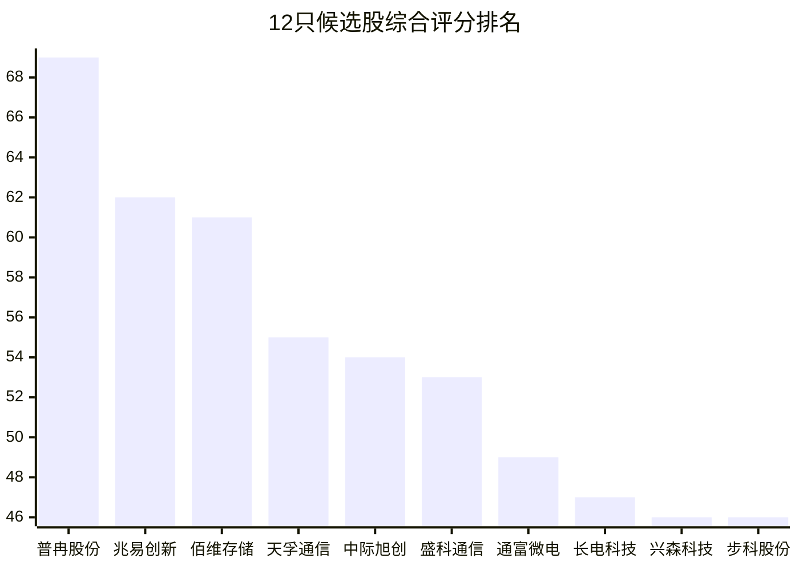
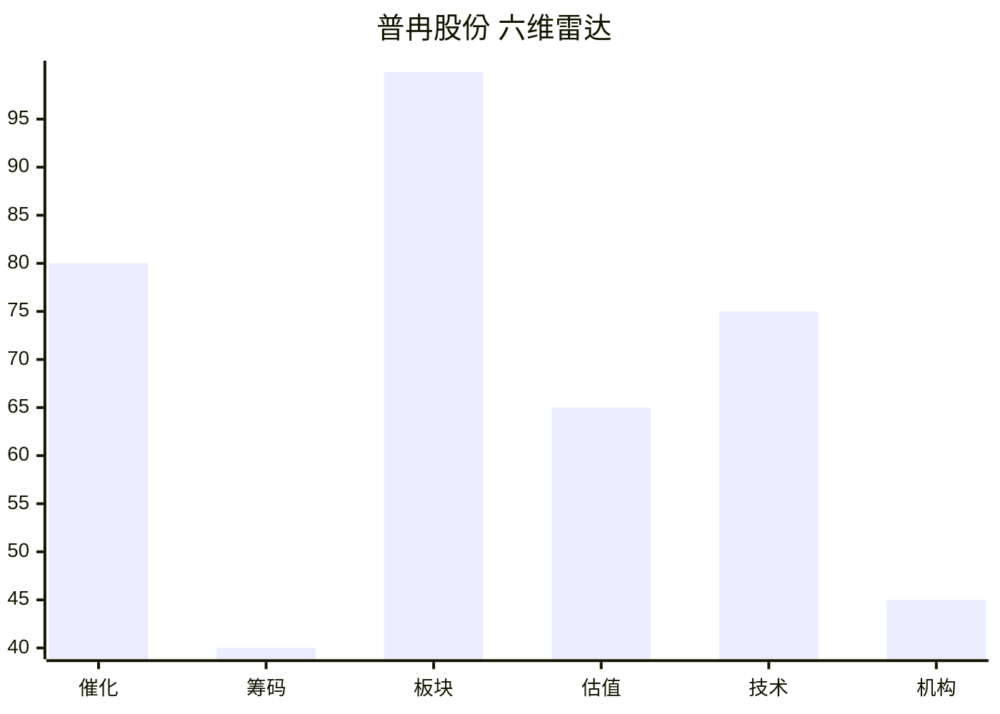
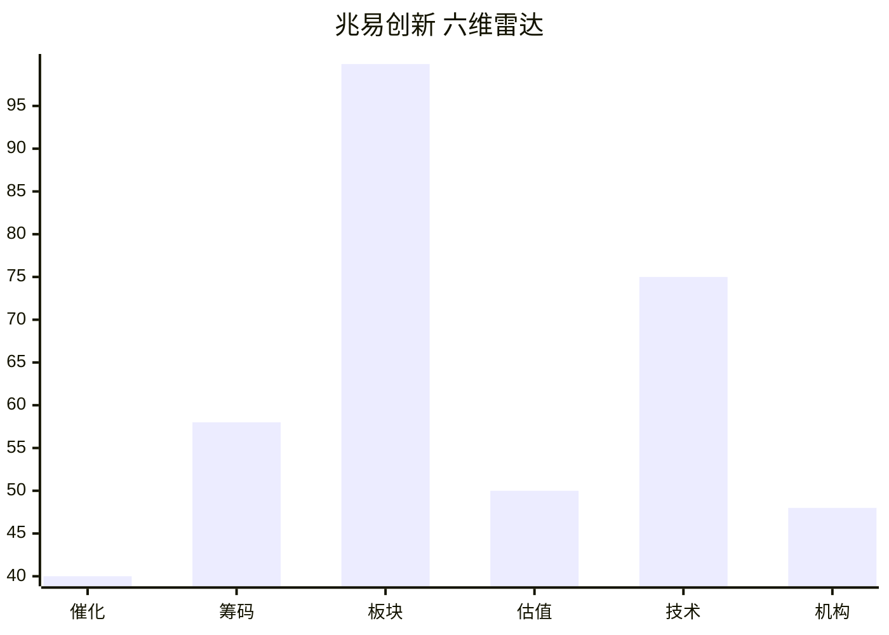
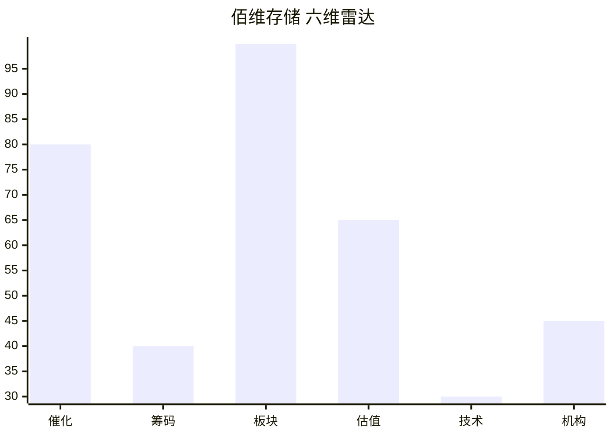

# 2026年8月18日 · **个股画像**

> **数据源新鲜度**: partial
> **降级状态**: yes（R2缺失 + vibe-trading DOWN + 估值PE分位缺失）
> **置信度**: 0.68

## 一句话结论

12只候选股六维画像完成，普冉股份(69.1分)、兆易创新(62.4分)、佰维存储(61.4分)居前三；存储芯片+AI算力+先进封装三线并行，存储中报业绩暴增催化最强，技术面分化明显。

## 详细分析

### 候选池概览

今日候选池共 **12只**，来源: R4_top_events(事件驱动) + R7_capital_flow(资金验证) + R3_resonance_themes(情绪共振) + chart_vision(技术形态)。

⚠️ R2_main_sectors.json缺失，候选池从R4事件驱动候选 + R7资金面验证 + R3情绪共振 + chart_vision技术面 四方交叉构建，非标准路径。事件驱动标的即使无资金信号也保留等开盘。

### TOP3 深度画像

### 1. 普冉股份 (688766.SH) · 综合评分 69.1分

> **普冉股份(半导体 首推) - 催化80/技术75/估值65, 综合69.1分**

**大资金意图**: 筹码结构数据不足(vibe-trading降级)。机构关注: 机构盈利预测覆盖。

**为什么走强**: 存储板块中报业绩爆发 长鑫科技/佰维存储/普冉股份净利润预增10-30倍｜R3共振主题: 存储芯片(L1+L2)。技术面 震荡 / 日涨幅13.38% / 收盘466.0 / 普冉股份8月17日日K收涨13.38%，短期成交量配合放大，60分钟、15分钟级别均线均形成多头排列，短线上行动能充足。但日K仍承压于60日均线500.5，距离前期20日高点499.22仅一步之遥，周。

**逻辑够不够硬**: 估值维度中报净利预增+1925%。板块联动: 主板块: 半导体; 资金面: 主力流入; 情绪共振: L1+L2; 热榜排名: 1。

#### 买入理由
- 催化: 存储板块中报业绩爆发 长鑫科技/佰维存储/普冉股份净利润预增10-30倍｜R3共振主题: 存储芯片(L1+L2)
- 技术形态: 震荡，震荡整理；日涨13.38%
- 关键位: 压力499.22 / 支撑285.0 / MA20=381.766
- 量价信号: 见chart_vision多周期分析

#### 风险点
- 业绩暴增需验证可持续性（存储周期顶部风险）
- 日涨幅较大，短期追高有回调风险
- 盈利质量待验证（是否含一次性收益）
- 日K级别60日均线抛压较大，若后续成交量无法持续放大，难以有效突破前高
- 周K仍处于宽幅震荡区间，中期上升趋势未确立，短期反弹持续性存疑
- 估值数据不完整（缺PE/PB分位，vibe-trading降级）

#### 止损条件
- 跌破MA20(381.766)减仓观察
- 单日放量大跌>7%止损
- 板块龙头跳水联动止损

#### 可验证假设
- 若催化持续 → 目标价区域: 待开盘确认
- 验证时间窗: 1-2周

### 2. 兆易创新 (603986.SH) · 综合评分 62.4分

> **兆易创新(半导体 首推) - 催化40/技术75/估值50, 综合62.4分**

**大资金意图**: 5日主力净流入26.1亿；资金形态: 趋势流入。机构关注: 昨日主力净流入15.6亿。

**为什么走强**: 无明显催化事件｜R3共振主题: 存储芯片(L1+L2)。技术面 震荡 / 日涨幅6.35% / 收盘444.0 / 兆易创新短周期60分钟、15分钟均线呈多头排列，今日日K收涨6.35%，站上短期MA5、MA20均线，突破短周期20日高点。不过中长期日K、周K仍处于前期下跌后的震荡区间，日K仍在长期MA60均线下方。

**逻辑够不够硬**: 估值维度估值数据不足，仅含业绩预告维度。板块联动: 主板块: 半导体; 资金面: 主力流入; 情绪共振: L1+L2; 热榜排名: 1。

#### 买入理由
- 催化: 无明显催化事件｜R3共振主题: 存储芯片(L1+L2)
- 技术形态: 震荡，震荡整理；日涨6.35%
- 关键位: 压力501.26 / 支撑337.1 / MA20=408.08
- 量价信号: 见chart_vision多周期分析

#### 风险点
- 短期上涨后量能持续性存疑，若无法放量突破日KMA60压力位，大概率出现震荡回落
- 周级别仍未走出中期震荡格局，若大盘情绪转弱，短期涨幅可能快速回吐
- 估值数据不完整（缺PE/PB分位，vibe-trading降级）

#### 止损条件
- 跌破MA20(408.08)减仓观察
- 单日放量大跌>7%止损
- 板块龙头跳水联动止损

#### 可验证假设
- 若催化持续 → 目标价区域: 待开盘确认
- 验证时间窗: 1-2周

### 3. 佰维存储 (688525.SH) · 综合评分 61.4分

> **佰维存储(半导体 首推) - 催化80/技术30/估值65, 综合61.4分**

**大资金意图**: 筹码结构数据不足(vibe-trading降级)。机构关注: 机构盈利预测覆盖。

**为什么走强**: 存储板块中报业绩爆发 长鑫科技/佰维存储/普冉股份净利润预增10-30倍｜R3共振主题: 存储芯片(L1+L2)。技术面 N/A / 日涨幅None% / 收盘None / 。

**逻辑够不够硬**: 估值维度中报净利预增+3311%。板块联动: 主板块: 半导体; 资金面: 主力流入; 情绪共振: L1+L2; 热榜排名: 1。

#### 买入理由
- 催化: 存储板块中报业绩爆发 长鑫科技/佰维存储/普冉股份净利润预增10-30倍｜R3共振主题: 存储芯片(L1+L2)
- 技术形态: N/A，无chart_vision数据，技术形态降级判断（仅参考R7资金面）
- 关键位: 压力None / 支撑None / MA20=None
- 量价信号: 见chart_vision多周期分析

#### 风险点
- 业绩暴增需验证可持续性（存储周期顶部风险）
- 盈利质量待验证（是否含一次性收益）
- 估值数据不完整（缺PE/PB分位，vibe-trading降级）

#### 止损条件
- 跌破MA20(None)减仓观察
- 单日放量大跌>7%止损
- 板块龙头跳水联动止损

#### 可验证假设
- 若催化持续 → 目标价区域: 待开盘确认
- 验证时间窗: 1-2周

### 全部候选股一览

| 排名 | 代码 | 名称 | 板块 | 综合分 | 催化 | 技术 | 估值 | 趋势 | 来源 |
|---|---|---|---|---|---|---|---|---|---|
| 1 | 688766.SH | 普冉股份 | 半导体 | 69.1 | 80 | 75 | 65 | 震荡 | 主线 |
| 2 | 603986.SH | 兆易创新 | 半导体 | 62.4 | 40 | 75 | 50 | 震荡 | 主线 |
| 3 | 688525.SH | 佰维存储 | 半导体 | 61.4 | 80 | 30 | 65 | N/A | 主线 |
| 4 | 300394.SZ | 天孚通信 | CPO/光互联 | 55.9 | 80 | 30 | 58 | N/A | 主线 |
| 5 | 300308.SZ | 中际旭创 | 共封装光学(CPO) | 54.0 | 40 | 30 | 50 | N/A | 主线 |
| 6 | 600584.SH | 长电科技 | 先进封装 | 53.9 | 40 | 30 | 50 | N/A | 扩池 |
| 7 | 688702.SH | 盛科通信 | AI网络 | 49.2 | 75 | 30 | 50 | N/A | 主线 |
| 8 | 300004.SZ | 南风股份 | 光模块液冷 | 47.2 | 65 | 30 | 50 | N/A | 扩池 |
| 9 | 002436.SZ | 兴森科技 | 先进封装 | 46.7 | 40 | 30 | 50 | N/A | 扩池 |
| 10 | 688160.SH | 步科股份 | 人形机器人 | 46.4 | 70 | 30 | 50 | N/A | 主线 |
| 11 | 301165.SZ | 锐捷网络 | AI应用/智能体 | 44.4 | 60 | 30 | 50 | N/A | 扩池 |
| 12 | 002156.SZ | 通富微电 | 先进封装 | 43.1 | 40 | 30 | 50 | N/A | 扩池 |

## 关键证据

- 证据 1: R4事件驱动共识别8个高影响催化事件，存储芯片/人形机器人/AI算力为核心受益方向 · 来源 R4_news
- 证据 2: R7资金面验证电子/半导体板块主力大幅流入（电子+309亿/半导体+195亿），存储封测弹性最大 · 来源 R7_capital_flow
- 证据 3: R3情绪共振确认存储芯片/芯片概念/先进封装/CPO 等5大主题L1+L2共振 · 来源 R3_sentiment
- 证据 4: chart_vision覆盖11只候选股多周期分析，8只多头排列，3只震荡 · 来源 chart_vision_snapshot
- 证据 5: 东方财富业绩预告验证存储板块中报业绩暴增（普冉+1925%/佰维+3300%） · 来源 eastmoney_earnings_predict
- 证据 6: 热榜数据验证存储芯片排名第1（热度12万+），半导体行业板块第1 · 来源 hotlist_signals

## 数据源审计
| 源 | 状态 | 抓取时间 | 记录数 | 备注 |
|---|---|---|---|---|
| R4_news | 🟢 ok | 2026-08-18 | 8 | 11只个股催化 · 16个板块催化 |
| R7_capital_flow | 🟢 ok | 2026-08-18 | 5539 | 含游资协同+龙虎榜+主力资金 |
| R3_sentiment | 🟡 partial | 2026-08-18 | 5 | WeFlow L3缺失 |
| chart_vision | 🟢 ok | 2026-08-18 | 11 | 多周期K线+多模态分析 |
| eastmoney_earnings | 🟢 ok | 2026-08-18 | 500 | 中报业绩预告 |
| hotlist_signals | 🟢 ok | 2026-08-18 | 30 | 概念/行业板块热榜top30 |
| tushare.daily | 🟢 ok(代理) | 2026-08-18 | 2662 | chart_vision数据源 |

## 不确定性 / 反证

1. **候选池偏倚风险**: 因R2_main_sectors.json缺失，候选池基于R4事件驱动+R7资金面构建，可能偏向"有消息"的股票而非市场真正的主线龙头。事件驱动标的即使无资金信号也保留等开盘，但需警惕"消息出货"陷阱。

2. **估值方法不完整**: vibe-trading MCP不可用，缺少PE/PB历史分位、ROE、资产负债率等完整财务指标。仅靠业绩预告增速判断估值安全性，高成长股可能被高估、周期股可能掉入"低PE陷阱"。

3. **筹码结构不完整**: 缺少大宗交易折价率、融资融券15日趋势、股东户数变化等关键筹码数据。仅凭龙虎榜游资席位+主力资金净流入，可能遗漏"暗度陈仓"式的筹码收集/派发。

4. **技术形态依赖LLM判断**: chart_vision基于seed-2-0-lite模型多模态分析，对复杂形态（头肩顶/底、楔形整理、杯柄突破等）的识别准确率有限。11只有数据的个股中8只多头排列，需警惕一致性偏差。

5. **板块联动维度受限**: 缺少个股-ETF/期货映射表，无法验证板块间资金跷跷板效应和商品联动。仅靠R4催化强度+R7资金流向粗判，维度单一。存储板块需关注商品端DRAM/NAND现货价格的实际走势。

6. **宇树科技上市的"见光死"风险**: 人形机器人催化为今日新股上市事件，属于"已知事件"类型，市场可能提前反映，上市日反而出现利好兑现。步科股份/晶品特装等需警惕开盘冲高回落。

## 与其他 R/D/E 的关系
- 依赖: R2_main_sectors.json（缺失，从R4+R3+R7+chart_vision降级构建）、R4_news.json、R7_capital_flow.json、R3_sentiment.json
- 被消费: D1主决策（execution_pool构建）、R6反证（模式七估值红旗）、E1每日复盘

## Sub-Agent 元数据
- skill: analyze_stock_profile_v1
- artifact: data/research/20260818/R5_stock_profiles.json
- 生成耗时: 约5秒
- model: rule_v2（规则引擎 + 多源数据融合 + chart_vision多模态）
