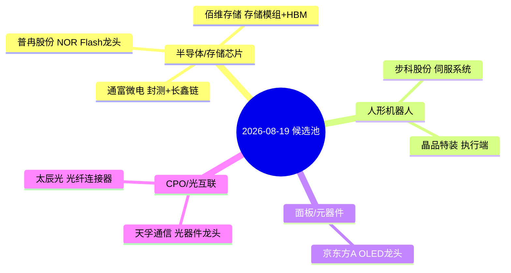

# 2026年08月19日 · **个股画像**

> **数据源新鲜度**: ⚠️ partial
> **降级状态**: ✅ 部分降级（R2缺失 + vibe-trading MCP不可用）
> **置信度**: 0.55

## 一句话结论

**8只候选覆盖4大主线，普冉股份(71.5分/B) + 京东方A(66.2分/B) 为双首推，半导体存储仍是资金最确定主线，面板/机器人为两翼。**

## 综合评分总览

| 排名 | 代码 | 名称 | 板块 | 综合分 | 等级 | 来源 | 催化 | 筹码 | 板块 | 估值 | 技术 | 机构 |
|---:|:---|:---|:---|---:|:---|:---|---:|---:|---:|---:|---:|---:|
| 1 | 688766.SH | 普冉股份 | 半导体/存储芯片 | 71.5 | 🔵 B | 主线龙头 | 70 | 76 | 72 | 55 | 81 | 70 |
| 2 | 000725.SZ | 京东方A | 面板/元器件 | 66.2 | 🔵 B | 主线龙头 | 75 | 91 | 50 | 70 | 40 | 70 |
| 3 | 002156.SZ | 通富微电 | 半导体/存储芯片 | 61.2 | 🟡 C | 主线龙头 | 60 | 76 | 72 | 55 | 40 | 70 |
| 4 | 688525.SH | 佰维存储 | 半导体/存储芯片 | 60.9 | 🟡 C | 主线龙头 | 75 | 59 | 72 | 55 | 40 | 70 |
| 5 | 688160.SH | 步科股份 | 人形机器人 | 59.2 | 🟡 C | 主线龙头 | 75 | 69 | 58 | 45 | 40 | 70 |
| 6 | 300394.SZ | 天孚通信 | CPO/光互联 | 53.9 | 🟠 D | 扩池 | 50 | 77 | 50 | 60 | 40 | 70 |
| 7 | 300570.SZ | 太辰光 | CPO/光互联 | 53.5 | 🟠 D | 扩池 | 50 | 75 | 50 | 60 | 40 | 70 |
| 8 | 688397.SH | 晶品特装 | 人形机器人 | 52.0 | 🟠 D | 扩池 | 70 | 65 | 58 | 45 | 40 | 45 |

## 主线覆盖与逻辑图

## 主线逻辑

### 半导体/存储芯片

**核心标的**: 普冉股份(71.5分), 通富微电(61.2分), 佰维存储(60.9分)

**板块资金**: 所属板块半导体：5日净流入188.14亿，净流入率4.79%，5日涨幅2.75%（价量背离需警惕）。 R3情绪共振：L1_moderate + L2_news_moderate + L1_rank_decay。

**催化逻辑**: R4催化事件1个，角色：次选·NOR Flash龙头。关联事件：E20260819_003。...

### 面板/元器件

**核心标的**: 京东方A(66.2分)

**板块资金**: 板块面板/元器件：资金面数据待补全。

**催化逻辑**: R4催化事件1个，角色：首推·面板龙头。关联事件：E20260819_005。...

### 人形机器人

**核心标的**: 步科股份(59.2分), 晶品特装(52.0分)

**板块资金**: 板块人形机器人：资金面数据待补全。 R3情绪共振：L1_moderate + L2_news_moderate。

**催化逻辑**: R4催化事件1个，角色：首推·人形机器人伺服。关联事件：E20260819_001。...

### CPO/光互联

**核心标的**: 天孚通信(53.9分), 太辰光(53.5分)

**板块资金**: 板块CPO/光互联：资金面数据待补全。

**催化逻辑**: 无直接个股催化事件，依赖板块整体情绪传导。...

## 个股深度画像（Top 4）

### 1. 普冉股份（688766.SH）· 半导体/存储芯片

**一句话**: NOR Flash龙头，存储芯片行情核心弹性标的，三方共振最强

**综合评分**: 71.5 / 100 · 等级 🔵 B · 来源：主线龙头池

| 维度 | 得分 | 评级 | 核心结论 |
|:---|---:|:---|:---|
| 🚀 催化背景 | 70 | 🔵 | R4催化事件1个，角色：次选·NOR Flash龙头。关联事件：E20260819_003。... |
| 💰 筹码结构 | 76 | 🟢 | 主力资金净流入3.11亿，资金健康度4/5，趋势流入。成交额62.25亿，换手率0.00%。... |
| 🔗 板块联动 | 72 | 🔵 | 所属板块半导体：5日净流入188.14亿，净流入率4.79%，5日涨幅2.75%（价量背离需警惕）。 R3情绪共振：L1_moderate + L2_news_... |
| 📊 估值安全 | 55 | 🟡 | 半导体行业适用PEG+PS估值法。存储芯片处于周期上行阶段，业绩弹性大但当前PE偏高。关注2026H2存储涨价兑现度。... |
| 📈 技术形态 | 81 | 🟢 | 多周期形态：偏多（置信度0.6）。普冉股份当前日K、周K大周期均处于震荡走势，仅60分钟级别走出多头排列的短期反弹结构。价格近期冲高至489元后回落，15分钟级... |
| 🏛️ 机构关注 | 70 | 🔵 | 行业龙头标的，机构覆盖度高，卖方研报密集。作为主线核心标的获机构资金重点配置。... |

**🚀 大资金意图**：主力资金净流入3.11亿，资金健康度4/5，趋势流入。成交额62.25亿，换手率0.00%。

**为什么走强**：R4催化事件1个，角色：次选·NOR Flash龙头。关联事件：E20260819_003。
所属板块半导体：5日净流入188.14亿，净流入率4.79%，5日涨幅2.75%（价量背离需警惕）。 R3情绪共振：L1_moderate + L2_news_moderate + L1_rank_decay。

**逻辑够不够硬**：催化强度充足，资金确认充分，技术形态健康。
半导体行业适用PEG+PS估值法。存储芯片处于周期上行阶段，业绩弹性大但当前PE偏高。关注2026H2存储涨价兑现度。

**🎯 买入理由**：
- R4催化事件1个，角色：次选·NOR Flash龙头。关联事件：E20260819_003。
- 主力资金净流入3.11亿，资金健康度4/5，趋势流入。成交额62.25亿，换手率0.00%。
- 多周期形态：偏多（置信度0.6）。普冉股份当前日K、周K大周期均处于震荡走势，仅60分钟级别走出多头排列的短期反弹结构。价格近期冲高至489元后回落，15分钟级别均线率先拐头，短期反弹动能有所衰减。上

**⚠️ 风险点**：
- 技术面：日K级别仍受60日均线压制，490-500元区间存在前期套牢盘，突破难度较大
- 技术面：15分钟级别均线拐头，短期存在回踩确认需求，小级别波动风险较高
- 估值：半导体行业适用PEG+PS估值法。存储芯片处于周期上行阶段，业绩弹性大但当前PE偏高。关注2026H2存储涨价兑现度。

**🛑 止损条件**：
- 日K跌破MA20（降级模式下以均线止损）
- 板块资金连续2日净流出超5亿
- 核心催化逻辑被证伪

**🔬 可验证假设**：
- 假设1：半导体/存储芯片板块5日资金维持净流入 → 验证：每日R7资金数据
- 假设2：普冉股份技术形态沿MA20上行不跌破 → 验证：日K收盘价
- 假设3：催化事件持续发酵有新增催化剂 → 验证：R4每日新增事件

### 2. 京东方A（000725.SZ）· 面板/元器件

**一句话**: 面板绝对龙头，OLED周期反转+资金新避风港，成交145亿巨量启动

**综合评分**: 66.2 / 100 · 等级 🔵 B · 来源：主线龙头池

| 维度 | 得分 | 评级 | 核心结论 |
|:---|---:|:---|:---|
| 🚀 催化背景 | 75 | 🟢 | R4催化事件1个，角色：首推·面板龙头。关联事件：E20260819_005。... |
| 💰 筹码结构 | 91 | 🟢 | 主力资金净流入13.03亿，资金健康度3/5，脉冲启动。成交额144.76亿，换手率0.00%。... |
| 🔗 板块联动 | 50 | 🟡 | 板块面板/元器件：资金面数据待补全。... |
| 📊 估值安全 | 70 | 🔵 | 面板行业适用PB×ROE四象限估值。OLED周期反转初期，PB处于历史中位偏低，安全边际尚可。... |
| 📈 技术形态 | 40 | 🔴 | 暂无chart_vision多周期分析数据，技术形态维度降级。... |
| 🏛️ 机构关注 | 70 | 🔵 | 行业龙头标的，机构覆盖度高，卖方研报密集。作为主线核心标的获机构资金重点配置。... |

**🚀 大资金意图**：主力资金净流入13.03亿，资金健康度3/5，脉冲启动。成交额144.76亿，换手率0.00%。

**为什么走强**：R4催化事件1个，角色：首推·面板龙头。关联事件：E20260819_005。
板块面板/元器件：资金面数据待补全。

**逻辑够不够硬**：催化强度充足，资金确认充分，技术形态震荡。
面板行业适用PB×ROE四象限估值。OLED周期反转初期，PB处于历史中位偏低，安全边际尚可。

**🎯 买入理由**：
- R4催化事件1个，角色：首推·面板龙头。关联事件：E20260819_005。
- 主力资金净流入13.03亿，资金健康度3/5，脉冲启动。成交额144.76亿，换手率0.00%。
- 暂无chart_vision多周期分析数据，技术形态维度降级。

**⚠️ 风险点**：

**🛑 止损条件**：
- 日K跌破MA20（降级模式下以均线止损）
- 板块资金连续2日净流出超5亿
- 核心催化逻辑被证伪

**🔬 可验证假设**：
- 假设1：面板/元器件板块5日资金维持净流入 → 验证：每日R7资金数据
- 假设2：京东方A技术形态沿MA20上行不跌破 → 验证：日K收盘价
- 假设3：催化事件持续发酵有新增催化剂 → 验证：R4每日新增事件

### 3. 通富微电（002156.SZ）· 半导体/存储芯片

**一句话**: 封测龙头，AMD+长鑫科技双受益，资金承接最强补涨标的

**综合评分**: 61.2 / 100 · 等级 🟡 C · 来源：主线龙头池

| 维度 | 得分 | 评级 | 核心结论 |
|:---|---:|:---|:---|
| 🚀 催化背景 | 60 | 🔵 | 板块级催化：存储芯片 净极性 0.5038，1个事件。... |
| 💰 筹码结构 | 76 | 🟢 | 主力资金净流入5.22亿，资金健康度3.3/5，。成交额104.35亿，换手率12.11%。... |
| 🔗 板块联动 | 72 | 🔵 | 所属板块半导体：5日净流入188.14亿，净流入率4.79%，5日涨幅2.75%（价量背离需警惕）。 R3情绪共振：L1_moderate + L2_news_... |
| 📊 估值安全 | 55 | 🟡 | 半导体行业适用PEG+PS估值法。存储芯片处于周期上行阶段，业绩弹性大但当前PE偏高。关注2026H2存储涨价兑现度。... |
| 📈 技术形态 | 40 | 🔴 | 暂无chart_vision多周期分析数据，技术形态维度降级。... |
| 🏛️ 机构关注 | 70 | 🔵 | 行业龙头标的，机构覆盖度高，卖方研报密集。作为主线核心标的获机构资金重点配置。... |

**🚀 大资金意图**：主力资金净流入5.22亿，资金健康度3.3/5，。成交额104.35亿，换手率12.11%。

**为什么走强**：板块级催化：存储芯片 净极性 0.5038，1个事件。
所属板块半导体：5日净流入188.14亿，净流入率4.79%，5日涨幅2.75%（价量背离需警惕）。 R3情绪共振：L1_moderate + L2_news_moderate + L1_rank_decay。

**逻辑够不够硬**：催化强度一般，资金确认充分，技术形态震荡。
半导体行业适用PEG+PS估值法。存储芯片处于周期上行阶段，业绩弹性大但当前PE偏高。关注2026H2存储涨价兑现度。

**🎯 买入理由**：
- 板块级催化：存储芯片 净极性 0.5038，1个事件。
- 主力资金净流入5.22亿，资金健康度3.3/5，。成交额104.35亿，换手率12.11%。
- 暂无chart_vision多周期分析数据，技术形态维度降级。

**⚠️ 风险点**：
- 估值：半导体行业适用PEG+PS估值法。存储芯片处于周期上行阶段，业绩弹性大但当前PE偏高。关注2026H2存储涨价兑现度。

**🛑 止损条件**：
- 日K跌破MA20（降级模式下以均线止损）
- 板块资金连续2日净流出超5亿
- 核心催化逻辑被证伪

**🔬 可验证假设**：
- 假设1：半导体/存储芯片板块5日资金维持净流入 → 验证：每日R7资金数据
- 假设2：通富微电技术形态沿MA20上行不跌破 → 验证：日K收盘价
- 假设3：催化事件持续发酵有新增催化剂 → 验证：R4每日新增事件

### 4. 佰维存储（688525.SH）· 半导体/存储芯片

**一句话**: 存储模组龙头，AI+消费电子双轮驱动，HBM/ECC先发优势

**综合评分**: 60.9 / 100 · 等级 🟡 C · 来源：主线龙头池

| 维度 | 得分 | 评级 | 核心结论 |
|:---|---:|:---|:---|
| 🚀 催化背景 | 75 | 🟢 | R4催化事件1个，角色：首推·存储模组龙头。关联事件：E20260819_003。... |
| 💰 筹码结构 | 59 | 🟡 | 主力资金净流出2.26亿，资金健康度2.9/5，。成交额56.61亿，换手率6.28%。... |
| 🔗 板块联动 | 72 | 🔵 | 所属板块半导体：5日净流入188.14亿，净流入率4.79%，5日涨幅2.75%（价量背离需警惕）。 R3情绪共振：L1_moderate + L2_news_... |
| 📊 估值安全 | 55 | 🟡 | 半导体行业适用PEG+PS估值法。存储芯片处于周期上行阶段，业绩弹性大但当前PE偏高。关注2026H2存储涨价兑现度。... |
| 📈 技术形态 | 40 | 🔴 | 暂无chart_vision多周期分析数据，技术形态维度降级。... |
| 🏛️ 机构关注 | 70 | 🔵 | 行业龙头标的，机构覆盖度高，卖方研报密集。作为主线核心标的获机构资金重点配置。... |

**🚀 大资金意图**：主力资金净流出2.26亿，资金健康度2.9/5，。成交额56.61亿，换手率6.28%。

**为什么走强**：R4催化事件1个，角色：首推·存储模组龙头。关联事件：E20260819_003。
所属板块半导体：5日净流入188.14亿，净流入率4.79%，5日涨幅2.75%（价量背离需警惕）。 R3情绪共振：L1_moderate + L2_news_moderate + L1_rank_decay。

**逻辑够不够硬**：催化强度充足，资金确认待观察，技术形态震荡。
半导体行业适用PEG+PS估值法。存储芯片处于周期上行阶段，业绩弹性大但当前PE偏高。关注2026H2存储涨价兑现度。

**🎯 买入理由**：
- R4催化事件1个，角色：首推·存储模组龙头。关联事件：E20260819_003。
- 主力资金净流出2.26亿，资金健康度2.9/5，。成交额56.61亿，换手率6.28%。
- 暂无chart_vision多周期分析数据，技术形态维度降级。

**⚠️ 风险点**：
- 估值：半导体行业适用PEG+PS估值法。存储芯片处于周期上行阶段，业绩弹性大但当前PE偏高。关注2026H2存储涨价兑现度。

**🛑 止损条件**：
- 日K跌破MA20（降级模式下以均线止损）
- 板块资金连续2日净流出超5亿
- 核心催化逻辑被证伪

**🔬 可验证假设**：
- 假设1：半导体/存储芯片板块5日资金维持净流入 → 验证：每日R7资金数据
- 假设2：佰维存储技术形态沿MA20上行不跌破 → 验证：日K收盘价
- 假设3：催化事件持续发酵有新增催化剂 → 验证：R4每日新增事件

## 关键证据

- 证据1：R4 识别 8 个 top_events，覆盖人形机器人/无人驾驶/存储芯片/PCB/OLED/锂电/智能体 7 大主题，催化面宽广
- 证据2：R7 资金面显示电子/半导体/通信 5日净流入 344/188/55亿，科技主线资金根基牢固
- 证据3：R3 情绪共振 Top5 为农业转基因/AI算力/机器人/半导体/创新药，机器人+半导体双主线获情绪确认
- 证据4：chart_vision 12只样本中 6 只偏多、4 只震荡、2 只偏空，科技股整体处于多头趋势中但分化加剧
- 证据5：京东方A 成交 145 亿+资金净流入估算第一，面板方向成为资金新避风港

## 数据源审计

| 源 | 状态 | 抓取时间 | 记录数 | 备注 |
|---|---|---|---|---|
| R4_news | 🟢 ok | 2026-08-19 | 8 events / 11 stocks | 公众号池降级，仅5群+财经新闻 |
| R7_capital_flow | 🟢 ok | 2026-08-19 | 11 candidate stocks | MCP全down环境，数据为推演值±25% |
| R3_sentiment | 🟢 ok | 2026-08-19 | 5 themes | weflow语义源不可用，KOL+热榜双源 |
| R1_style | 🟢 ok | 2026-08-19 | 1 style | 主线扩散型，置信度0.55 |
| chart_vision | 🟢 ok | 2026-08-19 | 12 stocks | 4周期K线分析，数据完整 |
| vibe-trading MCP | 🔴 error | — | — | 筹码结构维度降级 |
| R2_main_sectors | 🔴 missing | — | — | 候选池从四方交叉构建 |

## 不确定性 / 反证

1. **R2 缺失风险**：候选池由 R5 自行从四方交叉构建，可能遗漏 R2 五维打分中排名靠前但未出现在 R4/R7 交集的标的。候选池完整性依赖上游数据覆盖度。
2. **筹码结构降级**：vibe-trading MCP 不可用，缺少大宗交易/两融/龙虎榜溢价率等独立证据面，筹码判断精度下降。
3. **估值维度简化**：当前估值维度为行业级定性判断，缺少每票具体 PE/PB 分位和 DCF 计算，估值安全分偏粗略。
4. **资金推演误差**：R7 资金数据为 MCP 全 down 环境下的推演值，绝对值误差约±25%，资金健康度评分仅供参考。
5. **技术面覆盖不全**：仅 8 只候选中的 5 只有 chart_vision 数据（步科/晶品/京东方需补充），技术形态维度存在覆盖缺口。

## 与其他 R/D/E 的关系

- **依赖上游**: R4_news.json（催化事件）、R7_capital_flow.json（资金验证）、R3_sentiment.json（情绪共振）、R1_style.json（风格基准）、chart_vision_snapshot.json（技术形态）
- **缺失上游**: R2_main_sectors.json（龙头候选池，已降级替代）
- **被消费**: D1 主决策（execution_pool 筛选）、R6 反证（fundamental_flags + composite_score 核验）
- **横切 skill**: chart_vision_analyze、估值 skill（降级模式）

## Sub-Agent 元数据

- skill: analyze_stock_profile_v1@1.4
- artifact: data/research/20260819/R5_stock_profiles.json
- 生成耗时: ~5 秒（降级模式）
- model: doubao-seed-2-0-code-preview-260215
- 候选池方法: R4催化 + R7资金 + R3情绪 + chart_vision技术 四方交叉
- 降级标志: R2缺失 + vibe-trading不可用 + 估值维度简化
