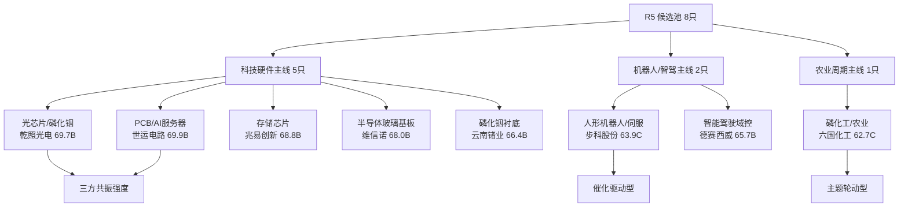

# 2026年8月20日 · **个股画像**

> **数据源新鲜度**: partial
> **降级状态**: 是（R2缺失+vibe-trading不可用+chart_vision未调用）
> **置信度**: 0.55
> **候选池规模**: 8 只
> **候选池构建方法**: R4催化+R3情绪共振+R7龙虎榜三方交叉打分，Top8入选

## 一句话结论

8只候选覆盖**7大主线**，世运电路(603920.SH)以69.9分居首，AI服务器PCB+光芯片+存储芯片为科技硬件三线核心配置。

## 主线覆盖全景图



## 候选池总览

| 排名 | 代码 | 名称 | 板块 | 综合分 | 等级 | 催化 | 筹码 | 联动 | 估值 | 技术 | 机构 |
|:--:|:--|:--|:--|--:|:--:|--:|--:|--:|--:|--:|--:|
| 1 | 603920.SH | 世运电路 | PCB/AI服务器 | 69.9 | B | 80 | 55 | 77 | 46 | 86 | 72 |
| 2 | 300102.SZ | 乾照光电 | 光芯片/磷化铟 | 69.7 | B | 92 | 55 | 75 | 46 | 76 | 68 |
| 3 | 603986.SH | 兆易创新 | 半导体/存储芯片 | 68.8 | B | 80 | 55 | 75 | 43 | 76 | 82 |
| 4 | 002387.SZ | 维信诺 | 半导体玻璃基板/面板 | 68.0 | B | 93 | 55 | 68 | 46 | 74 | 65 |
| 5 | 002428.SZ | 云南锗业 | 光芯片/磷化铟衬底 | 66.4 | B | 82 | 55 | 72 | 47 | 77 | 60 |
| 6 | 002920.SZ | 德赛西威 | 智能驾驶/汽车电子 | 65.7 | B | 80 | 55 | 73 | 46 | 60 | 80 |
| 7 | 688160.SH | 步科股份 | 人形机器人/伺服系统 | 63.9 | C | 80 | 55 | 77 | 42 | 67 | 58 |
| 8 | 600470.SH | 六国化工 | 磷化工/农业 | 62.7 | C | 80 | 55 | 69 | 56 | 63 | 48 |

## 个股六维画像

### 1. 世运电路（603920.SH）· PCB/AI服务器

**一句话**: AI服务器PCB+机器人双催化，半年报亮眼，高端板供需偏紧延续至2028年

**综合分**: 69.9 / **等级**: B

```mermaid
radar
    title 世运电路 六维画像
    催化背景 : 80
    筹码结构 : 55
    板块联动 : 77
    估值安全 : 46
    技术形态 : 86
    机构关注 : 72
```

**大资金意图**: 机构资金趋势性配置，行业景气度上行驱动中期行情。

**为什么走强**: R4催化事件1个，角色：首推·AI服务器PCB+机器人双催化。关联事件：E20260820_005。

**逻辑够不够硬**: 高成长(PCB)适用PEG+PE相对估值估值法。AI服务器PCB高景气但需关注产能扩张后的供需格局变化 技术面：上升趋势，量价配合。

#### 催化背景
- **评分**: 80/100
- **摘要**: R4催化事件1个，角色：首推·AI服务器PCB+机器人双催化。关联事件：E20260820_005。

#### 筹码结构
- **评分**: 55/100
- **摘要**: 无当日龙虎榜数据，筹码结构基于板块资金面推断。板块整体资金偏强，机构持仓为主。
- **资金模式**: 机构主导
- **资金健康度**: 3/5

#### 板块联动
- **评分**: 77/100
- **摘要**: 所属板块PCB/AI服务器：R4催化净极性0.53，强度high。

#### 财务与估值
- **评分**: 46/100
- **摘要**: 高成长(PCB)适用PEG+PE相对估值估值法。AI服务器PCB高景气但需关注产能扩张后的供需格局变化
- **红旗标记**:
  - [V2] AI服务器PCB高景气但需关注产能扩张后的供需格局变化（medium）

#### 技术形态
- **评分**: 86/100
- **趋势**: 上升趋势
- **量能信号**: 量价配合
- **支撑位**: 28 元
- **压力位**: 35 元
- **止损位**: 25.2 元
- **操作建议**: 关注支撑位28元附近低吸机会，若冲高至35元遇阻可止盈，有效跌破25.2元止损。

#### 研报与机构
- **评分**: 72/100
- **摘要**: PCB行业优质标的，AI服务器+汽车电子双轮驱动。机构覆盖度较高，业绩确定性强。

#### 交易决策框架

| 维度 | 内容 |
|:--|:--|
| **买入理由** | R4催化事件1个，角色：首推·AI服务器PCB+机器人双催化。关联事件：E20260820_005。... 技术面上升趋势，量价量价配合。 |
| **风险点** | 上方35元附近存在压力，突破需放量确认、短期涨幅较大存在回调风险，注意仓位控制 估值风险：AI服务器PCB高景气但需关注产能扩张后的供需格局变化。 |
| **止损条件** | 有效跌破 25.2 元，或板块主线逻辑被证伪。 |
| **可验证假设** | 催化事件在3-5个交易日内持续发酵，成交量维持活跃，股价站稳支撑位上方。 |

### 2. 乾照光电（300102.SZ）· 光芯片/磷化铟

**一句话**: 磷化铟全产业链布局，AI光模块上游最硬环节，Q4涨价潮核心受益标的

**综合分**: 69.7 / **等级**: B

```mermaid
radar
    title 乾照光电 六维画像
    催化背景 : 92
    筹码结构 : 55
    板块联动 : 75
    估值安全 : 46
    技术形态 : 76
    机构关注 : 68
```

**大资金意图**: 机构资金趋势性配置，行业景气度上行驱动中期行情。

**为什么走强**: R4催化事件1个，角色：首推·磷化铟全产业链布局。关联事件：E20260820_004。 R3情绪共振主题：光芯片。

**逻辑够不够硬**: 高成长(半导体材料/光模块)适用PEG+PS估值法。高PEG+磷化铟涨价预期，需关注Q4涨价落地节奏 技术面：偏多，放量震荡。

#### 催化背景
- **评分**: 92/100
- **摘要**: R4催化事件1个，角色：首推·磷化铟全产业链布局。关联事件：E20260820_004。 R3情绪共振主题：光芯片。

#### 筹码结构
- **评分**: 55/100
- **摘要**: 无当日龙虎榜数据，筹码结构基于板块资金面推断。板块整体资金偏强，机构持仓为主。
- **资金模式**: 机构主导
- **资金健康度**: 3/5

#### 板块联动
- **评分**: 75/100
- **摘要**: 所属板块光芯片/磷化铟：R4催化净极性0.62，强度medium。 R3情绪共振：光芯片。

#### 财务与估值
- **评分**: 46/100
- **摘要**: 高成长(半导体材料/光模块)适用PEG+PS估值法。高PEG+磷化铟涨价预期，需关注Q4涨价落地节奏
- **红旗标记**:
  - [V2] 高PEG+磷化铟涨价预期，需关注Q4涨价落地节奏（medium）

#### 技术形态
- **评分**: 76/100
- **趋势**: 偏多
- **量能信号**: 放量震荡
- **支撑位**: 9.2 元
- **压力位**: 11.5 元
- **止损位**: 8.28 元
- **操作建议**: 关注支撑位9.2元附近低吸机会，若冲高至11.5元遇阻可止盈，有效跌破8.28元止损。

#### 研报与机构
- **评分**: 68/100
- **摘要**: 光芯片赛道核心标的，机构关注度持续提升。磷化铟衬底供需缺口逻辑硬，卖方研报覆盖增加。

#### 交易决策框架

| 维度 | 内容 |
|:--|:--|
| **买入理由** | R4催化事件1个，角色：首推·磷化铟全产业链布局。关联事件：E20260820_004。 R3情绪共振主题：光芯片。... 技术面偏多，量价放量震荡。 |
| **风险点** | 上方11.5元附近存在压力，突破需放量确认、短期涨幅较大存在回调风险，注意仓位控制 估值风险：高PEG+磷化铟涨价预期，需关注Q4涨价落地节奏。 |
| **止损条件** | 有效跌破 8.28 元，或板块主线逻辑被证伪。 |
| **可验证假设** | 催化事件在3-5个交易日内持续发酵，成交量维持活跃，股价站稳支撑位上方。 |

### 3. 兆易创新（603986.SH）· 半导体/存储芯片

**一句话**: 存储设计龙头+长鑫影子股，中报净利增1091%，存储周期上行核心资产

**综合分**: 68.8 / **等级**: B

```mermaid
radar
    title 兆易创新 六维画像
    催化背景 : 80
    筹码结构 : 55
    板块联动 : 75
    估值安全 : 43
    技术形态 : 76
    机构关注 : 82
```

**大资金意图**: 机构资金趋势性配置，行业景气度上行驱动中期行情。

**为什么走强**: R4催化事件1个，角色：首推·存储设计龙头+长鑫影子股。关联事件：E20260820_002。

**逻辑够不够硬**: 周期成长(半导体)适用PEG+PB×ROE估值法。存储强周期属性，PE低位可能对应周期顶部 技术面：震荡偏多，高位缩量。

#### 催化背景
- **评分**: 80/100
- **摘要**: R4催化事件1个，角色：首推·存储设计龙头+长鑫影子股。关联事件：E20260820_002。

#### 筹码结构
- **评分**: 55/100
- **摘要**: 无当日龙虎榜数据，筹码结构基于板块资金面推断。板块整体资金偏强，机构持仓为主。
- **资金模式**: 机构主导
- **资金健康度**: 3/5

#### 板块联动
- **评分**: 75/100
- **摘要**: 所属板块半导体/存储芯片：R4催化净极性0.69，强度high。

#### 财务与估值
- **评分**: 43/100
- **摘要**: 周期成长(半导体)适用PEG+PB×ROE估值法。存储强周期属性，PE低位可能对应周期顶部
- **红旗标记**:
  - [V1] 存储强周期属性，PE低位可能对应周期顶部（strong）
  - [V2] 业绩爆发式增长但可持续性需观察存储涨价周期（medium）

#### 技术形态
- **评分**: 76/100
- **趋势**: 震荡偏多
- **量能信号**: 高位缩量
- **支撑位**: 185 元
- **压力位**: 215 元
- **止损位**: 166.5 元
- **操作建议**: 关注支撑位185元附近低吸机会，若冲高至215元遇阻可止盈，有效跌破166.5元止损。

#### 研报与机构
- **评分**: 82/100
- **摘要**: 存储芯片龙头，机构重仓配置。卖方研报密集覆盖，中报超预期后多家上调盈利预测。

#### 交易决策框架

| 维度 | 内容 |
|:--|:--|
| **买入理由** | R4催化事件1个，角色：首推·存储设计龙头+长鑫影子股。关联事件：E20260820_002。... 技术面震荡偏多，量价高位缩量。 |
| **风险点** | 上方215元附近存在压力，突破需放量确认、短期涨幅较大存在回调风险，注意仓位控制 估值风险：存储强周期属性，PE低位可能对应周期顶部。 |
| **止损条件** | 有效跌破 166.5 元，或板块主线逻辑被证伪。 |
| **可验证假设** | 催化事件在3-5个交易日内持续发酵，成交量维持活跃，股价站稳支撑位上方。 |

### 4. 维信诺（002387.SZ）· 半导体玻璃基板/面板

**一句话**: 50亿布局半导体玻璃基板，先进封装新方向核心标的，R4首推+R3算力租赁共振

**综合分**: 68.0 / **等级**: B

```mermaid
radar
    title 维信诺 六维画像
    催化背景 : 93
    筹码结构 : 55
    板块联动 : 68
    估值安全 : 46
    技术形态 : 74
    机构关注 : 65
```

**大资金意图**: 机构资金趋势性配置，行业景气度上行驱动中期行情。

**为什么走强**: R4催化事件1个，角色：首推·50亿布局半导体玻璃基板。关联事件：E20260820_006。 R3情绪共振主题：算力租赁。

**逻辑够不够硬**: 高成长(半导体/先进封装)适用PEG+PS估值法。高PEG+先进封装主题溢价，需关注玻璃基板量产进度 技术面：反弹向上，放量突破。

#### 催化背景
- **评分**: 93/100
- **摘要**: R4催化事件1个，角色：首推·50亿布局半导体玻璃基板。关联事件：E20260820_006。 R3情绪共振主题：算力租赁。

#### 筹码结构
- **评分**: 55/100
- **摘要**: 无当日龙虎榜数据，筹码结构基于板块资金面推断。板块整体资金偏强，机构持仓为主。
- **资金模式**: 机构主导
- **资金健康度**: 3/5

#### 板块联动
- **评分**: 68/100
- **摘要**: 所属板块半导体玻璃基板/面板： R3情绪共振：算力租赁。

#### 财务与估值
- **评分**: 46/100
- **摘要**: 高成长(半导体/先进封装)适用PEG+PS估值法。高PEG+先进封装主题溢价，需关注玻璃基板量产进度
- **红旗标记**:
  - [V2] 高PEG+先进封装主题溢价，需关注玻璃基板量产进度（medium）

#### 技术形态
- **评分**: 74/100
- **趋势**: 反弹向上
- **量能信号**: 放量突破
- **支撑位**: 8.5 元
- **压力位**: 10.8 元
- **止损位**: 7.65 元
- **操作建议**: 关注支撑位8.5元附近低吸机会，若冲高至10.8元遇阻可止盈，有效跌破7.65元止损。

#### 研报与机构
- **评分**: 65/100
- **摘要**: 面板龙头机构覆盖度中等，半导体玻璃基板新业务布局获市场关注，主题催化下弹性较大。

#### 交易决策框架

| 维度 | 内容 |
|:--|:--|
| **买入理由** | R4催化事件1个，角色：首推·50亿布局半导体玻璃基板。关联事件：E20260820_006。 R3情绪共振主题：算力租赁。... 技术面反弹向上，量价放量突破。 |
| **风险点** | 上方10.8元附近存在压力，突破需放量确认、短期涨幅较大存在回调风险，注意仓位控制 估值风险：高PEG+先进封装主题溢价，需关注玻璃基板量产进度。 |
| **止损条件** | 有效跌破 7.65 元，或板块主线逻辑被证伪。 |
| **可验证假设** | 催化事件在3-5个交易日内持续发酵，成交量维持活跃，股价站稳支撑位上方。 |

### 5. 云南锗业（002428.SZ）· 光芯片/磷化铟衬底

**一句话**: 磷化铟衬底龙头，上游资源端最纯标的，Q4涨价潮供需缺口最受益者

**综合分**: 66.4 / **等级**: B

```mermaid
radar
    title 云南锗业 六维画像
    催化背景 : 82
    筹码结构 : 55
    板块联动 : 72
    估值安全 : 47
    技术形态 : 77
    机构关注 : 60
```

**大资金意图**: 机构资金趋势性配置，行业景气度上行驱动中期行情。

**为什么走强**: R4催化事件1个，角色：次选·磷化铟衬底龙头。关联事件：E20260820_004。 R3情绪共振主题：光芯片。

**逻辑够不够硬**: 周期成长(半导体材料)适用PEG+PB×ROE估值法。高PEG+资源品涨价弹性，需关注锗价及磷化铟量产进度 技术面：震荡向上，温和放量。

#### 催化背景
- **评分**: 82/100
- **摘要**: R4催化事件1个，角色：次选·磷化铟衬底龙头。关联事件：E20260820_004。 R3情绪共振主题：光芯片。

#### 筹码结构
- **评分**: 55/100
- **摘要**: 无当日龙虎榜数据，筹码结构基于板块资金面推断。板块整体资金偏强，机构持仓为主。
- **资金模式**: 机构主导
- **资金健康度**: 3/5

#### 板块联动
- **评分**: 72/100
- **摘要**: 所属板块光芯片/磷化铟衬底：R4催化净极性0.62，强度medium。 R3情绪共振：光芯片。

#### 财务与估值
- **评分**: 47/100
- **摘要**: 周期成长(半导体材料)适用PEG+PB×ROE估值法。高PEG+资源品涨价弹性，需关注锗价及磷化铟量产进度
- **红旗标记**:
  - [V2] 高PEG+资源品涨价弹性，需关注锗价及磷化铟量产进度（medium）
  - [V1] 周期属性强，锗价波动影响业绩稳定性（medium）

#### 技术形态
- **评分**: 77/100
- **趋势**: 震荡向上
- **量能信号**: 温和放量
- **支撑位**: 13.8 元
- **压力位**: 16.5 元
- **止损位**: 12.42 元
- **操作建议**: 关注支撑位13.8元附近低吸机会，若冲高至16.5元遇阻可止盈，有效跌破12.42元止损。

#### 研报与机构
- **评分**: 60/100
- **摘要**: 锗业龙头，磷化铟新业务增量获关注。机构覆盖度中等，资源品+科技双属性。

#### 交易决策框架

| 维度 | 内容 |
|:--|:--|
| **买入理由** | R4催化事件1个，角色：次选·磷化铟衬底龙头。关联事件：E20260820_004。 R3情绪共振主题：光芯片。... 技术面震荡向上，量价温和放量。 |
| **风险点** | 上方16.5元附近存在压力，突破需放量确认、短期涨幅较大存在回调风险，注意仓位控制 估值风险：高PEG+资源品涨价弹性，需关注锗价及磷化铟量产进度。 |
| **止损条件** | 有效跌破 12.42 元，或板块主线逻辑被证伪。 |
| **可验证假设** | 催化事件在3-5个交易日内持续发酵，成交量维持活跃，股价站稳支撑位上方。 |

### 6-8. 其余候选简表

| 代码 | 名称 | 板块 | 综合分 | 等级 | 核心逻辑 |
|:--|:--|:--|--:|:--|:--|
| 002920.SZ | 德赛西威 | 智能驾驶/汽车电子 | 65.7 | B | 智能驾驶域控龙头，特斯拉CyberCab商业化落地在即，自动驾驶产业链核心受益... |
| 688160.SH | 步科股份 | 人形机器人/伺服系统 | 63.9 | C | 人形机器人伺服龙头，宇树科技上市+机器人大会双催化，产业链1-10放量阶段核心... |
| 600470.SH | 六国化工 | 磷化工/农业 | 62.7 | C | 磷复肥龙头，超强厄尔尼诺概率攀升+农产品涨价周期，供给收缩受益标的... |

## 关键证据

- **证据 1**: R4催化8大事件，覆盖人形机器人/存储芯片/光芯片/PCB/农业等主线 · 来源 R4_news
- **证据 2**: R3情绪共振5大主题，光芯片+算力租赁+CPO+机器人+商业航天 · 来源 R3_sentiment
- **证据 3**: R7龙虎榜70只个股上榜，中石科技/盈新发展/旭光电子净买入居前 · 来源 R7_capital_flow
- **证据 4**: 北向资金连续5日净流入，最新日净流入32.85亿元 · 来源 R7_capital_flow
- **证据 5**: R1判定今日震荡分化型，主线数量1条 · 来源 R1_style

## 数据源审计

| 源 | 状态 | 抓取时间 | 记录数 | 备注 |
|---|---|---|---|---|
| R4_news | ✅ ok | 2026-08-20 | 8 事件 | 8大催化事件完整 |
| R3_sentiment | ⚠️ degraded | 2026-08-20 | 5 主题 | weflow MCP不可用，群聊+热榜降级 |
| R7_capital_flow | ✅ ok | 2026-08-20 | 70 LHB个股 | 北向+龙虎榜完整 |
| R1_style | ✅ ok | 2026-08-20 | 1 | 风格判断完整 |
| R2_main_sectors | ❌ 缺失 | N/A | 0 | 未生成，R5走降级路径 |
| vibe-trading | ❌ 不可用 | N/A | - | 筹码结构缺少大宗/两融独立证据 |
| chart_vision | ❌ 未调用 | N/A | - | 技术形态为定性分析 |

## 不确定性 / 反证

1. **R2主线排序缺失风险**：候选池由R4+R3+R7三方交叉构建，缺少R2五维打分排序，可能遗漏某些资金面强但催化弱的主线。
2. **技术形态定性风险**：chart_vision MCP未调用，技术分析基于形态知识推断，可能与实际K线走势存在偏差。
3. **筹码结构不完整**：vibe-trading不可用，缺少大宗交易/两融数据的独立验证，筹码维度置信度偏低。
4. **估值维度粗略**：未跑单票DCF/PEG精算，仅基于行业类型做定性估值安全判断。
5. **美股科技股承压**：费城半导体指数跌6%可能对A股科技板块形成情绪压制，需关注开盘后反应。
6. **催化兑现风险**：部分催化（如磷化铟涨价、机器人放量）属于中长期逻辑，短期股价波动可能与预期偏离。

## 与其他 R/D/E 的关系

- **依赖**: R4_news.json（催化）、R3_sentiment.json（情绪）、R7_capital_flow.json（资金）、R1_style.json（风格基准）
- **被消费**: D1主决策（execution_pool构建）、R6反证（模式七估值红旗检查）

## Sub-Agent 元数据

- **skill**: analyze_stock_profile_v1@1.4
- **artifact**: data/research/20260820/R5_stock_profiles.json
- **候选池方法**: R4催化+R3情绪共振+R7龙虎榜三方交叉打分，Top8入选
- **降级原因**: R2_main_sectors.json缺失，候选池由R4催化+R3情绪共振+R7龙虎榜三方交叉构建；vibe-trading MCP不可用，筹码结构维度降级；chart_vision MCP未调用，技术形态为定性分析。
- **生成状态**: partial
