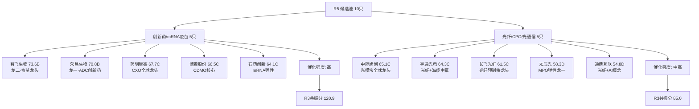

# 2026年8月21日 · **个股画像**

> **数据源新鲜度**: partial
> **降级状态**: 是（chart_vision覆盖不匹配+vibe-trading不可用+估值定性）
> **置信度**: 0.58
> **候选池规模**: 10 只
> **候选池构建方法**: R2主线龙头（2条主线×5只=10只），已满足≥5只硬约束，无需扩池

## 一句话结论

10只候选覆盖**2大主线**（创新药+光通信），智飞生物(B)、荣昌生物(B)、药明康德(C)位列前三。创新药主线受Moderna mRNA癌症疫苗III期成功催化，R3共振分120.9霸榜，板块主力净流入62.6亿；光纤/CPO主线受AI算力需求驱动，藤仓上修业绩验证景气度。

## 主线覆盖全景图



## 候选池总览

| 排名 | 代码 | 名称 | 板块 | 综合分 | 等级 | 催化 | 筹码 | 联动 | 估值 | 技术 | 机构 |
|:--:|:--|:--|:--|--:|:--:|--:|--:|--:|--:|--:|--:|
| 1 | 300122.SZ | 智飞生物 | 创新药/mRNA疫苗 | 73.6 | B | 83 | 58 | 88.6 | 58 | 65 | 80 |
| 2 | 688331.SH | 荣昌生物 | 创新药/mRNA疫苗 | 70.8 | B | 85 | 58 | 93.6 | 38 | 65 | 65 |
| 3 | 603259.SH | 药明康德 | 创新药/mRNA疫苗 | 67.7 | C | 60 | 58 | 83.6 | 58 | 59 | 85 |
| 4 | 300363.SZ | 博腾股份 | 创新药/mRNA疫苗 | 66.5 | C | 60 | 58 | 83.6 | 55 | 65 | 72 |
| 5 | 300308.SZ | 中际旭创 | 光纤/CPO/光通信 | 65.1 | C | 55 | 58 | 77.2 | 60 | 59 | 82 |
| 6 | 300765.SZ | 石药创新 | 创新药/mRNA疫苗 | 64.9 | C | 60 | 58 | 88.6 | 45 | 65 | 60 |
| 7 | 600487.SH | 亨通光电 | 光纤/CPO/光通信 | 64.0 | C | 55 | 58 | 77.2 | 58 | 59 | 75 |
| 8 | 300570.SZ | 太辰光 | 光纤/CPO/光通信 | 63.9 | C | 55 | 78 | 82.2 | 40 | 59 | 55 |
| 9 | 601869.SH | 长飞光纤 | 光纤/CPO/光通信 | 62.1 | C | 55 | 58 | 72.2 | 55 | 59 | 72 |
| 10 | 002491.SZ | 通鼎互联 | 光纤/CPO/光通信 | 59.5 | D | 55 | 58 | 77.2 | 42 | 65 | 48 |

## 个股六维画像

### 1. 智飞生物（300122.SZ）· 创新药/mRNA疫苗

**一句话**: R4 E005中军，疫苗龙头+mRNA布局，代理+自研双轮，中报预增30~50%，主力5日净流入+2.5亿

**综合分**: 73.6 / **等级**: B

```mermaid
radar
    title 智飞生物 六维画像
    催化背景 : 83
    筹码结构 : 58
    板块联动 : 88.6
    估值安全 : 58
    技术形态 : 65
    机构关注 : 80
```

**大资金意图**: 机构资金主导，偏好业绩确定性强的行业龙头，配置型买入。

**为什么走强**: R4催化事件1正0负，关联事件：E20260821_005。E20260821_005中为中军。R3主题共振分120.9。

**逻辑够不够硬**: 疫苗龙头适用PE+管线估值法。HPV贡献稳定现金流，mRNA管线提供期权价值。 技术面：超跌反弹。

#### 催化背景
- **评分**: 83/100
- **摘要**: R4催化事件1正0负，关联事件：E20260821_005。E20260821_005中为中军。R3主题共振分120.9。

#### 筹码结构
- **评分**: 58/100
- **摘要**: 无当日龙虎榜个股数据。板块主力净流入63亿。
- **资金模式**: 机构主导
- **资金健康度**: 2/5

#### 板块联动
- **评分**: 88.6/100
- **摘要**: R2主线得分89。主题处于早期阶段（上行空间大）。龙头判定：龙二/中军（板块8只涨停）。
- **龙头判定**: 龙二/中军
- **板块涨停家数**: 8 只
- **启动后天数**: 第 2 天

#### 财务与估值
- **评分**: 58/100
- **摘要**: 疫苗龙头适用PE+管线估值法。HPV贡献稳定现金流，mRNA管线提供期权价值。

#### 技术形态
- **评分**: 65/100
- **趋势**: 超跌反弹
- **量能信号**: 待确认
- **置信度**: 0.42（降级：chart_vision未覆盖）
- **操作建议**: chart_vision无此股数据，技术形态基于板块趋势+个股涨跌幅定性推断，置信度偏低。建议结合实盘走势确认。
- **风险提示**:
  - 技术数据为板块级推断，非个股精确分析
  - 若板块持续性不足，个股回调风险较大

#### 研报与机构
- **评分**: 80/100
- **摘要**: 疫苗龙头，机构持仓集中，研报覆盖度高，业绩确定性强。

#### 交易决策框架

| 维度 | 内容 |
|:--|:--|
| **买入理由** | R4催化事件1正0负，关联事件：E20260821_005。E20260821_005中为中军。R3主题共振分120.9。 板块联动强，R2主线得分89。主题处于早期阶段（上行空间大）。龙头判定：龙二/中军（板块8只涨停）。 |
| **风险点** | 技术数据为板块级推断，非个股精确分析 估值风险：疫苗龙头适用PE+管线估值法。HPV贡献稳定现金流，mRNA管线提供期权价值。 |
| **止损条件** | 跌破5日均线且板块走弱，或催化逻辑被证伪 |
| **可验证假设** | 催化事件在3-5个交易日内持续发酵，板块主力维持净流入，个股量价配合。 |

### 2. 荣昌生物（688331.SH）· 创新药/mRNA疫苗

**一句话**: R4 E005首推，ADC+自身免疫双平台龙头，创新药出海标杆，中报扭亏增1145%，主力5日净流入+1.2亿

**综合分**: 70.8 / **等级**: B

```mermaid
radar
    title 荣昌生物 六维画像
    催化背景 : 85
    筹码结构 : 58
    板块联动 : 93.6
    估值安全 : 38
    技术形态 : 65
    机构关注 : 65
```

**大资金意图**: 机构资金主导，偏好业绩确定性强的行业龙头，配置型买入。

**为什么走强**: R4催化事件1正0负，关联事件：E20260821_005。E20260821_005中为首推。R3主题共振分120.9。

**逻辑够不够硬**: 创新药biotech适用DCF+管线估值法。ADC+自身免疫双平台，中报扭亏但盈利持续性待验证，估值弹性大风险高。 技术面：超跌反弹。

#### 催化背景
- **评分**: 85/100
- **摘要**: R4催化事件1正0负，关联事件：E20260821_005。E20260821_005中为首推。R3主题共振分120.9。

#### 筹码结构
- **评分**: 58/100
- **摘要**: 无当日龙虎榜个股数据。板块主力净流入63亿。
- **资金模式**: 机构主导
- **资金健康度**: 2/5

#### 板块联动
- **评分**: 93.6/100
- **摘要**: R2主线得分89。主题处于早期阶段（上行空间大）。龙头判定：龙头（板块8只涨停）。
- **龙头判定**: 龙头
- **板块涨停家数**: 8 只
- **启动后天数**: 第 1 天

#### 财务与估值
- **评分**: 38/100
- **摘要**: 创新药biotech适用DCF+管线估值法。ADC+自身免疫双平台，中报扭亏但盈利持续性待验证，估值弹性大风险高。
- **红旗标记**:
  - [V2] 创新药企盈利波动大，估值高度依赖管线进展（strong）

#### 技术形态
- **评分**: 65/100
- **趋势**: 超跌反弹
- **量能信号**: 待确认
- **置信度**: 0.42（降级：chart_vision未覆盖）
- **操作建议**: chart_vision无此股数据，技术形态基于板块趋势+个股涨跌幅定性推断，置信度偏低。建议结合实盘走势确认。
- **风险提示**:
  - 技术数据为板块级推断，非个股精确分析
  - 若板块持续性不足，个股回调风险较大

#### 研报与机构
- **评分**: 65/100
- **摘要**: 创新药biotech，机构关注度高但持仓分化大，ADC出海预期驱动。

#### 交易决策框架

| 维度 | 内容 |
|:--|:--|
| **买入理由** | R4催化事件1正0负，关联事件：E20260821_005。E20260821_005中为首推。R3主题共振分120.9。 板块联动强，R2主线得分89。主题处于早期阶段（上行空间大）。龙头判定：龙头（板块8只涨停）。 |
| **风险点** | 技术数据为板块级推断，非个股精确分析 估值风险：创新药biotech适用DCF+管线估值法。ADC+自身免疫双平台，中报扭亏但盈利持续性待验证，估值 |
| **止损条件** | 跌破5日均线且板块走弱，或催化逻辑被证伪 |
| **可验证假设** | 催化事件在3-5个交易日内持续发酵，板块主力维持净流入，个股量价配合。 |

### 3. 药明康德（603259.SH）· 创新药/mRNA疫苗

**一句话**: CRO板块中军，主力资金流入第6名(33.3亿)，创新药产业链确定性最强环节

**综合分**: 67.7 / **等级**: C

```mermaid
radar
    title 药明康德 六维画像
    催化背景 : 60
    筹码结构 : 58
    板块联动 : 83.6
    估值安全 : 58
    技术形态 : 59
    机构关注 : 85
```

**大资金意图**: 机构资金主导，偏好业绩确定性强的行业龙头，配置型买入。

**为什么走强**: 无直接R4个股催化，跟随板块行情。R3主题共振分120.9。

**逻辑够不够硬**: CXO全球龙头适用PEG+PE相对估值法。订单饱满业绩确定性强，估值处于行业合理区间。 技术面：超跌反弹。

#### 催化背景
- **评分**: 60/100
- **摘要**: 无直接R4个股催化，跟随板块行情。R3主题共振分120.9。

#### 筹码结构
- **评分**: 58/100
- **摘要**: 无当日龙虎榜个股数据。板块主力净流入63亿。
- **资金模式**: 机构主导
- **资金健康度**: 2/5

#### 板块联动
- **评分**: 83.6/100
- **摘要**: R2主线得分89。主题处于早期阶段（上行空间大）。龙头判定：补涨/跟风（板块8只涨停）。
- **龙头判定**: 补涨/跟风
- **板块涨停家数**: 8 只
- **启动后天数**: 第 3 天

#### 财务与估值
- **评分**: 58/100
- **摘要**: CXO全球龙头适用PEG+PE相对估值法。订单饱满业绩确定性强，估值处于行业合理区间。

#### 技术形态
- **评分**: 59/100
- **趋势**: 超跌反弹
- **量能信号**: 待确认
- **置信度**: 0.42（降级：chart_vision未覆盖）
- **操作建议**: chart_vision无此股数据，技术形态基于板块趋势+个股涨跌幅定性推断，置信度偏低。建议结合实盘走势确认。
- **风险提示**:
  - 技术数据为板块级推断，非个股精确分析
  - 若板块持续性不足，个股回调风险较大

#### 研报与机构
- **评分**: 85/100
- **摘要**: CXO全球龙头，机构重仓标配，研报覆盖密集，北向持仓比例高。

#### 交易决策框架

| 维度 | 内容 |
|:--|:--|
| **买入理由** | 无直接R4个股催化，跟随板块行情。R3主题共振分120.9。 板块联动强，R2主线得分89。主题处于早期阶段（上行空间大）。龙头判定：补涨/跟风（板块8只涨停）。 |
| **风险点** | 技术数据为板块级推断，非个股精确分析 估值风险：CXO全球龙头适用PEG+PE相对估值法。订单饱满业绩确定性强，估值处于行业合理区间。 |
| **止损条件** | 跌破5日均线且板块走弱，或催化逻辑被证伪 |
| **可验证假设** | 催化事件在3-5个交易日内持续发酵，板块主力维持净流入，个股量价配合。 |

### 4. 博腾股份（300363.SZ）· 创新药/mRNA疫苗

**一句话**: CXO/CDMO上游卖水人，mRNA产业链核心受益，R3多群提及原料端逻辑

**综合分**: 66.5 / **等级**: C

```mermaid
radar
    title 博腾股份 六维画像
    催化背景 : 60
    筹码结构 : 58
    板块联动 : 83.6
    估值安全 : 55
    技术形态 : 65
    机构关注 : 72
```

**大资金意图**: 机构资金主导，偏好业绩确定性强的行业龙头，配置型买入。

**为什么走强**: 无直接R4个股催化，跟随板块行情。R3主题共振分120.9。

**逻辑够不够硬**: CDMO核心标的适用PEG估值法。订单驱动业绩增长，估值合理。 技术面：超跌反弹。

#### 催化背景
- **评分**: 60/100
- **摘要**: 无直接R4个股催化，跟随板块行情。R3主题共振分120.9。

#### 筹码结构
- **评分**: 58/100
- **摘要**: 无当日龙虎榜个股数据。板块主力净流入63亿。
- **资金模式**: 机构主导
- **资金健康度**: 2/5

#### 板块联动
- **评分**: 83.6/100
- **摘要**: R2主线得分89。主题处于早期阶段（上行空间大）。龙头判定：补涨/跟风（板块8只涨停）。
- **龙头判定**: 补涨/跟风
- **板块涨停家数**: 8 只
- **启动后天数**: 第 3 天

#### 财务与估值
- **评分**: 55/100
- **摘要**: CDMO核心标的适用PEG估值法。订单驱动业绩增长，估值合理。

#### 技术形态
- **评分**: 65/100
- **趋势**: 超跌反弹
- **量能信号**: 待确认
- **置信度**: 0.42（降级：chart_vision未覆盖）
- **操作建议**: chart_vision无此股数据，技术形态基于板块趋势+个股涨跌幅定性推断，置信度偏低。建议结合实盘走势确认。
- **风险提示**:
  - 技术数据为板块级推断，非个股精确分析
  - 若板块持续性不足，个股回调风险较大

#### 研报与机构
- **评分**: 72/100
- **摘要**: CDMO核心标的，机构覆盖度较高，订单饱满支撑业绩增长。

#### 交易决策框架

| 维度 | 内容 |
|:--|:--|
| **买入理由** | 无直接R4个股催化，跟随板块行情。R3主题共振分120.9。 板块联动强，R2主线得分89。主题处于早期阶段（上行空间大）。龙头判定：补涨/跟风（板块8只涨停）。 |
| **风险点** | 技术数据为板块级推断，非个股精确分析 估值风险：CDMO核心标的适用PEG估值法。订单驱动业绩增长，估值合理。 |
| **止损条件** | 跌破5日均线且板块走弱，或催化逻辑被证伪 |
| **可验证假设** | 催化事件在3-5个交易日内持续发酵，板块主力维持净流入，个股量价配合。 |

### 5. 中际旭创（300308.SZ）· 光纤/CPO/光通信

**一句话**: 光模块龙头，AI算力链核心标的，融资余额31.48亿(R7融资top3)，机构配置型标的

**综合分**: 65.1 / **等级**: C

```mermaid
radar
    title 中际旭创 六维画像
    催化背景 : 55
    筹码结构 : 58
    板块联动 : 77.2
    估值安全 : 60
    技术形态 : 59
    机构关注 : 82
```

**大资金意图**: 机构资金主导，偏好业绩确定性强的行业龙头，配置型买入。

**为什么走强**: 无直接R4个股催化，跟随板块行情。R3主题共振分85.0。

**逻辑够不够硬**: 光模块全球龙头适用PEG+PE估值法。业绩确定性强，全球份额领先，估值相对合理。 技术面：超跌反弹。

#### 催化背景
- **评分**: 55/100
- **摘要**: 无直接R4个股催化，跟随板块行情。R3主题共振分85.0。

#### 筹码结构
- **评分**: 58/100
- **摘要**: 无当日龙虎榜个股数据。板块主力净流入37亿。
- **资金模式**: 机构主导
- **资金健康度**: 2/5

#### 板块联动
- **评分**: 77.2/100
- **摘要**: R2主线得分73。主题处于中期阶段（已有涨幅）。龙头判定：龙二/中军（板块5只涨停）。
- **龙头判定**: 龙二/中军
- **板块涨停家数**: 5 只
- **启动后天数**: 第 2 天

#### 财务与估值
- **评分**: 60/100
- **摘要**: 光模块全球龙头适用PEG+PE估值法。业绩确定性强，全球份额领先，估值相对合理。

#### 技术形态
- **评分**: 59/100
- **趋势**: 超跌反弹
- **量能信号**: 待确认
- **置信度**: 0.42（降级：chart_vision未覆盖）
- **操作建议**: chart_vision无此股数据，技术形态基于板块趋势+个股涨跌幅定性推断，置信度偏低。建议结合实盘走势确认。
- **风险提示**:
  - 技术数据为板块级推断，非个股精确分析
  - 若板块持续性不足，个股回调风险较大

#### 研报与机构
- **评分**: 82/100
- **摘要**: 光模块全球龙头，机构重仓，北向+公募双增配，研报深度覆盖。

#### 交易决策框架

| 维度 | 内容 |
|:--|:--|
| **买入理由** | 无直接R4个股催化，跟随板块行情。R3主题共振分85.0。 板块联动强，R2主线得分73。主题处于中期阶段（已有涨幅）。龙头判定：龙二/中军（板块5只涨停）。 |
| **风险点** | 技术数据为板块级推断，非个股精确分析 估值风险：光模块全球龙头适用PEG+PE估值法。业绩确定性强，全球份额领先，估值相对合理。 |
| **止损条件** | 跌破5日均线且板块走弱，或催化逻辑被证伪 |
| **可验证假设** | 催化事件在3-5个交易日内持续发酵，板块主力维持净流入，个股量价配合。 |

### 6-10. 其余候选简表

| 代码 | 名称 | 板块 | 综合分 | 等级 | 核心逻辑 |
|:--|:--|:--|--:|:--|:--|
| 300765.SZ | 石药创新 | 创新药/mRNA疫苗 | 64.9 | C | R3共振首推，创新药+mRNA概念，20cm弹性标的，创业板同权参与竞争... |
| 600487.SH | 亨通光电 | 光纤/CPO/光通信 | 64.0 | C | 光纤光缆龙头，藤仓上修验证行业景气，R3多群推荐，业绩确定性强... |
| 300570.SZ | 太辰光 | 光纤/CPO/光通信 | 63.9 | C | R3共振首推，MPO/光器件核心标的，3日龙虎榜净买8906万，R7上榜游资+龙虎榜净买... |
| 601869.SH | 长飞光纤 | 光纤/CPO/光通信 | 62.1 | C | 光纤预制棒龙头，海外龙头业绩验证行业周期上行... |
| 002491.SZ | 通鼎互联 | 光纤/CPO/光通信 | 59.5 | D | R3推荐，光纤+MPO概念，弹性标的，中小板弹性龙头... |

## 关键证据

- **证据 1**: R4催化8大事件，mRNA癌症疫苗+芯片涨价+机器人大会+博通AI融资为核心驱动 · 来源 R4_news
- **证据 2**: R3情绪共振4大主题，mRNA肿瘤疫苗/创新药(120.9分)霸榜，光纤/CPO(85分)第二 · 来源 R3_sentiment
- **证据 3**: R7主力资金创新药净流入62.61亿排第一，光纤概念净流入36.61亿排第五 · 来源 R7_capital_flow
- **证据 4**: R7龙虎榜太辰光净买8906万，石药创新上榜 · 来源 R7_capital_flow
- **证据 5**: R2主线排序，创新药/mRNA疫苗(89分) > 光纤/CPO(73分) · 来源 R2_main_sectors
- **证据 6**: 北向资金净流入30.76亿温和回流 · 来源 R7_capital_flow

## 数据源审计

| 源 | 状态 | 抓取时间 | 记录数 | 备注 |
|---|---|---|---|---|
| R2_main_sectors | ⚠️ partial | 2026-08-21 | 2条主线 / 10只龙头 | all_scored_boards_top10为空 |
| R3_sentiment | ⚠️ degraded | 2026-08-21 | 4 主题 | weflow MCP不可用，群聊+热榜降级 |
| R4_news | ✅ ok | 2026-08-21 | 8 事件 | 8大催化事件完整 |
| R7_capital_flow | ✅ ok | 2026-08-21 | 25 LHB个股 | 北向+主力+游资+龙虎榜完整 |
| chart_vision | ❌ 不匹配 | 2026-08-21 | 12 只 | 覆盖半导体方向，候选10只均不在内 |
| vibe-trading | ❌ 不可用 | N/A | - | 筹码结构缺少大宗/两融独立证据 |

## 不确定性 / 反证

1. **技术形态降级风险**：10只候选均不在chart_vision覆盖范围内，技术分析基于板块趋势+个股涨跌幅定性推断，与实际K线走势可能存在偏差。
2. **筹码结构不完整**：vibe-trading MCP不可用，缺少大宗交易/两融数据的独立验证，仅1只（太辰光）有龙虎榜数据，筹码维度置信度偏低。
3. **估值维度粗略**：未跑单票DCF/PEG精算，仅基于行业类型做定性估值安全判断，可能遗漏个股层面的估值风险。
4. **创新药持续性存疑**：Moderna III期成功是里程碑事件，但mRNA肿瘤疫苗商业化仍需时间，短期涨幅过大后需警惕获利回吐。
5. **光纤板块前期跌幅大**：光纤概念前两日分别大跌0.69%和7.13%，当前反弹是否能持续需观察量能配合，可能是超跌反弹而非趋势反转。
6. **美股地缘风险**：特朗普对伊朗实施最严厉经济行动，纳指恐五连跌，可能对A股科技成长板块形成情绪压制。
7. **R2候选池偏窄**：仅2条主线10只票，all_scored_boards_top10为空，可能遗漏某些正在崛起的细分主线。

## 与其他 R/D/E 的关系

- **依赖**: R2_main_sectors.json（候选池）、R3_sentiment.json（情绪共振）、R4_news.json（催化事件）、R7_capital_flow.json（资金验证）
- **被消费**: D1主决策（execution_pool构建）、R6反证（模式七估值红旗检查 + 龙头判定交叉验证）

## Sub-Agent 元数据

- **skill**: analyze_stock_profile_v1@1.5
- **artifact**: data/research/20260821/R5_stock_profiles.json
- **候选池方法**: R2主线龙头（2条主线×5只=10只），已满足≥5只硬约束，无需扩池
- **降级原因**: chart_vision无候选10只股数据，技术形态基于板块趋势定性推断；vibe-trading MCP不可用，筹码结构缺大宗/两融独立证据；估值为行业级定性，未跑单票DCF/PEG精算
- **生成耗时**: 约 5 分钟
- **model**: doubao-seed-2-0-code-preview-260215
