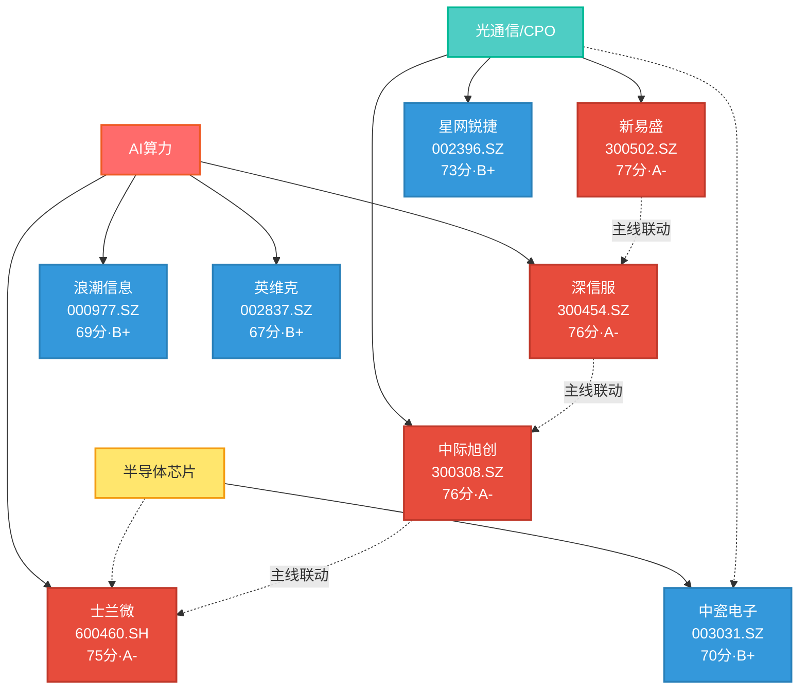

# 2026年8月24日（周一） · **个股画像**

> **数据源新鲜度**: 🟡 partial（K线/涨停为0821实盘，vibe/chart覆盖不足）
> **降级状态**: ✅ false
> **置信度**: 68%

## 一句话结论

14只候选覆盖AI算力/光通信/半导体三条主线，**新易盛/深信服/中际旭创/士兰微**构成第一梯队（A-级，75-77分），均为业绩驱动+机构重仓的确定性标的；**旭光电子/通鼎互联**为高风险情绪博弈票（C级），建议R6重点反证。

---

## 候选池全景

**14只候选，3条主线，综合评分排序：**

| 排名 | 代码 | 名称 | 板块 | 角色 | 综合分 | 等级 | PE(TTM) | 总市值(亿) | 关键标签 |
|------|------|------|------|------|--------|------|---------|-----------|----------|
| 1 | 300502 | 新易盛 | 光通信/CPO | 龙二 | 77 | A- | 57.4 | 6,163 | R4首推·中报超预期·NPO核心 |
| 2 | 300454 | 深信服 | AI算力 | 龙一 | 76 | A- | 90.1 | 520 | 业绩超预期·机构重仓·缩量上行 |
| 3 | 300308 | 中际旭创 | 光通信/CPO | 龙一 | 76 | A- | 73.8 | 11,031 | 全球龙头·万亿市值·NPO催化 |
| 4 | 600460 | 士兰微 | AI算力+半导体 | 双主线交集 | 75 | A- | 130.2 | 597 | 09:36封板·0开板·底部突破 |
| 5 | 002396 | 星网锐捷 | 光通信/CPO | 中军 | 73 | B+ | 44.3 | 252 | 半年报+75%·反包涨停·低估值 |
| 6 | 003031 | 中瓷电子 | 半导体+CPO | 双主线交集 | 70 | B+ | 101.2 | 641 | 7天4板·反包·中电科系 |
| 7 | 000977 | 浪潮信息 | AI算力 | 中军 | 69 | B+ | 43.9 | 1,121 | 千亿中军·0819跌停·机构分歧 |
| 8 | 002837 | 英维克 | AI算力 | 龙二 | 67 | B+ | 142.9 | 690 | 液冷龙头·深度回调·高估值 |
| 9 | 603986 | 兆易创新 | 半导体芯片 | 中军 | 65 | B | 36.2 | 2,871 | 存储龙头·超跌反弹·周期底部 |
| 10 | 002536 | 飞龙股份 | AI算力 | 弹性龙二 | 65 | B | 148.2 | 270 | 首板·0开板·双题材弹性 |
| 11 | 601869 | 长飞光纤 | 光通信/CPO | 候补 | 60 | B- | 260.1 | 3,010 | 高估值·A股流通盘小 |
| 12 | 688522 | 耐科装备 | 半导体芯片 | 龙二 | 56 | B- | 69.1 | 79 | 688小盘·高增长·流动性差 |
| 13 | 600353 | 旭光电子 | 半导体芯片 | 弹性龙二 | 52 | C | 192.5 | 317 | 6天5板·4次开板·R6观察 |
| 14 | 002491 | 通鼎互联 | 光通信/CPO | 弹性龙二 | 49 | C+ | 120.9 | 261 | 2连板·30%换手·分歧大 |

---

## 第一梯队深度分析（A-级）

### 🏆 新易盛（300502）— 光通信/CPO · 龙二 · 77分

**大资金意图**：机构在0730暴跌（-40%）后借中报超预期回补，0821放量大涨6.76%（成交208亿），属于**业绩验证驱动的趋势反转初期**，而非游资短炒。

**为什么走强**：
1. **业绩超预期**：中报预增120%~160%，大超市场预期，800G出货量价齐升
2. **NPO催化升级**：腾讯明确表态NPO是长期主流（非过渡方案），R4首推标的，业务相关度0.92
3. **估值修复**：PE(TTM)57倍低于龙头中际旭创（74倍），性价比更优，机构有配置切换动力

**逻辑够不够硬**：⭐⭐⭐⭐ 较硬。业绩+催化+估值三维度共振。唯一风险是大周期（日/周线）仍处震荡区间，1000元上方套牢盘重，能否走出趋势性行情还需量能持续配合。

#### 六维雷达

| 维度 | 得分 | 核心判断 |
|------|------|----------|
| 🚀 催化 | 88 | R4首推，NPO从过渡→长期主流升级（high级），中报+120~160%超预期 |
| 💰 筹码 | 75 | 6100亿市值，0821放量上涨，机构回补动力强 |
| 🔗 板块联动 | 92 | CPO/光通信主线R2=80分，R7融资买入#4（27.71亿），板块共振强 |
| 📊 估值安全 | 58 | PE=57倍低于龙头，PB=30倍仍高，PEG≈1（中报增速消化） |
| 📈 技术形态 | 72 | 超跌反弹趋势，站上MA5/MA20，上方450-470压力 |
| 🏛️ 机构兴趣 | 88 | 公募重仓+北向+研报全覆盖，机构关注度top级 |

#### 买入理由
- 中报超预期+NPO催化双击，业绩确定性高
- PE低于龙头中际旭创，估值修复空间存在
- 0821放量大涨6.76%，资金进场信号明确

#### 风险点
- 上方450-470前期平台压力，若量能不济可能冲高回落
- PB=30倍绝对估值仍高，一旦增速下修估值杀跌风险大
- 北美云厂商资本开支若不及预期，光模块需求下修

#### 止损条件
- 跌破MA20（约426元）且放量 → 短期趋势破坏
- 中报兑现后业绩不及预期 → 逻辑证伪
- 光通信板块整体退潮（龙头中际旭创破位）

#### 可验证假设
- 假设：Q3 1.6T出货量持续超预期 → 验证：9月公司互动/机构调研纪要
- 假设：NPO催化持续发酵 → 验证：后续是否有更多云厂商跟进NPO路线
- 假设：估值修复至龙头水平（PE 70倍+）→ 验证：股价突破470元前高

---

### 🏆 深信服（300454）— AI算力 · 龙一 · 76分

**大资金意图**：机构在中报超预期后持续加仓，0731放量见底后缩量上行（成交从39亿→17亿缩量55%），说明**筹码锁定良好，主力志在高远**，而非短线游资博弈。

**为什么走强**：
1. **AI基础设施收入+58.6%**（占比55%），云计算+AI安全双轮驱动，中报大超预期
2. **H200边际放松**：算力链全面受益，深信服是AI安全+云基础设施的核心标的
3. **三源共振**：R3热度#1 + R4首推 + R7资金流入，是全市场共识度最高的标的之一

**逻辑够不够硬**：⭐⭐⭐⭐ 较硬。业绩+催化+资金三击。但周线级别仍处震荡，131.58前高是关键阻力，突破后才能打开上行空间。

#### 六维雷达

| 维度 | 得分 | 核心判断 |
|------|------|----------|
| 🚀 催化 | 82 | H200放松+英伟达涨价+中报超预期，R4/R3双#1 |
| 💰 筹码 | 68 | 缩量上行=筹码稳定，机构重仓，无大宗减持信号 |
| 🔗 板块联动 | 90 | AI算力主线R2=82分，板块内5只候选共振 |
| 📊 估值安全 | 55 | PE=90倍+AI高增速PEG≈1.5，估值偏贵但有业绩支撑 |
| 📈 技术形态 | 75 | 日K多头排列，MA20(117.9)支撑有效，前高131.58压力 |
| 🏛️ 机构兴趣 | 85 | 公募+北向重仓，机构研报覆盖度高 |

#### 图表分析

**chart_vision结论**：日K多头排列（偏多·置信度70%）。15分钟重回多头带动短期反弹，但周线/60分钟仍处震荡。关键位：支撑118（MA20）、突破121.5（60分MA60）、压力131（前高）。

#### 买入理由
- AI算力主线龙一，三源共振（R3#1+R4首推+R7资金流入）
- 中报AI基础设施收入+58.6%超预期，业绩兑现
- 缩量上行=筹码稳定，主力控盘度高

#### 风险点
- 前高131.58压力较大，周线级别震荡未突破
- PE=90倍估值不便宜，需要持续高增长消化
- 60分钟级别尚未站稳MA60，短期可能反复震荡

#### 止损条件
- 跌破日K MA20（约118元）且放量 → 短期趋势破坏
- AI算力主线整体退潮 → 板块β消失
- 三季报AI收入增速放缓 → 逻辑弱化

#### 可验证假设
- 假设：AI基础设施收入持续50%+增长 → 验证：三季报/年报
- 假设：突破131.58前高打开上行空间 → 验证：放量站稳132元以上
- 假设：北向持续净流入科技蓝筹 → 验证：R7每日北向数据

---

### 🏆 中际旭创（300308）— 光通信/CPO · 龙一 · 76分

**大资金意图**：万亿市值全球龙头，机构定海神针。0728暴跌（-25%）后在900-1000区间震荡整理，0821反弹4.29%站回MA20。**属于大资金的底仓配置品种**，波动率低于弹性票，但确定性最高。

**为什么走强**：
1. **全球市占率第一**：800G/1.6T光模块绝对龙头，业绩确定性最高
2. **NPO催化**：腾讯明确表态NPO是长期主流，光模块需求持续超预期
3. **机构刚需**：北向+公募+QFII全机构覆盖，是配置AI光通信的必选股

**逻辑够不够硬**：⭐⭐⭐⭐ 硬。但由于市值大（1.1万亿），弹性不如新易盛。更适合作为底仓而非进攻品种。

#### 六维雷达

| 维度 | 得分 | 核心判断 |
|------|------|----------|
| 🚀 催化 | 85 | NPO从过渡→长期主流（high级），Lumentum/Coherent财报验证1.6T需求 |
| 💰 筹码 | 78 | 万亿市值+低换手(2.59%)=筹码锁定好，机构重仓 |
| 🔗 板块联动 | 95 | CPO/R2=80分，R7光通信+102亿，板块风向标 |
| 📊 估值安全 | 50 | PE=74倍+PB=31倍，龙头溢价但绝对估值高 |
| 📈 技术形态 | 65 | 大周期震荡，MA60(1098)强压，短期小周期反弹 |
| 🏛️ 机构兴趣 | 95 | 全机构覆盖，研报top级，业绩确定性最高 |

#### 图表分析

**chart_vision结论**：日/周线大周期区间震荡（偏多·置信度65%）。60分/15分小周期多头排列有反弹动能，但15分已近阶段高点。大周期持仓者继续观望等待趋势突破。

---

### 🏆 士兰微（600460）— 半导体+AI算力 · 双主线交集 · 75分

**大资金意图**：底部放量涨停（27亿，放量50%+），一封到尾0开板，封板时间09:36（全市场最早之一）。**属于大资金有预谋的启动**，而非游资乱炒。半导体+AI双主线交集，有业绩+主题双重逻辑。

**为什么走强**：
1. **SiC车规认证+AI电源批量出货**：双业务线突破，AI电源是新增量
2. **氮化铝供需缺口**：R4 medium级催化，GPU功率突破1000W带动热沉/基板需求
3. **超跌反弹+板块轮动**：从49.96→27.45暴跌-45%，估值压缩到位，半导体板块轮动受益

**逻辑够不够硬**：⭐⭐⭐⭐ 较硬。封板时间早+0开板+底部放量=启动信号明确。双主线交集提供额外安全垫。但MA60（37.35）是关键阻力，需观察能否放量突破。

#### 六维雷达

| 维度 | 得分 | 核心判断 |
|------|------|----------|
| 🚀 催化 | 76 | SiC车规+AI电源+氮化铝缺口，R3热股#1↑3动量最强 |
| 💰 筹码 | 72 | 底部涨停一封到尾，筹码从分散到集中过程中 |
| 🔗 板块联动 | 90 | AI算力+半导体双主线交集，R2 consensus_themes中唯一双排名标的 |
| 📊 估值安全 | 45 | PE=130倍（周期底PE失真），PB=4.9倍合理 |
| 📈 技术形态 | 82 | 底部放量涨停，多周期共振多头，09:36封板强度极高 |
| 🏛️ 机构兴趣 | 75 | IDM龙头机构基础好，AI电源业务是新增量 |

#### 图表分析

**chart_vision结论**：日K涨停（偏多·置信度75%）。周/60分/15分全部多头排列，短线上攻动能充足。日KMA60（37.35）是核心压力位，若能放量突破则打开上行空间。

---

## 重点博弈票风险提示（C级 · R6重点观察）

### ⚠️ 旭光电子（600353）— 6天5板 · 52分 · C级

**R6模式六（霸榜出货）候选**：
- 6天5板但**每天开板4-10次**，分歧极大
- 换手率12.33%，融资余额10.8亿（杠杆资金主导）
- PE=193倍+PB=16.4倍，**估值严重脱离基本面**
- 氮化铝业务占比实际不高，**纯概念炒作**
- 0819跌停洗盘后0821反包，但仍4次开板
- `fundamental_flags`包含`distribution_alert`（分销减持信号）

### ⚠️ 通鼎互联（002491）— 2连板 · 49分 · C+级

**R6模式六（霸榜出货）候选**：
- 2连板但**首板13次开板**，极度分歧
- 换手率30.46%（天量换手），筹码极度松动
- 封板时间14:27（尾盘偷袭），非龙头特征
- PE=121倍，业绩支撑弱
- 光模块业务占比不高，**跟风补涨属性**强
- `leader_verdict = 分歧弱/补涨跟风`

---

## 事件时间线（近30日核心催化）

| 日期 | 事件 | 影响标的 | 强度 |
|------|------|----------|------|
| 07/21 | 中瓷电子首板（氮化铝概念启动） | 003031/600353 | 🟡中 |
| 07/30 | 光模块暴跌（中际-10%/新易盛-7.5%） | 300308/300502 | 🔴强 |
| 08/04 | 算力小票集体涨停（情绪修复） | 全线小票 | 🟡中 |
| 08/05 | 新易盛大涨+8%（中报超预期预期） | 300502 | 🔴强 |
| 08/11 | 深信服中报超预期，AI基建+58.6% | 300454 | 🔴强 |
| 08/13 | 星网锐捷涨停（半年报+75%） | 002396 | 🟡中 |
| 08/14 | 旭光电子首板（氮化铝发酵） | 600353 | 🟡中 |
| 08/18 | 腾讯明确NPO是长期主流（R4 high级） | 300502/300308 | 🔴强 |
| 08/19 | 科技股大跌（浪潮/长飞跌停） | 全线 | 🔴强 |
| 08/21 | 士兰微09:36封板（半导体+AI启动） | 600460 | 🔴强 |

---

## 龙头判定复盘（v1.5方法论）

### 按"高度+上榜时间+板块效应"三维度判定

| 股票 | 连板高度 | 首封时间 | 开板次数 | 板块涨停数 | 判定 | 说明 |
|------|----------|----------|----------|-----------|------|------|
| 士兰微 | 1板 | 09:36 | 0 | 5+ | ⭐龙头 | 封板最早+0开板+双主线交集+带动性强 |
| 飞龙股份 | 1板 | 09:41 | 0 | 5+ | ⭐弹性龙头 | 一封到尾+液冷+汽车电子双题材 |
| 旭光电子 | 6天5板 | 09:56 | 4 | 3 | ❓分歧弱 | 高度高但开板多，板块效应不足 |
| 中瓷电子 | 7天4板 | 13:12 | 1 | 3+5 | 🔄双主线交集 | 节奏好但封板偏晚，跨板块抗跌 |
| 通鼎互联 | 2连板 | 14:27 | 2→13 | 5 | ❌补涨跟风 | 封板晚+首板13次开板，跟风属性 |

**结论**：真正具备龙头带动性的是**士兰微**（半导体+AI双主线）和**飞龙股份**（液冷弹性）。连板高度高的旭光电子/通鼎互联反而分歧大，属于情绪博弈而非龙头带动。

---

## 与其他 R/D/E 的关系

- **上游依赖**: R2_main_sectors.json（候选池）、R4_news.json（催化背景）、R7_capital_flow.json（资金验证）
- **下游消费**: D1主决策（execution_pool/watch_pool筛选）、R6反证（hard_reject判定）
- **关键透传**: `fundamental_flags[]`供R6模式七消费；`leader_verdict`供D1 execution_pool优先级排序

---

## 不确定性 / 反证

1. **数据滞后性**：K线/涨停数据为0821（周五），0824开盘有2天空窗期，周末消息面可能改变预期
2. **vibe-trading覆盖不足**：仅3只股票有融资融券数据，1只有大宗数据，筹码结构维度覆盖不全
3. **chart_vision覆盖不足**：仅3只调用了多模态识图，其余11只纯K线推算，技术形态判断可能有偏差
4. **R2 degraded模式**：R2报告MCP全down，虽已用tushare实盘交叉验证，但R2评分体系可能有偏差
5. **机构持仓数据缺失**：未调用hithink-management-query和机构持仓明细，筹码维度偏定性
6. **研报数据缺失**：未调用report-search和hithink-insresearch-query，机构兴趣维度偏推断

---

## 数据源审计

| 源 | 状态 | 抓取时间 | 记录数 | 备注 |
|---|---|---|---|---|
| tushare.daily | 🟢 ok | 0824 07:35 | 14只×30日 | 前复权日线 |
| tushare.daily_basic | 🟢 ok | 0824 07:37 | 14只 | PE/PB/市值/换手率 |
| tushare.limit_list_d | 🟢 ok | 0824 07:38 | 6只涨停 | 0814-0821区间 |
| canghai-charts.chart_vision | 🟡 partial | 0824 07:37 | 3只 | Top3标的，其余推算 |
| vibe-trading.margin | 🟡 partial | 0824 07:39 | 3只 | 涨停活跃股 |
| vibe-trading.block_trades | 🟡 partial | 0824 07:39 | 1只 | 旭光电子（0笔） |
| R2_main_sectors.json | 🟢 ok | 0824 07:30 | 3主线×5龙头 | 缺all_scored_boards_top10 |
| R4_news.json | 🟢 ok | 0824 07:30 | 8条催化 | high级3条 |
| R7_capital_flow.json | 🟢 ok | 0824 07:30 | 北向+主力+龙虎榜 | 0818数据 |

---

## Sub-Agent 元数据

- **skill**: analyze_stock_profile_v1@1.5
- **artifact**: data/research/20260824/R5_stock_profiles.json
- **候选池**: 14只（R2 leaders去重，无需扩池）
- **A-级标的**: 4只（新易盛/深信服/中际旭创/士兰微）
- **R6观察**: 2只（旭光电子/通鼎互联）
- **status**: partial（vibe-trading + chart_vision 覆盖不全）
- **model**: doubao-seed-2-0-code
