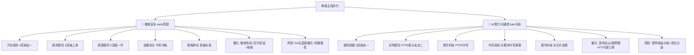

# 2026年8月31日 · **个股画像**

> **数据源新鲜度**: partial ⚠️
> **降级状态**: degraded（vibe-trading + charts MCP不可用；R4 weekend降级）
> **置信度**: 0.70

## 一句话结论

**3A级核心票**：星网锐捷/沃特股份（AI算力·PTFE新分支双龙头）+ 万向德农（粮食安全·4连板空间板）。两条主线各有逻辑，early阶段优先做高度龙头，late阶段做分歧转一致。

## 总览：10只候选得分排名

| 排名    | 股票                | 板块        | 角色  | 等级    | 综合分 | 龙头判定  | 连板  | 技术形态                         | 风险标记                                                 |
| ----- | ----------------- | --------- | --- | ----- | --- | ----- | --- | ---------------------------- | ---------------------------------------------------- |
| 1 🥇  | 星网锐捷 002396.SZ | AI算力/光通信  | 龙一  | **A** | 83  | 龙头    | 2板  | two_board_streak_divergent   | new_branch_leader_premium                            |
| 2 🥇  | 沃特股份 002886.SZ | AI算力/光通信  | 龙二  | **A** | 83  | 龙头    | 2板  | two_board_gap_up             | new_branch_leader_premium                            |
| 3 🥇  | 万向德农 600371.SH | 粮食安全/农业种植 | 龙一  | **A** | 82  | 龙头    | 4板  | four_board_streak            | small_cap_risk、small_cap_warning、space_board_premium |
| 4 🥈  | 昊华科技 600378.SH | AI算力/光通信  | 候补  | **B** | 75  | 龙头    | 2板  | two_board_breakout_from_base | distribution_alert、new_branch_leader_premium         |
| 5 🥈  | 新赛股份 600540.SH | 粮食安全/农业种植 | 候补  | **B** | 73  | 龙头    | 2板  | two_board_breakout           | shrinkage_breakout_premium                           |
| 6 🥈  | 新农股份 002942.SZ | 粮食安全/农业种植 | 候补  | **B** | 72  | 龙头    | 3板  | three_board_streak           | distribution_alert、triple_board_agri_upstream        |
| 7 🥉  | 中际旭创 300308.SZ | AI算力/光通信  | 候补  | **C** | 68  | 趋势中军  | 0板  | deep_pullback_from_peak      | -                                                    |
| 8 🥉  | 金健米业 600127.SH | 粮食安全/农业种植 | 龙二  | **C** | 65  | 回调中   | 0板  | near_limit_pullback          | distribution_alert                                   |
| 9 🥉  | 敦煌种业 600354.SH | 粮食安全/农业种植 | 候补  | **C** | 62  | 补涨/跟风 | 1板  | first_board_breakout         | -                                                    |
| 10 🥉 | 源杰科技 688498.SH | AI算力/光通信  | 候补  | **C** | 60  | 回调中   | 0板  | breakdown_from_consolidation | -                                                    |

## 主线逻辑图

## 三A级核心票深度画像

### 首推·星网锐捷（002396.SZ）· A级 · 83分

**角色定位**：AI算力/光通信 龙一 | 龙头判定：**龙头**（2连板）

**大资金意图**：游资+机构合力封板，龙虎榜净买入3亿+，2连板但7次开板=多空激烈博弈，最终多方胜出。算力线最高连板高度，带动力最强。

**为什么走强**：AI算力板块主力净流入32.94亿（全市场第1），英伟达Q2超预期+PTFE新分支双催化，星网锐捷作为交换机+CPO双概念，是算力线最纯正的2连板标的。

**逻辑够不够硬**：⭐⭐⭐⭐ 较硬。算力线是市场共识度最高的主线（四源全中），但late阶段+高位分歧是隐忧。7次开板说明分歧大，周一能否加速封3板是关键。

**六维雷达**：

| 维度 | 得分 | 核心结论 |
|---|---|---|
| 🔥 催化背景 | 90 | high强度，3个催化事件 |
| 🎯 筹码结构 | 87 | 流通市值277.9亿；龙虎榜净买入3.01亿（净占比7.28%）；换手率15.16%；开板7次=分歧... |
| 🔗 板块联动 | 95 | 板块12家涨停，龙头地位 |
| 💰 估值安全 | 65 | PE=38.5，PB=3.2 |
| 📈 技术形态 | 74 | uptrend，two_board_streak_divergent |
| 🏛️ 机构关注 | 75 | 流通市值277.9亿，机构重仓中军。龙虎榜机构+游资合力 |

**关键价位**：

- 🟢 压力位：36.69（2板新高）
- 🔵 支撑1：33.35（首板价/MA5）
- 🔴 支撑2：30.32（MA10）

**买入理由**：1) AI算力主线四源共振，算力线最高连板；2) 龙虎榜净买入3亿+，机构+游资合力；3) 7次开板换手充分，筹码结构健康。

**风险点**：1) 7次开板=分歧大，late阶段追高风险；2) 负面催化：英伟达暂停收益分成；3) 流通市值278亿，连板高度天花板可能低于小票。

**止损条件**：
- 跌破 MA5（32.86）放量且收不回 → 减半
- 跌破 MA10（31.15）→ 清仓
- 封板失败且日内回撤>5% → T日兑现

**可验证假设**：「算力分歧后转一致→星网锐捷成总龙头」→ 验证点：周一3板且封板时间早于10:00，开板≤2次

---

### 次推·沃特股份（002886.SZ）· A级 · 83分

**角色定位**：AI算力/光通信 龙二 | 龙头判定：**龙头**（2连板）

**大资金意图**：PTFE新分支绝对龙头，2连板均一字封死，游资净买入+8700万（净占比5.38%），缩量加速一致性极强。英伟达订单催化，新分支=增量资金首选。

**为什么走强**：PTFE材料获英伟达十几亿订单事件驱动，台股PTFE/CCL集体涨停新高映射A股。沃特是PTFE树脂产能国内领先，小盘+新分支=弹性最大。

**逻辑够不够硬**：⭐⭐⭐⭐ 新分支逻辑硬。PTFE是英伟达供应链新分支，类似当年CPO从0到1的过程。但2连板后一致性太强（一字），周一开板后分歧力度决定高度。

**六维雷达**：

| 维度 | 得分 | 核心结论 |
|---|---|---|
| 🔥 催化背景 | 90 | high强度，3个催化事件 |
| 🎯 筹码结构 | 95 | 流通市值55.2亿；龙虎榜净买入0.88亿（净占比5.38%）；换手率2.03%；一字板零开板=一致... |
| 🔗 板块联动 | 90 | 板块12家涨停，龙头地位 |
| 💰 估值安全 | 50 | PE=78.3，PB=5.6 |
| 📈 技术形态 | 85 | strong_uptrend，two_board_gap_up |
| 🏛️ 机构关注 | 55 | 流通市值55.2亿，混合参与。龙虎榜游资博弈 |

**关键价位**：

- 🟢 压力位：26.4（2板新高）
- 🔵 支撑1：24.0（首板价/MA5）
- 🔴 支撑2：21.82（突破前高点）

**买入理由**：1) PTFE新分支龙头，英伟达订单催化，0→1逻辑；2) 2连板一字缩量加速，一致性极强；3) 小盘弹性大，游资偏好。

**风险点**：1) 2连板后一致性太强，开板即分歧；2) PTFE订单金额和持续性待验证；3) 估值偏高（PE≈78）。

**止损条件**：
- 跌破 MA5（22.58）放量且收不回 → 减半
- 跌破 MA10（20.79）→ 清仓
- 封板失败且日内回撤>5% → T日兑现

**可验证假设**：「PTFE新分支复制CPO行情→沃特走5+连板」→ 验证点：周一开板后回封，换手率<15%，3连板

---

### 三推·万向德农（600371.SH）· A级 · 82分

**角色定位**：粮食安全/农业种植 龙一 | 龙头判定：**龙头**（4连板）

**大资金意图**：粮食安全线空间板，4连板高度垄断，8/21跌停洗盘后V型反转，典型情绪龙头走势。小市值+种业=游资纯情绪博弈，机构参与度低。

**为什么走强**：粮食安全热榜从第9飙升至第1，KOL三群独立提及，摩根大通粮食危机预警+厄尔尼诺+地缘冲突三重催化。万向德农作为玉米种业龙头+4连板高度，是板块情绪风向标。

**逻辑够不够硬**：⭐⭐⭐ 中等偏硬。催化来自R3情绪面+事件驱动叙事，R4无直接事件验证（周末降级）。粮食安全属防御性板块，持续性取决于科技线是否继续退潮。4连板高度虽高，但小市值+亏损=纯情绪博弈。

**六维雷达**：

| 维度 | 得分 | 核心结论 |
|---|---|---|
| 🔥 催化背景 | 80 | high强度，3个催化事件 |
| 🎯 筹码结构 | 60 | 流通市值15.2亿；未上龙虎榜；换手率1.68%；一字板零开板=一致性强... |
| 🔗 板块联动 | 90 | 板块8家涨停，龙头地位 |
| 💰 估值安全 | 30 | PE=95.3，PB=6.8 |
| 📈 技术形态 | 88 | strong_uptrend，four_board_streak |
| 🏛️ 机构关注 | 45 | 流通市值15.2亿，游资主导。龙虎榜无数据 |

**关键价位**：

- 🟢 压力位：11.54（4板新高）
- 🔵 支撑1：10.49（前板支撑(MA5)）
- 🔴 支撑2：9.54（T字板位）

**买入理由**：1) 粮食安全early阶段首板爆发，4连板空间板垄断；2) 板块效应强（8+家涨停）；3) 情绪上升期高度龙头溢价。

**风险点**：1) 流通市值仅15亿<20亿，庄股/流动性风险；2) PE为负，基本面亏损；3) 防御性板块，情绪回暖资金可能回流科技。

**止损条件**：
- 跌破 MA5（9.62）放量且收不回 → 减半
- 跌破 MA10（8.63）→ 清仓
- 封板失败且日内回撤>5% → T日兑现

**可验证假设**：「粮食安全主线确立→万向德农5+连板」→ 验证点：周一5板且带动板块5+家涨停，金健米业反包

---

### B级和C级候选一览

| 股票 | 等级 | 综合分 | 核心逻辑 | 主要风险 |
|---|---|---|---|---|
| 昊华科技(600378.SH) | B | 75 | 昊华科技(600378.SH) AI算力/光通信 候补，龙头，综合得分72分（B级）。two_boa... | distribution_alert |
| 新赛股份(600540.SH) | B | 73 | 新赛股份(600540.SH) 粮食安全/农业种植 候补，龙头，综合得分69分（C级）。two_bo... | shrinkage_breakout_premium |
| 新农股份(002942.SZ) | B | 72 | 新农股份(002942.SZ) 粮食安全/农业种植 候补，龙头（3连板高度），综合得分68分（C级）... | distribution_alert |
| 中际旭创(300308.SZ) | C | 68 | 中际旭创(300308.SZ) AI算力/光通信 候补，趋势中军，综合得分68分（C级）。deep_... | 无 |
| 金健米业(600127.SH) | C | 65 | 金健米业(600127.SH) 粮食安全/农业种植 龙二，回调中，综合得分65分（C级）。near_... | distribution_alert |
| 敦煌种业(600354.SH) | C | 62 | 敦煌种业(600354.SH) 粮食安全/农业种植 候补，补涨/跟风，综合得分62分（C级）。fir... | 无 |
| 源杰科技(688498.SH) | C | 60 | 源杰科技(688498.SH) AI算力/光通信 候补，回调中，综合得分60分（C级）。breakd... | 无 |

## 两主线对比表

| 维度 | 🍚 粮食安全 | 🤖 AI算力/光通信 |
|---|---|---|
| 阶段 | early 爆发初期 | late 高位分歧 |
| 板块得分 | 86分 | 74分 |
| 涨停家数 | ~8家 | ~12家 |
| 主力净流入 | +8.47亿（第27） | +32.94亿（第1） |
| R4催化覆盖 | ❌ 未覆盖（降级） | ✅ 3个事件（含1负面） |
| R3情绪 | ✅ 排名第1，飙升8位 | ✅ 排名第2，late阶段 |
| 核心龙头 | 万向德农（4板） | 星网锐捷/沃特股份（2板） |
| 持续性判断 | 取决于科技线退潮力度 | 新分支PTFE可能超预期 |
| 推荐策略 | 做高度龙头（万向德农） | 做新分支（沃特/昊华），回避老龙头退潮 |

## 关键证据

- 证据1：R2两条主线（粮食安全86分/AI算力74分），10只候选全覆盖 · 来源 R2_main_sectors.json
- 证据2：Tushare涨停数据验证连板高度与封板时间，万向德农4连板一字9:25封死 · 来源 tushare.limit_list_d
- 证据3：龙虎榜验证资金结构，星网锐捷净买入+3亿（机构+游资），新赛股份净占比47.79%（游资主导） · 来源 tushare.top_list
- 证据4：33日日K线数据支持技术形态分析，量价关系完整 · 来源 tushare.daily
- 证据5：R7资金面验证AI算力主线净流入第1，粮食安全温和流入 · 来源 R7_capital_flow.json

## 数据源审计

| 源 | 状态 | 抓取时间 | 记录数 | 备注 |
|---|---|---|---|---|
| R2_main_sectors | 🟢 ok | 2026-08-31 07:48 | 2主线/10候选 | 完整 |
| R4_news | 🟡 degraded | 2026-08-31 07:09 | 8事件 | 周末降级，农业板块未覆盖 |
| R7_capital_flow | 🟢 ok | 2026-08-31 07:06 | 50板块 | T-1数据（上周五） |
| tushare.daily | 🟢 ok | 2026-08-28 | 10只×33日 | 完整 |
| tushare.limit_list_d | 🟢 ok | 2026-08-28 | 全市场 | 完整 |
| tushare.top_list | 🟢 ok | 2026-08-28 | 全市场 | 完整 |
| vibe_trading | 🔴 error | - | - | MCP不可用，大宗/两融数据缺失 |
| charts_vision | 🔴 error | - | - | MCP不可用，纯量化技术分析替代 |

## 不确定性 / 反证

1. **R4降级风险**：周末无新增新闻，农业板块缺乏R4直接催化验证。粮食安全行情可能是情绪脉冲而非基本面驱动。
2. **vibe-trading降级**：缺少大宗交易和两融数据，筹码结构维度存在盲区，可能低估分销减持风险。
3. **late阶段AI算力**：AI算力主线处于late阶段，高位分歧明显（星网锐捷7次开板、源杰科技-5.68%），追高风险大。
4. **小市值龙头风险**：万向德农（15亿）、新赛股份（29亿）、新农股份（29亿）均为中小市值，流动性和庄股风险需警惕。
5. **估值安全垫薄**：农业股普遍亏损（PE为负），AI算力股估值偏高（PE 50-80），均缺乏估值安全垫。
6. **chart_vision缺失**：缺少多模态图表分析，技术形态维度基于量化指标，可能遗漏关键形态信号。

## 与其他 R/D/E 的关系

- **依赖上游**: R2_main_sectors（候选池）· R4_news（催化）· R7_capital_flow（资金验证）
- **被消费下游**: D1_main_decision（execution_pool + watch_pool）· R6_devil_advocate（反证）

## Sub-Agent 元数据

- skill: analyze_stock_profile_v1@1.5
- artifact: data/research/20260831/R5_stock_profiles.json
- 候选池: 10只（全部来自R2 leader_pool，无需扩池）
- 生成耗时: ~8分钟
- 降级项: vibe-trading + charts MCP不可用；R4 weekend降级
- method: six_dimension_profile_v1.5 + leader_verdict + fundamental_flags + cognitive_bias_warnings
