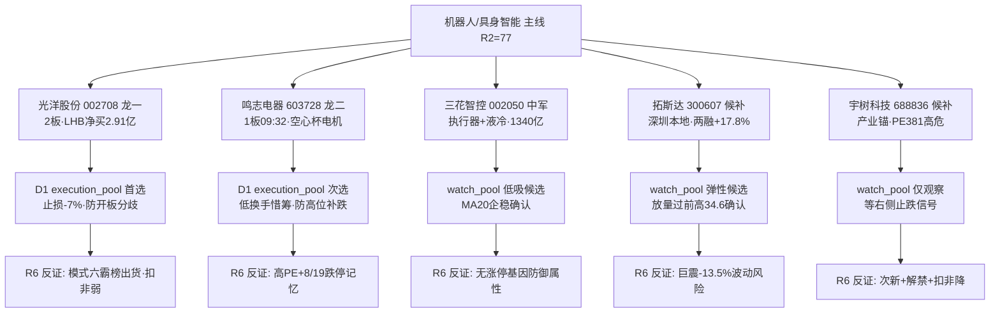

# 2026年9月4日 · **个股画像**

> **数据源新鲜度**: partial
> **降级状态**: yes(charts MCP DOWN · R2缺all_scored_boards_top10)
> **置信度**: 0.62

## 一句话结论
机器人/具身智能主线 5 候选全部画像完毕：**光洋股份(2板龙一·资金共振最强但开板20次强分歧)、鸣志电器(首板09:32带动·惜筹)·三花智控(中军压舱)·拓斯达(深圳本地弹性)·宇树科技(次新高危仅观察)**；D1 建议 execution_pool 优先光洋/鸣志，宇树只入 watch_pool。

## 详细分析

### 候选池(5只 · R2 leaders 全量)

| 排名 | 代码 | 名称 | 角色 | 综合分 | Alpha | 核心逻辑 | 最大风险 |
|---|---|---|---|---|---|---|---|
| 1 | 002708.SZ | 光洋股份 | 龙一 | 68 | A | 2连板+龙虎榜三日净买2.91亿+游资3席位共振+减速器链正宗 | 开板20次强分歧+扣非≈0盈利质量差 |
| 2 | 603728.SH | 鸣志电器 | 龙二 | 68 | A | 空心杯电机全球核心+首板09:32早封+换手2.08%惜筹+223亿大市值 | 2026E PE 184倍+8/19曾跌停 |
| 3 | 002050.SZ | 三花智控 | 中军 | 66 | B | 执行器中军+液冷双逻辑+8家券商覆盖(中金目标52) | 业绩-3.1%微降+无涨停基因 |
| 4 | 300607.SZ | 拓斯达 | 候补 | 64 | B | 深圳方案直接受益+两融+17.8%资金进场+光通信新曲线 | 无涨停高度+8/19曾-13.5%巨震 |
| 5 | 688836.SH | 宇树科技 | 候补 | 47 | C | 产业锚+净利+955%硬alpha+20cm弹性 | PE381/PB77+次新12日跌35%+扣非-19% |

**大资金意图**: 龙虎榜显示游资(国新北京/国泰海通长宁/平安浙江)与机构合力买入光洋股份，三日净买2.91亿是真金白银的板块卡位；鸣志低换手涨停=筹码锁定、主力惜售，二者代表"游资进攻+机构底仓"双路径。宇树融资盘自上市峰值17.5亿回落至13.7亿=高位套牢盘未消化。

**为什么走强**: 深圳机器人产业方案(E005·5源high)是政策级催化+宇树中报净利+955%给出业绩锚+特斯拉Optimus/Atlas世界模型叙事共振。减速器/轴承/空心杯电机属于"卖铲人"逻辑，机构易认。

**逻辑够不够硬**: 政策(深圳方案)+业绩(宇树/鸣志/拓斯达均高增)+资金(龙虎榜)三要素齐备，是当前全市场多源支撑最强的主线(R2 77分)。但 R1 退潮加速期(情绪35)+炸板率42.9%+板块最高仅2板无3板=脆弱，逻辑硬但容错低，追高必须带止损。

### 龙头判定(v1.5 leader_verdict)

| 票 | 高度 | 首封 | 开板 | 启动日 | 板块涨停 | 判定 |
|---|---|---|---|---|---|---|
| 光洋股份 | 2板 | 09:50 | **20次** | 第1天 | 11家 | 龙头但强分歧警示 |
| 鸣志电器 | 1板 | 09:32 | 1次 | 第1天 | 11家 | 龙头(早封带动性) |
| 宇树科技 | 0 | - | - | - | 11家 | 无涨停·产业锚 |
| 拓斯达 | 0 | - | - | - | 11家 | 无涨停·中军型 |
| 三花智控 | 0 | - | - | - | 11家 | 无涨停·压舱石 |

### 每票思维链(≥4段 · 首推票必附)

#### 光洋股份(首推 · composite 68 · A)

**买入理由**: 板块最高连板(2板/4天3板)+龙虎榜三日净买2.91亿(机构游资双共振)+减速器链正宗标的(滚针/圆柱轴承)，是主线里资金认可度最高的票，符合"只做资金正在买的龙头"原则。

**风险点**: ①9/3开板20次=盘中反复炸板，筹码松动剧烈，次日高开可能直接出货；②2026H1扣非净利仅250万(利润靠非经常损益5469万)，基本面不能支撑83倍PE，纯题材定价；③R1退潮加速期炸板率42.9%接近崩溃阈值。

**止损条件**: 参考买入价-7%硬止损(按D1契约-5~-10%区间)；若竞价低于昨收或9:45前未封板则竞价/开盘即撤。

**可验证假设**: 假设1=今日早盘(9:45前)封板且开板次数<3次→分歧收敛龙头地位确立可持有；假设2=开板次数仍>5次→分歧加剧，逢反弹减仓；假设3=板块出现3板高标(光洋自身或同板块)→主升确认加仓。

#### 鸣志电器(composite 68 · A)

**买入理由**: 空心杯电机=人形机器人手部执行器全球核心，首板09:32早封(上榜早=带动性)+换手仅2.08%惜筹=筹码锁定极好，223亿大市值安全，国盛"Q2业绩超预期"背书。

**风险点**: 2026E PE 184倍估值极贵(华源237倍)；8/19刚经历跌停(-10%)显示高位波动大；低换手涨停若次日不放量则难续板。

**止损条件**: 买入价-6%硬止损；若次日缩量高开低走破53.35(昨涨停价)减半。

**可验证假设**: 假设1=连板晋级(2板)且换手<5%→惜筹逻辑成立持有；假设2=换手突增>8%→筹码松动出货预警；假设3=板块内空心杯/灵巧手分支同步走强→主线扩散确认。

#### 三花智控(composite 66 · B)

**买入理由**: 机电执行器中军+液冷双逻辑，8家券商覆盖(中金目标52元/现价36.3)，1340亿流通压舱石，回踩MA20企稳，适合主线确认后的低吸配置。

**风险点**: 2026H1净利-3.1%业绩短期承压；无涨停基因，弹性不足(日波动小)；退潮期大市值票容易"只跟不涨"。

**止损条件**: 买入价-5%硬止损(低波动票收紧)；跌破35.5(近期平台)离场。

**可验证假设**: 假设1=板块走强时放量过37.5(8月平台)→中军启动确认；假设2=持续缩量阴跌→资金不认可离场观望。

#### 拓斯达(composite 64 · B)

**买入理由**: 深圳机器人方案直接受益(R4首推)+两融15日+17.8%杠杆资金真金白银进场+东莞证券挖掘光通信第二曲线，弹性标的。

**风险点**: 30日无涨停(8/25+10.23%未封)，高度不足；8/19曾-13.5%单日巨震；PE113.9偏高。

**止损条件**: 买入价-8%硬止损；跌破33.3(8/24低点)离场。

**可验证假设**: 假设1=放量突破34.6(8/28低点上方密集区)→右侧确认；假设2=深圳本地机器人股批量异动→政策映射发酵。

#### 宇树科技(composite 47 · C · 仅观察)

**买入理由**: 人形机器人产业锚+中报净利+955%~1055%(R4 hard alpha)+20cm弹性，若板块主升有补涨空间。

**风险点**: PE_ttm 381/PB77极端估值；上市12日从845跌至550(-35%)下降通道；扣非净利同比-19.34%利润质量差；流通盘165亿(总市值2226亿)次新解禁未释放；融资盘高位套牢。

**止损条件**: 不提供买入建议；仅当出现右侧信号(放量收复MA10 634)且板块晋级3板时再评估。

**可验证假设**: 假设1=缩量止跌(量比<0.6且不创新低)持续3日→底部信号；假设2=跌破545(9/3低点)→下跌中继离场观望。

## 关键证据

- 证据 1: 光洋股份龙虎榜9/3单日净买+1.64亿(net_rate 11.36%)+三日榜+2.91亿(12.62%) · 来源 tushare top_list · 机构游资共振
- 证据 2: 光洋9/3 limit_list_d: first_time 09:50 · open_times=20次 · limit_times=2 · 来源 tushare limit_list_d · 强分歧
- 证据 3: 鸣志9/3 limit_list_d: first_time 09:32 · open_times=1 · 换手2.08% · 来源 tushare limit_list_d · 早封惜筹
- 证据 4: R7 hot_money: 国新北京/国泰海通长宁/平安浙江3游资席位同买002708 · 来源 R7_capital_flow.json
- 证据 5: 宇树2026H1扣非-19.34% vs 净利+955%(非经常3007万) · 来源 tushare fina_indicator
- 证据 6: 三花智控8家券商近3月覆盖(中信建投/兴业/国盛/中金/东吴/长江/浙商/高盛)·中金目标52元 · 来源 tushare report_rc

## 数据源审计

| 源 | 状态 | 抓取时间 | 记录数 | 备注 |
|---|---|---|---|---|
| R2_main_sectors.json | ok | 07:36 | 5 | 候选=5 · 缺all_scored_boards_top10 |
| R4_news.json | ok | 07:11 | 8 | E005深圳方案 high |
| R7_capital_flow.json | ok | 07:14 | 50 | 游资席位命中光洋 |
| tushare daily/daily_basic | ok | 07:40 | 5票×30日 | 全 fresh |
| tushare limit_list_d | ok | 07:41 | 5票 | 打板/炸板明细 |
| tushare top_list | ok | 07:41 | 2 | 光洋9/3龙虎榜 |
| tushare block_trade | ok | 07:42 | 5票 | 30日全空=无大宗 |
| tushare margin | ok | 07:42 | 4467 | 光洋非两融标的 |
| tushare fina_indicator | ok | 07:43 | 5票 | F/V 红旗检出 |
| tushare report_rc | ok | 07:44 | 5票 | 券商评级 |
| tushare anns_d | ok | 07:44 | 2票 | 半年报/增资公告 |
| canghai-charts | error | - | 0 | MCP出图层DOWN·chart_degraded |

## 不确定性 / 反证

1. **图表维度缺失是最大盲区**: charts MCP 出图层全域 DOWN，全部5票 chart_vision=null，技术形态仅靠 tushare 量价推断，K线结构(缺口/形态/分时承接)无法多模态确认，判断置信度打折(顶格medium)。
2. **R2 缺 all_scored_boards_top10**: v1.4 扩池源缺失(候选5≥5未触发扩池)，但如果今日机器人主线走弱，D1 无备选板块候选可切换。
3. **光洋扣非≈0是硬伤**: 该票本质是题材+资金驱动，若龙虎榜资金次日离场，无基本面托底，反证(R6)可能触发"霸榜出货"或"盈利质量"红旗。
4. **R7 为 T-1(0903) 数据**: 今日(0904)资金流向尚未跑，游资席位是否延续需竞价验证。
5. **宇树次新风险无法消除**: 即便业绩硬，PE381+解禁预期使其在任何环境下都是高风险标的，R5 建议只观察不参与。

## 与其他 R 的关系

- 依赖: R2_main_sectors.json · R4_news.json · R7_capital_flow.json
- 被消费: D1(main_decision_v1 · execution_pool/watch_pool) · R6(analyze_devil_advocate_v1 · 六类反证 + fundamental_flags 模式七) · E1(daily_review_v1)

## Sub-Agent 元数据

- skill: analyze_stock_profile_v1
- artifact: data/research/20260904/R5_stock_profiles.json
- 生成耗时: ~1200 秒(含 MCP 重试)
- model: deepseek-v4-flash-260425
