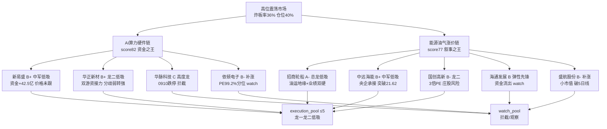

> ⚠️ **会话实际运行于 0910 收盘后**
> - 文件名交易日: **2026-09-10** · 量价/资金/估值基准: **2026-09-09 收盘**(T-1)
> - 技术面 chart_vision 为 canghai-charts 实时出图,含 **0910 当日收盘**(如华脉科技已跌停/国创高新二连板/招商轮船回踩-1.95%)
> - 影响: 技术维度含当日信息,其余维度保持盘前口径;D1 消费时以 0909 收盘为 execution 基准

# 2026-09-10 · 📌 个股画像

> **数据源新鲜度**: partial
> **降级状态**: degraded(true · R3 weflow down / R7 vibe fallback)
> **置信度**: 0.68

## 📌 一句话结论
两主线 9 只候选:**AI 算力硬件链**(新易盛 B+ 资金价格背离蓄势/华正新材 B+ 双游资接力·分歧转弱强)与**能源油气涨价链**(招商轮船 A- 油运总龙分歧板弱转强/中远海能 B+ 中军低吸/国创高新 B- 沥青 3 倍 PE 但庄股风险)。高位震荡(炸板率 36%)纪律下只做**龙一/龙二低吸**,候补仅 watch;华脉科技 0910 已放量跌停=高度龙退潮,板块内高位股禁碰。

## 🧭 候选池总览
| 票 | 角色 | 综合/等级 | 一句话 |
|---|---|---|---|
| 招商轮船 `601872` | 龙一 | 78 A- 🟢 | 油运总龙/VLCC龙头·流通1695亿容量中军：0909涨停(10:55封/炸8次14:52回封·换手2.36%·封单8.2亿·BDTI周涨40%)·分歧板后弱转强概率>炸板；R4 E001 布油破百101.21(7源high·weighted 0.78 top)·机构目标价26.9(现20.99·空间28%)；⚠️ 涨停日主力-4.4亿(5日-3.0亿)+融资15日-24.5%(追涨资金未进)→低吸(MA5 19.7)为主·竞价高开>4%放弃·止损18.8 |
| 新易盛 `300502` | 龙一 | 74 B+ 🟢 | 光模块全球头部/板块容量中军：主力5日+42.47亿(全链唯一大额正流入·0907+30.1亿)但股价未跟(0909收414.8/-0.38%)·资金价格背离=低位试错特征；ROE 35.7%/净利yoy+91%基本面最硬；但 chart_vision 偏空0.65(日K空头/MA60压制)+股东户数半年+65%筹码分散 → 只低吸(60分395/MA5 403.8)不追高·日K突破MA20 414.7才转强 |
| 中远海能 `600026` | 候补(中军低吸) | 74 B+ 🟢 | 原油运输龙头(流通820亿中军·BDTI周涨39.97%)：0909+5.93%未涨停·主力+1.14亿正流入·PE 17.5(19.4%分位)+净利yoy+143%估值不贵；chart_vision偏多0.75全周期多头·临近前高21.62 → 龙一(招商)高开时的低吸替代·回踩MA5 20.6低吸·突破21.62加仓 |
| 华正新材 `603186` | 龙二 | 72 B+ 🟢 | PCB/CCL龙头(212元高价票)：0909涨停(10:03封/13:58撤·换手14.41%)·龙虎榜双游资大买(龙井路+4.08亿/中信上海+1.98亿·净+4.89亿)·股东户数4-7月-30%筹码集中；但涨停日主力-5.76亿(5日-8.48亿)=旧主力借板出货新游资接→强则弱转强·弱则补跌；chart_vision偏多0.75多头排列逼近前高223.3·只低吸(196/MA5)禁追板·竞价高开>5%放弃 |
| 海通发展 `603162` | 候补(弹性先锋) | 68 B 🟡 | 外贸散货/油运弹性先锋(up_stat 3/5曾3板·流通65亿)：0909一字(9:58最早封·封单1.29亿·换手15.75%)·PE 23.5(38.8%分位合理)+净利yoy+502.6%基本面强；⚠️ 5日主力-5.31亿持续流出 → 一字开板分歧风险·仅作龙一/龙二无法上车时的弹性替代·不主动 |
| 国创高新 `002377` | 龙二 | 64 B- 🟡 | 沥青子线龙头(产能70万吨·吨利润1100-1200元·年化约7.7亿/市值26亿≈3倍PE产业级硬逻辑)：0909涨停(炸6次回封·换手19.7%)·R4 E003 沥青期现破5200新高(5源high)；⚠️ 流通27.5亿∈[20,50)亿 caution 庄股/游资控盘+负债70%+静态PE 99.9失真 → 只做低吸(高开<3%)禁追板·破涨停价-5%即撤；chart_vision 显示 0910 已放量涨停(3.47/+10.16%)二连板=弱转强确认但更不宜追 |
| 盛航股份 `001205` | 候补(低位补涨) | 61 B- 🟡 | 21艘外贸船18.6万载重吨·外贸运价弹性：0909+4.09%补涨·主力+0.26亿·PB 1.32极低+PE 22.6(12.4%分位)估值便宜；⚠️ 流通25.4亿<50亿 caution+chart_vision显示0910已-3.34%跌破5日线 → 低位补涨依赖板块持续性·周线60周压力未破·仅 watch 不主动 |
| 依顿电子 `603328` | 候补(低位补涨) | 60 B- 🟡 | PCB低位补涨票：0909首板(13:05封·换手4.31%·主力+0.39亿正流入)·流通121亿安全区；⚠️ PE_ttm 38.6(1年99.2%分位=一年最贵)+2026中报净利yoy-58.6%(业绩下滑)基本面撑不起估值 → 仅 watch·板块确认走强后的低位半路·不追高 |
| 华脉科技 `603042` | 候补(高度龙) | 52 C 🔴 | 板块高度龙(0909 3板一字·9:25封·开板0次·封单1.54亿·up_stat 3/3)·流通39亿<50亿 caution+一字无承接+主力5日-2.15亿；⚠️ chart_vision 显示 0910 已放量跌停(收16.8/-10.02%)=高度龙退潮·板块分歧信号 → 拦截，不参与·等放量分歧后观察承接 |

## 🔍 推理深度三问（Top 票）

### 🚢 招商轮船（A- · 78 · 油运总龙）
- **大资金意图**: 美伊互射油轮+霍尔木兹设海上制裁区(布油破百 101.21)·油运是地缘冲突**唯一直接受益方向**;机构目标价 26.9(现 20.99·空间 28%)+中报预增 66-73 亿(油散双景气),大资金在此下注的是"运价主升+业绩兑现"双引擎;对手盘是涨停日炸 8 次的先手兑现盘(当日主力-4.4 亿)。
- **为什么走强**: 位置=20 日新高(1/1 首板·全周期多头)·催化=E001 硬事件(7 源 high·BDTI 周涨 40%)·筹码=换手仅 2.36% 惜售+封单 8.2 亿+股东户数月内-6% 集中→筹码稳,分歧板后弱转强概率>炸板。
- **逻辑够不够硬**: 三个独立源(地缘事件+运价指数+业绩预告)全硬;证伪路径=特朗普"中选后战事结束"言论→油价回落,或 R7 资金维 0910 盘中仍不见真流入(现仅周期股 proxy 未进 top10),逻辑证伪即出。

### 🔦 新易盛（B+ · 74 · 光模块中军）
- **大资金意图**: 主力 5 日 **+42.47 亿**(0907 +30.1 亿·全链唯一大额正流入)在低位持续吸筹,股价却-0.38% 未跟=典型"资金先进、涨停未跟"低位试错;大资金赌的是存储/光模块利好蓄势后的主升,对手盘是高位出逃的中际旭创(0909 主力-11.3 亿)。
- **为什么走强**: 位置=pos30d 32.7% 中低位但日 K 空头排列(MA60 469 压制)·催化=E002/E004 高但 0909 未兑现·筹码=股东户数半年 **+65%** 分散=散户进场→资金与筹码反向,故"强在资金、弱在价格",只低吸不追。
- **逻辑够不够硬**: 业绩最硬(ROE 35.7%/净利 yoy+91%)+资金最硬(+42.47 亿)双硬,但技术最弱(chart_vision 偏空 0.65);证伪路径=MA20 414.7 久攻不上→资金改道,或美债 E008 压制成长估值持续。

### 🛢️ 中远海能（B+ · 74 · 油运中军）
- **大资金意图**: 0909 主力 +1.14 亿(5 日由负转正)在 20 日新高 21.62 前蓄势;央企 820 亿流通中军=承接盘稳,大资金以"运价主升期容量股"定位,对手盘是融资盘(15 日-10.2% 已出清)。
- **为什么走强**: 位置=全周期多头临近前高·催化=BDTI 周涨 39.97% 同源·筹码=融资杠杆出清+股东户数稳定→抛压轻。
- **逻辑够不够硬**: 油运硬逻辑同招商,但辨识度低于龙一;证伪路径=突破 21.62 无量→前高压力有效。

## 🧠 首推票思维链（4 段）

### 🚢 招商轮船（进 execution · 低吸）
- **买入理由**: ①油运总龙+容量中军(流通 1695 亿·炸 8 次仍回封=承接力验证)②机构目标价 26.9/中报预增 66-73 亿(油散双景气·PE 15.6 合理)。
- **风险点**: ①涨停日主力-4.4 亿+炸 8 次=先手兑现分歧,0910 高开低走风险 ②融资 15 日-24.5% 追涨未进+融券+25.4%(short_pressure·绝对量小)③地缘缓和(战事结束言论)即证伪。
- **止损条件**: 跌破 **18.8**(日 K MA20)止损;买入 20.0 附近对应止损距-6%(硬区间内)。
- **可验证假设**: 0910 竞价高开 ≤4% 且 10:30 前主力净流入转正→弱转强成立(24h 内可验);反之高开低走破 19.7→证伪。

### 🔦 新易盛（进 execution · 只低吸不追高）
- **买入理由**: ①主力 5 日+42.47 亿(资金之王)与股价背离=预期差所在 ②ROE 35.7%/净利 yoy+91% 业绩确定性(研报高覆盖)。
- **风险点**: ①chart_vision 偏空 0.65·日 K 空头排列 MA60 469 强压制 ②股东户数半年+65% 筹码分散 ③E008 美债飙升压制成长估值。
- **止损条件**: 跌破 60 分支撑 **395**(日 K 前低 378.56 之下)止损;低吸位 395-403(MA5)止损距约-5~-8%。
- **可验证假设**: 3 日内放量站上 MA20 **414.7**→空翻多成立;若缩量回踩 395 不破→资金蓄势延续,破 395→资金改道证伪。

### 🛢️ 中远海能（进 execution · 龙一高开时的低吸替代）
- **买入理由**: ①油运中军+央企(820 亿流通)承接稳 ②PE 17.5(19.4% 分位低估)+净利 yoy+143%+主力转正。
- **风险点**: ①辨识度低于招商·资金维未进 R7 top10 ②前高 21.62 无量突破→阶段回调。
- **止损条件**: 跌破 **20.6**(MA5)减仓·跌破 19.16(MA20)止损;低吸位 20.6 对应止损距约-7%。
- **可验证假设**: 0910 放量突破 21.62→主升确认(24h 可验);缩量滞涨 21.6→前高压力有效证伪。

### 🟡 华正新材（进 execution · 仅低吸禁追板）
- **买入理由**: ①PCB/CCL 龙头+龙虎榜双游资大买(龙井路+4.08 亿/中信上海+1.98 亿·净+4.89 亿)②股东户数 4-7 月-30% 筹码集中+chart_vision 偏多 0.75。
- **风险点**: ①涨停日主力-5.76 亿=旧主力借板出货·新游资接,弱则补跌 ②PE 81.7(65% 分位)+PB 13.5 估值保护弱 ③212 元高价票波动大。
- **止损条件**: 回踩 5 日线 **196** 不破低吸·破 196 且竞价高开>5% 放弃·跌停日即走(超短不达预期隔日走)。
- **可验证假设**: 0910 平开/低开不破 196→弱转强成立;高开>5% 冲高回落→分歧兑现证伪。

## 🕸️ 六维画像 · 主线联动图

## 📊 关键证据
- 招商轮船: R4 E001 布油破百 101.21(7 源 high)+BDTI 周涨 40%+机构目标价 26.9 · 来源 R4/report-search
- 新易盛: 主力 5 日 +42.47 亿(0907 +30.1 亿)vs 股价-0.38% 背离 · 来源 tushare.moneyflow
- 华正新材: 龙虎榜 0909 净+4.89 亿(龙井路+4.08/中信上海+1.98 双游资) · 来源 tushare.top_list/R7
- 华脉科技: 0910 已放量跌停(收 16.8/-10.02%)=3 板一字高度龙退潮 · 来源 canghai-charts
- 国创高新: R4 E003 沥青破 5200 新高+吨利润 1100-1200 元≈3 倍 PE 产业逻辑 · 来源 R4
- 依顿电子: PE_ttm 38.6 处 1 年 99.2% 分位但 2026 中报净利 yoy-58.6% · 来源 tushare.daily_basic/fina_indicator

## 数据源审计
| 源 | 日期 | 状态 | 备注 |
|---|---|---|---|
| R2_main_sectors | 2026-09-10 | 🟢 | 9 候选 · 双主线 |
| R4_news | 2026-09-10 | 🟢 | 8 事件 · E001/E003 命中 |
| R7_capital_flow | 2026-09-10 | 🟡 | vibe 降级·tushare fallback |
| R1_style | 2026-09-10 | 🟢 | 情绪浓度 45 · 仓位 40% |
| R3_sentiment | 2026-09-10 | 🔴 | weflow down · L1 用 T-1 |
| tushare.daily | 2026-09-09 | 🟢 | 38 交易日/票 ≥30 满足 |
| tushare.daily_basic | 2026-09-09 | 🟢 | PE/PB/市值 |
| tushare.top_list | 2026-09-09 | 🟢 | 63 行 · 华正命中 |
| tushare.block_trade | 2026-09-09 | 🟢 | 30 日窗口 |
| tushare.margin_detail | 2026-09-09 | 🟢 | 14 交易日 · 4 票 NA |
| tushare.moneyflow | 2026-09-09 | 🟢 | 5 日主力 |
| tushare.stk_holdernumber | 2026-09-09 | 🟢 | 股东户数 |
| tushare.fina_indicator | 2026-09-09 | 🟢 | 20260630 中报 |
| tushare.limit_list_d | 2026-09-09 | 🟢 | 82 行 · 龙头判定 |
| canghai-charts.chart_vision | 2026-09-10 | 🟢 | 9 票 · 含当日收盘 |
| report-search (iwencai) | 2026-09-10 | 🟢 | 4 查询 · 机构观点 |

## ⚠️ 不确定性 / 反证
- **chart_vision 含 0910 当日收盘**(会话盘后运行): 华脉科技跌停/国创高新二连板/招商回踩-1.95% 已体现;若作盘前依据,技术维度存在前视偏差,量价/资金/估值维度仍为 0909 口径。
- **资金维未确认**: 油运/石油未进 R7 top10(仅周期股 proxy),招商/中远海能 0910 盘中主力是否真流入需验证,未验证前仅低吸不追。
- **候选池 9 只均含 R2 过滤的候补**: 华脉/依顿/海通/中远/盛航 execution_eligible=false,仅作 watch,不可直接进 D1 execution_pool。
- **margin_detail 部分标的数据空**(华正/海通/盛航/国创): 非两融或接口未回,已标 margin_na 非降级;两融趋势缺失削弱筹码维度判断。
- **自身批判**: 新易盛"资金+业绩双硬 vs 技术弱"的分歧结论依赖 0909 单日 moneyflow,若 0910 主力转流出则该票应立即降级。

## 🔗 与其他 R 的关系
- 依赖: R2(候选池/主线 score) · R4(催化事件) · R7(资金/龙虎榜) · R1(情绪/仓位上限) · R3(情绪共振背景)
- 被消费: D1(main_decision_v1·execution_pool 依据 alpha_grade+leader_verdict) · R6(analyze_devil_advocate_v1·六维红旗与 0910 跌停反证) · E1(复盘·T+N 回填验证)

## 🤖 Sub-Agent 元数据
- skill: analyze_stock_profile_v1
- artifact: data/research/20260910/R5_stock_profiles.json
- 生成耗时: 约 25 分钟(含 9 票 chart_vision + 全维度 tushare 拉取)
- model: deepseek-v4-flash-260425
