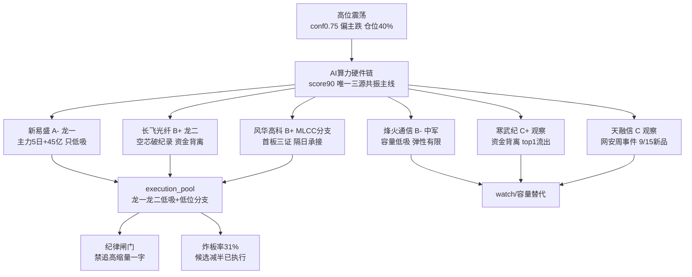

> ⚠️ **数据源时间说明**
> - 文件名交易日: **2026-09-14**(周一) · 量价/资金/估值基准: **2026-09-11 收盘**(最近已收盘交易日)
> - R2/R4 为 0914 盘前产出; R1/R7 数据日 0911; 一致口径无跨日错位

# 2026-09-14 · 📌 个股画像

> **数据源新鲜度**: partial
> **降级状态**: degraded(true · MCP 网关全 down / chart_vision 不可用 / R3 weflow down)
> **置信度**: 0.525 · 公式 0.75 × 0.7 × 1.0

## 📌 一句话结论
高位震荡(conf0.75 偏主跌·仓位上限 40%)环境下唯一三源共振主线 **AI 算力硬件链** 4 只 leaders + 2 只 secondary 观察。**新易盛**(A- 75 龙一·主力 5 日+45.12 亿全链第一)与**风华高科**(B+ 74 MLCC 低位分支龙一·0911 首板·机构+北向双买)为可执行核心;长飞光纤(B+ 72·空芯光纤破纪录但板块资金背离)低吸不追;烽火通信(B- 62 中军)容量低吸;寒武纪/天融信仅 watch。**纪律: 只做龙一龙二低吸与低位分支·禁追高缩量一字·炸板率 31% 候选减半已执行(6 只)**。

## 🧭 候选池总览
| 新易盛 `300502` | 龙一 | 75 A- 🟢 | 光模块全球龙头: 0911 主力净额+9.36亿(全板块第一)·5日+45.12亿 vs 股价+2.94%未涨停=高位分歧资金承接·浮筹5305亿容量核心; ROE 35.7%/净利yoy+91%基本面最硬·PE 44.96(1年11%分位不贵); 风险: 高位(423元)对利好钝化·股东户数半年+65%筹码分散·R3 判高位分歧兑现初期 → 只做回踩5日线低吸·高开>3%不追·跌破400降级 |
| 长飞光纤 `601869` | 龙二 | 72 B+ 🟢 | 空芯光纤龙头: 9/13 晚间 0.032dB/km 衰减破纪录(全球最低传输损耗)为次日增量催化·0911 已+8.78% 提前反映(收473.99); 主力5日+15.19亿(0911单日+5.79亿)·光纤概念热榜18→6(+12位); 净利yoy+889%(扭亏爆发·低基数); ⚠️ 光纤板块主力净流出-17.2亿(divergence: 热榜升位≠资金确认)·高开>5%不追·平开/小高开回踩可低吸·竞价顶高放弃 |
| 烽火通信 `600498` | 中军 | 62 B- 🟡 | 通信设备中军: 800G+空芯光纤实景验证(与长飞共振)·行业端通信设备 0911 主力+47.41亿(#1)/通信+44.32亿(#2); 位置低(40.75元 vs 新易盛423/长飞474)·float 518亿容量票·0911 主力+1.16亿; 但净利yoy-32.7%/ROE 1.1%基本面弱·PE 161.8(1年79%分位贵) → 高位震荡期容量低吸载体·弹性有限不追涨 |
| 风华高科 `000636` | 候补 | 74 B+ 🟢 | MLCC/被动元件分支龙一: 0911 首板涨停(55.99/+10%·13:37封·开板0次)·元件板块+3.11%涨幅全市场第一·被动元件+33.69亿/MLCC+28.28亿板块资金·MLCC热榜19→2(+17最强动量); 龙虎榜: 机构专用+2.86亿/深股通+1.44亿(净+2.92亿); float 642亿·位置低(55.99 vs 光模块423/474)=板块高低切核心承接; 全条链唯一'低位+资金+热榜'三证分支龙头 → 首板后隔日看承接: 弱转强可半路·高开秒板缩量一字不追 |
| 寒武纪 `688256` | 扩池观察 | 55 C+ 🟡 | 国产AI芯片龙头观察: R4 昇腾链叙事+华创'底部已至'核心资产清单+国联民生昇腾/寒武纪深度; 0911 主力+1.43亿逆势微流入(国产芯片板块-124.47亿流出); 但 30日-30.3% 深度回调(1588.97→1040)·PE 196(1年2.5%分位·历史极低); 大宗 0911 平价4笔(合计6178万·承接盘); ⚠️ R2 明确'有叙事无资金·只观察不建仓'·国产芯片-124.47亿 top1 流出+沐曦解禁占流通盘75% → 资金未回流前不参与·盯是否逆势放量突破 MA5 |
| 天融信 `002212` | 扩池观察 | 52 C 🔴 | 事件驱动观察: 2026国家网络安全宣传周 9/14 今日开幕+天融信AI防火墙首批证书+9/15 智能体安全新品锁定(R4 E007 high); 0911 +2.75% 主力+0.49亿·float 79亿小盘; ⚠️ 基本面差: 2026H1 亏损(净利yoy-322%·营收-34%)·PB 0.86破净; 无 L1 热榜/无板块资金确认(formation 第1天) → 按 R4 事件催化处理·盘中验证封单/资金·不预建仓·9/15 新品发布日为首板试探窗口 |

## 🔍 推理深度三问（Top 票）

### 📡 新易盛（A- · 75 · 龙一·光模块全球龙头）
- **大资金意图**: 0911 主力净额 **+9.36 亿**(全板块个股第一)+5 日 **+45.12 亿**=高位分歧中资金仍在坚定承接;大资金下注的是"1.6T 订单排到明年+光博会供不应求"的产业确定性,以 5305 亿流通容量票为承接载体;对手盘是高位兑现的先手盘(PCB/通信涨停端 lhb 诱多 46%·超声电子-2.04 亿机构兑现)。
- **为什么走强**: 位置=30 日高点 618.87 回撤-31.6% 深度回调后修复(pos30d 26.4% 中低位)·催化=E004 光博会供不应求(6 券商独立共振)+E003 算力一张网·筹码=股东户数半年 **+65%** 分散=散户进场→高位分歧但资金硬承接。
- **逻辑够不够硬**: 基本面最硬(ROE 35.7%/净利 yoy+91%/营收 yoy+100%)+资金最硬(+45.12 亿)双硬+三源共振(R3/R4/R7 全 ✓);证伪路径=0914 放量跌破 400 关口→高位筹码松动,或 9/17 美联储加息决议落地后成长股估值压制延续。

### 🏭 风华高科（B+ · 74 · MLCC 低位分支龙一）
- **大资金意图**: 0911 首板龙虎榜 **机构专用+2.86 亿/深股通+1.44 亿**(净+2.92 亿)=机构+北向双买·非游资独庄;大资金在做板块**高低切**: 光模块高位(新易盛 423/长飞 474)vs MLCC 低位(55.99),元件板块 +3.11% 涨幅全市场第一+被动元件+33.69 亿/MLCC+28.28 亿板块资金;对手盘是高位兑现的 PCB/通信机构(超声电子/逸豪新材净卖)。
- **为什么走强**: 位置=30 日高点 76.8 回撤-27.1% 低位启动(pos30d 47.1%)·催化=MLCC 热榜 19→2(+17 最强动量)+元件板块涨幅第一·筹码=首板 13:37 封·开板 0 次·封单 5.74 亿·换手 16.2% 充分换手=机构资金质量高。
- **逻辑够不够硬**: 三证(低位+资金+热榜)全命中=全条链唯一;硬证据=龙虎榜机构净买+板块资金 top4+热榜动量第一;证伪路径=0914 高开秒板缩量一字(无承接)→或板块炸板率破 40%→首板后隔日承接证伪。

### 🔦 长飞光纤（B+ · 72 · 龙二·空芯光纤）
- **大资金意图**: 0911 主力+5.79 亿(5 日+15.19 亿)下注"空芯光纤下一代方向"(9/13 晚间 0.032dB/km 破纪录·题材新鲜度高于 1.6T 订单);对手盘=光纤概念热榜升 12 位但**板块主力净流出-17.2 亿**(divergence)=先手资金借热榜出货。
- **为什么走强**: 位置=20 日+33.5% 强趋势·高位(距 30 日高点-12.7%)·催化=破纪录事件(9/13 晚间·次日增量)·筹码=股东户数半年 **+83%** 大幅分散=高位散户接盘特征→热榜动量 up 但资金背离。
- **逻辑够不够硬**: 题材硬(空芯光纤全球领先·与烽火实景验证共振)+净利 yoy+889%(扭亏爆发·低基数);证伪路径=0914 高开>5% 利好兑现冲高回落,或光纤板块主力继续净流出→分歧转退潮。

## 🧠 首推票思维链（4 段）

### 📡 新易盛（进 execution · 只低吸不追高）
- **买入理由**: ①主力 5 日+45.12 亿(全链第一·0911 单日+9.36 亿)资金承接硬 ②ROE 35.7%/净利 yoy+91%/PE 1 年 11% 分位=业绩确定性+估值不贵。
- **风险点**: ①高位票对存量利好钝化(0911 +2.94% 未涨停·板块分歧兑现初期) ②股东户数半年+65% 筹码分散 ③9/17 美联储加息决议负面压制(high)。
- **止损条件**: 跌破 **400**(30 日关键支撑·R2 t1_game 破位线)降级观察;回踩 5 日线(416)低吸对应止损距约-4%~-6%。
- **可验证假设**: 0914 回踩 5 日线不破且主力继续净流入→高位分歧蓄势成立(24h 可验);放量破 400→高位筹码松动证伪降级。

### 🏭 风华高科（进 execution · 首板后隔日看承接）
- **买入理由**: ①MLCC 低位分支龙一·全条链唯一"低位+资金+热榜"三证(机构+北向双买+板块资金 top4+热榜动量第一) ②位置低(55.99 vs 光模块 423/474)=板块高低切核心承接。
- **风险点**: ①首板后隔日不确定性(13:37 封板较晚=分歧首板) ②ROE 2.3% 周期底部特征·PE 157.9(74% 分位)偏贵 ③板块炸板率若破 40% 降档。
- **止损条件**: 回踩不破首板涨停价 **50.9** 为低吸前提·跌破则放弃;高开秒板缩量一字**不追**(无承接=诱多)。
- **可验证假设**: 0914 竞价低开→盘中弱转强(半路机会)或平开承接放量→二板成立(24h 可验);高开>5% 冲高回落→首板兑现证伪。

### 🔦 长飞光纤（进 execution · 平开/小高开回踩低吸·高开>5% 放弃）
- **买入理由**: ①空芯光纤破纪录(0.032dB/km 全球最低传输损耗·9/13 晚间增量催化)题材新鲜度最高 ②净利 yoy+889% 扭亏爆发+主力 5 日+15.19 亿。
- **风险点**: ①光纤板块主力净流出-17.2 亿(热榜升位≠资金确认·R3 divergence 明确) ②股东户数半年+83% 大幅分散 ③PE 113.99/PB 23.98 估值靠增速消化。
- **止损条件**: 回踩 5 日线 **434** 不破可低吸·破 434 且板块资金续流出→放弃;竞价高开>5% 不追(利好兑现风险)。
- **可验证假设**: 0914 平开/小高开回踩 434-450 承接放量→增量催化发酵(24h 可验);高开低走破 434→热榜出货证伪。

## 🕸️ 六维画像 · 主线联动图

## 📊 关键证据
- 新易盛: 0911 主力净额+9.36 亿(5 日+45.12 亿·全链第一) vs 股价+2.94% 未涨停 · 来源 tushare.moneyflow/R2
- 风华高科: 首板龙虎榜净+2.92 亿(机构专用+2.86 亿/深股通+1.44 亿)·13:37 封·开板 0 次 · 来源 tushare.top_list/limit_list_d
- 长飞光纤: 9/13 晚间空芯光纤 0.032dB/km 破纪录+光纤热榜 18→6(+12)·但板块主力净流出-17.2 亿(divergence) · 来源 R4/R3
- 烽火通信: 通信设备行业 0911 主力+47.41 亿(#1)·float 518 亿容量 · 但净利 yoy-32.7% 基本面弱 · 来源 R7/tushare.fina_indicator
- 寒武纪: 0911 大宗平价 4 笔(6178 万承接)但国产芯片板块-124.47 亿 top1 流出 · 来源 R7/tushare.block_trade
- 天融信: R4 E007 网安周 9/14 开幕+AI 防火墙证书+9/15 智能体新品 · 2026H1 亏损(F1 红旗) · 来源 R4/tushare.fina_indicator

## 数据源审计
| R2_main_sectors | 2026-09-14 | 🟢 | 4 leaders + secondary 2 观察 |
| R4_news | 2026-09-14 | 🟢 | 8 事件 · E004/E007 命中 |
| R7_capital_flow | 2026-09-11 | 🟡 | vibe 降级 · tushare fallback · 数据日为 0911 |
| R1_style | 2026-09-11 | 🟡 | 情绪 42 · 高位震荡 conf0.75 偏主跌 · 仓位 40% |
| R3_sentiment | 2026-09-14 | 🔴 | weflow down · L1 用 T-1 baseline |
| tushare.daily | 2026-09-11 | 🟢 | 53 交易日/票 ≥30 满足 |
| tushare.daily_basic | 2026-09-11 | 🟢 | PE/PB/市值 · 0911 收盘 |
| tushare.top_list | 2026-09-11 | 🟢 | 近10日窗口 · 风华命中 |
| tushare.block_trade | 2026-09-11 | 🟢 | 30 日窗口 |
| tushare.margin_detail | 2026-09-11 | 🟢 | 15 交易日 · 6 票全覆盖 |
| tushare.moneyflow | 2026-09-11 | 🟢 | 5/10 日主力净额 |
| tushare.stk_holdernumber | 2026-09-11 | 🟢 | 股东户数 · 最新 20260630 |
| tushare.fina_indicator | 2026-09-11 | 🟢 | 20260630 中报 |
| tushare.limit_list_d | 2026-09-11 | 🟢 | 龙头判定 · 风华首板 |
| tushare.research_report | 2026-09-11 | 🟢 | 近90日研报 · 新易盛/寒武纪覆盖 |
| canghai-charts.chart_vision | 2026-09-14 | 🔴 | MCP down · snapshot 不覆盖本池 · chart_degraded |
| fetch manifest / MCP 网关 | 2026-09-14 | 🔴 | global_severity=3 · tushare SDK 直连替代 |

## ⚠️ 不确定性 / 反证
- **chart_vision 不可用**(canghai-charts MCP down + snapshot 不覆盖本池): 技术形态维度用 tushare 30 日 K 自算(MA/量比/位置),strength 顶格 medium·无多周期视觉确认。
- **R2 缺 all_scored_boards_top10**: v1.4 扩池规则降级·从 secondary_lines 补天融信/寒武纪 2 只观察(composite 起步-3·仅 watch)·`r2_schema_missing_top10=true` 已记。
- **资金维数据日 0911**: 全部量价/资金/估值基准为 0911 收盘(最近已收盘交易日);0914 盘中资金流向需 P1 竞价/P2 午盘修订验证。
- **自身批判**: 新易盛"资金硬 vs 筹码分散"分歧结论依赖 0911 单日 moneyflow,若 0914 主力转流出应立即降级;长飞"题材新 vs 板块资金背离"同理,光纤板块续流出=证伪。
- **lhb 诱多 46%**(29/63): 高位兑现期·PCB/通信涨停端机构净卖(超声电子-2.04 亿)·R6 反证重点复核对象。

## 🔗 与其他 R 的关系
- 依赖: R2(候选池/主线 score) · R4(催化事件 E003-E005/E007) · R7(资金/龙虎榜/大宗) · R1(情绪/仓位上限) · R3(情绪共振·divergence 提示)
- 被消费: D1(main_decision_v1·execution_pool 依据 alpha_grade+leader_verdict+provenance) · R6(analyze_devil_advocate_v1·六维红旗/高位分歧反证) · E1(复盘·T+N 回填验证)

## 🤖 Sub-Agent 元数据
- skill: analyze_stock_profile_v1
- artifact: data/research/20260914/R5_stock_profiles.json
- 生成耗时: 约 20 分钟(6 票 tushare 8 接口 + PE 分位 + 六维组装)
- model: deepseek-v4-flash-ga-260731
