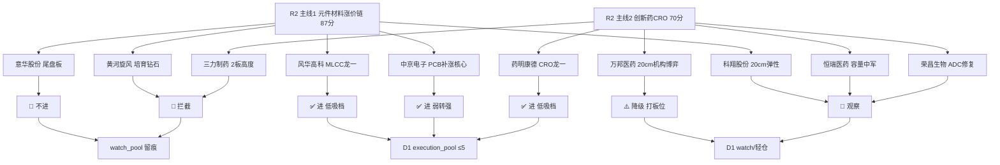

# 2026年09月15日 · **个股画像**

> **数据源新鲜度**: partial
> **降级状态**: degraded(true)
> **置信度**: 0.5
> **情绪背景**: 高位震荡(炸板率 35.3% 破 35% 纪律线 → 候选数砍半 · 只做龙一/龙二与低位补涨)

## 一句话结论

R2 两主线 10 只候选逐票六维画像完成：**主线1 元件材料涨价链(PCB/MLCC)资金地位龙一 风华高科 + 低位补涨核心 中京电子** 与 **主线2 CRO 龙一 药明康德** 为今日可执行档（3 票，低吸/弱转强，均禁追高）；万邦医药 降级为打板位；恒瑞/荣昌/科翔/意华 观察；**黄河旋风 与 三力制药 拦截**（开板8次资金背离+PB70负债94% / lhb涨停净卖出+商誉29.5%）。

## 📊 候选池全景（R2 → 六维 → 分档）

### 六维总分排序

| 排名 | 票 | 综合分 | 催化 | 筹码 | 联动 | 估值 | 技术 | 机构 | 态度 |
|---|---|---|---|---:|---:|---:|---:|---:|---:|---|
| 1 | 药明康德 | 75.1 | 85 | 75 | 80 | 70 | 68 | 75 | ✅进·低吸 |
| 2 | 风华高科 | 74.9 | 92 | 80 | 85 | 45 | 72 | 72 | ✅进·低吸 |
| 3 | 中京电子 | 68.3 | 80 | 68 | 80 | 35 | 78 | 65 | ✅进·弱转强 |
| 4 | 科翔股份 | 61.5 | 65 | 62 | 75 | 30 | 75 | 55 | 👀观察 |
| 5 | 恒瑞医药 | 60.3 | 70 | 50 | 70 | 72 | 45 | 70 | 👀观察 |
| 6 | 万邦医药 | 57.3 | 75 | 55 | 65 | 25 | 60 | 68 | ⚠️降级·打板 |
| 7 | 荣昌生物 | 53.8 | 65 | 45 | 60 | 55 | 50 | 55 | 👀观察 |
| 8 | 意华股份 | 50.0 | 60 | 45 | 45 | 50 | 55 | 45 | 🚫不进 |
| 9 | 黄河旋风 | 44.8 | 70 | 35 | 55 | 15 | 55 | 40 | 🚫拦截 |
| 10 | 三力制药 | 42.5 | 60 | 30 | 55 | 25 | 55 | 30 | 🚫拦截 |

## 🎯 推理深度三问（Top 分析对象）

### 风华高科（主线1·MLCC 龙一）

- **大资金意图**: 北向(深股通 0914 +1.47亿、3日 +4.39亿)在 MLCC 涨价+村田扩产 的产业逻辑下**接力承接**；而机构专用 0914 净卖 -8654.6万 —— 这是"机构高位兑现、外资接力"的换手格局，对手盘是追热点的散户(热榜#1 人气)。大资金把它当**容量中军**配置(642亿 float)，而非连板博弈。
- **为什么走强**: 位置=底部反转后站上全部均线(MA5/10/20 多头)、距20日高仅 -5.5% 属中高位；催化=电子布 G75 涨价 + 村田扩产20% + 大摩材料超级周期 三源共振(E008)；筹码=5日主力 +9.49亿 全链第一、连续两日正流入。三维同向 → 走强有支撑。
- **逻辑够不够硬**: 硬。催化三独立源(R4 新闻 × R7 资金 × R3 人气)全部指向同一方向，且 5日+9.49亿 是**资金行为实证**非预期。但证伪路径明确：①E003 费半-6% 外盘AI担忧传导压高端元件；②PE_ttm 166 估值贵，若 0915 高开低走即高位兑现；③0915 盘前已发异动公告=人气高位提示。

### 中京电子（主线1·PCB 低位补涨核心）

- **大资金意图**: 紫阳东路(武汉著名游资)0914 单票 +1.27亿 + 国新北京 +0.93亿 + 深股通 +0.22亿 —— 游资+北向+部分机构**低位建仓**；大单+特大单 +5.53亿 vs 全单净额≈0 → **主力买、散户卖**，筹码向主力集中(首板良性特征)。位置在链内最低(18.79 vs 超声 22.63 3板)。
- **为什么走强**: 位置=低位首板(30日 -12% 深调后)、10:26 封死 0 开板 强封；催化=PCB 涨价链+定增注册获批(扩产弹药)；筹码=多路资金进场+板块效应9家涨停。低位+强封+板块共振 → 补涨核心。
- **逻辑够不够硬**: 较硬。但有两点需 pushback：①5日全单净额 -2.0亿(前波 0904-0908 已板过=反复股，高位兑现盘仍在)；②H1 亏损(-591%)无业绩锚，纯涨价预期+资金驱动。证伪路径=板块炸板率破 40% 或 0915 承接失败破 18.79。

### 药明康德（主线2·CRO 龙一）

- **大资金意图**: 主力 0914 +6.63亿 全链第一、5日 +7.63亿 —— 在创新药出海 1200亿 事件催化下**回补 CRO 核心资产**；北向连续净流入背景(0914 大盘 +23.85亿)。对手盘是 30日深调后割肉离场的套牢盘 —— 修复行情的典型承接位。
- **为什么走强**: 位置=低位(30日 +26.9% 反转但距历史 180+ 仍远)、站上 MA5/10；催化=出海交易总额 +36% 硬数据 + 港股创新药ETF +4.79% 盘面验证；筹码=医药生物行业 R7 +28.98亿 全行业第一。修复日资金+催化+ETF 三确认。
- **逻辑够不够硬**: 硬。出海 1200亿(+36%) 是行业级硬数据、医药ETF 0914 当日最强 1.92% 盘面验证、资金 5日 +7.63亿 实证。证伪路径=①创新药概念 5日累计 -61亿 刚转正，0915 资金不再流入即一日游；②E002 加息 92.4% 压制高估值成长；③修复主线在科技扩散日弹性偏弱。

## 🧠 首推票思维链（进执行档 3 票 + 降级 1 票）

### 风华高科 000636.SZ

- **买入理由**: ①产业逻辑：MLCC 国产龙头直接受益村田扩产20%验证的 AI 服务器 MLCC 需求(E008)，涨价周期弹性第一；②资金实证：5日主力 +9.49亿 全链第一、深股通 3日 +4.39亿，北向持续接力。
- **风险点**: ①短期：PE_ttm 166 估值贵+热榜#1 出货 watch(R3 distribution_alert)，高开追高=接盘；②中期反证：机构专用 0914 净卖 -8654.6万，若外资停止接力则高位换手失败；E003 费半-6% 压制高端元件情绪。
- **止损条件**: 低吸 55.9-56.5 后收盘跌破 55.95(前高支撑/5日线)无条件降级 watch；若高开>3% 放弃本次买点(不追)。
- **可验证假设**: 24-72h 内观察 ①主力资金是否连续第 3 日净流入(>0)；②0915 若回调，回踩 5 日线 55.9-56.5 是否缩量企稳；③板块(MLCC/元件)涨停家数是否维持 ≥5。任一不成立 → 逻辑证伪，快切。

### 中京电子 002579.SZ

- **买入理由**: ①低位补涨核心：18.79 首板 10:26 封死 0 开板，链内位置最低(对比超声 3板 22.63)，是高位震荡期"低位补涨"纪律内的承接票；②多路资金实证：紫阳东路 +1.27亿 + 国新北京 +0.93亿 + 深股通 +0.22亿，大单买散户卖=主力建仓特征。
- **风险点**: ①短期：0915 隔日承接不确定，若板块炸板率破 40% 高开秒板缩量一字不追；②中期反证：H1 亏损(-591%)无业绩锚、5日全单净额 -2.0亿 前波兑现盘仍在，纯资金驱动行情一旦断板补跌快。
- **止损条件**: 承接 18.8-19.2 入场后，收盘跌破 18.79(首板涨停价)离场；弱转强半路入场则按 -4% 硬止损(18.3)。
- **可验证假设**: 24-72h 内观察 ①0915 竞价承接(高开 0-3% 属良性，高开>5% 警惕)；②板块 PCB 涨停家数维持 ≥5；③游资席位是否继续上榜。破首板价 → 证伪，隔日走。

### 药明康德 603259.SH

- **买入理由**: ①CRO 全球龙头是板块资金首选承接位(0914 主力 +6.63亿 全链第一、5日 +7.63亿)；②估值合理(PE_ttm 22.2、ROE 13.6、营收 +38.9%)，低位修复空间大(距历史高位 180+ 约 -12%)。
- **风险点**: ①短期：防御修复主线在科技扩散日弹性偏弱，若 0915 高开低走=修复一日游；②中期反证：创新药概念 5日累计 -61亿 刚转正(0914 单日 +16.18亿)，持续性未确认；E002 加息 92.4% 压制高估值成长。
- **止损条件**: 低吸 152-155 后收盘跌破 150(-5%)降级 watch；高开>3% 不追。
- **可验证假设**: 24-72h 内观察 ①0915 医药生物行业资金是否连续第 2 日净流入；②医药ETF 是否续强；③外盘 9/16 议息前风险偏好是否恶化。资金断流 → 一日游证伪。

### 万邦医药 301520.SZ（降级·仅打板位）

- **买入理由**: 机构专用 3日 +1.81亿 high synergy(R7 当日唯一 high 信号票)，20cm 弹性反包涨停。
- **风险点**: float 21亿 庄股风险高；30日 +105% 翻倍妖股±9% 剧烈震荡；0914 涨停板净流出 -0.70亿 出货迹象；H1 净利 -99.5% 盈利归零。
- **止损条件**: 仅打板位博弈：破 63.6 承接位或 -7%(59.0) 无条件离场，仓位 ≤ 单票上限一半。
- **可验证假设**: 24-72h 内观察 ①机构专用是否连续第 4 日净买(>0)；②LHB 是否继续高频出现；③量能是否维持 12万手+。机构撤离 → 立即证伪。

## 📋 全部候选快照（板型/龙头认定/盈亏比/禁止清单 四项）

| 票 | 板型 | 龙头认定 | 盈亏比(RR) | 禁止清单命中 | 态度 |
|---|---|---|---|---|---|
| 风华高科 | 趋势低吸(卡位/中军) | 主线1龙一·资金地位·板块涨停9家 | 低吸55.9-56.5/止损55.95(-5%)/目标62.5-65 · RR 2.1 | 无硬命中·禁追高(热榜#1) | ✅进·低吸 |
| 中京电子 | 首板隔日(低位补涨) | 主线1龙二·本波首板10:26封死·板块9家 | 承接18.8-19.2/止损18.3(-4%)/目标20.7-21.5 · RR 2.0 | 无硬命中 | ✅进·弱转强 |
| 药明康德 | 趋势低吸(容量核心) | 主线2龙一·资金地位·全链第一 | 低吸152-155/止损150(-5%)/目标168-172 · RR 3.0 | 无硬命中 | ✅进·低吸 |
| 万邦医药 | 20cm打板(机构博弈) | 主线2龙二·机构3日+1.81亿 | 承接63.6-65/止损59(-7%)/目标68-70 · RR 1.4 | 庄股风险·float21亿 | ⚠️降级·打板 |
| 科翔股份 | 20cm弹性(打板博弈) | PCB 20cm弹性·10:51封死 | 不预建仓 | PB26·负债75% | 👀观察 |
| 恒瑞医药 | 趋势低吸(容量中军) | 创新药龙头·SHR-2004受理 | 低吸41-42/止损41/目标45.5-47.5 · RR 2.5 | 下降趋势左侧 | 👀观察 |
| 荣昌生物 | 趋势低吸(低位修复) | ADC扭亏硬alpha·无板块效应 | 低吸112-115/止损112/目标125-132 · RR 2.5 | 无硬命中 | 👀观察 |
| 意华股份 | 尾盘首板(跟风) | 行业孤军·14:50尾盘板 | 不建仓 | **late_speculation**(14:50点火板) | 🚫不进 |
| 黄河旋风 | 分歧板(情绪博弈) | 培育钻石人气王·资金背离 | 不建仓 | **buy_after_fade**(5日-6.76亿) | 🚫拦截 |
| 三力制药 | 连板2板(高度博弈) | 板块最高连板·lhb涨停净卖出 | 不建仓 | **lhb_sell_on_limit**+商誉29.5% | 🚫拦截 |

## 🚨 风险与反证提示（供 R6 消费）

1. **黄河旋风(600172)**：0914 涨停但开板 8 次=分歧极大，5日主力 -6.76亿 资金背离，PB 70.5 + 负债率 94.6% + 净资产仅 3.4亿 —— 三重高危，R6 建议重点反证。
2. **三力制药(603439)**：0914 lhb **涨停净卖出** -1722万(R7 诱多 pattern) + 商誉/净资产 29.5% 近警戒线 + 主力5日 -0.78亿 —— 2板高度无资金背书。
3. **万邦医药(301520)**：0914 涨停板净流出 -0.70亿 + 盈利归零 + float 21亿 庄股风险 —— 机构信号 high 与出货迹象并存，降级处理。
4. **板块级**：炸板率 35.3% 破 35% 纪律线(情绪=震荡，候选数砍半)；R3 PCB 热榜#1 distribution_alert(霸榜第一永作反向，只做龙一/低位补涨)；E003 费半-6% 若 0915 高开低走=外盘映射杀；E002 美联储 9/16 议息(加息92.4%)压制高估值成长。

## 🔍 关键证据

- 风华 5日主力 +9.49亿/0914 +2.79亿(全链第一) · 来源 tushare moneyflow(net_mf)
- 中京 0914 席位：紫阳东路 +1.27亿、国新北京 +0.93亿、深股通 +0.22亿 · 来源 tushare top_inst
- 药明 0914 主力 +6.63亿/5日 +7.63亿(全链第一) · 来源 tushare moneyflow
- 万邦 机构专用 3日 +1.81亿 high synergy(R7 当日唯一 high) · 来源 R7 hot_money.synergy_flags
- 黄河旋风 0914 开板 8 次 + 5日主力 -6.76亿 · 来源 tushare limit_list_d + moneyflow
- 三力制药 0914 lhb 涨停净卖出 -1722万 · 来源 R7 lhb_bull_trap
- 板块资金：PCB +43.85亿#1 / MLCC +22.41亿#4 / 培育钻石 +18.18亿#7 / 医药生物 +28.98亿#1 · 来源 R7 main_force

## 📈 数据源审计

| 源 | 日期 | 状态 | 备注 |
|---|---|:--:|---|
| R2 主线板块 | 2026-09-15 | 🟢 | 10 票候选 · leader_filter_applied=true |
| R4 消息面 | 2026-09-15 | 🟢 | 8 事件 · E007/E008 主线催化 |
| R7 资金面 | 2026-09-15 | 🟢 | hot_money synergy + lhb_bull_trap + main_force |
| tushare/daily | 2026-09-14 | 🟢 | 10票 × 65日 K/量价 |
| tushare/limit_list_d | 2026-09-14 | 🟢 | 0914 全市场 100 家涨停 · 首封/开板/连板 |
| tushare/top_list+top_inst | 2026-09-14 | 🟢 | 15 交易日龙虎榜/机构席位 |
| tushare/block_trade | 2026-09-14 | 🟢 | 30 日大宗交易(风华1笔/药明7笔) |
| tushare/margin_detail | 2026-09-14 | 🟢 | 15 日两融 · 三力非两融标的 |
| tushare/fina_indicator+balancesheet | 2026-06-30 | 🟢 | H1 财务 + 商誉/审计 |
| tushare/pledge_stat+anns_d+report_rc | 2026-09-14 | 🟢 | 质押/公告/研报 |
| charts MCP | — | 🔴 | DOWN · chart_vision=null · chart_degraded=true 全 10 票 |
| 上游 R1/R3 | 2026-09-15 | 🟡 | KOL 5群全灭+WeFlow down · 情绪依赖量化 |

## ⚠️ 不确定性 / 反证

- **数据口径**：六维技术结论全部由 tushare 60日K 量化推得(charts MCP down)，缺多模态图表交叉验证；技术形态判定置信度下调一档。
- **上游缺口**：R1/R3 degraded 导致情绪/人气维依赖 R2/R4/R7 量化 artifact，L2/L3 舆论确认缺失。
- **反证自查**：本画像给"进"档的 3 票(风华/中京/药明)均存在可证伪路径(见各票可验证假设)；若 0915 板块炸板率破 40% 或外盘映射杀，执行档应整体降档为观察。黄河旋风/三力制药 的反证信号(R6 模式)最强，主控不得干预 R6 hard_reject。

## 🔗 与其他 R/D/E 的关系

- 依赖: data/research/20260915/R2_main_sectors.json · R4_news.json · R7_capital_flow_20260915.json
- 被消费: D1(main_decision_v1 执行池 3/5 票来源 + watch_pool) · R6(analyze_devil_advocate_v1 六维反证) · E1(daily_review_v1 画像回填)

## Sub-Agent 元数据

- skill: analyze_stock_profile_v1@1.5
- artifact: data/research/20260915/R5_stock_profiles.json
- 生成耗时: 约 35 分钟(含 tushare SDK 拉取 + 六维画像 + md)
- model: deepseek-v4-flash-ga-260731

