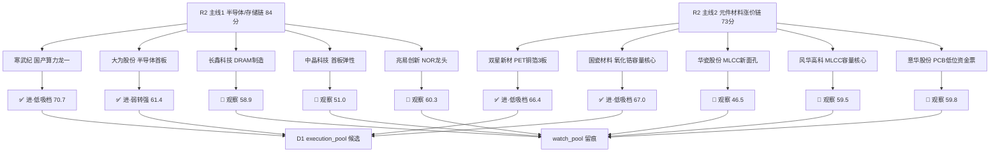

# 2026年09月16日 · **个股画像**

> **数据源新鲜度**: partial
> **降级状态**: degraded(true)
> **置信度**: 0.46(0.78 × 0.7 × 0.85)
> **情绪背景**: 高位震荡贴主跌边缘(R1 · 炸板率 42.86% 破 40% 退潮线 → 候选数砍半 · 只做龙一/龙二低吸 · 禁追高缩量一字)

## 一句话结论

R2 两主线 10 只候选六维画像完成：**寒武纪 / 国瓷材料 / 双星新材 三票进·低吸档（仅回踩不追高）+ 大为股份进·弱转强档**；其余 6 票全部观察（长鑫大宗折价 -15.19% 分销警报、兆易资金背离、风华高位兑现、华瓷当日澄清、中晶/华瓷小市值警戒、意华融券 +112%）。

## 📊 候选池全景（R2 → 六维 → 分档）

### 六维总分排序（composite = 0.20催化+0.20筹码+0.20联动+0.15估值+0.15技术+0.10机构）

| 排名 | 票 | 综合分 | 催化 | 筹码 | 联动 | 估值 | 技术 | 机构 | 态度 |
|---|---|---|---|---:|---:|---:|---:|---:|---:|---|
| 1 | 寒武纪 | 70.7 | 85 | 75 | 82 | 35 | 60 | 80 | 进(低吸档·仅回踩不追高) |
| 2 | 国瓷材料 | 67.0 | 78 | 70 | 76 | 40 | 60 | 72 | 进(低吸档·回踩不追高) |
| 3 | 双星新材 | 66.4 | 80 | 68 | 74 | 45 | 75 | 40 | 进(低吸档·仅回踩不追高) |
| 4 | 大为股份 | 61.4 | 78 | 62 | 72 | 30 | 70 | 40 | 进(弱转强/回踩不破首板价档) |
| 5 | 兆易创新 | 60.3 | 82 | 40 | 72 | 60 | 35 | 72 | 观察(不进) |
| 6 | 意华股份 | 59.8 | 60 | 62 | 62 | 45 | 72 | 55 | 观察(不进·等回踩或弱转强) |
| 7 | 风华高科 | 59.5 | 72 | 50 | 74 | 40 | 55 | 60 | 观察(不进·等资金回补) |
| 8 | 长鑫科技 | 58.9 | 85 | 35 | 68 | 55 | 35 | 78 | 观察(不进) |
| 9 | 中晶科技 | 51.0 | 75 | 55 | 70 | 45 | 72 | 35 | 观察(不预建仓) |
| 10 | 华瓷股份 | 46.5 | 70 | 45 | 60 | 50 | 70 | 35 | 观察(不预建仓·澄清票) |

> ⚠️ 两融无数据(非两融标的) 扣 10 分：中晶科技 51.0 / 华瓷股份 46.5。

## 🎯 推理深度三问（Top 分析对象）

### 寒武纪 688256.SH（主线1·国产算力总龙头）

- **大资金意图**: 5日主力(moneyflow_dc)+2.98亿 **5日全正** —— 在存储涨价+华为10万卡超节点叙事下，机构把它当**国产算力容量核心**低位承接(6765亿 circ)，而非连板博弈；大宗 11 笔机构专用平价接(1040元)佐证配置型买盘。对手盘是 950-1140 区间内的获利盘与 1075 元高价恐高盘。
- **为什么走强**: 位置=区间中枢站上 MA5/MA20(1050.9/1054.9)、MA60=1199.7 未破；催化=华为 3D 数据中心/10 万卡超节点(E001 high)+今日 07:30 开源超节点电话会时间锚；筹码=R3 热榜六细分同向+华创点名核心资产。三维同向但**未突破区间** → 强而不破。
- **逻辑够不够硬**: 硬。四独立源(R4 新闻×R7 资金×R3 人气×R2 主线)同向，5日资金全正是资金行为实证。但证伪路径明确：①E003 10Y 美债破 5% 压制高估值成长；②英伟达 5 日 -8.42% 映射断裂，外盘续跌则 A 股芯片高开低走；③半导体概念 5 日累计仍 -273.95 亿，0915 仅转正首日，资金不续即脉冲结束。

### 双星新材 002585.SZ（主线2·PET铜箔 3板龙一）

- **大资金意图**: 紫阳东路(3日2次)+温州帮(+8387万)席位接力 + 5日主力 +9.62 亿 —— **游资高位接力票**，赌的是 MLCC/氧化锆/PET铜箔 细分情绪延续；LHB 0915 +1.87亿/0914 +2.20亿 显示涨停板上有真实承接。对手盘是 3 板后追高的散户与 11 元下方获利盘。
- **为什么走强**: 位置=3 板创 20 日新高、站上全部均线；催化=PET铜箔#3 新进热榜+元件材料涨价链 KOL 共振；筹码=早盘 09:36 封死(开板1次 09:46 回封)+换手 22.25% 高位分歧。**高度+早封+资金** 三确认。
- **逻辑够不够硬**: 中硬。资金+人气硬，但基本面软(PB 1.64 但 ROE 0.55%/净利率 1.68% 盈利未兑现，PE_ttm None)，且 PCB 霸榜 2 日 high 出货警报(R3 红线4)若带崩材料链情绪，3 板票首当其冲。证伪路径=0916 材料链资金转负或放量跌破 11.0。

### 国瓷材料 300285.SZ（主线2·氧化锆容量核心）

- **大资金意图**: 5日主力 +6.84 亿(0914 +7.32 亿主升) —— 在东曹断供→氧化锆国产替代叙事下(村田 10 月'大概率'普调涨价/三环'确定'涨)，机构**把 568 亿容量核心当高低切承接位**；华瓷(涨停)已澄清未批量供货 → 资金转向有粉体产能的国瓷。对手盘是 63-67.5 区间内的套牢盘。
- **为什么走强**: 位置=站上 MA5/MA20(63.2/64.2)、MA60=70.41 压制未破；催化=KOL 对日替代点名+MLCC 5日 +53.94 亿强净入；筹码=8 笔大宗平价机构对倒中性。**资金温和建仓而非抢筹** → 趋势型而非情绪型。
- **逻辑够不够硬**: 较硬。产业逻辑(东曹断供+涨价传导)真实，资金 5 日强净入实证；但 PE_ttm 103.5 高估+商誉 16.9%(F2) 是中期包袱，且业绩(H1 净利 +9.4%)尚未兑现叙事。证伪路径=0916 放量跌破 63 支撑或材料链整体退潮。

## 🧠 首推票思维链（进档 4 票）

### 寒武纪 688256.SH · 进(低吸档)

- **买入理由**: ①国产算力总龙头，华为 10 万卡超节点(E001)是板块级硬催化，寒武纪是机构资金首选承接位；②5日主力 +2.98 亿 5 日全正(算力大票唯一持续流入)，大宗 11 笔机构平价接，配置盘在场。
- **风险点**: ①PE_ttm 203/PB 49.9 极贵，10Y 美债破 5% 下估值敏感；②外盘英伟达 5 日 -8.42% 映射断裂，高开冲高易被兑现；③半导体概念 5 日累计 -273.95 亿，资金转正仅 1 日。
- **止损条件**: 放量跌破 990(区间中枢失败，-5.3%)降级 watch；或跌破 950 区间下沿离场。
- **可验证假设**: 0916 半导体/存储概念主力净流入≥+20 亿 且寒武纪主力净流入为正 → 主升窗口打开；若概念资金转负或寒武纪高开>3% 后冲高回落 → 兑现信号，降档。

### 国瓷材料 300285.SZ · 进(低吸档)

- **买入理由**: ①氧化锆国产替代硬逻辑(东曹断供+村田 10 月涨价传导)，华瓷澄清后资金唯一粉体承接位；②5日主力 +6.84 亿 + 62 份研报机构共识(摩根大通'MLCC 产业链势头强劲')，568 亿容量核心。
- **风险点**: ①PE_ttm 103.5 高估、商誉 16.9%(F2)；②0915 +1.22% 未涨停，资金温和=弹性弱于情绪票；③E003 利率冲击压制高估值成长。
- **止损条件**: 放量跌破 60.9(-5.2%)降级 watch；跌破 63 支撑(60 分 MA20/MA60 共振)减半。
- **可验证假设**: 0916 放量突破 67.5(15 分阶段小高)且 MLCC 概念资金续正 → 升级半路档；若缩量回落 63 下方 → 区间震荡延续，仅低吸不追。

### 双星新材 002585.SZ · 进(低吸档·仅回踩)

- **买入理由**: ①3 板=元件材料链细分最高板，09:36 早盘封死，高度+带动性确认龙头；②紫阳东路+温州帮游资席位 + 5日主力 +9.62 亿，涨停板上有真实承接。
- **风险点**: ①3 板高位+换手 22.25%+股东户数 +11.85% 筹码分散；②PCB 霸榜 2 日 high 出货警报(R3 红线4)若带崩材料链情绪，高度票首当其冲；③基本面软(ROE 0.55%)无业绩锚。
- **止损条件**: 放量跌破 11.0(3 板低吸位，-6.3%)降级 watch；回踩不破 3 板开盘价可持有。
- **可验证假设**: 0916 材料链(MLCC/氧化锆)资金续正且双星回踩 5 日线(11.3-11.6)不破 → 4 板预期成立；若高开>3% 或竞价顶一字 → 禁追(高位震荡末期缩量一字=接盘)。

### 大为股份 002213.SZ · 进(弱转强/回踩档)

- **买入理由**: ①半导体链首板共振，0915 首板 10:19 封死 0 开板，涨停日主力 +2.10 亿(半导体涨停票资金第一)；②芯片概念 0915 涨停 7 家板块效应成立，低位 61 亿弹性。
- **风险点**: ①PE_ttm 358.7 无基本面背书，纯情绪/资金票；②融资余额 15 日 -25.96% 杠杆未跟随，资金成色弱；③高位震荡末期炸板率 42.86%，首板隔日承接不确定。
- **止损条件**: 回踩不破首板涨停价 29.49；破 28.5(-5.0% 相对 30.0)离场。
- **可验证假设**: 0916 竞价低开→盘中弱转强(资金真金回流) → 半路进场成立；高开秒板缩量一字或板块炸板率破 50% → 降档观察。

## 👀 观察清单（不进档 6 票 · 触发条件）

| 票 | 不进原因 | 升档触发 |
|---|---|---|
| 长鑫科技 688825 | 技术 60/15m 空头排列 + 5日主力 -40.9 亿 + 大宗折价 -15.19%(分销警报) | 站稳 56 + 主力转正第 2 日 |
| 兆易创新 603986 | 日K/60m/15m 空头排列 + 5日主力 -38.9 亿(单日转正未确认) | 连续 2 日主力转正 |
| 风华高科 000636 | 0915 主力 -4.85 亿高位兑现 + 股东户数 +23.07% 筹码大幅分散 | 连续 2 日主力转正 |
| 意华股份 002897 | 业绩负增长 + 融券余额 +112.87% + PCB 霸榜出货 watch | 回踩 70 且资金续正 |
| 中晶科技 003026 | circ 44.1 亿 <50 亿庄股警戒 + RR 1.3 | 晋级 2 板且资金续正 |
| 华瓷股份 001216 | R4 当日澄清 MLCC 粉体未批量供货 + circ 40.6 亿 | 澄清落地后资金真金确认 |

## 数据源审计

| 源 | 日期 | 状态 | 备注 |
|---|---|:--:|---|
| tushare SDK 直连(daily/daily_basic/limit_list_d/moneyflow_dc) | 2026-09-15 | 🟢 | 0915 收盘全量 · 10 票 × 12 API 全 ok |
| canghai-charts MCP(chart_vision_analyze) | 2026-09-16 | 🟢 | 10/10 出图+多模态 · 昨日降级项今日恢复 |
| R2 主线板块 | 2026-09-16 | 🟢 | 2 主线 10 leaders · leader_filter_applied |
| R4 消息面 | 2026-09-16 | 🟡 | 8 events · hithink/vibe MCP down → llm_pure_no_verification |
| R7 资金面 | 2026-09-16 | 🟡 | 北向/主力/游资 ok · 两融 0915 未落库用 0914 |
| R3 情绪 | 2026-09-16 | 🟡 | KOL 2/5 群 · WeFlow 永久下线 · 4 源共振方向一致 |
| tushare 两融(margin_detail) | 2026-09-14 | 🟡 | 中晶/华瓷 非两融标的无数据 → vibe_trading_degraded=true 扣 10 分 |
| tushareMcp / hithink / vibe-trading MCP | - | 🔴 | timeout>45s · 本 session 用 SDK 直连 + canghai-charts 代偿 |

## 不确定性 / 反证

1. **资金口径差异已对齐**: tushare 官方 moneyflow 与东财 moneyflow_dc 在 4 只小票(大为/双星/华瓷/中晶)方向相反，本画像以 moneyflow_dc(与 R2/R7 上游一致)为筹码维度主源 —— 若东财口径对主力单划分偏宽，小票资金强度可能高估。
2. **两融数据 T-1**: 0915 两融未落库，margin 维度用 0914；中晶/华瓷非两融标的直接扣分，未做替代验证。
3. **chart_vision 多模态为辅助**: 10 票图表结论与 tushare 量化指标(MA/volR/区间)已交叉核对，但 15m/60m 周期对隔日博弈的指导力有限，仅作方向参考。
4. **R1 高位震荡贴主跌边缘是总约束**: 炸板率 42.86% 破 40% 退潮线 → 本画像 4 张进档票全部标"仅回踩/弱转强"且 RR 中枢 1.7-2.4，D1 需按纪律 §4(RR<2 降级 watch)二次闸门。
5. **上游降级残留**: R3 KOL 3/5 群缺失 → 氧化锆/存储 KOL 共振仅 2 群佐证；华瓷/风华"高位澄清"以 R4 单源为准，若 0916 资金仍强封则澄清证伪需重新评估。

## 与其他 R 的关系

- 依赖: R2(候选池与主线评分) · R3(情绪共振/人气) · R4(催化事件) · R7(资金验证) · tushare SDK 0915 收盘 + canghai-charts 10/10
- 输出被下游使用: **R6 反证**(fundamental_flags/leader_verdict/distribution_alert 消费) · **D1 主决策**(六维分/态度档/rr_estimate 构建 execution_pool)

## Sub-Agent 元数据

- skill: analyze_stock_profile_v1
- artifact: data/research/20260916/R5_stock_profiles.json
- 生成耗时: 约 18 分钟(数据拉取 + 10×chart_vision + 六维组装)
- model: deepseek-v4-flash-ga-260731
