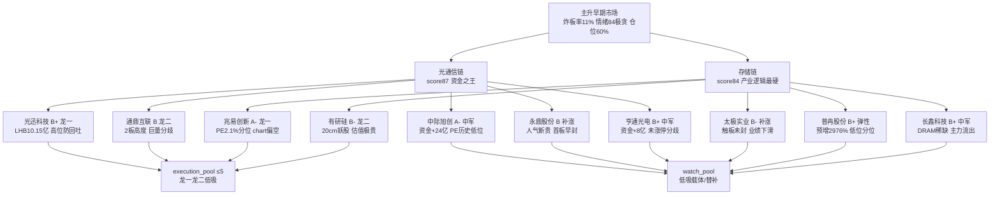

> ⚠️ **数据基准**
> - 文件名交易日: **2026-09-17** · 量价/资金/估值基准: **2026-09-16 收盘**(T-1)
> - 技术面: 兆易创新/普冉股份 用 canghai-charts 快照 chart_vision(含 0916 收盘); 其余 8 票 chart MCP 本会话不可用 → chart_degraded=true·技术维度降级为 30 日 K 自算(MA/pos30d/量比/涨停史)
> - 影响: D1 消费时以 0916 收盘为 execution 基准

# 2026-09-17 · 📌 个股画像

> **数据源新鲜度**: partial
> **降级状态**: degraded(true · R3 L1-only / R7 vibe fallback / chart 快照 2/10)
> **置信度**: 0.62

## 📌 一句话结论
双主线 10 只候选:**光通信链**(中际旭创 A- 全球龙头资金之王/光迅科技 B+ 龙一龙虎榜第1·高位追高防回吐/通鼎互联 B 高度龙高位巨量分歧/永鼎 B 人气新贵)与**存储链**(兆易创新 A- 产业龙一历史最低PE·chart偏空只低吸/长鑫科技 B+ 国产DRAM中军·主力巨量流出/普冉 B+ 预增2976%低分位/有研硅 B- 妖股估值极贵)。主升早期(炸板率11%·情绪84极贪)纪律:每条主线只龙一/龙二进 execution(光迅/通鼎·兆易/有研硅),候补仅 watch;⚠️ 极贪84+反转首日次日回吐风险 → 0917 防高开低走,高开>5% 一律不追。

## 🧭 候选池总览
| 票 | 角色 | 综合/等级 | 一句话 |
|---|---|---|---|
| 中际旭创 `300308` | 候补 | 79 A- 🟢 | 全球光模块龙头/板块中军(1.07万亿市值·907元高价)：0916 +5.07%放量214.7亿·主力5日+24.15亿(0916 +24.4亿)·PE 52.3处1年6.6%分位=历史低位+净利yoy+241.7%基本面最硬+R4 E002首推；⚠️ 高位907元+股东户数+33%分散+PB 26.8极高→ 只低吸(回调MA5 892承接)不追高开·2029上市偏叙事·兑现节奏需跟踪 |
| 兆易创新 `603986` | 龙一 | 79 A- 🟢 | NOR Flash全球前三龙头/存储容量核心：R4 E005首推(美光512GB DDR5+2028前无新增供应+英飞凌NOR退出)·PE 33.1处1年2.1%分位=历史最低+净利yoy+1091%基本面最硬；⚠️ chart_vision 偏空0.75(日K空头排列·MA20 386.58压制·MA60 472高压)+pos30d 7.1%低位+股东户数+48%分散→ 只低吸不追高·突破MA20 386.58才转强·破355.55存储逻辑证伪 |
| 光迅科技 `002281` | 龙一 | 74 B+ 🟢 | 光通信容量核心/龙一：0916 涨停(10:35 早封·0开板·封单3.4亿)+龙虎榜净买10.15亿全市场第1+主力0916转正+3.08亿·通信设备6家涨停行业第1；⚠️ 高位185元(PE 132.6·1年71.2%分位偏贵)+股东户数半年+68%分散+5日主力仍-15.53亿(前期出货待接续验证)→ 只做竞价平开/回踩承接半路·高开>5%不追·打板需封单确认 |
| 亨通光电 `600487` | 候补 | 72 B+ 🟢 | 光纤/光缆大票中军(1613亿市值·65.4元)：0916 +4.77%未涨停·主力5日+8.18亿(0916 +15.07亿)·attention persistent 180天+R3 光纤 suggested；⚠️ 未涨停=分歧·ret10 -2.2%高位滞涨·股东户数Q2跳增+208%(20260415口径异常待核)→ 趋势票只低吸不追板·板块加速则补涨 |
| 长鑫科技 `688825` | 候补 | 72 B+ 🟢 | 国产DRAM稀缺龙头(总市值3.7万亿权重级中军·55.1元)：中报预增+2244~2544%(earnings_cross_hits命中)·R4 E005直接受益(美光2028前无新增供应)·ROE 81%基本面之王；⚠️ 主力5日-47.25亿巨量流出(0916 +7.66转正)+PB 27.8极高+上市仅38日→ 权重中军·只低吸·不打板·板块加速则补涨 |
| 普冉股份 `688766` | 候补 | 71 B+ 🟢 | NOR+EEPROM存储+中报预增+2976%硬alpha(R4 E005次选)：PE 59.7处1年4.7%分位低位+ROE 28.7%业绩最硬；⚠️ chart_vision 震荡0.65(日K空头·MA20 404.3压制·15分多头·低吸390/高抛405)+股东户数+26%分散+主力5日-2.63亿→ 高位398元688票·仅板块确认后低吸·禁追高 |
| 通鼎互联 `002491` | 龙二 | 68 B 🟡 | 光通信高度龙(2连板·0915首板→0916 2板=链内最高)+双平台人气第1(dc#1+ths#1)+游资3席协同(章盟主3日2次·R7 synergy)+中报预增+3293~4768%硬alpha；⚠️ 0916 67亿巨量(换手24.5%)+11:24午后封板+开板6次=高位分歧·LHB 0916净卖-385万(前日+8.35亿兑现)·股东户数+57%→ 只做弱转强确认(竞价强+快速上板)·低开破24.45不接·高位巨量控仓 |
| 永鼎股份 `600105` | 候补 | 67 B 🟡 | 光纤人气新贵：0916 涨停(10:07 早封·0开板·封单6.42亿)+主力5日+10.11亿(0916 +5.12亿)·attention surge 89→2(+87位 人气爆发最强)+R3 光纤 suggested #1；⚠️ PE 158(63%分位)贵+股东户数+26%分散→ 首板次日常有分歧·半路/打板确认·低开承接弱则观望 |
| 有研硅 `688432` | 龙二 | 63 B- 🟡 | 半导体材料(硅片)弹性龙二：0916 20cm涨停(10:09 早封·开板1次·封单2.15亿)+LHB净买7.06亿(全市场第3)+半导体材料资金+39.4亿(行业#6)；⚠️ PE 285.9处1年98.3%分位=一年最贵+ROE仅2.9%业绩撑不起+股东户数+125%大幅分散+30日8次涨停=妖股→ 20cm高波动·只做竞价强回踩承接·高开>10%不追·隔日兑现纪律严格 |
| 太极实业 `600667` | 候补 | 62 B- 🟡 | 存储+先进封装双属性：0916 +6.98%(14:44触板未封·开板1次)·attention surge 38→5(+33位人气爆发)·主力0916 +7.75亿大幅转正；⚠️ 未封板+PE 96.9(90.9%分位贵)+业绩下滑(or_yoy-14.9/np_yoy-3.5)+负债73.3%→ 人气surge未兑现·弱转强确认或低吸·不追高开 |

## 🔍 推理深度三问（Top 票）

### 🔦 中际旭创（A- · 79 · 光模块全球龙头）
- **大资金意图**: 主力 5 日 **+24.15 亿**(0916 +24.4/0911 +36.85 亿)在 907 元高位持续吸筹,PE 52.3 处 1 年 **6.6% 分位=历史低位**+净利 yoy+241.7%=业绩最硬;大资金下注的是苹果 NVLink 重返服务器带来的光互连需求外溢,对手盘是高位解套盘(股东户数+33% 分散)。
- **为什么走强**: 位置=站上 MA5/MA10/MA20(907.8 vs MA20 873.5)·催化=R4 E002 首推(美股 Lumentum+9.53% 直接映射)·筹码=融资 318.82 亿稳定+换手 2.16% 惜售→资金强筹码稳。
- **逻辑够不够硬**: 全球光模块龙头+R4 首推+41 篇研报三硬;证伪路径=2029 上市偏叙事兑现节奏慢,或高估值成长遭美联储加息(E001/E007)情绪压制,907 元高位回踩 MA5 892 失守则转弱。

### 💾 兆易创新（A- · 79 · NOR 存储产业龙一）
- **大资金意图**: 主力 5 日 **+4.96 亿**(0915 +9.31/0916 +6.61 转正)+融资 15 日 -9.7% 杠杆出清=筹码沉淀;PE 33.1 处 1 年 **2.1% 分位=历史最低**+净利 yoy+1091%=产业逻辑最硬;大资金赌的是美光 2028 前无新增供应+英飞凌 NOR 退出的供需缺口兑现。
- **为什么走强**: 位置=pos30d 7.1% 低位但日 K 空头排列(chart_vision 偏空 0.75·MA20 386.58 压制·MA60 472 高压)·催化=R4 E005 首推·筹码=融资出清+大宗 4 笔小额。
- **逻辑够不够硬**: 产业逻辑(供需缺口)+业绩(1091%)双硬,但技术最弱(chart 偏空)→只低吸不追高;证伪路径=跌破 355.55 前低存储涨价逻辑证伪,或 0917 存储板块分歧高位票最先承压。

### 🔦 光迅科技（B+ · 74 · 光通信龙一/容量核心）
- **大资金意图**: LHB 0916 净买 **10.15 亿=全市场第 1**(资金之王)+10:35 早封 0 开板=抢筹;但 5 日主力仍 **-15.53 亿**(前期连续流出·0916 才转正 +3.08 亿)=旧主力兑现 vs 新资金接力的切换节点,大资金对手盘是高位解套盘(股东户数+68% 分散)。
- **为什么走强**: 位置=放量大阳突破站上 MA5/MA10/MA20·催化=E002 苹果 NVLink+通信技术板块资金+223 亿·筹码=龙虎榜资金第 1+封单 3.4 亿。
- **逻辑够不够硬**: 板块资金+龙虎榜双硬,但 PE 132.6(71% 分位)+ROE 仅 4.75% 估值保护一般;证伪路径=1456 亿大票弹性受限,高开>5% 接盘风险,或 5 日主力持续流出证伪接续。

## 🧠 首推票思维链（4 段）

### 🔦 中际旭创（候补·低吸载体 → 可升 execution）
- **买入理由**: ①全球光模块龙头+PE 1 年 6.6% 分位历史低位 ②主力 5 日+24.15 亿资金之王+净利 yoy+241.7% 业绩最硬 ③R4 E002 首推+41 篇研报覆盖。
- **风险点**: ①907 元高价票+股东户数+33% 分散 ②2029 上市偏叙事·兑现节奏慢 ③美联储加息对高估值成长负面对撞。
- **止损条件**: 跌破 MA5 **892** 减仓·跌破 60 分前低(约 860 区间)止损;低吸位 892-905 对应止损距约-5~-7%。
- **可验证假设**: 0917 高开≤5% 且 10:30 前主力净流入转正→延续成立;放量跌破 892→资金改道证伪。

### 💾 兆易创新（龙一·只低吸不追高）
- **买入理由**: ①NOR 存储全球前三+PE 1 年 2.1% 分位历史最低 ②R4 E005 首推(美光 2028 无新增供应+英飞凌 NOR 退出)③净利 yoy+1091% 业绩最硬+融资杠杆出清。
- **风险点**: ①chart_vision 偏空 0.75·日 K 空头排列 MA20 386.58/MA60 472 双重压制 ②股东户数+48% 分散 ③370+ 高位,板块分歧最先承压。
- **止损条件**: 跌破前低 **355.55** 止损(存储逻辑证伪);低吸位 365-373 对应止损距约-5~-8%。
- **可验证假设**: 3 日内放量站上 MA20 **386.58**→空翻多成立;缩量回踩 355.55 不破→蓄势延续,破位→证伪。

### 🔦 光迅科技（龙一·竞价平开/回踩承接·高开>5% 不追）
- **买入理由**: ①LHB 净买 10.15 亿全市场第 1+10:35 早封 0 开板=资金抢筹 ②光通信容量核心(1456 亿流通)+板块资金通信技术+223 亿。
- **风险点**: ①5 日主力仍-15.53 亿=旧主力兑现切换未完成 ②PE 132.6(71% 分位)+ROE 4.75% 估值保护弱 ③股东户数+68% 分散。
- **止损条件**: 跌破 MA5 **176.4** 减仓·跌破涨停日开盘 169 止损;回踩承接位 176-180 对应止损距约-5~-6%。
- **可验证假设**: 0917 竞价平开/小幅低开且承接强→半路成立;高开>5% 冲高回落→接盘风险证伪。

### 🟡 通鼎互联（龙二·只做弱转强确认·高位控仓）
- **买入理由**: ①2 连板=链内最高高度+双平台人气第 1(dc#1+ths#1)②游资 3 席协同(章盟主 3 日 2 次)③中报预增+3293~4768% 硬 alpha。
- **风险点**: ①0916 67 亿巨量(换手 24.5%)+11:24 午后封板+开板 6 次=高位分歧 ②LHB 0916 净卖-385 万(前日+8.35 亿兑现)③股东户数+57% 分散。
- **止损条件**: 破 2 板开盘 **24.45** 不接·低开无承接即放弃;若进场止损距-5% 内严格。
- **可验证假设**: 0917 竞价强+快速上板→弱转强延续;低开破 24.45→分歧转退潮证伪。

## 🕸️ 六维画像 · 主线联动图

## 📊 关键证据
- 中际旭创: 主力 5 日 +24.15 亿(0916 +24.4 亿)+PE 52.3 处 1 年 6.6% 分位+41 篇研报 · 来源 tushare.moneyflow/daily_basic/report_rc
- 光迅科技: LHB 0916 净买 10.15 亿全市场第 1+10:35 早封 0 开板 · 来源 tushare.top_list/limit_list_d
- 通鼎互联: 2 连板(0915+0916)+67 亿巨量换手 24.5%+游资协同(章盟主 3 日 2 次) · 来源 tushare.limit_list_d/R7.hot_money
- 兆易创新: PE 33.1 处 1 年 2.1% 分位=历史最低+净利 yoy+1091.5%+chart_vision 偏空 0.75 · 来源 tushare/R5 chart 快照
- 长鑫科技: 中报预增+2244~2544%(R4 earnings_cross_hits)+主力 5 日-47.25 亿巨量流出(0916 +7.66 转正) · 来源 R4/tushare.moneyflow
- 有研硅: PE 285.9 处 1 年 98.3% 分位=一年最贵+ROE 仅 2.9% · 来源 tushare.daily_basic/fina_indicator

## 数据源审计
| 源 | 日期 | 状态 | 备注 |
|---|---|---|---|
| R2_main_sectors | 2026-09-17 | 🟢 | 10 候选 · 双主线 |
| R4_news | 2026-09-17 | 🟢 | 8 事件 · E002/E005 命中 |
| R7_capital_flow | 2026-09-17 | 🟡 | vibe 降级·tushare fallback |
| R1_style | 2026-09-17 | 🟢 | 连板情绪型 84 · 仓位 60% |
| R3_sentiment | 2026-09-17 | 🔴 | weflow down · L1-only |
| tushare.daily | 2026-09-16 | 🟢 | ≥38 交易日/票满足 |
| tushare.daily_basic | 2026-09-16 | 🟢 | PE/PB/市值/PE 分位 |
| tushare.top_list | 2026-09-16 | 🟢 | 73 行 · 光迅/通鼎/有研硅命中 |
| tushare.block_trade | 2026-09-16 | 🟢 | 30 日窗口 |
| tushare.margin_detail | 2026-09-16 | 🟢 | 融资趋势 |
| tushare.moneyflow | 2026-09-16 | 🟢 | 5 日主力 |
| tushare.fina_indicator | 2026-09-16 | 🟢 | 20260630 中报 |
| tushare.limit_list_d | 2026-09-16 | 🟢 | 104 行 · 龙头判定 |
| tushare.report_rc | 2026-09-16 | 🟢 | 研报覆盖 10 票 |
| chart_vision_snapshot | 2026-09-17 | 🟡 | 2/10 覆盖(兆易/普冉) |

## ⚠️ 不确定性 / 反证
- **chart_vision 覆盖不足**: canghai-charts MCP 本会话不可用,仅 2/10 候选有 fetch 快照(兆易/普冉);其余 8 票技术维度降级为 30 日 K 自算,形态判断(突破/回调)置信度下降,已按 skill v1.1 置 chart_degraded=true + strength cap medium,D1 消费时技术维度权重应下调。
- **股东户数口径异常**: 亨通(20260415 19.2万→20260630 59.1万 +208%)/太极(20260618 17.8万→20260630 54.9万 +208%)/长鑫(上市后 345.7万) 跳增疑似口径变动,已标注待 E1 核,筹码集中度判断不可靠。
- **资金维未完全确认**: 光迅 5 日主力仍-15.53 亿(仅 0916 转正),通鼎 0916 LHB 净卖-385 万(前日+8.35 亿兑现),有研硅 5 日-1.34 亿,长鑫 5 日-47.25 亿巨量流出——龙头资金切换与兑现并存,0917 盘中需验证主力真流入。
- **反转首日回吐风险**: R2 提示 0916 涨停 89 家含大量超跌反抽成分+极贪 84,0917 高开低走防追高;本批 10 只中 6 只 0916 涨停/大涨,追高风险集中。
- **自身批判**: 中际旭创/兆易 A- 依赖 0916 单日资金+低位 PE 分位,若 0917 板块分歧高位票最先承压;通鼎"弱转强"结论依赖竞价验证,未验证前不可作执行依据。

## 🔗 与其他 R 的关系
- 依赖: R2(候选池/主线 score) · R4(催化事件) · R7(资金/龙虎榜/游资协同) · R1(情绪/仓位上限) · R3(情绪共振背景)
- 被消费: D1(main_decision_v1·execution_pool 依据 alpha_grade+leader_verdict) · R6(analyze_devil_advocate_v1·六维红旗与高位分歧反证) · E1(复盘·T+N 回填验证)

## 🤖 Sub-Agent 元数据
- skill: analyze_stock_profile_v1
- artifact: data/research/20260917/R5_stock_profiles.json
- 生成耗时: 约 20 分钟(10 票全维度 tushare 拉取 + 快照 chart_vision + 研报检索)
- model: deepseek-v4-flash-ga-260731
