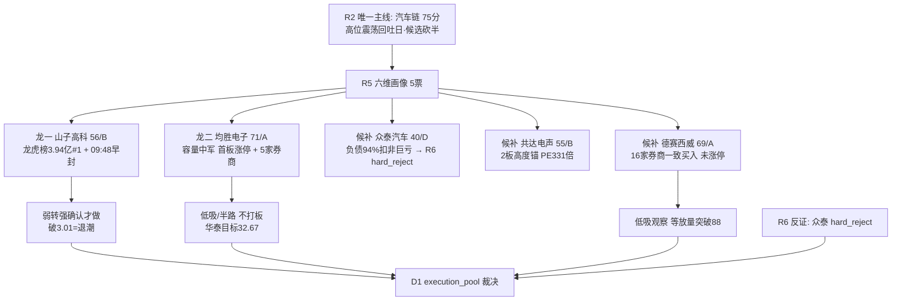

# 2026-09-18 · **个股画像**

> **数据源新鲜度**: partial
> **降级状态**: true(chart_vision MCP 不可用 · stk_holdernumber 空)
> **置信度**: 0.53(0.75 × 0.7 × 1.0 = 0.525 → 0.53)

## 一句话结论

**均胜电子(71/A)与德赛西威(69/A)是唯一两只基本面+资金+机构三重扎实的票；山子高科(56/B)是纯游资人气核心、只做弱转强不做左侧；众泰汽车(40/D)财务濒危标记 R6 hard_reject 候选；共达电声(55/B)331 倍 PE 只作高度锚观察。**

## 详细分析

### 候选池构建(v1.4 扩池规则)

R2 输出 5 只 leaders(龙一山子高科 / 龙二均胜电子 / 候补众泰·共达·德赛西威)，**≥3 无需扩池**，全部 `provenance.source = r2_leader_pool`。R2 高位震荡回吐日已按纪律把主线收缩至 1 条(汽车链 75 分)、候选砍半，R5 不重复收缩。

### 六维评分矩阵

| 票 | 角色 | 催化 | 筹码 | 板块联动 | 估值安全 | 技术 | 机构 | composite | alpha |
|---|---|---|---|---|---|---|---|---|---|
| **均胜电子** | 龙二 | 65 | 68 | 85 | 62 | 68 | 80 | **71** | **A** |
| **德赛西威** | 候补·低位中军 | 72 | 55 | 60 | 78 | 55 | 92 | **69** | **A** |
| 山子高科 | 龙一 | 55 | 88 | 90 | 25 | 70 | 10 | 56 | B |
| 共达电声 | 候补·高度锚 | 60 | 72 | 70 | 15 | 78 | 35 | 55 | B |
| 众泰汽车 | 候补 | 45 | 62 | 55 | 8 | 65 | 5 | 40 | D |

### 龙头判定(leader_verdict · v1.5)

| 票 | 高度 | 封板时间 | open_times | 首板距今 | 板块宽度 | 判定 |
|---|---|---|---|---|---|---|
| 山子高科 | 4天2板 | 09:48 ⏰早 | 1 | 2天 | 8家涨停 | ✅**龙头**(人气) |
| 均胜电子 | 首板 | 13:17 尾盘 | 0 | 1天 | 8家涨停 | ✅龙二/容量中军 |
| 共达电声 | 2连板 | 10:28 秒板 | 0 | 2天 | 7家涨停 | ✅高度龙(补涨锚) |
| 众泰汽车 | 8天5板中断 | 10:51 | **3** ❌ | 4天 | 8家涨停 | ⚠️分歧弱/补涨 |
| 德赛西威 | 未涨停 | — | — | — | 8家涨停 | ⚠️低位中军 |

### 各票关键证据

**🟢 均胜电子(600699.SH)** — 容量中军逻辑最完整
- 0917 首板涨停 19.87(+10.02%)，13:17 尾盘封板 open_times0，量比 2.86 放量突破 30 日阴跌通道(21.0→17.8)
- 个股主力净入 +1.05 亿(超大单净买 3.4 亿)，换手仅 3.93% 温和
- 5 家券商 8 月底密集覆盖：华泰买入(目标 **32.67** = 现价 +64%)/中泰买入/国海增持/国信优于大市/中金跑赢行业(25.9)
- pe_ttm 22.5 / pb 1.86 估值合理；**风险**：Q2 单季净利 yoy -19.9% 增速转弱(F6 medium)

**🟢 德赛西威(002920.SZ)** — 机构共识最扎实但资金未进场
- 16+ 家券商一致看多(中银深度买入/申万宏源/东吴/国盛买入·银河/平安推荐·中金跑赢行业目标 115.6·东方目标 120.96)，目标价 107-121 = 现价 84.43 **+27%~43%**
- 0908 公告：惠州产投/惠州创投**受让股份 + 股东提前终止减持** = 国资/产业资本入主治理利好
- 0917 放量反弹 +3.5%(量比 1.7)企稳 80-88 箱体，但**未涨停 = 资金未大举进攻**
- pe_ttm 20.4 / pb 3.14 / ROE 19.6%(2025) / 负债 46.8%，5 票中基本面最扎实，fundamental_flags=[]

**🟡 山子高科(000981.SZ)** — 游资人气核心但两融剧烈
- 龙虎榜净买 **3.94 亿全市场第 1**，紫阳东路 +1.78 亿/量化打板/T 王 3 席合力；09:48 早封 4 天 2 板(up_stat 2/4)
- 个股超大单净买 +8.9 亿；但**两融剧烈**：0915 融资买入 4.18 亿 → 0916 还款 2.58 亿 → 0917 再买 1.9 亿，杠杆盘分歧极大
- 基本面深度亏损：扣非 ROE -12.13% / 净利 yoy -85.7% / 经营现金流为负 → **纯情绪票，估值无锚**
- 0915 媒体报道澄清公告(中性)；高位宽幅震荡(0916 -9.27% ↔ 0917 +9.85%)，只做竞价弱转强确认

**🟡 共达电声(002655.SZ)** — 高度锚：2 连板秒板
- 0916/0917 二连板，10:28 秒板 open_times0 一致性强，30 日 +82% 主升(22.37→40.77)
- 5 日龙虎榜净买 +1.83 亿(量化打板)+ 超大单净买 2.37 亿；但 **PE_ttm 331 倍 / 中报净利 -68%** 极端高估
- 仅中邮证券 7/31 首次关注买入(2026E PE 159.79)；作板块高度锚观察 3 板晋级，不进 execution

**🔴 众泰汽车(000980.SZ)** — 财务濒危标记 hard_reject 候选
- 8 天 5 板低价妖股(2.37 元)，0917 涨停但 open_times3 盘中反复开板 = 分歧大
- **F11 司法冻结历史**(0904 破产企业财产处置账户股份冻结/解除公告) + **F2 扣非 ROE -98.2% 巨亏** + V2 pb 61.3 负债率 94%
- 0915/0910 连续异常波动公告(交易所关注)；无机构参与，纯游资/量化打板博弈 → R6 应 hard_reject

## 关键证据

- 证据 1: 均胜 0917 首板涨停 19.87 · 量比 2.86 · 华泰目标 32.67 · 来源 tushare daily + report_rc
- 证据 2: 德赛西威 16+ 家券商一致买入目标 107-121 · 0908 国资受让终止减持 · 来源 tushare report_rc + anns_d
- 证据 3: 山子龙虎榜净买 3.94 亿全市场第 1 · 紫阳东路+1.78 亿 · 来源 R7 hot_money + tushare top_list
- 证据 4: 众泰 0904 司法冻结公告 + 扣非 ROE -98.2% · 来源 tushare anns_d + fina_indicator
- 证据 5: 共达 2 连板 10:28 秒板 · PE_ttm 331 倍 · 来源 tushare limit_list_d + daily_basic
- 证据 6: 板块宽度 8 家涨停(汽车零部件行业第 1) · 来源 R2 + tushare limit_cpt_list

## 推理深度三问(首推 top 票)

### 🟢 均胜电子(600699.SH)

- **大资金意图**: 板块容量中军(277 亿流通)+ 0917 首板放量涨停(量比 2.86/主力净入 1.05 亿)——大资金借 Robotaxi 商业化预期在低位(30 日阴跌 21→17.8)卡位容量核心, 意图是"板块行情起来时承接不了妖股的资金全往容量票走"; 对手盘是 8 月 20-21 平台套牢盘与 9 月前 2 周阴跌割肉盘, 涨停突破后套牢盘转解套抛压
- **为什么走强**: 位置(30 日新低附近 17.8 起涨=超卖反弹)+ 催化(R4 E007 Robotaxi medium + 板块资金 +37.08 亿 #1)+ 筹码(超大单净买 3.4 亿/换手仅 3.93% 温和=惜售)——三因子共振, 尾盘封板 open_times0 显示收盘资金态度坚决
- **逻辑够不够硬**: 有硬证据链(板块资金三连号 + 涨停潮 + 券商 5 家覆盖 + 华泰目标 32.67 高于现价 64%), 属于"资金+叙事+机构"三源共振而非单点; **证伪路径**: Q2 单季净利 -19.9% 若引发中报后业绩下修, 或板块资金次日转出(汽车行业 persist=1 未验证多日), 则首板涨停次日低开即证伪

### 🟢 德赛西威(002920.SZ)

- **大资金意图**: 国资/产业资本(惠州产投/创投)0908 受让股份 + 股东提前终止减持, 是产业资本在 80-84 区间主动承接的信号; 机构 16 家一致买入目标 107-121, 是"拿订单兑现 Robotaxi/域控渗透率"的长线配置逻辑, 与游资短炒不同
- **为什么走强**: 位置(30 日阴跌 96→80 后 80-88 箱体企稳)+ 催化(Robotaxi 商业化 + 治理变更双利好)+ 筹码(0917 放量反弹 +3.5% 主力净入 7823 万)——但**未涨停 = 资金未形成合力进攻**, 这是它 vs 山子/均胜的本质区别
- **逻辑够不够硬**: 基本面最硬(ROE 19.6%/负债 46.8%/Q2 净利 +16.6% 环比改善)+ 机构共识最密, 但**短线逻辑不够硬**(无涨停无资金潮); 对短线 D1 而言只能低吸观察等放量突破 88, 对波段是右侧启动前埋伏位

## 每票思维链

### 🟢 均胜电子(600699.SH)

- **买入理由**: ① 板块容量核心, 妖股资金溢出承接位(277 亿流通给足流动性) ② 首板涨停突破 30 日阴跌通道, 华泰目标 32.67 = 现价 +64% ③ 5 家券商 8 月底集中覆盖, 2026E PE 16-19 倍估值合理
- **风险点**: ① Q2 单季净利 yoy -19.9% 业绩拐点未确认(F6) ② 尾盘 13:17 封板而非早封, 弱于山子 09:48 的卡位强度, 板块若分歧它首当其冲 ③ 高位震荡日炸板率 29.85% 下容量票涨停次日溢价不确定
- **止损条件**: 跌破 18.06(昨收/涨停起跳位)→ 当日立即止损; 若回踩 17.8(0916 低)不破且缩量可视为洗盘, 破 17.8 无条件走
- **可验证假设**: 24-72h 内板块资金(汽车行业)是否连续第 2 日净入前三(若转出=接力熄火); 0918 竞价溢价 ≥2% 且量比 ≥1.5 视为资金认可, 低开或平开缩量则观察

### 🟢 德赛西威(002920.SZ)

- **买入理由**: ① 智驾域控龙头, Robotaxi 商业化最纯正受益(R4 E007 首推) ② 0908 国资受让 + 股东终止减持治理利好 ③ 16 家券商一致买入, 目标价中位 ~112 = +33%
- **风险点**: ① 未涨停无资金合力, 板块熄火则继续阴跌(80 箱体下沿破位) ② 换手仅 1.36% 流动性低, 大票弹性弱于妖股 ③ 高位震荡日追高容量票的盈亏比差
- **止损条件**: 跌破 80.18(0916 低)→ 箱体破位止损; 短线不追 88 上方(前高密集区), 只在 84-86 低吸或放量突破 88.5 确认后介入
- **可验证假设**: 24-72h 内是否放量(量比 ≥2)站上 88.5; 汽车链若续强 3 日而它仍未涨停, 说明资金聚焦在妖股/中军, 德赛西威补涨证伪降级 watch

### 🟡 山子高科(000981.SZ)

- **买入理由**: ① 龙虎榜净买 3.94 亿全市场第 1(紫阳东路+1.78 亿 3 席合力) ② 09:48 早封 4 天 2 板, 人气 surge 25→2 双平台 ③ 板块汽车零部件 8 家涨停宽度第一
- **风险点**: ① 两融剧烈(0915 买 4.18 亿→0916 还 2.58 亿)杠杆盘随时翻脸 ② 基本面深度亏损(扣非 ROE -12.13%)无估值锚 ③ 高位宽幅震荡(0916 -9.27% ↔ 0917 +9.85%), 高位震荡日炸板风险高
- **止损条件**: 破 3.01(昨收)= 分歧转退潮立即走; 竞价低开且无承接(封单 <3 亿)不接刀
- **可验证假设**: 0918 竞价是否高开 ≥3% 且量能配合(弱转强延续); 若平开/低开且龙虎榜席位次日净卖 → 游资一日游证伪, 降级 watch

### 🟡 共达电声(002655.SZ)

- **买入理由**: ① 板块最高连板 2 板高度锚, 10:28 秒板 open_times0 一致 ② 5 日龙虎榜净买 1.83 亿 + 超大单净买 2.37 亿
- **风险点**: ① PE_ttm 331 倍极端高估 ② 中报净利 -68% 业绩塌方 ③ 30 日 +82% 已充分透支, 高位巨量换手 10.1% 随时分歧
- **止损条件**: 3 板晋级失败(炸板或次日不涨停)→ 高度锚失效观察; 破 37.06(2 板起跳位)止损
- **可验证假设**: 0918 是否 3 板晋级且板块汽车电子涨停 ≥5 家(高度打开); 若断板则高度锚失效, 板块高度回落至 1 板

### 🔴 众泰汽车(000980.SZ)

- **买入理由**: 无(标记 R6 hard_reject 候选)——低价 8 天 5 板纯情绪, 不构成可交易逻辑
- **风险点**: ① F11 司法冻结历史(破产重整背景) ② F2 扣非 ROE -98.2% 巨亏 ③ 负债率 94% 濒危 ④ 0915/0910 连续异常波动公告(监管关注)
- **止损条件**: 禁入 execution_pool; 若 D1 误纳入, 破 2.15 无条件止损
- **可验证假设**: R6 反证是否 hard_reject(依 fundamental_flags F11+F2 应 yes); 该票结论=拦截

## 数据源审计

| 源 | 日期 | 状态 | 备注 |
|---|---|:--:|---|
| tushare daily / daily_basic | 2026-09-17 | 🟢 | 5 票 × 34 日 K 线 · 估值/市值全量 |
| tushare limit_list_d | 2026-09-17 | 🟢 | 5 票涨停专题(first_time/open_times/up_stat) |
| tushare top_list / margin_detail / moneyflow | 2026-09-17 | 🟢 | 龙虎榜/两融 15 日/资金流 8 日 |
| tushare block_trade | 2026-09-17 | 🟢 | 30 日全空(5 票均无大宗) |
| tushare fina_indicator / report_rc / anns_d | 2026-09-17 | 🟢 | 财务 3 期/研报 3 月/公告 9 月 |
| tushare stk_holdernumber | — | 🔴 | 接口返回空数组(股东户数缺失) |
| chart_vision MCP (canghai charts) | — | 🔴 | 本会话不可用 → chart_degraded=true(以 30 日真实 K 线定量替代) |
| R2 / R4 / R7 上游 | 2026-09-17/18 | 🟡 | R2 partial(R3 场景 E L1-only) |

## 不确定性 / 反证

1. **chart_vision 全票降级**：技术形态维度无多模态识图交叉，30 日 K 线定量分析(趋势/量价/关键位)为单源，形态结论(底部首板/高位反包/主升)置信度打折
2. **股东户数缺失**：筹码结构缺少"户数连续下降=机构吸筹"维度，只能靠龙虎榜/两融/资金流三角替代
3. **山子两融剧烈**：0915→0916 融资 4.18 亿→还款 2.58 亿，杠杆盘极不稳定，龙虎榜 3.94 亿净买可能在次日被 T 出(高位震荡日游资一日游风险)
4. **德赛西威未涨停**：16 家券商共识 vs 资金未进攻的背离——若板块续强它补涨，若板块熄火它继续阴跌，不能因机构共识就提前重仓
5. **均胜 Q2 转弱**：华泰目标 32.67 基于 2026E EPS 1.18，但 Q2 单季 -19.9% 说明业绩拐点未确认，涨停次日低开概率低但上方套牢密集(8 月 20-21 平台)

## 与其他 R 的关系

- 依赖: R2_main_sectors(候选池) · R4_news(E007 催化) · R7_capital_flow(资金验证)
- 输出被下游使用: D1(main_decision_v1 消费 execution_pool 候选 + alpha_grade) · R6(analyze_devil_advocate_v1 反证 · 众泰 hard_reject 候选 · fundamental_flags 透传模式七)

## Sub-Agent 元数据

- skill: analyze_stock_profile_v1
- artifact: data/research/20260918/R5_stock_profiles.json
- 生成耗时: ~45 秒(数据拉取) + md 渲染
- model: deepseek-v4-flash-ga-260731
