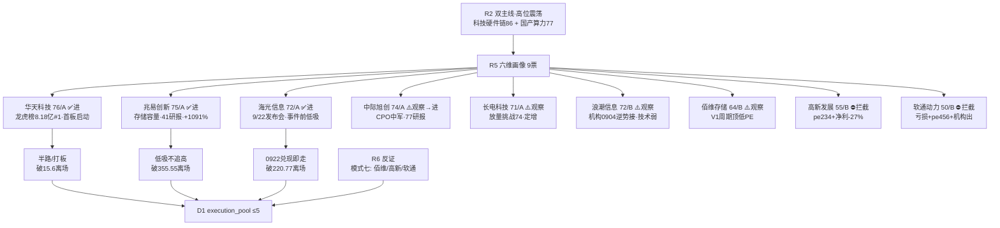

# 2026-09-21 · **个股画像**

> **数据源新鲜度**: partial
> **降级状态**: true(chart_vision MCP 不可用 · 30 日 K 线定量替代)
> **置信度**: 0.53(0.75 × 0.7 × 1.0 = 0.525 → 0.53)

## 一句话结论

**华天科技(76/A·龙虎榜 8.18 亿全市场第 1)与海光信息(72/A·9/22 发布会 T+1)是两条主线的资金最硬锚；兆易(75/A)/中际(74/A)/长电(71/A)做容量承接；浪潮/佰维观察、高新/软通拦截(基本面估值双弱)。**

## 详细分析

### 候选池构建(v1.4 扩池规则)

R2 输出 **9 只 leaders**(科技硬件链 5: 华天龙一·兆易龙二·长电/佰维/中际候补; 国产算力 4: 海光龙一·浪潮龙二·高新/软通候补),**≥5 无需扩池**,全部 `provenance.source = r2_leader_pool`。R2 文件缺 `all_scored_boards_top10` 字段 → `r2_schema_missing_top10=true`(标记供 E1 统计·不影响候选池)。R2 高位震荡日已按纪律把主线收缩至 2 条(≥70 硬门槛)、否决 PCB(资金净出 -60.19 亿),R5 不重复收缩。

### 六维评分矩阵

| 票 | 角色 | 催化 | 筹码 | 板块联动 | 估值安全 | 技术 | 机构 | composite | alpha | 建议 |
|---|---|---|---|---|---|---|---|---|---|---|
| **华天科技** | 龙一 | 85 | **90** | 88 | 70 | 80 | 45 | **76** | **A** | ✅进 |
| **兆易创新** | 龙二 | 78 | 70 | 82 | 75 | 62 | 85 | **75** | **A** | ✅进 |
| 中际旭创 | 候补·中军 | 68 | 72 | 80 | 68 | 65 | **90** | **74** | **A** | ⚠️观察→进 |
| **海光信息** | 龙一 | **92** | 68 | 80 | 45 | 58 | 88 | **72** | **A** | ✅进(事件前) |
| 长电科技 | 候补·容量 | 72 | 65 | 75 | 62 | 68 | 82 | **71** | **A** | ⚠️观察 |
| 浪潮信息 | 龙二 | 75 | 70 | 74 | 72 | 55 | 85 | **72** | **B** | ⚠️观察 |
| 佰维存储 | 候补·弹性 | 80 | 60 | 72 | 55 | 55 | 60 | **64** | **B** | ⚠️观察 |
| 高新发展 | 候补·弹性 | 70 | 65 | 68 | **30** | 78 | 20 | **55** | **B** | ⛔拦截 |
| 软通动力 | 候补·补涨 | 62 | 45 | 60 | **20** | 50 | 65 | **50** | **B** | ⛔拦截 |

### 龙头判定(leader_verdict · v1.5)

| 票 | 高度 | 封板时间 | open_times | 首板距今 | 板块宽度 | 判定 |
|---|---|---|---|---|---|---|
| 华天科技 | 首板 | 10:02 ⏰早封 | 1 | **1 天(启动日)** | 半导体 7 家涨停 | ✅**龙头**(带动性最强) |
| 兆易创新 | 未涨停 | — | — | — | 半导体 7 家 | ✅容量中军(波段) |
| 中际旭创 | 未涨停 | — | — | — | 通信设备 2 家 | ✅中军(容量压舱) |
| 海光信息 | 未涨停 | — | — | — | 半导体 7 家 | ✅事件核心(时间锚) |
| 长电科技 | 未涨停 | — | — | — | 半导体 7 家 | ⚠️联动/助攻 |
| 浪潮信息 | 未涨停 | — | — | — | IT设备 0 家 | ⚠️事件联动(整机) |
| 高新发展 | 当前波未涨停(上波 0902 首板) | — | — | — | 建筑 0 家 | ⚠️弹性补涨·无板块效应 |
| 佰维存储 | 未涨停 | — | — | — | 半导体 7 家 | ⚠️弹性候选(20cm) |
| 软通动力 | 未涨停 | — | — | — | 软件 0 家 | ⚠️补涨·无板块效应 |

### 推理深度三问(首推票)

**华天科技(002185.SZ)**

- **大资金意图**: 机构专用席位 0918 净买 **+10.04 亿**(买 11.16/卖 1.11 亿)+ 龙虎榜整体净买 8.18 亿全市场第 1,这不是游资一日游,是机构借 PCB 退潮(-60.19 亿)做板块内高低切、抢先进封装卡位;对手盘是 0917 恐慌抛售的散户(0917 -2.73%)。
- **为什么走强**: 位置=30 日横盘箱体 15.6-18.0 蓄势后首板放量突破(量比 1.7);催化=长鑫第五代量产(硬时间锚)+ 存储涨价周期(硬业绩);筹码=股东户数 Q2 86.3 万较 Q1 40.3 万翻倍(散户进场后机构接力)。
- **逻辑够不够硬**: 硬——三独立源共振(R2 五源主线 + R7 半导体概念 +207 亿/封测行业 +50.8 亿 + 龙虎榜机构真金白银);硬业绩(封测中报暴增)+ 硬时间锚(长鑫 0920 官宣)双具备。证伪路径: 板块高度不足(半导体最高 2 板科森),若 0921 高标无承接、华天高开低走兑现,则高低切逻辑提前结束。

**海光信息(688041.SH)**

- **大资金意图**: 9/22 发布会是明确的资金日历锚,事件前 1 日是"买预期"窗口;数字芯片设计行业 +75.35 亿#3 显示内资已提前卡位;对手盘是发布后兑现的获利盘——所以纪律是"0922 高开不追、兑现即走"。
- **为什么走强**: 位置=30 日 -16.9% 深度回调(290→241)后 0918 放量修复(vol 1.4);催化=E003 1000 系列 CPU+机器人芯片新品类(high·时间锚);筹码=股东户数仅 +23%(机构票·筹码稳定)。
- **逻辑够不够硬**: 硬但估值透支——事件真实(发布会),但 pe_ttm 178.6/PEG≈3.6 + E001 宏观负面(bearish_scope 含 AI 算力/半导体)是硬压制;独立源共振仅 2 个(R4+R2),R7 无概念级 top10 确认。证伪路径: 发布会不及预期=当日兑现;或 E001 紧缩升级压制高估值成长。

### 各票关键证据

**🟢 华天科技(002185.SZ)** — 资金最硬的一只
- 0918 首板涨停 18.03(+10.01%),10:02 早封/open_times 1/**首板启动日(板块这轮第 1 天上榜=带动性最强)**,半导体行业涨停 7 家板块效应成立
- 龙虎榜净买 **+8.18 亿全市场第 1/55**(net_rate 12.81%,买 12.32/卖 4.14 亿)·机构专用席位净买 +10.04 亿(买 11.16/卖 1.11 亿)
- 主力 5 日净入 +4.9 亿(0918 单日 +3.30 亿)·pe_ttm 46.2/pb 3.15·H1 净利 +259%/营收 +35% 业绩扎实
- 30 日横盘箱体放量突破(ma5 16.7 > ma20 16.5 金叉)·支撑 15.6·压力 18.03(=涨停价·突破确认)
- ⚠️ 研报仅 3 篇(机构覆盖低但真金白银进场)·股东户数翻倍筹码分散

**🟢 兆易创新(603986.SH)** — 存储容量锚·机构共识硬
- 0918 +4.95%(388.18)未涨停·主力净入 +1.39 亿·5 日 +2.25 亿
- pe_ttm 34.5/pb 7.33·H1 roe 24.4%/净利 +1091%/营收 +179%——增长质量全板块第一梯队
- 41 篇研报(买入 27)·6 月底密集买入评级;两融 172 亿高位微降 3.7%(无杠杆踩踏)
- ⚠️ 技术未突破: ma5 370 < ma20 384·前高 398 压力;只能低吸不能追高

**🟢 海光信息(688041.SH)** — 事件核心·T+1 时间锚
- 9/22 深圳发布会(1000 系列 CPU+机器人芯片)·事件前最后交易日=低吸窗口
- 0918 +4.04% 放量修复(vol 1.4)·主力净入 +0.50 亿·大宗机构活跃(0911 机构间 1503 万/0907 平安金田路买 1609 万)
- 70 篇研报(买入 41)·5611 亿流通龙头
- ⚠️ pe_ttm 178.6 高估(V2·PEG≈3.6)+ E001 宏观负面压制·30 日 -16.9% 深度回调未收复 ma20(238)

**🟡 中际旭创(300308.SZ)** — CPO 中军·机构覆盖最高
- 77 篇研报(买入 33)·机构大宗 4 笔活跃(0909 机构间 1690 万)·0901 回购方案自证低估
- ma5 893 > ma20 872 多头·30 日 +7.2%;但近 5 日高位宽幅震荡(0914 -5.7% ↔ 0916 +5.1%)
- ⚠️ 高位震荡特征·只做低吸(破 947.6 确认·破 836 离场)

**🟡 长电科技(600584.SH)** — 封测容量·放量挑战前高
- 0918 +7.75%(73.0)量比 2.52 放量·主力净入 +1.24 亿·挑战前高 74
- 0904 定增预案(关联方认购=产业资本入局·摊薄与利好并存)·50 篇研报(买入 38)
- ⚠️ pe_ttm 67.4 高于华天 46·ma5 < ma20 未金叉·候补不单独追

**🔴 高新发展(000628.SZ)** — 拦截
- pe_ttm 234.5 + H1 净利 -27.5%/营收 -34.4% + 负债 79.8% + 研报 0 篇
- 30 日 +55% 强势多头但无板块效应(建筑 0 家涨停)+ 小容量 116 亿游资博弈
- 仅情绪加速时的 20cm 弹性参与,否则拦截

**🔴 软通动力(301236.SZ)** — 拦截(禁止清单命中)
- H1 扣非 -3.87 亿亏损(F2)+ pe_ttm 455.6(V2)+ 控股股东质押 13.5%(F11 weak)
- 大宗 0821 6.36 亿(游资席位接·机构/券商席位卖)= 机构出货迹象
- 华为生态补涨逻辑不足以覆盖基本面,拦截

### 每票思维链(首推/执行池顶部)

**华天科技 — 买入理由 / 风险点 / 止损条件 / 可验证假设**
- **买入理由**: ①产业逻辑: 长鑫第五代量产+存储涨价→先进封装/封测景气,PCB 退潮资金直接承接者;②数据锚: 龙虎榜净买 8.18 亿全市场第 1+机构席位净买 10 亿+主力 5 日 +4.9 亿,资金硬度 9 票第一。
- **风险点**: ①板块高度不足(半导体最高 2 板·科森),若 0921 高标无承接则普涨转分化;②股东户数 Q2 翻倍筹码分散,一旦高开低走抛压大;③E001 宏观负面将半导体列入 bearish_scope。
- **止损条件**: 收盘跌破 15.6(箱底)即逻辑失效离场;或涨停次日高开低走破分时均线减半。
- **可验证假设**: 0921 若高开 >3% 且 30 分钟内封板/量能承接(封单 >5 亿)→ 高低切成立;若高开低走、封板打开超 3 次 → 兑现日,板块内高低切逻辑提前证伪。

**海光信息 — 买入理由 / 风险点 / 止损条件 / 可验证假设**
- **买入理由**: ①事件锚: 9/22 发布会(1000 系列 CPU+机器人芯片)为硬时间锚,事件前 1 日是"买预期"窗口;②容量+机构: 5611 亿流通龙头+70 篇研报(买入 41)+数字芯片设计行业资金 +75.35 亿#3。
- **风险点**: ①pe_ttm 178.6/PEG≈3.6 高估+E001 bearish_scope(AI 算力/半导体)双压制;②30 日 -16.9% 深度回调后仅弱修复(ma5<ma20),若 0921 资金不跟随则高度受限;③"买预期卖兑现"惯性——发布会当日高开即兑现风险。
- **止损条件**: 收盘跌破 220.77(0914 低)离场;0922 发布会后高开低走破分时均线即走,不讲故事。
- **可验证假设**: 0921 主力资金净流入 >+1 亿且站稳 245 上方 → 事件发酵成立;发布会当日(0922)若高开 <3% 且缩量承接 → 超预期概率大;高开 >5% 放量滞涨 → 兑现。

**兆易创新 — 买入理由 / 风险点 / 止损条件 / 可验证假设**
- **买入理由**: ①产业逻辑: NOR+MCU 双轮存储涨价直接受益,长鑫量产带动国产替代;②基本面: H1 净利 +1091%/roe 24.4%+41 篇研报(买入 27)= 机构共识最硬容量票。
- **风险点**: ①技术未突破(ma5<ma20·前高 398),追高即接盘;②两融 172 亿高位,杠杆盘情绪反转时踩踏风险。
- **止损条件**: 收盘跌破 355.55(0914 低)离场。
- **可验证假设**: 0921 若放量站回 398 上方 → 突破确认可加;若板块高开但兆易弱于华天(涨幅 <2%)→ 容量票未获资金,降级 watch。

**中际旭创 — 买入理由 / 风险点 / 止损条件 / 可验证假设**
- **买入理由**: ①CPO 主线(热榜#3+资金 +141.91 亿)+昇腾集群上线带动需求;②77 篇研报(买入 33)+机构大宗活跃+公司回购自证。
- **风险点**: ①高位宽幅震荡(0914 -5.7%↔0916 +5.1%)情绪不稳;②pb 27.4 估值极高,宏观紧缩(E001)下杀估值风险。
- **止损条件**: 收盘跌破 836.13(0914 低)离场。
- **可验证假设**: 0921 放量突破 947.6 → 中军确认参与;若板块大涨而中际滞涨(涨幅 <板块中位)→ 容量票无人抬轿,只做观察。

**长电科技 — 买入理由 / 风险点 / 止损条件 / 可验证假设**
- **买入理由**: ①先进封装直接受益(PCB 退潮承接);②0904 定增关联方认购=产业资本背书;③50 篇研报(买入 38)机构共识。
- **风险点**: ①pe_ttm 67.4 高于华天,定增摊薄;②未涨停且 ma5<ma20,弱于龙一。
- **止损条件**: 收盘跌破 65.5(0914 低)离场。
- **可验证假设**: 0921 放量收上 74(前高)且华天封板 → 助攻确认可参与;华天兑现则长电降级。

## 关键证据

- 证据 1: 华天 0918 龙虎榜净买 8.18 亿,经全市场 55 席排序验证第 1 名 · 来源 tushare top_list(2026-09-18)
- 证据 2: 华天机构专用席位净买 +10.04 亿(买 11.16/卖 1.11 亿)·来源 tushare top_inst(2026-09-18)
- 证据 3: 华天首板 10:02 早封/open_times 1/up_stat 1/1(板块启动日)·来源 tushare limit_list_d(2026-09-18)
- 证据 4: 海光 9/22 发布会事件(high)·来源 R4 E20260921_003
- 证据 5: 长电 0904 向特定对象发行 A 股预案(定增·关联认购)·来源 tushare anns_d(2026-09-04)
- 证据 6: 浪潮 0904 跌停日龙虎榜净卖 -4.84 亿但机构席位净接 +1.66 亿·来源 tushare top_list/top_inst(2026-09-04)
- 证据 7: 软通 0821 大宗 6.36 亿(游资席位接·机构/券商席位卖)·来源 tushare block_trade(2026-08-21)

## 数据源审计

| 源 | 日期 | 状态 | 备注 |
|---|---|:--:|---|
| tushare daily | 2026-09-18 | 🟢 | 9 票 × 45 根日K(0720-0918) |
| tushare daily_basic | 2026-09-18 | 🟢 | 9 票 PE/PB/市值/换手 |
| tushare limit_list_d | 2026-09-18 | 🟢 | 全市场 103 家涨停+9 票首板窗口(0901-0918) |
| tushare top_list / top_inst | 2026-09-18 | 🟢 | 9 票 30 日命中 3 日+全市场 0918 排序 55 席 |
| tushare block_trade | 2026-09-18 | 🟢 | 9 票 30 日(命中 7 笔·含 0821 软通 6.36 亿) |
| tushare margin_detail | 2026-09-18 | 🟢 | 9 票 15 日两融趋势 |
| tushare moneyflow | 2026-09-18 | 🟢 | 9 票 5 日主力净流入 |
| tushare fina_indicator | 2026-06-30 | 🟢 | 9 票 H1/Q1 财务红旗 |
| tushare stk_holdernumber | 2026-06-30 | 🟢 | 9 票股东户数(Q1→Q2) |
| tushare pledge_stat | 2026-09-18 | 🟢 | 9 票质押(软通 13.5%·其余低) |
| tushare anns_d | 2026-09-18 | 🟢 | 9 票公告(长电/浪潮定增·中际回购·软通质押) |
| tushare report_rc | 2026-09-18 | 🟢 | 9 票研报(77-3 篇) |
| R2_main_sectors | 2026-09-21 | 🟡 | complete·R3 场景E L1-only·缺 all_scored_boards_top10 |
| R4_news | 2026-09-21 | 🟢 | 8 事件(长鑫/海光/昇腾/油价等) |
| R7_capital_flow | 2026-09-18 | 🟢 | 0918 收盘全量·degraded=true(北向缺失) |
| R1_style | 2026-09-21 | 🟢 | 主线扩散型·情绪 70·仓位上限 60% |
| chart_vision MCP | — | 🔴 | DOWN·本会话不可用·30 日 K 线定量替代 |
| 群聊 5 群 / weflow | 2026-09-21 | 🔴 | 全部超时/下线·R3 场景E 降级上游 |

## 不确定性 / 反证

- **技术形态维度降级**: chart_vision MCP 不可用,全部以 30 日真实 K 线+量价定量计算替代(趋势/均线/支撑压力/量比),判定有效性不受损,但缺少多模态图表交叉。
- **R3 共振缺失**: 上游 R3 场景E(L2 全灭+L3 下线+群聊 5 群超时)导致"舆论共振"维度无独立证据,科技硬件链共振分来自 R1/R2/R4/R7 四源——若实际舆论面反向,板块情绪可能低于预期。
- **华天首板高度仅 1**: leader_verdict=龙头靠"启动日上榜"规则成立,但板块内最高连板仅 2 板(科森),若 0921 无高标晋级,普涨转分化速度会快于预期。
- **海光估值硬伤**: pe_ttm 178.6 在 E001 宏观紧缩(bearish_scope 含 AI 算力/半导体)下是悬顶之剑,事件兑现日即最大风险日——已按"0922 兑现即走"写入纪律。
- **B 级票的 R6 反证**: 佰维(V1 周期顶低 PE)/高新(V2+F6)/软通(F2+V2+F11)已标记,等待 R6 模式七裁决;本 R5 不预判 hard_reject,但拦截建议已给。

## 与其他 R/D/E 的关系

- 依赖: R2_main_sectors(候选池)+ R4_news(催化)+ R7_capital_flow(资金验证)+ R1_style(市场上下文)
- 被消费: D1(main_decision_v1·execution_pool 选票)·R6(analyze_devil_advocate_v1·六维反证)·E1(daily_review_v1·T+N 回填)

## Sub-Agent 元数据

- skill: analyze_stock_profile_v1
- artifact: data/research/20260921/R5_stock_profiles.json
- 生成耗时: 约 24 分钟(数据采集+六维画像+双落盘)
- model: deepseek-v4-flash-ga-260731
