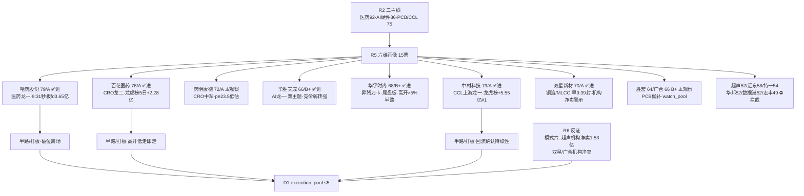

# 2026-09-22 · **个股画像**

> **数据源新鲜度**: ok
> **降级状态**: false(chart_vision MCP 15/15 全成功)
> **置信度**: 0.74(0.80 × 0.92 × 1.00 = 0.736 → 0.74)

## 一句话结论

**医药链(哈药79/A·百花76/A)与 PCB 上游(中材79/A·双星70/A)是今日资金最硬的双档；AI 硬件链龙一华胜(66/B+·双主题)仅做竞价弱转强、龙二华孚(68/B+·尾盘板)高开>5%才半路；超声/远东/特一等 6 只候补拦截，双星虽进但机构净卖 1.14 亿须防反证。** 情绪 82 极贪上沿，只做龙一/龙二，中位杂毛全剔除。

## 详细分析

### 候选池构建(v1.4 扩池规则)

R2 输出 **15 只 leaders**(医药链 5·AI 硬件链 5·PCB 上游 5),**≥5 无需扩池**,全部 `provenance.source = r2_leader_pool`。R2 文件缺 `all_scored_boards_top10` 字段 → `r2_schema_missing_top10=true`(标记供 E1 统计·不影响候选池)。R2 已按纪律三主线收缩(医药 92·AI 硬件 86·PCB 上游 75 均过 70 硬门槛),R5 不重复收缩,只做逐票六维深挖。

### 六维评分矩阵

| 票 | 角色 | 催化 | 筹码 | 联动 | 估值 | 技术 | 机构 | composite | flags | 建议 |
|---|---|---|---|---|---|---|---|---|---|---|
| 哈药股份 `600664` | 龙一 | 88 | 72 | 90 | 55 | 82 | 45 | **79** A ✅ | 🟢 | 进(龙一·半路/打板·破位离场) |
| 百花医药 `600721` | 龙二 | 85 | 78 | 86 | 40 | 75 | 50 | **76** A ✅ | 🟢 | 进(龙二·半路/打板·破位离场) |
| 华邦健康 `002004` | 候补 | 60 | 50 | 62 | 72 | 58 | 40 | **52** B 🟡 | 🟢 | 拦截(候补·条件不足) |
| 特一药业 `002728` | 候补 | 70 | 55 | 65 | 50 | 68 | 45 | **54** B 🟡 | 🟢 | 拦截(候补·条件不足) |
| 药明康德 `603259` | 候补(中军) | 75 | 70 | 80 | 78 | 82 | 90 | **72** A ✅ | 🟢 | 观察(候补(中军)·入watch_pool) |
| 华胜天成 `600410` | 龙一 | 85 | 65 | 84 | 30 | 72 | 55 | **66** B+ 🟡 | ⚠️loss_maker(H1净利-275%) | 进(龙一·仅竞价自然走强弱转强/超预期·高开无溢价不买·低开破位即弃) |
| 华孚时尚 `002042` | 龙二 | 82 | 60 | 80 | 60 | 68 | 50 | **68** B+ 🟡 | 🟢 | 进(龙二·高开>5%承接可半路·分歧低吸更优·不追高) |
| 数据港 `603881` | 候补 | 72 | 50 | 70 | 40 | 55 | 55 | **52** B 🟡 | 🟢 | 拦截(候补·条件不足) |
| 远东股份 `600869` | 候补(中军) | 78 | 68 | 78 | 25 | 62 | 65 | **58** B 🟡 | ⚠️high_valuation(pe421+负债80%) | 拦截(候补(中军)·条件不足) |
| 超声电子 `000823` | 候补 | 80 | 30 | 70 | 48 | 72 | 40 | **52** B 🟡 | ⚠️lhb_bull_trap(机构净卖1.53亿+换手异常) | 拦截(候补·条件不足) |
| 中材科技 `002080` | 龙一 | 88 | 90 | 85 | 62 | 78 | 75 | **79** A ✅ | 🟢 | 进(龙一·半路/打板·破位离场) |
| 双星新材 `002585` | 龙二 | 82 | 55 | 80 | 42 | 80 | 40 | **70** A ✅ | ⚠️inst_sell(lhb机构净卖1.14亿) | 进(龙二·半路/低吸) |
| 胜宏科技 `300476` | 候补 | 78 | 62 | 72 | 58 | 70 | 80 | **64** B+ 🟡 | ⚠️chinext_risk(创业板20cm) | 观察(候补·入watch_pool) |
| 温州宏丰 `300283` | 候补 | 62 | 50 | 58 | 55 | 58 | 35 | **49** C 🔴 | ⚠️chinext_risk(创业板20cm) | 拦截(候补·条件不足) |
| 广合科技 `001389` | 候补 | 76 | 62 | 74 | 68 | 76 | 65 | **66** B+ 🟡 | ⚠️inst_sell(lhb机构净卖0.59亿) | 观察(候补·入watch_pool) |

### 龙头判定(leader_verdict · v1.5)

| 票 | 高度 | 封板 | open | 首板距今 | 板块宽度 | 判定 |
|---|---|---|---|---|---|---|
| 哈药股份 | 1 | 09:31 | 1 | 1 | 12 | **龙头** |
| 百花医药 | 1 | 10:02 | 0 | 2 | 12 | **龙头** |
| 华邦健康 | 0 | — | — | — | 12 | **未涨停·潜伏** |
| 特一药业 | 0 | — | — | — | 12 | **未涨停·观察** |
| 药明康德 | 0 | — | — | — | 12 | **容量中军(未涨停)** |
| 华胜天成 | 0 | — | — | — | 23 | **未涨停·事件核心** |
| 华孚时尚 | 1 | 14:34 | 0 | 4 | 23 | **补涨/跟风(尾盘板)** |
| 数据港 | 0 | — | — | — | 23 | **未涨停·潜伏** |
| 远东股份 | 0 | — | — | — | 23 | **容量中军(未涨停)** |
| 超声电子 | 0 | 14:18 | 1 | 4 | 23 | **分歧(开板未封)** |
| 中材科技 | 1 | 10:13 | 3 | 1 | 3 | **龙头(分歧)** |
| 双星新材 | 1 | 09:39 | 0 | 1 | 3 | **龙头** |
| 胜宏科技 | 0 | — | — | — | 3 | **未涨停·弹性** |
| 温州宏丰 | 0 | — | — | — | 3 | **未涨停·潜伏** |
| 广合科技 | 1 | 09:34 | 1 | 1 | 3 | **补涨(回流首板)** |

### 推理深度三问(首推票)

**哈药股份(600664.SH · 医药龙一)**

- **大资金意图**: 0921 早盘 9:31 秒板 fd 3.65 亿(全天封单最足之一),人气 surge 98→4 单日跳升 94 位(ths#4/dc#4),R7 创新药概念净入 +42.2 亿全市场 #1 + 医药生物行业 +67.42 亿 #1——资金不是脉冲,是流感季(特一 5 次提及)+ License 出海缓和双催化下医药簇宽度最厚(5 板块进涨停 top20)的总攻信号。
- **为什么走强**: 位置=8 月初 5.99 低点后震荡修复、0921 放量涨停突破 MA20(8.04)刚金叉;催化=流感季+创新药双属性,医药人气第一;筹码=首板秒板一致性极高(open_times 1),但 30 日无龙虎榜说明筹码在散户/游资而非机构。
- **逻辑够不够硬**: 中上——三源共振(R2 92 分 + R3 rank1 + R7 资金双顶格),但 R4 无独立医药 top_event(仅背景催化),叙事强度弱于 AI 硬件链;R1 标注医药为 0921 新启动轮动补涨,持续性待验证。证伪路径: 0922 医药簇整体无承接→哈药高开低走兑现,主线宽度从 20 收缩。买点=高开>5%缩量承接半路/分歧低吸,高开无溢价不追。

**中材科技(002080.SZ · PCB 上游龙一)**

- **大资金意图**: 0921 龙虎榜净买 **+5.55 亿全市场 #1**(买 12.79/卖 7.24 亿,深股通参与)+ 5 日净买 +5.55 亿——这是 PCB 资金单日转正(+27.37 亿概念#10)下回流主线核心的硬资金,不是游资一日游。
- **为什么走强**: 位置=8 月初 40.34 低点后单边主升(5 日 +25.5%),0921 放量(vr 2.46)涨停创 20 日新高 66.24;催化=CCL 上游电子布紧缺逻辑(东北计算机看多)+ R4 E003 长鑫第五代量产;筹码=龙虎榜净买 5.55 亿 + 两融 17.3 亿 15 日 +19.4%。
- **逻辑够不够硬**: 硬——R2/R3/R4/R7 四源全中(cross_validation 1.0),电子布紧缺是真实产业矛盾,玻纤/风电/隔膜多元主业 + 电子布弹性;但盘中 3 次开板(open3)说明分歧存在,且 5 日 PCB 资金累计仍 -76 亿 choppy(单日转正非趋势)。证伪路径: 0922 PCB 资金未连续第二日转正→回流证伪,破 MA5 58.96 离场。

### 关键证据

- 哈药 fd 3.65 亿全市场第一档封单 + 人气跳升 94 位 · 来源 tushare limit_list_d + R3
- 中材龙虎榜净买 +5.55 亿全市场 #1 + 深股通参与 · 来源 tushare top_list + R7 lhb_top10_5d
- 百花 0921 龙虎榜净买 +1.66 亿/三日 +2.28 亿 · 来源 tushare top_list + R7
- 超声电子 0921 龙虎榜净卖 -1.99 亿 + 机构专用净卖 -1.53 亿(lhb_bull_trap) · 来源 R7 lhb_bull_trap
- 双星新材 0921 机构专用净卖 -1.14 亿(净买 +8770 万但机构出货)· 来源 R7 lhb_bull_trap
- 远东股份 pe_ttm 421.6 + 负债 80.2% · 来源 tushare daily_basic/fina_indicator

### 数据源审计

| 源 | 状态 | 抓取时间 | 记录数 | 备注 |
|---|---|---|---|---|
| R2_main_sectors | 🟢 ok | 07:50 | 15 leaders | 缺 top10 字段(标记) |
| R4_news | 🟢 ok | 07:17 | 8 events | 三事件 high |
| R7_capital_flow | 🟢 ok | 07:10 | 全量 | lhb_bull_trap 19 只 |
| R1_style | 🟢 ok | 07:10 | 主线扩散型 | 情绪82·仓位70% |
| tushare 直连 | 🟢 ok | 0921 收盘 | 15×10 接口 | 全量 0921 |
| chart_vision MCP | 🟢 ok | 08:0x | 15/15 | 无降级 |

### 不确定性 / 反证

1. **医药为 0921 新启动轮动补涨**——R4 无独立 top_event,若 License 消息被证伪或流感季证伪,情绪链断裂;哈药/百花均无机构龙虎榜,纯情绪筹码,极贪上沿(82)下高开低走风险高。
2. **PCB 资金单日转正非趋势**——5 日累计仍 -76 亿 choppy,中材盘中 3 次开板即分歧信号,0922 需连续第二日转正确认。
3. **双星新材机构净卖 1.14 亿 + 股东户数暴增 142%(6.9→16.7 万)**——筹码极度分散+机构出货,与早 9:39 秒板形成矛盾,R6 反证重点。
4. **超声电子技术最强(chart_vision 0.85)但筹码最弱(机构净卖 1.53 亿+换手 30.48% 异常)**——技术/筹码背离,已拦截,留给 R6 模式六霸榜出货核验。
5. **华胜天成持续亏损(净利 yoy -275%)+ 无研报覆盖**——纯事件驱动(双主题),只做竞价弱转强,业绩面无任何保护。

### 与其他 R/D/E 的关系

- 依赖: R2_main_sectors(候选) · R4_news(催化) · R7_capital_flow(资金/龙虎榜) · R1_style(风格/仓位)
- 被消费: D1(main_decision_v1·execution_pool) · R6(analyze_devil_advocate_v1·反证候选) · E1(daily_review_v1·复盘)

## Sub-Agent 元数据

- skill: analyze_stock_profile_v1@1.5
- artifact: data/research/20260922/R5_stock_profiles.json
- 生成耗时: ~20 分钟(含 tushare 直连批量拉取 + chart_vision 15 票)
- model: deepseek-v4-flash
