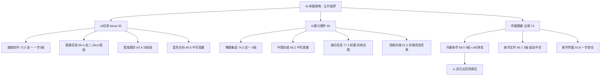

# 2026-09-23 · **个股画像（R5）**

> **数据源新鲜度**: ok
> **降级状态**: false
> **置信度**: 0.68

## 一句话结论

AI 单极聚焦下，**六维分最高的不是情绪龙一，而是基本面最硬的国产 CPU 权重（海光 77.3）**；R2 执行池内真龙头排序为 **博通集成 74.3 > 南威软件 72.0 > 旋极信息 69.4 > 新华文轩 66.7 > 中国长城 66.2 > 内蒙新华 58.5**，其中内蒙新华虽为 5 板高度龙一，但龙虎榜净卖 7113 万 + 中报净利 -81.8%，**已进入高位出货观察区，优先降级**。

## 详细分析

### 候选池总览（15 只 · R2 main_lines.leaders 全量）

| 主线 | 标的 | 角色 | 六维分 | 龙头判定 | 一句话定性 |
|---|---|---|---|---|---|
| 🔵 AI应用·Muse | 南威软件 603636 | 龙一 | **72.0** | 龙头(2板一字92502) | 2板一字筹码未置换，竞价承接定胜负 |
| 🔵 AI应用·Muse | 旋极信息 300324 | 龙二 | **69.4** | 龙头(启动日20cm) | 财税数字化首板，外资游资接、机构撤 |
| 🔵 AI应用·Muse | 智度股份 000676 | 候补 | 60.9 | 分歧弱(开8次) | 业绩+73.8%最干净，但开板分歧大 |
| 🔵 AI应用·Muse | 引力传媒 603598 | 候补 | 55.0 | 补涨 | 负债88%+PB22，极端估值禁追 |
| 🔵 AI应用·Muse | 蓝色光标 300058 | 中军 | 60.6 | 中军(未涨停) | 容量488亿，等涨停潮确认再低吸 |
| 🟣 AI算力硬件 | 博通集成 603068 | 龙一 | **74.3** | 龙头(3板95619) | CPU链高度+龙虎榜净买2.25亿 |
| 🟣 AI算力硬件 | 中国长城 000066 | 龙二 | **66.2** | 中军(放量) | 算力信创中军，PE 433 硬伤 |
| 🟣 AI算力硬件 | 海光信息 688041 | 候补 | **77.3** | 中军(权重) | 国产CPU平台，15家券商全推 |
| 🟣 AI算力硬件 | 中科曙光 603019 | 候补 | 69.2 | 中军(区间) | chart 全场唯一震荡信号 |
| 🟣 AI算力硬件 | 佰维存储 688525 | 候补 | 61.5 | 中军(存储背离) | 业绩+3273%但资金-69亿背离 |
| 🟠 传媒·出版 | 内蒙新华 603230 | 龙一 | **58.5** | 龙头(5板·高位分歧) | ⚠️LHB净卖7113万+业绩-81.8% |
| 🟠 传媒·出版 | 新华文轩 601811 | 龙二 | **66.7** | 龙头(3板一字) | pe15低估中军，开板分歧低吸位 |
| 🟠 传媒·出版 | 新华传媒 600825 | 候补 | 55.8 | 一字锁仓 | fd21亿锁死，无法参与 |
| 🟠 传媒·出版 | 中国出版 601949 | 候补 | 55.7 | 补涨 | 巨震后修复，业绩-88% |
| 🟠 传媒·出版 | 华媒控股 000607 | 候补 | 56.2 | 一字锁仓 | 作手新一进、机构净卖 |

### 六维分布规律（大资金意图 / 为什么走强 / 逻辑够不够硬）

- **大资金意图**: 0922 资金 Top10 概念全为 AI 应用簇（百度+34.6 亿 / AI 智能体+30 亿 / AI 应用+28.3 亿），主力在做**从算力硬件到 AI 应用/传媒的板块内切仓**——海光、曙光这类算力权重只是承接资金的中军底仓，弹性让给南威、旋极这些应用簇小票。传媒出版簇（沪股通净买含南威/内蒙新华/国脉文化）是外资+游资合力做的事件驱动分支。
- **为什么走强**: 三条线内部分化明显——AI 应用线靠 **Muse 爆火事件（E001）+ 9/23-24 Meta Connect 双日催化** 驱动，龙头南威/旋极都是资金+人气+涨停三共振；算力硬件线只剩 **CPU/ABF/昇腾资金正向细分**（博通 3 板、长城放量），芯片/CPO/存储概念资金全流出；传媒出版线是**教育强国发布会（今日 10 时）事件驱动**，兑现点就在今天。
- **逻辑够不够硬**: 硬逻辑排序：**海光（业绩+机构 15 家）> 佰维（业绩+3273% 但资金背离）> 博通（业绩+162% + 龙虎榜净买）> 智度（业绩+73.8% 但开板分歧）> 南威/旋极/内蒙新华（纯情绪+事件，无业绩锚）**。反过来看，**六维分最高的海光是中军候补（弹性弱），情绪龙一南威六维分 72 但基本面是 15 只里最差的之一（H1 亏 136%）**——这是典型的"市场在情绪票上给溢价、在权重票上给确定性"的分层定价，D1 选 execution 必须按主模板分层取权。

### mermaid · 主线→板块→龙头三层结构

## 关键证据

- 证据 1: 博通集成 0922 龙虎榜净买 +2.25 亿（net_rate 8.07%）、R7 5 日净买 +2.25 亿；3 板换手 19.16% 充分 · 来源 tushare top_list + R7
- 证据 2: 内蒙新华 0922 龙虎榜 **净卖 -7113 万**（net_rate -3.48%），5 板开 3 次分歧加大 · 来源 tushare top_list
- 证据 3: 海光信息 0922 单日融资买入 +10.3 亿（两融 89.6 亿），15 家券商覆盖 target 337-500 · 来源 tushare margin_detail + report_rc
- 证据 4: 15/15 只 chart_vision 每票必调通过——南威周线压力 8.07（距现价 0.5%）、博通 15 分 MACD 顶背离、佰维全场唯一偏空信号 · 来源 canghai-charts
- 证据 5: R4 E001（Meta Muse 登顶 iOS + Meta Connect 9/23-24）+ E002（Intel CPU 涨价）双 high 事件直接命中 AI 应用线与 CPU 链 · 来源 R4_news.json

## 每票思维链（首推/执行池候选）

### 南威软件 603636.SH（AI 应用龙一 · 六维 72.0）

- **买入理由**: ① AI+政务/信创/AI 应用三属性，R3 双主题 suggested + 人气 surge 76→16 单日最大跳升，沪股通净买背书（7.59 亿含 603636）；② 今日 10 时教育强国发布会 + 海州区 AI+政务会议双事件窗口，事件未兑现前有催化溢价。
- **风险点**: ① 2 板一字换手仅 2.94%、封单仅 9651 万——**筹码未置换，开板分歧是唯一生死口**，高开承接不足极易高开低走；② H1 净利 -136% 亏损扩大，纯情绪定价，无业绩缓冲。
- **止损条件**: 竞价高开无溢价不追；一字转 T 字弱转强才可进；**跌破 7.0 元（MA20/MA60 共振位）坚决止损**，破位即逻辑失效。
- **可验证假设**: 竞价溢价 >+3% 且炸板率 <20% → 主升确认可半路/打板；若竞价低开破 8.01 昨收且无承接 → 弱转强失败，当日不入场。

### 博通集成 603068.SH（算力硬件龙一 · 六维 74.3）

- **买入理由**: ① Intel CPU 10 月再涨 10%（E002）+ ABF 载板三年 CAGR 100%，CPU 配套正解+WiFi7 双属性；② 3 板换手 19.16% 充分 + 龙虎榜 5 日净买 2.25 亿硬资金 + 沪股通/国泰海通总部/量化多席位。
- **风险点**: ① 15 分钟 MACD 顶背离（chart_vision 预警）短期超买，3 板高位接力断板即出；② 周线仍震荡未脱离区间，PE 136 已 price in 两年高增。
- **止损条件**: 3 板高位不打缩量一字；竞价超预期（溢价>+3% 且炸板率<20%）可半路；**跌破 MA60 38.5 元止损**；高开低走破 48.17 昨收则弃。
- **可验证假设**: 竞价承接 >+3% + 炸板率 <20% → 上攻 50 元压力；若竞价转弱或板块 AI 硬件资金继续流出 → 只观察不接力。

### 旋极信息 300324.SZ（AI 应用龙二 · 六维 69.4）

- **买入理由**: ① 启动日上榜（days_since_first_board=1）带动性最强，财税数字化 lead_stock + 20cm 弹性；② 龙虎榜净买 +1.15 亿（net_rate 9.86%），深股通+开源+量化打板三路进场。
- **风险点**: ① 机构专用席位 0922 净卖（全市场 -5.13 亿含 300324）——**外资游资接、机构撤**的对倒局；② H1 仍亏损（净利率 -24.2%），20cm 波动大。
- **止损条件**: 竞价高开>+3% 且承接强可半路，**20cm 以低吸为主不追涨停**；高开低走破 17.24 昨收则弃。
- **可验证假设**: 竞价溢价 >+3% + 板块 AI 应用持续 → 上攻 5.1 压力；若 60 分跌破 4.0 支撑 → 反弹逻辑破坏离场。

### 新华文轩 601811.SH（出版中军 · 六维 66.7）

- **买入理由**: ① pe 15.2 / pb 1.35 / 股息 3.57%，15 只候选里估值最安全的容量中军（流通 133 亿）；② 3 板一字封单 1.44 亿，文化传媒 5 天 5 板簇 + 教育强国事件。
- **风险点**: ① 一字换手 0.51% 无法参与，**开板即分歧**承接未知；② H1 净利 -23.6% 业绩承压。
- **止损条件**: 中军低吸/半路不打板；**开板分歧低吸为主，破 14.14 日 K MA5 止损**。
- **可验证假设**: 竞价开板承接 > 封单 30% → 低吸成立；若高开无溢价冲高回落 → 放弃等待二次回踩。

## 数据源审计

| 源 | 日期 | 状态 | 备注 |
|---|---|---|---|
| tushare daily/daily_basic | 2026-09-22 | 🟢 | 15 只 · 30 日 K + 估值/市值 |
| tushare limit_list_d/top_list | 2026-09-22 | 🟢 | 全市场涨停 63 + 龙虎榜明细 |
| tushare margin_detail/block_trade | 2026-09-22 | 🟢 | 15 只 · 两融 15 日 + 大宗 30 日 |
| tushare fina_indicator/report_rc | 2026-09-22 | 🟢 | H1 财务 + 券商盈利预测 |
| canghai-charts chart_vision_analyze | 2026-09-23 | 🟢 | 15/15 每票必调 · pattern 全非空 |
| R2_main_sectors.json | 2026-09-23 | 🟢 | 15 只候选 · 缺 all_scored_boards_top10 |
| R4_news.json | 2026-09-23 | 🟢 | 8 个 high 事件 |
| R7_capital_flow.json | 2026-09-23 | 🟢 | 席位/资金流/两融 |

## 不确定性 / 反证

- 六维分对**情绪票的评估天然失真**：南威（72.0）、内蒙新华（58.5）基本面分极低，但短线赚钱效应恰恰来自情绪溢价——R5 六维分是"基本面×资金×技术"的合成，**不能替代 R1 情绪周期与 R2 主线地位的权重**，D1 应按主模板（首板隔日/总龙锁仓/三格/树干/分歧接力）重新取权。
- 内蒙新华 5 板 LHB 净卖 7113 万是本批最强反证点：板块效应（文化传媒 10 家）尚在，但**龙头资金在撤**——若今日教育强国发布会兑现即见光死，5 板高度崩塌将拖累整个出版簇（新华文轩/新华传媒/中国出版/华媒连锁承压）。
- 15 只中 9 只无券商覆盖、5 只非两融标的、3 只一字锁仓无法验证承接——"研报与机构"与"筹码结构"维度对这批妖股/中军的验证力偏弱，机构维度权重已相应压低。
- 两融 300324/000676/300058/000066 最新为 2026-09-21（R7 同口径），不影响趋势判断；佰维 chart_vision 为全场唯一偏空信号 + 存储概念资金 -69 亿背离，六维分 61.5 有高估风险。

## 与其他 R 的关系

- 依赖: R2_main_sectors.json（候选 15 只）· R4_news.json（催化）· R7_capital_flow.json（席位/资金）· R1_style.json（主升临界上下文）
- 被消费: D1（main_decision_v1，execution_pool/watch_pool 分层）· R6（analyze_devil_advocate_v1，反证输入：内蒙新华 LHB 净卖 / 佰维资金背离 / 引力高杠杆）

## Sub-Agent 元数据

- skill: analyze_stock_profile_v1
- artifact: data/research/20260923/R5_stock_profiles.json
- 生成耗时: 约 45 分钟（15 只 × 6 维 + 15 次 chart_vision）
- model: deepseek-v4-flash-ga-260731
