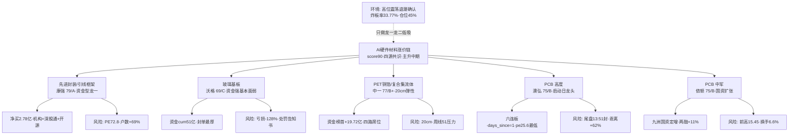

# 2026-09-24 · **个股画像 R5**

> **数据源新鲜度**: ok
> **降级状态**: 否
> **置信度**: 0.70

## 一句话结论

AI硬件材料涨价链 5 票画像:康强 79/A 资金型龙一最优,中一 77/B+ 弹性次之,澳弘/依顿 75/B 高度与中军分化,沃格 69/C 六维最弱(亏损+处罚+筹码散);退潮环境全部仅限龙一/龙二低吸。

## 详细分析

**候选池结构**。R2 唯一硬主线「AI硬件材料涨价链」leaders 5 票:龙一康强(先进封装/引线框架)、龙二沃格(玻璃基板)、候补中一(PET铜箔 20cm)、候补澳弘(PCB 高度)、候补依顿(PCB 中军)。四源共识(热榜榜首+资金Top5全材料链+KOL+R4 E003/E004)·R2 score 90·主升中期。但环境是高位震荡退潮确认日(炸板率 33.77% 破线、溢价 -0.37% 转负、仓位上限 0.45),候选必须按纪律砍半基调处理。

**资金与时间的错位是本日画像最大发现**。按 v1.5 龙头判定(高度+首封时间+首次上榜日),链内唯一从启动日(0911)上榜并走出六连板的票是**澳弘电子**(days_since=1·高度 6 板),但它在 0923 尾盘 13:51 才封板、断板后 2 连、乖离 +62%——是高度型龙头却也是隔日溢价最不确定的票。反之,康强/沃格是资金型(康强三路席位净买 2.78 亿净率 18.81%、沃格封单 2.31 亿链内最厚),但按时间维度都是板块 age9/age4 才上板的「跟风/补涨」。**资金维度与时间维度首次出现系统性分歧**,已写入各票 leader_verdict 供 R6 反向验证。

**基本面拖累在沃格身上最重**。六维画像中沃格是唯一 C 级:26H1 亏损扩大(np_yoy -128%)、pb 21.96、负债率 72.6%、控股股东相关方 0808 收到行政处罚告知书、股东户数 3 月→6 月 +312% 巨幅分散。这与 R2 给它的 execution_eligible 龙二身份显著背离——R5 提示 D1:沃格的资金持续性(cum51 亿)是真实的,但承接它的是散户化筹码+亏损叙事,低吸窗口必须更苛刻。

**技术面全线偏多但有压力位共性**。5/5 chart_vision 均偏多(0.70-0.85),日K全部突破 20 日新高、60 分多头排列;但康强 30 元、中一 51 元、沃格 103.7 元、依顿 15.45 元全部贴着周线级别压力位——0924 若竞价量能无法突破,全部回踩低吸位(25.1/47/96.1/14.9)是更优介入点。

## 候选池总览

| 排名 | 代码 | 名称 | 角色 | 六维综合 | 等级 | 资金背书 | 最大风险 |
|:--:|:--|:--|:--|--:|:--:|:--|:--|
| 1 | 002119 | 康强电子 | 龙一 | 79 | A | 三路席位净买 2.78 亿 | PE 72.8 增收不增利 |
| 2 | 301150 | 中一科技 | 候补·弹性 | 77 | B+ | 四路席位净买 2.16 亿 | 20cm 退潮隔日 ±20% |
| 3 | 605058 | 澳弘电子 | 候补·高度 | 75 | B | 国泰海通 0.47 亿 | 尾盘封+乖离 +62% |
| 4 | 603328 | 依顿电子 | 候补·中军 | 75 | B | 国资定增背书 | 前高压力贴身 |
| 5 | 603773 | 沃格光电 | 龙二/中军 | 69 | C | 封单 2.31 亿最厚 | 亏损+处罚+筹码散 |

## 每票画像

### 1️⃣ 康强电子 002119 · 79/A · 龙一

**大资金意图**: 机构专用+深股通+开源西安三路真金净买 2.78 亿(净率 18.81%),且三席位同票共振——这不是散单,是机构借道引线框架景气(康强 yoy+79% KOL 背书)做先进封装链卡位,资金意图=链内核心仓。
**为什么走强**: 首板 11:07 封死不开板+封单 1.59 亿+换手 15.27% 充分换手,日K突破 20 日新高站上 MA5/20/60,量比 1.37 温和放大;催化四源同向(E003 涨价+先进封装 high+KOL+人气 dc#2)。
**逻辑够不够硬**: 涨价逻辑硬(引线框架行业景气第一梯队),但估值软——PE 72.8 且增收不增利(净利 +6.4% vs 营收 +57%),高成长定价需要 Q3 业绩兑现,这是它 79 分而不是 85 分的原因。
**买入理由**: 退潮环境只做低吸/竞价自然走强(溢价>+3% 且炸板率<25% 可半路);回踩 25.1(60分MA20)为低吸位;破 24.12(昨日最低)逻辑弱化。
**风险点**: 板块 age9 才首板(v1.5 时间维度=跟风/补涨·与资金维度分歧)→ R6 重点反证对象;股东户数 +69% 散户涌入;首板换手 15.27% 偏高。
**止损条件**: 相对买入价 -5~-10% 硬区间;或日线收盘破 60分MA20 25.1。
**可验证假设**: 0924 竞价溢价>+3% 且先进封装板块资金继续净入 → 卡位成立;若高开低走破 24.12 → 先手兑现,假设证伪。

### 2️⃣ 中一科技 301150 · 77/B+ · 候补·弹性

**大资金意图**: 机构+开源+深股通+章盟主四路净买 2.16 亿——游资与机构同席做 PET 铜箔(复合集流体资金全市场#1 +19.72 亿),意图=20cm 弹性卡位,与康强同席共振(两票同现机构/开源/深股通席位)。
**为什么走强**: 20cm 放量涨停(量比 2.12)突破 3 个月横盘箱体,复合集流体是 R7 资金榜首方向。
**逻辑够不够硬**: 成长逻辑硬(2027E eps 2.25-3.21·PE~22),但 Q2 转回资产减值贡献利润(F6 一次性·净利 +988% 含水分)——硬逻辑+软水分并存。
**买入理由**: 仅做竞价自然走强低吸;回踩 47.0(60分MA5)承接有效可参与;破 41.07(昨日最低)离场。
**风险点**: 301 创业板 20cm 在退潮环境隔日 -20% 波动;周线 51 元套牢压力贴身;板块涨停仅自身 1 家(孤军)。
**止损条件**: -5~-10% 硬区间;20cm 票建议止损距放大但仓位减半。
**可验证假设**: 0924 复合集流体板块仍有 2 家以上涨停(板块效应扩散)→ 弹性成立;若孤军缩量高开 → 退潮期先手兑现。

### 3️⃣ 澳弘电子 605058 · 75/B · 候补·高度

**大资金意图**: 国泰海通总部席位净买 0.47 亿(强度一般),但 0911-0917 六连板是链内唯一从启动日(0911)连续上榜的高度票——资金已反复确认它是 PCB 链旗帜,0922-23 断板后 2 连=二次启动确认。
**为什么走强**: PCB 热榜 3→1 新晋榜首(+22 亿)+PCB 9 天 7 板;它是最早启动的票(0911 首板 10:20)。
**逻辑够不够硬**: 基本面链内最优(毛利率 24.7%、pe_ttm 25.6 链内最低估),但 np_yoy -17.9% 缺高成长想象;纯高度博弈逻辑。
**买入理由**: 只做 60分MA5 57 元回踩低吸(不追 58.6 现价);竞价弱转强才考虑。
**风险点**: 0923 尾盘 13:51 封板(隔日溢价最不确定);乖离 +62%(close 58.6 vs MA20 36.1);历史分歧大(0917 开板 23 次)。
**止损条件**: -5~-10% 硬区间;收盘破 57(60分MA5)即走。
**可验证假设**: 0924 高开>+3% 且 PCB 板块 3 家以上涨停 → 二波确认;若平开低走 → 断板票退潮特征。

### 4️⃣ 依顿电子 603328 · 75/B · 候补·中军

**大资金意图**: 两融 15 日 +11.3% 加仓(杠杆资金持续进场),四川九洲集团国资认购定增+高端 PCB 智造项目=产业资本真金扩张——这是链内中长期逻辑最实的一只。
**为什么走强**: PCB 板块效应带动;0923 首封 10:18 封单 1.57 亿,换手 6.62% 链内最低(筹码锁定好)。
**逻辑够不够硬**: 产业扩张硬(定增+扩产+激励),但当期业绩弱(or_yoy +3.7%·np -58.6%)——买的是 2027 年产能弹性,不是当期。
**买入理由**: 中军低吸需板块涨停潮确认;回踩 14.9(60分MA5)承接有效可参与;周K 前高 15.45 突破后空间打开。
**风险点**: 前高 15.45 压力贴身(现价 15.2 仅 +1.6%);换手 6.62% 偏低(承接活跃度待验证);v1.5 判定跟风补涨(启动第 6 天才上榜)。
**止损条件**: -5~-10% 硬区间;收盘破 14.9 离场。
**可验证假设**: 0924 放量突破 15.45 → 中军转强;若缩量滞涨于压力位 → 继续观察。

### 5️⃣ 沃格光电 603773 · 69/C · 龙二/中军 ⚠️

**大资金意图**: 玻璃基板资金#2(+12.69 亿·5日4/5天净入 cum51.09 亿=链内持续性最强)+早盘首封 09:33+封单 2.31 亿链内最厚——资金意图明确做玻璃基板容量核心,但 0923 涨停未上龙虎榜,买方席位背书缺失。
**为什么走强**: 玻璃基板=先进封装载板新方向叙事;资金 5 日最强持续性;早盘封板带动链内情绪。
**逻辑够不够硬**: 叙事硬但落地弱——26H1 亏损扩大(np -128%)、pb 21.96、负债率 72.6%;股东户数 3 月→6 月 +312% 巨幅散户化;0808 控股股东相关方行政处罚告知书。**逻辑硬度与康强/中一不在一个层级**。
**买入理由**: R5 降级为 C——仅在竞价资金正转+玻璃基板板块 2 家以上涨停时做低吸观察;回踩 96.1(60分MA5)承接有效才考虑;周K 103.7 压力贴身,不追 102.5 现价。
**风险点**: 亏损+处罚+筹码散三重压制;周线压力位近在咫尺;资金持续性若断档(5日净入终止)即逻辑证伪。
**止损条件**: -5~-10% 硬区间;收盘破 96.1 离场。
**可验证假设**: 0924 玻璃基板资金继续净入且竞价溢价>+3% → 突破 103.7 打开空间;若高开低走 → 资金断档,退潮期先手兑现。
**给 R6 的反证靶点**: 基本面红旗(S2 合规+亏损)+筹码巨幅分散 vs R2 execution_eligible 的背离。

## 关键证据

- 证据 1: 康强 0923 龙虎榜净买 2.78 亿·净率 18.81%·机构+深股通+开源三路同席 · 来源 tushare top_list + R7 active_seats
- 证据 2: 中一 0923 龙虎榜净买 2.16 亿·机构+开源+深股通+章盟主四路;复合集流体资金全市场#1 +19.72 亿 · 来源 tushare top_list + R7
- 证据 3: 澳弘 0911-0917 六连板·days_since_first_board=1(链内唯一启动日龙头)·0923 尾盘 13:51 封 · 来源 tushare limit_list_d
- 证据 4: 沃格 26H1 np_yoy -128%·pb 21.96·股东户数 +312%(29195→120380)·0808 控股股东相关方行政处罚告知书 · 来源 tushare fina_indicator/daily_basic/stk_holdernumber/anns_d
- 证据 5: 5/5 chart_vision 偏多(0.70-0.85)·日K全破 20 日新高·周线压力位全贴身(30/51/103.7/15.45) · 来源 canghai-charts

## 数据源审计

| 源 | 状态 | 抓取时间 | 记录数 | 备注 |
|---|---|---|---|---|
| R2 主线 | ✅ | 07:49 | 5 leaders | 四源共识唯一主线 |
| R3 情绪 | ✅ | 07:45 | 5 主题 | L3 WeFlow 永久下线·最高 L1+L2 |
| R4 消息 | ✅ | 07:42 | 8 事件 | E003/E004 正向·E008 美股大跌对冲 |
| R7 资金 | ✅ | 07:40 | 69 LHB | 资金 Top5 全材料链 |
| tushare 10 接口 | ✅ | 07:57 | 61日K/票 | daily/daily_basic/limit_list_d/top_list/block_trade/margin_detail/fina_indicator/stk_holdernumber/report_rc/anns_d |
| canghai-charts | ✅ | 07:58 | 5/5 | chart_vision 多模态识图全成功 |
| vibe-trading | ⚠️ 未配置 | - | - | v1.3 以降 tushare 主源兜底·无 degraded |

## 不确定性 / 反证

- **v1.5 时间维度与 R2 资金维度分歧**(康强/沃格按上榜时间=跟风补涨·R2 按资金=龙一龙二):这是本日最大不确定性,已显式写入 leader_verdict·R6 必须反向验证,若康强资金是 0923 单日脉冲而非持续净入,则「资金型龙一」判断需下调。
- 财务红旗仅基于 fina_indicator/anns_d 标题判断(F6 中一转回减值·S2 沃格处罚),未拉三表逐项核验 F1-F12 全部条目——R6 模式七如需深挖须自行二次核验。
- chart_vision 模型 seed-2-0-lite·偏多一致性强,存在同模型系统性乐观偏差;压力位判断已用 tushare 周K 数据交叉。
- 沃格 C 级判定 vs R2 execution_eligible 的冲突:可能因 R2 未加载股东户数/处罚公告信息——R5 已补全,请 D1 以 R6 反证结论为准。

## 与其他 R/D/E 的关系

- 依赖: R2_main_sectors(R5 候选池来源)· R3_sentiment(共振/人气)· R4_news(催化)· R7_capital_flow(资金验证)
- 被消费: D1(canghai-plan·execution_pool/watch_pool 候选)· R6(analyze_devil_advocate_v1·模式三估值/模式六资金/模式七基本面红旗)· E1(daily_review_v1·复盘对照)

## Sub-Agent 元数据

- skill: analyze_stock_profile_v1@1.5
- artifact: data/research/20260924/R5_stock_profiles.json
- 生成耗时: 约 11 分钟
- model: deepseek-v4-flash-ga-260731
