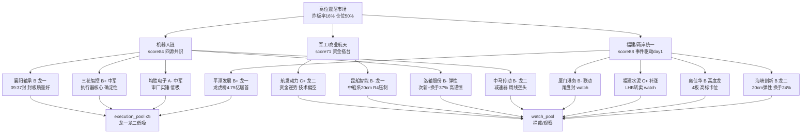

# 2026-09-25 · 📌 个股画像

> **数据源新鲜度**: ok
> **降级状态**: degraded(false · R3/R4 覆盖缺口但核心源全 fresh)
> **置信度**: 0.72

## 📌 一句话结论
三主线 12 只候选:**福建/两岸统一**(平潭发展 B+ 人气资金双核心·容量中军/海峡创新 B 20cm 弹性/奥佳华 B 4板高度龙)与**机器人链**(均胜电子 A- 审厂 Tier1 中军/三花智控 B+ 执行器核心/襄阳轴承 B 轴承核心)双主线确定,军工线(昆船智能 B- 唯一涨停辨识度)受 R4 bearish 压制只做产业分支。高位震荡(炸板率 16.13% 健康/广度 0.26 9月最差)纪律下只做**龙一/龙二低吸与高标卡位**,候补仅 watch;福建线多尾盘抢筹封板=高开兑现压力大,机器人链是唯一四源共识成长主线。

## 🧭 候选池总览
| 票 | 角色 | 综合/等级 | 一句话 |
|---|---|---|---|
| 均胜电子 `600699` | 候补(中军低吸) | 76 A- 🟢 | T链审厂通过Tier1实锤(新订单5000-6000部)+花旗2028利润敞口5%+流通315.7亿主板容量：机器人链唯一非涨停中军·0924 +5.06% 主力5日+0.17亿(0924 大单+7.22亿显著转正)·R3 suggested[3]；⚠️ 非涨停·中军低吸型·临近20日高23.68(压力位) → 竞价承接确认才看·破22.62(昨收)放弃 |
| 三花智控 `002050` | 候补(中军低吸) | 71 B+ 🟢 | 特斯拉执行器核心供应商+R4 E006 首推(龙头地位最稳·回调低吸·花旗2028利润敞口5.3%·T链审厂Tier1顺利)+流通1331.7亿超大盘：确定性最高的中军；⚠️ 0924 +0.25%横盘·周线空头(MA60 43.4远高现价)+20日区间震荡33.28-37.25未突破 → 低吸型·回踩企稳竞价确认才看(参考36.08昨收)·高抛37.2/止损35 |
| 平潭发展 `000592` | 龙一 | 70 B+ 🟢 | 福建线容量中军(流通168亿)+龙虎榜净买4.75亿全市场居首+人气dc#1：R3四源同向·事件驱动day1·开源西安西大街集中买福建核心；但 14:23 尾盘封板(先手多)+板块0924收跌-0.28%(热度>价格)+股东户数9月+19.6%分散+中报亏损 → 只做竞价自然走强(溢价+3~5%且板块扩散≥5家)半路/低吸·高开>6%无承接不追·破8.78(昨收)观察 |
| 奥佳华 `002614` | 候补(高度龙) | 67 B 🟡 | 福建线连板高度龙(0921-0924 4连板·09:30早盘封·up_stat 4/4)+LHB 2日净买2.5亿(机构/开源西安西大街/T王)：早盘封板=有带动性·高度#1；⚠️ 流通36.8亿<50亿 caution+题材纯度复合(按摩椅/健康+福建属性非纯统一概念)+中报亏损 → 高位震荡下4板高标波动剧烈·只做高标卡位/竞价自然走强低吸·高开>6%无承接不追·破8.33(昨收)观察 |
| 海峡创新 `300300` | 龙二 | 66 B 🟡 | 福建线20cm弹性龙二(流通72亿)+龙虎榜净买2.88亿(机构/深股通/开源/T王)+人气dc#4：换手24.26%充分分歧转一致；但 14:24 尾盘封+开板2次(分歧)+中报巨亏+PB 29极高 → 20cm高开兑现杀跌更快·只做竞价转强半路/低吸(溢价+3~5%)·高开无承接不追·破10.81(昨收)观察 |
| 襄阳轴承 `000678` | 龙一 | 66 B 🟡 | 特斯拉Optimus审厂→轴承涨停潮核心(09:37早封·换手5.8%低=封板质量好·up_stat 1/1)+KOL点名(游资群)+减速器/执行器资金共振：唯一四源共识成长主线龙一；⚠️ 流通44.5亿<50亿 caution+中报亏损+无龙虎榜+周线MA60 12.46压制 → 竞价自然走强(弱转强/高开承接)可半路·高开无溢价不追·破9.68(昨收)观察 |
| 中马传动 `603767` | 龙二 | 63 B- 🟡 | 减速器=Optimus核心执行部件(R7减速器+6.38亿#4)+09:40早封·换手3.49%极低=封板质量好+R3 KOL点名(大业/襄阳/中马批量涨停)：龙二地位；⚠️ 流通45.5亿<50亿 caution+首板未验证+周线长期空头(MA60 21.12远高现价) → 竞价转强进·高开无溢价不追·破14.74(昨收)观察 |
| 洛轴股份 `301699` | 候补(弹性) | 63 B- 🟡 | 次新股+轴承20cm弹性(09:42早封·换手36.9%极高·LHB 1.01亿多席位:开源/机构/T王/量化打板/温州帮)+dc人气#23：审厂核心弹性票；⚠️ 次新仅12日K(20260909上市)+流通24.9亿<50亿高谨慎+换手36.9%分歧巨大+20cm高位震荡隔日±20%风险 → 观察·只做竞价资金转正自然走强·不主动追高 |
| 昆船智能 `301311` | 龙一 | 62 B- 🟡 | 中船系/统一大市场20cm(突破3个月底部·14:02封·LHB 0.29亿机构+深股通+开源·lead_stock·R3 suggested[0])：军工线唯一涨停辨识度；⚠️ R4 E002 bearish 军工(中美缓和利空反制逻辑·错题本004)+2日+30%超买+流通43.2亿<50亿 caution+尾盘14:02封 → 只做 大飞机/商业航天/中船系 产业分支·竞价转强低吸·高开兑现不追·破17.98(昨收)观察 |
| 厦门港务 `000905` | 候补(联动) | 60 B- 🟡 | 福建航运港口中军(流通72.8亿)+两岸直航受益：尾盘14:39封·换手5.63%低·辨识度弱于平潭/海峡创新；⚠️ 首板无龙虎榜+主力5日微流出+融资-11% → 只观察·竞价板块扩散确认才看·破9.81(昨收)放弃 |
| 福建水泥 `600802` | 候补(补涨) | 58 C+ 🔴 | 福建基建/水泥补涨2板(14:24封·up_stat 2/2)+开源西安西大街席位+KOL点名(游资群)：低位补涨属性·辨识度低于平潭/海峡创新；⚠️ 流通30.3亿<50亿 caution+LHB 0924转净卖-0.24亿+中报亏损 → 只观察·竞价自然走强低吸·破6.62(昨收)放弃 |
| 航发动力 `600893` | 龙二 | 58 C+ 🔴 | 大飞机资金+10.47亿全市场#1+国防军工行业+8.84亿#2+流通1020.5亿超大盘中军+R3 suggested[1]：资金方向明确；⚠️ 个股0924 -3.21%破位(板块普跌·资金逆势流入)+多周期空头(chart_vision 偏空0.85)+PE 148极高+主力5日-2.04亿 → R4 bearish 军工+技术破位双重压制·低吸需竞价承接确认·破38.29(昨收)放弃 |

## 🔍 推理深度三问（Top 票）

### 🤖 均胜电子（A- · 76 · 机器人链中军低吸）
- **大资金意图**: T链审厂通过实锤(Tier1·新订单 5000-6000 部)+花旗 2028 利润敞口 5%,0924 大单 +7.22 亿/特大单 +7.49 亿显著转正,大资金在 315.7 亿流通容量票上做"审厂实锤→订单落地"的中军配置;对手盘是机器人链小票(洛轴/襄阳)的游资博弈盘。
- **为什么走强**: 位置=pos30d 82%(日 K 突破 MA60 20.29 脱离近 3 月底部)·催化=审厂通过+新订单(硬事件·R4 E006 high)·筹码=主力 5 日转正+股东户数 6-7 月-7.1% 集中+量比 1.97 放量。
- **逻辑够不够硬**: 三个独立源(审厂实锤+订单+花旗敞口)全硬,机器人链唯一有基本面锚的中军(PE 25.7/PB 2.12 估值合理);证伪路径=0925 竞价破 22.62 或板块不扩散(涨停<4)→审厂逻辑提前兑现。

### 🏠 平潭发展（B+ · 70 · 福建线容量中军）
- **大资金意图**: 中美元首会晤收官+两岸统一预期(事件驱动 day1),龙虎榜净买 **4.75 亿全市场居首**(开源西安西大街集中买福建核心+机构/国新/国信/深股通多席位),大资金在 168 亿容量中军上做事件主线卡位;对手盘是 0923 -7.21% 洗盘的套牢盘与尾盘抢筹的先手盘。
- **为什么走强**: 位置=pos30d 97.1%(逼近 20 日高 8.87)·催化=中美会晤 R4 E002 high+R3 四源同向 rank1·筹码=龙虎榜 4.75 亿硬资金+换手 17.01% 充分,但股东户数 9 月 +19.6% 分散(散户进场)+板块 0924 收跌-0.28%(热度>价格)。
- **逻辑够不够硬**: 资金+人气双硬(全市场第一/人气#1),但事件驱动 day1 未验证扩散+尾盘 14:23 封=先手多;证伪路径=0925 涨停家数<4 或高开>6% 无承接→一日游证伪。

### 🤖 三花智控（B+ · 71 · 执行器核心中军）
- **大资金意图**: 特斯拉执行器核心供应商+R4 E006 首推(龙头地位最稳·花旗 2028 利润敞口 5.3%·T链审厂 Tier1 顺利),大资金在 1331.7 亿超大盘白马做确定性配置;对手盘是高位震荡下追高的散户。
- **为什么走强**: 位置=pos30d 39.1% 中低位(日 K 区间 33.28-37.25 震荡未突破)·催化=审厂 Tier1 顺利(硬事件·确定性最高)·筹码=融资盘 52.27 亿最大+股东户数-7.0% 集中+换手 1.39% 筹码稳,但个股 0924 仅 +0.25% 未跟涨。
- **逻辑够不够硬**: 事件确定性最高(执行器核心+审厂顺利+花旗敞口),但技术面周线空头(MA60 43.4 远高现价)+0924 未跟涨=弹性弱;证伪路径=跌破 35 元支撑(60 分 35.32)→区间破位。

## 🧠 首推票思维链（4 段）

### 🤖 均胜电子（进 execution · 中军低吸）
- **买入理由**: ①T链审厂通过实锤(Tier1·R3 KOL)+新订单 5000-6000 部=硬事件 ②9224 大单 +7.22 亿显著转正+PE 25.7/PB 2.12 估值合理(机器人链唯一有基本面锚中军)。
- **风险点**: ①临近 20 日高 23.68 压力位(15 分已回落·量能萎缩) ②周线受 MA60 25.89 压制·中期趋势未确认 ③高位震荡(conf0.41)下小盘票波动拖累中军。
- **止损条件**: 破 **22.62**(昨收)观察·跌破 21.7(日 K MA20 上方)减仓·破 19.68(MA20)止损;低吸位 21.7 对应止损距约-9%(硬区间内)。
- **可验证假设**: 0925 竞价承接确认且板块涨停≥4→审厂扩散成立(24h 可验);高开无溢价/破 22.62→逻辑提前兑现证伪。

### 🏠 平潭发展（进 execution · 竞价自然走强半路/低吸）
- **买入理由**: ①龙虎榜净买 4.75 亿全市场居首(多席位硬资金)+人气 dc#1 ②168 亿主板容量中军承接力强·林业行业 +6.39 亿联动。
- **风险点**: ①尾盘 14:23 才封+板块 10+ 涨停多尾盘抢筹=先手多→0925 高开兑现压力大 ②股东户数 9 月 +19.6% 分散(散户进场) ③中报亏损-560% 纯情绪定价+PB 9.95。
- **止损条件**: 竞价溢价 >6% 无承接不追·破 **8.78**(昨收)观察·破 8.0(MA20 7.87)止损;低吸位 8.0-8.5 对应止损距约-5~-8%。
- **可验证假设**: 竞价自然走强(溢价+3~5% 且板块扩散涨停≥5 家)→卡位成立(24h 可验);高开兑现/涨停家数<4→一日游证伪。

### 🤖 襄阳轴承（进 execution · 竞价弱转强半路）
- **买入理由**: ①轴承审厂核心(09:37 早封·换手 5.8% 低=封板质量好·带动性) ②机器人链唯一四源共识主线(R2 84/R3 rank2/R4 E006/R7 执行器#2+减速器#4)。
- **风险点**: ①流通 44.5 亿<50 亿 caution+中报亏损-32.7% 无业绩锚 ②周线 MA60 12.46 长期压制·大周期未摆脱震荡 ③板块内涨停票 float 全<50 亿·高位震荡下小盘波动剧烈。
- **止损条件**: 竞价高开无溢价不追·破 **9.68**(昨收)观察·破 9.0(MA5 9.07 下)止损;低吸位 9.2-9.5 对应止损距约-5~-7%。
- **可验证假设**: 0925 竞价弱转强/高开承接且板块扩散(涨停≥4)→审厂主线延续(24h 可验);板块不扩散或高标断板→全线降档。

### 🤖 奥佳华（watch · 高标卡位）
- **买入理由**: ①福建线连板高度#1(4 连板·09:30 早盘封·有带动性·up_stat 4/4) ②LHB 2 日净买 2.5 亿(机构/开源西安西大街/T王)。
- **风险点**: ①流通 36.8 亿<50 亿 caution+题材纯度复合(按摩椅+福建非纯统一概念) ②4 板高标波动剧烈·高位震荡下接力风险大 ③中报亏损-373%。
- **止损条件**: 只做高标卡位/竞价自然走强低吸·高开>6% 无承接不追·破 **8.33**(昨收)观察·破 8.1(60 分 MA5)离场。
- **可验证假设**: 0925 竞价自然走强且平潭/海峡创新未 hard_reject→高度卡位延续;断板/核按钮→板块高度退潮。

## 🕸️ 六维画像 · 主线联动图

## 📊 关键证据
- 平潭发展: 龙虎榜 0924 净买 **4.75 亿全市场居首**(机构/开源西安西大街/国新北京/国信浙江/深股通)+人气 dc#1(0923 rank90→0924 rank1) · 来源 R7/tushare.top_list
- 均胜电子: T链审厂通过实锤(新订单 5000-6000 部)+0924 大单 +7.22 亿/特大单 +7.49 亿转正 · 来源 R4 E006/tushare.moneyflow
- 奥佳华: 4 连板(0921-0924·09:30 早盘封·up_stat 4/4)+LHB 2 日净买 2.5 亿 · 来源 tushare.limit_list_d/top_list
- 襄阳轴承: 09:37 早盘封·换手 5.8% 低=封板质量好·轴承涨停潮(09:30-09:42 批量早封) · 来源 tushare.limit_list_d
- 昆船智能: 突破 3 个月底部·0924 收 20% 涨停·chart_vision 偏多 0.85(全池最高置信)·但 R4 E002 bearish 军工 · 来源 canghai-charts/R4
- 航发动力: R7 大飞机 +10.47 亿#1 但个股 0924 -3.21% 破位·多周期空头(chart_vision 偏空 0.85) · 来源 R7/canghai-charts

## 数据源审计
| 源 | 日期 | 状态 | 备注 |
|---|---|---|---|
| R2_main_sectors | 2026-09-25 | 🟢 | 12 候选 · 3 主线 · leader_filter_applied |
| R4_news | 2026-09-25 | 🟡 | 8 事件 · degraded(公众号池 down·llm_pure) |
| R7_capital_flow | 2026-09-25 | 🟡 | vibe 降级·tushare fallback |
| R1_style | 2026-09-25 | 🟡 | 高位震荡 conf0.41 · 仓位 50% |
| R3_sentiment | 2026-09-25 | 🔴 | weflow down · 场景C baseline |
| tushare.daily | 2026-09-24 | 🟢 | 34 交易日/票 ≥30 满足 |
| tushare.daily_basic | 2026-09-24 | 🟢 | PE/PB/市值 |
| tushare.top_list | 2026-09-24 | 🟢 | 0924/0923 · 5 票命中 |
| tushare.block_trade | 2026-09-24 | 🟢 | 30 日窗口 · 昆船 1 笔 |
| tushare.margin_detail | 2026-09-24 | 🟢 | 15 交易日 · 部分 NA |
| tushare.moneyflow | 2026-09-24 | 🟢 | 5 日主力 |
| tushare.stk_holdernumber | 2026-09-24 | 🟢 | 股东户数 |
| tushare.fina_indicator | 2026-09-24 | 🟢 | 20260630 中报 |
| tushare.limit_list_d | 2026-09-24 | 🟢 | 13 涨停 · 龙头判定 |
| tushare.report_rc | 2026-09-24 | 🟢 | 研报覆盖 6/12 票 |
| canghai-charts.chart_vision | 2026-09-25 | 🟢 | 12/12 全成功 · 无降级 |

## ⚠️ 不确定性 / 反证
- **福建线高开兑现压力**: 板块 10+ 涨停中大部分(平潭 14:23/海峡创新 14:24/福建水泥 14:24/厦门港务 14:39)为尾盘集体抢筹封板=先手资金多,0925 高开兑现潮风险大;R3 distribution_alert(板块收跌-0.28% 热度>价格·hard=false watch)未解除 → 只做竞价自然走强的龙一/龙二低吸。
- **军工线 R4 冲突**: R4 E20260925_002 bearish_impact 明确列军工(中美缓和利空反制·错题本004),R2 仍列第 3 主线(score 71·资金搭台)→ 只做 大飞机/商业航天/中船系 产业分支,军民融合/稀土反制分支严禁;R6 需重点反证此冲突。
- **机器人链小盘属性**: 板块内涨停票 float 全部 <50 亿(洛轴 24.9/大业 33.5/襄阳 44.5/中马 45.5 亿),高位震荡+广度 0.26 环境下小盘波动剧烈,严格执行-5~-10% 止损。
- **候选池 12 只含 R2 过滤候补**: 奥佳华/福建水泥/厦门港务/洛轴/均胜/三花 execution_eligible=false,仅作 watch/低吸载体,不可直接进 D1 execution_pool(除非 R5 alpha_grade=A 且 R6 无 hard_reject)。
- **自身批判**: 均胜电子"审厂实锤中军"结论依赖 R3 KOL(公众号池已 down·weflow 永久下线)传递的审厂信息,若 0925 板块不扩散(涨停<4)则该逻辑证伪应立即降级;洛轴股份次新仅 12 根日 K,技术形态判断置信度天然受限。

## 🔗 与其他 R 的关系
- 依赖: R2(候选池/主线 score/leader_filter) · R4(催化事件 E002/E006) · R7(资金/龙虎榜) · R1(情绪周期/仓位上限) · R3(情绪共振 suggested_stocks)
- 被消费: D1(main_decision_v1·execution_pool 依据 alpha_grade+leader_verdict+六维) · R6(analyze_devil_advocate_v1·六维红旗与 R4 bearish 军工反证) · E1(复盘·T+N 回填验证)

## 🤖 Sub-Agent 元数据
- skill: analyze_stock_profile_v1
- artifact: data/research/20260925/R5_stock_profiles.json
- 生成耗时: 约 22 分钟(12 票 chart_vision + 全维度 tushare 拉取 + 研报覆盖)
- model: deepseek-v4-flash-ga-260731
