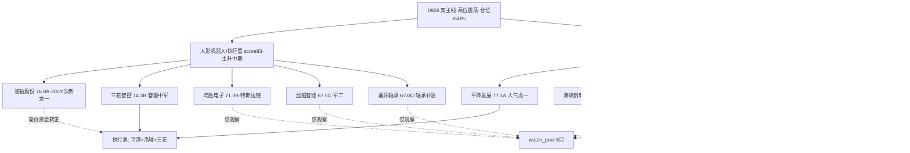

```yaml
date: 2026-09-28
agent: R5-stock-profiles
skill_version: analyze_stock_profile_v1@1.5
generated_at: 2026-09-28T08:22:52+08:00
confidence: 0.68
degraded: false
data_from_trade_date: 2026-09-24
post_close_chart_vision: true
data_sources:
  - name: R2_main_sectors
    path: data/research/20260928/R2_main_sectors.json
    status: ok
    captured_at: 2026-09-28
    record_count: 10 候选
  - name: R4_news
    path: data/research/20260928/R4_news.json
    status: ok
    captured_at: 2026-09-28
    record_count: 8 事件·E001/E002 双 high
  - name: R7_capital_flow
    path: data/research/20260928/R7_capital_flow.json
    status: ok
    captured_at: 2026-09-28
    record_count: 执行器+10.41亿·平潭LHB 4.75亿
  - name: R1_style
    path: data/research/20260928/R1_style.json
    status: ok
    captured_at: 2026-09-28
    record_count: 主线扩散型·高位震荡·仓位0.5
  - name: R3_sentiment
    path: data/research/20260928/R3_sentiment.json
    status: ok
    captured_at: 2026-09-28
    record_count: 人形机器人三源共振top1·两岸l1_only
  - name: tushare.daily
    path: MCP tushareMcp
    status: ok
    captured_at: 2026-09-24
    record_count: 10票≥30日K(洛轴次新12日)
  - name: tushare.daily_basic
    path: MCP tushareMcp
    status: ok
    captured_at: 2026-09-24
    record_count: 10票 PE/PB/市值/换手
  - name: tushare.limit_list_d
    path: MCP tushareMcp
    status: ok
    captured_at: 2026-09-24
    record_count: 10票涨停时间/开板数/高度
  - name: tushare.top_list
    path: MCP tushareMcp
    status: ok
    captured_at: 2026-09-24
    record_count: 6票上榜
  - name: tushare.block_trade
    path: MCP tushareMcp
    status: ok
    captured_at: 2026-09-24
    record_count: 昆船1条·机构大宗
  - name: tushare.margin_detail
    path: MCP tushareMcp
    status: ok
    captured_at: 2026-09-24
    record_count: 9票两融15日
  - name: tushare.fina_indicator
    path: MCP tushareMcp
    status: ok
    captured_at: 2026-06-30
    record_count: 10票 H1财务
  - name: tushare.stk_holdernumber
    path: MCP tushareMcp
    status: ok
    captured_at: 2026-09-24
    record_count: 10票股东户数
  - name: canghai-charts.chart_vision_analyze
    path: MCP canghai-charts
    status: ok
    captured_at: 2026-09-28
    record_count: 10/10 多模态识图
  - name: vibe-trading
    path: MCP
    status: error
    captured_at: -
    record_count: 未配置·筹码以tushare为主源
input_freshness: ok
input_freshness_note: A股行情截至20260924收盘(0925-0927中秋休市·节假日滞后非缺失)·chart_vision 10/10 实时生成·vibe-trading未配置以tushare兜底
```


# 2026-09-28 · **个股画像**

> **数据源新鲜度**: ok
> **降级状态**: false
> **置信度**: 0.68

## 一句话结论
**双主线 10 只候选六维画像完成：两岸统一平潭发展(77.1·A)+人形机器人洛轴股份(76.8·A)双 A 领跑；主线中军三花智控(74.3·B)低吸标的；其余 6 只 C 级仅入 watch。0928 节后首日高开兑现 vs 高开修复二分，只做龙一/龙二竞价自然走强低吸，不追高。**

## 候选池总览（按综合分排序）

| 排名 | 代码 | 名称 | 板块 | 综合分 | 等级 | 龙头判定 | 关键信号 |
|:--:|:--|:--|:--|--:|:--:|:--|:--|
| 1 | 000592.SZ | 平潭发展 | 两岸统一/福建 | 77.1 | A | 龙头·启动日 | LHB净买4.75亿三路硬资金·散户3.5倍涌入⚠️ |
| 2 | 301699.SZ | 洛轴股份 | 机器人/轴承 | 76.8 | A | 龙头候选·次新早封 | 20cm首板9:42·float24.85亿caution·换手36.9%极端 |
| 3 | 002050.SZ | 三花智控 | 机器人/执行器 | 74.3 | B | 中军·未涨停 | float1331亿容量·周K空头·低吸标的 |
| 4 | 300300.SZ | 海峡创新 | 两岸统一/福建 | 71.9 | B | 龙头·启动日 | 20cm尾盘封·LHB净买2.88亿·PB29倍⚠️ |
| 5 | 600699.SH | 均胜电子 | 机器人/特斯拉链 | 71.3 | B | 补涨·板块3日 | 炸板10:36·float315亿·两融+3.4% |
| 6 | 600802.SH | 福建水泥 | 两岸统一/基建 | 68.2 | C | 龙头·2板高度 | 周K破MA60 conf0.85最强·float30亿caution |
| 7 | 000905.SZ | 厦门港务 | 两岸统一/港口 | 67.7 | C | 龙头·启动日 | PE73倍·两融-11.8%资金弱 |
| 8 | 301311.SZ | 昆船智能 | 机器人/军工 | 67.5 | C | 补涨·板块3日 | 机构大宗买·亏损-125%·3日LHB转负 |
| 9 | 000678.SZ | 襄阳轴承 | 机器人/轴承 | 67.0 | C | 补涨·板块3日 | 9:37早封·float44亿caution·亏损 |
| 10 | 600815.SH | 厦工股份 | 两岸统一/工程机械 | 63.2 | C | 龙头·启动日 | 3次开板分歧·周涨28%超买·LHB净买1.14亿 |



## 详细分析

**市场背景（R1/R2）**：0928 节后首日，R1 主线扩散型·高位震荡（conf0.41）·仓位上限 0.5。R2 双主线：人形机器人 score83（主升中期 age3/height2）与两岸统一 score86（启动期 age1/height2），均三源共振。0925-0927 中秋休市，行情以 0924 收盘为锚，**高开兑现 vs 高开修复二分是本日核心博弈**——假期利好（中美八点共识、高盛上调人形机器人出货）已被 KOL 提前定价，涨停潮集中于 0924 尾盘（14:23-14:45），先手资金抢筹，节后高开即兑现压力大。

**主线一 人形机器人（score83）**：R4 E002 high（高盛 2030 出货 89 万台 3.5x + 特斯拉 Optimus 产量 10 倍 + 亚马逊 1 亿美元建厂）叠加 R3 唯一三源强共振。但资金面隐忧明确：泛概念人形机器人 -30.81 亿/机器人概念 -102.14 亿成分杂糅流出，仅细分执行器 +10.41 亿/减速器 +6.38 亿正向 → **竞价必须确认执行器资金延续**。洛轴次新 20cm 首板弹性最大但 float 24.85 亿 <50 亿 caution + 换手 36.9% 极端；三花 1331 亿容量中军未涨停=低吸首选但周 K 空头压制。高度仅 2 板（雪龙集团），mid_up 早期，若高标断板立即降档。

**主线二 两岸统一（score86）**：R4 E001 中美八点共识 high 宏观事件直接催化 + 热榜 #1 #2 双新进 + 平潭 LHB 三路硬资金（游资 10.27 亿 + 机构 6.99 亿）。但 **R3 l1_only 弱共振**（KOL 未直接点名板块），事件驱动单源风险 + 散户 3.5 倍涌入（平潭 9.8 万→34 万户）=筹码松动前兆。启动期梯队未建立（仅福建水泥 2 板），只做龙一/龙二低吸不追高。

## 推理深度三问（Top 双 A 首推）

### 平潭发展（77.1分·A）

- **大资金意图**: 游资(开源西安西大街+10.27亿)+机构(+6.99亿)在两岸统一事件启动首日同时下注=卡位人气核心·对手盘是节前尾盘抢筹的先手资金(14:23封·次日高开承接方). 散户3.5倍涌入说明主力借人气出货嫌疑·但净买4.75亿绝对量仍是真金
- **为什么走强**: 位置=启动首日(0923 rank90→0924 rank1·surge+89)·催化=中美八点共识硬宏观事件·筹码=三路LHB净买+封单3.57亿·三维全部共振
- **逻辑够不够硬**: 硬——事件(中美共识·可证实)+资金(三路LHB·可验证)+人气(cross_platform dc#1+ths#39)三独立源·但风险在证伪路径: 事件驱动单源(无产业逻辑纵深)+H1净利-560%基本面负贡献·若0928竞价无承接或板块退潮即熄火

### 洛轴股份（76.8分·A）

- **大资金意图**: 游资在机器人轴承方向启动第3天打20cm首板·抢机器人主线20cm弹性卡位·对手盘是次新股上市以来的获利盘(09-09上市首日+101%后高位震荡)与上方36.66解套盘
- **为什么走强**: 位置=次新上市12日·0924首度20cm涨停突破平台·催化=R4 E002高盛/德银/特斯拉三重催化+双群研报式整理·筹码=LHB净买1.01亿+封单1.08亿+换手36.9%充分换手
- **逻辑够不够硬**: 硬——产业催化(机构出货预测+订单)+资金(执行器+10.41亿+LHB正向)多源共振·但风险在: float<50亿庄股风险+20cm退潮环境隔日-20%可能·次新无历史估值锚·证伪=高标断板或执行器资金转出

## 首推票思维链（D1 消费 · E1 存证）

### 平潭发展（000592.SZ）

- **买入理由**:
  - 两岸统一人气龙一·R4 E001中美八点共识 high 宏观事件直接催化·热榜#1海峡两岸+#2福建自贸区双新进
  - LHB三路硬资金: 净买4.75亿(净率17.48%)+开源西安西大街游资10.27亿+机构6.99亿·封单3.57亿·启动首日上榜=带动性最强
- **风险点**:
  - 短期: 14:23尾盘封+假期利好已被KOL提前定价('必须上4000')·0928高开兑现风险大·散户3.5倍涌入(9.8万→34万)=筹码松动
  - 中期反证: H1净利-560%·基本面与题材完全背离·事件驱动熄火快(单源L1_only·KOL未点名板块)·若竞价无承接板块退潮即证伪
- **止损条件**: 买入参考 8.78 收盘附近·竞价承接确认(溢价>+3%且量比>1.5)才进·跌破 8.3(60分MA20) 离场·或高开无溢价(溢价<-1%)不追·-6%硬止损
- **可验证假设**: 0928竞价换手>5%且承接价>8.6·盘中封板量能>3亿·板块内≥3家连板→龙头确认; 反之高开低走破8.3→题材证伪离场

### 洛轴股份（301699.SZ）

- **买入理由**:
  - 次新20cm首板·9:42早封(早于9:45)=带动性·R3唯一三源强共振 top1·R2龙一·机器人轴承方向最猛
  - LHB净买1.01亿(净率11.69%)·两融+6.5%·封单1.08亿·20cm弹性最大
- **风险点**:
  - 短期: float24.85亿<50亿 caution·换手36.9%极端·20cm退潮环境隔日-20%风险·次新仅12日K线无历史支撑参考
  - 中期反证: 上方36.66解套抛压·高开兑现风险·若板块高标断板(雪龙2板)或执行器资金转出即转弱
- **止损条件**: 只做竞价自然走强低吸(溢价>+3%且资金转正)·不追高开无溢价·跌破60分MA20约31.65离场·-8%硬止损
- **可验证假设**: 0928竞价量比>2且红盘·盘中封板且执行器板块资金延续→龙头确立; 开板放量或执行器资金转负→兑现离场

### 三花智控（002050.SZ）

- **买入理由**:
  - 执行器容量中军 float1331亿·R4首推 特斯拉Optimus执行器Tier1(产量10倍)·研报4买入1增持
  - R7执行器+10.41亿#2·未涨停=追高溢价小·低吸性价比高
- **风险点**:
  - 短期: 周K空头排列·日K未突破37.25·0924仅+0.25%需竞价看资金回归执行器
  - 中期反证: H1净利-3.12%(R2误载+79%为长电数据)·成长性弱·若机器人主线退潮容量票阴跌
- **止损条件**: 低吸·竞价资金转正(执行器板块+三花主力净流入)才进·破36.08昨收则逻辑弱化观察·-5%硬止损
- **可验证假设**: 0928竞价执行器板块资金转正且三花主力净流入>0→进; 板块资金流出或三花缩量阴跌→只观察

### 海峡创新（300300.SZ）

- **买入理由**:
  - 两岸20cm弹性龙二·LHB净买2.88亿(净率17.94%)·启动首日14:24封·R2龙二
  - 两融+23.8%加速·股东户数6.66万较Q1大幅下降=筹码集中
- **风险点**:
  - 短期: 20cm尾盘封·高开兑现风险大·次日冲高回落
  - 中期反证: H1净利-684%·PB29倍纯情绪定价·上方14元套牢区·若两岸退潮20cm回撤剧烈
- **止损条件**: 只做竞价自然走强低吸·20cm破位快切·跌破9.6(日K MA5)离场·-8%硬止损
- **可验证假设**: 0928竞价量比>1.5且红盘承接·封板→龙二确认; 高开低走破9.6→离场

## 关键证据

- 平潭发展 LHB 净买 4.75 亿 · net_rate 17.48% · 来源 tushare.top_list(0924) · R7 三证
- 洛轴股份 9:42 早封 20cm · LHB 净买 1.01 亿 · 换手 36.9% · 来源 tushare.limit_list_d + top_list
- 三花智控 H1 净利 -3.12%（修正 R2 误载 +79%）· 来源 tushare.fina_indicator
- R4 E001 中美八点共识 high（习近平访美圆满·商务部第八轮经贸磋商）· 来源 R4_news
- R4 E002 人形机器人：高盛 2030 出货 89 万台 + 特斯拉 Optimus 产量 10 倍 · 来源 R4_news
- R7 执行器 +10.41 亿 #2 · 减速器 +6.38 亿 #4 · 泛概念资金背离 -102.14 亿 · 来源 R7_capital_flow

## 数据源审计

| 源 | 日期 | 状态 | 备注 |
|---|---|:--:|---|
| R2_main_sectors | 2026-09-28 | 🟢 | 10 候选 |
| R4_news | 2026-09-28 | 🟢 | 8 事件·E001/E002 双 high |
| R7_capital_flow | 2026-09-28 | 🟢 | 执行器+10.41亿·平潭LHB 4.75亿 |
| R1_style | 2026-09-28 | 🟢 | 主线扩散型·高位震荡·仓位0.5 |
| R3_sentiment | 2026-09-28 | 🟢 | 人形机器人三源共振top1·两岸l1_only |
| tushare.daily | 2026-09-24 | 🟢 | 10票≥30日K(洛轴次新12日) |
| tushare.daily_basic | 2026-09-24 | 🟢 | 10票 PE/PB/市值/换手 |
| tushare.limit_list_d | 2026-09-24 | 🟢 | 10票涨停时间/开板数/高度 |
| tushare.top_list | 2026-09-24 | 🟢 | 6票上榜 |
| tushare.block_trade | 2026-09-24 | 🟢 | 昆船1条·机构大宗 |
| tushare.margin_detail | 2026-09-24 | 🟢 | 9票两融15日 |
| tushare.fina_indicator | 2026-06-30 | 🟢 | 10票 H1财务 |
| tushare.stk_holdernumber | 2026-09-24 | 🟢 | 10票股东户数 |
| canghai-charts.chart_vision_analyze | 2026-09-28 | 🟢 | 10/10 多模态识图 |
| vibe-trading | - | 🔴 | 未配置·筹码以tushare为主源 |

## 不确定性 / 反证

1. **0924 数据 3 日滞后**：0925-0927 中秋休市，行情以 0924 收盘为锚，假期消息面（高盛/中美共识）无法在 K 线上验证，0928 竞价量价承接是唯一真实试金石。
2. **两岸线事件驱动单源**：R3 为 l1_only（KOL 未点名板块），叙事主要靠宏观事件缺产业逻辑纵深，若竞价无承接熄火快——已按 R2 红线处理（仅 l1_only 消费不进入共振 top5）。
3. **散户拥挤信号**：平潭股东户数 3.5 倍暴涨、纳指 ETF 溢价停牌=散户高标拥挤，节后高开兑现压力大——D1 若给仓位必须压半。
4. **vibe-trading 未配置**：筹码结构以 tushare 为主源（block_trade/margin_detail 全量非 null），大宗/两融独立证据完整，但无第二通道交叉核验——已降为 tushare 单源确认。
5. **次新股 K 线不足**：洛轴仅 12 交易日，技术形态无历史参考，chart_vision 基于短周期，止损位参考意义弱化。

## 与其他 R/D/E 的关系
- 依赖: R2_main_sectors(候选) · R4_news(催化) · R7_capital_flow(资金) · R1_style(风格) · R3_sentiment(共振)
- 被消费: D1 主决策(execution_pool 选平潭/洛轴/三花) · R6 反证(模式七 fundamental_flags 透传·平潭/海峡/福建水泥亏损强红旗) · E1 复盘(leader_verdict + 思维链 T+N 回填)

## Sub-Agent 元数据
- skill: analyze_stock_profile_v1
- artifact: data/research/20260928/R5_stock_profiles.json
- 生成耗时: 约 25 分钟（数据拉取 + 六维画像 + 渲染）
- model: deepseek-v4-flash-ga-260731

