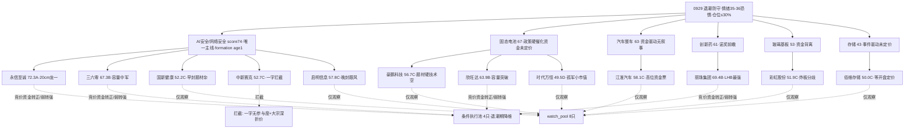

```yaml
date: 2026-09-29
agent: R5-stock-profiles
skill_version: analyze_stock_profile_v1@1.5
generated_at: 2026-09-29T07:52:00+08:00
confidence: 0.70
degraded: true
data_sources:
  - name: R2_main_sectors
    path: data/research/20260929/R2_main_sectors.json
    status: ok
    captured_at: 2026-09-29
    record_count: 1主线+7secondary·12候选
  - name: R3_sentiment
    path: data/research/20260929/R3_sentiment.json
    status: ok
    captured_at: 2026-09-29
    record_count: 5主题L1+L2·AI安全rank4
  - name: R4_news
    path: data/research/20260929/R4_news.json
    status: ok
    captured_at: 2026-09-29
    record_count: 8事件·E003 AI安全0.92全场最高
  - name: R7_capital_flow
    path: data/research/20260929/R7_capital_flow.json
    status: ok
    captured_at: 2026-09-29
    record_count: 汽车整车+10.43亿#1·题材均无板块资金
  - name: tushare.daily
    path: MCP tushareMcp
    status: ok
    captured_at: 2026-09-28
    record_count: 12票≥35日K
  - name: tushare.daily_basic
    path: MCP tushareMcp
    status: ok
    captured_at: 2026-09-28
    record_count: 12票 PE/PB/市值/换手
  - name: tushare.limit_list_d
    path: MCP tushareMcp
    status: ok
    captured_at: 2026-09-28
    record_count: 7票涨停明细(封板时间/开板/高度)
  - name: tushare.top_list
    path: MCP tushareMcp
    status: ok
    captured_at: 2026-09-28
    record_count: 2票命中(丽珠+1.21亿/永信+4313万)
  - name: tushare.block_trade
    path: MCP tushareMcp
    status: ok
    captured_at: 2026-09-28
    record_count: 中新5笔(-18.1%折价)·欣旺达1笔
  - name: tushare.margin_detail
    path: MCP tushareMcp
    status: partial
    captured_at: 2026-09-25
    record_count: 10票·豪鹏/时代万恒非两融标的
  - name: tushare.fina_indicator
    path: MCP tushareMcp
    status: ok
    captured_at: 2026-06-30
    record_count: 12票 H1财务
  - name: tushare.forecast
    path: MCP tushareMcp
    status: ok
    captured_at: 2026-09-28
    record_count: 12票业绩预告
  - name: tushare.report_rc
    path: MCP tushareMcp
    status: ok
    captured_at: 2026-09-28
    record_count: 7票有券商盈利预测(江淮42条最多)
  - name: tushare.stk_holdernumber
    path: MCP tushareMcp
    status: partial
    captured_at: 2026-09-28
    error: 单位不一致·不做数值趋势·仅取最新值
  - name: tushare.pledge_stat
    path: MCP tushareMcp
    status: partial
    captured_at: 2026-09-28
    error: 12票均无质押数据返回
  - name: canghai-charts.chart_vision_analyze
    path: MCP canghai-charts
    status: ok
    captured_at: 2026-09-29
    record_count: 12/12 多模态识图·含PNG
  - name: vibe-trading
    path: MCP
    status: error
    captured_at: -
    record_count: 未配置·筹码以tushare为主源兜底
input_freshness: partial
input_freshness_note: weflow down+公众号sanji disabled(manifest global_severity=2)·两融数据截至0925(交易所8:30更新前)·holder/pledge数据质量降级·行情/涨停/LHB/图视全fresh
```


# 2026-09-29 · **个股画像**

> **数据源新鲜度**: partial
> **降级状态**: true
> **置信度**: 0.70

## 一句话结论
**退潮防守期 12 只候选六维画像完成：永信至诚(72.3·A·AI安全龙一)唯一 A 级；丽珠集团(69.4·B) LHB 净买 1.21 亿全场最强资金验证。R1 情绪 35-36 恐惧·仓位上限 30%，全线只做竞价资金转正低吸，不追高不接力。**

## 候选池总览（按综合分排序）

| 排名 | 代码 | 名称 | 板块 | 综合分 | 等级 | 推荐 | 龙头判定 | 关键信号 |
|:--:|:--|:--|:--|--:|:--:|:--:|:--|:--|
| 1 | 688244.SH | 永信至诚 | AI安全 | 72.3 | A | 降级 | 龙头·启动日 | E003 0.92最高分·LHB净买4313万·20cm首板·float29.9亿caution⚠️ |
| 2 | 000513.SZ | 丽珠集团 | 创新药 | 69.4 | B | 降级 | 龙头·9:32早封 | LHB净买1.21亿全场最强·pe16财务好·npy-27%反证 |
| 3 | 601360.SH | 三六零 | AI安全 | 67.3 | B | 降级 | 中军·未涨停 | AI安全认证第一标的·容量626亿·技术震荡无突破 |
| 4 | 300207.SZ | 欣旺达 | 固态/BBU | 63.9 | B | 降级 | 未涨停 | +6.42%放量突破·20条研报·容量366亿·debt73%⚠️ |
| 5 | 600418.SH | 江淮汽车 | 汽车整车 | 58.1 | C | 观察 | 中军·资金#1 | 主力+10.43亿·5日+31%高位·无叙事催化 |
| 6 | 002232.SZ | 启明信息 | AI安全 | 57.8 | C | 观察 | 补涨·11:06晚封 | R2 filtered·pe197极高 |
| 7 | 001283.SZ | 豪鹏科技 | 固态/BBU | 56.7 | C | 观察 | 未涨停 | 双题材最硬但多周期空头·45支撑 |
| 8 | 002912.SZ | 中新赛克 | AI安全 | 52.7 | C | 拦截 | 龙头·一字 | 大宗折价-18.1%分销⚠️·亏损·无参与度 |
| 9 | 000503.SZ | 国新健康 | AI安全 | 52.2 | C | 观察 | 龙头·9:31早封 | 题材纯度低(医保网安)·H1增亏 |
| 10 | 600707.SH | 彩虹股份 | 玻璃基板 | 51.9 | C | 观察 | 分歧弱·炸板3次 | 9.38%未封·融资+28%双刃·pe1650 |
| 11 | 688525.SH | 佰维存储 | 存储 | 50.0 | C | 观察 | 未涨停·回调 | 扭亏3200%·技术空头-6.05%·事件未定价 |
| 12 | 600241.SH | 时代万恒 | 固态/BBU | 49.5 | D | 观察 | 孤军·板块1只 | float23.7亿过小⚠️·H1首亏 |



## 详细分析

**市场背景（R1/R2）**：0929 是节前倒数第二个交易日，R1 给出震荡分化偏退潮（情绪 35-36 恐惧档·仓位上限 30%），退潮线三条件全触发。R2 在"不堆主线数"纪律下只保留 1 条真主线——AI 安全（74 分，formation age1），固态电池 67 分因政策盘后发、资金未定价降为 secondary。**全题材资金未确认**：R7 前十大流入全是汽车整车/白酒/猪肉/婴童等低位防御，AI 安全/固态/创新药均无板块级主力流入，这意味着 0929 开盘前没有任何题材被资金预定价，一切都要等竞价资金转正——退潮期题材高开低走的常态剧本。R5 因此全线降维：12 只候选没有一只能直接进 execution_pool，全部是"条件票"。

**主线 AI 安全（score74·formation）**：催化是全场最硬的——R4 E003 三重共振 0.92 分（英伟达开放智能体安全平台 + 360 获国内首个 AI 安全认证 + OpenAI 紧急暂停最强模型训练），叠加商务部中美 AI 事件沟通渠道。但注意板块 0928 是 -2.02% 随大盘下跌的，涨停 4 只（永信至诚 20cm/启明/中新赛克/国新健康）全是事件驱动首日异动，没有资金底座。永信至诚作为唯一 20cm 弹性核心 + LHB 净买 4313 万 + 人气 first_entry#75，是唯一 A 级，但 float 29.9 亿 <50 亿 caution、2025 首亏、周线 20.47 压力三重压制，只配"竞价资金转正低吸"；三六零是认证第一标的的容量中军，但技术面震荡无突破信号，同样等资金；中新赛克虽一字秒板筹码锁定好，但 30 日大宗交易 5 笔平均折价 -18.1%（分销减持迹象）+ H1 增亏，直接拦截；国新健康 9:31 早封但题材纯度低（医保网安边缘），启明信息 11:06 晚封典型跟风，二者仅观察。

**secondary 三线（固态/整车/创新药）**：固态电池政策（七部门 2030 全固态）是真硬催化但盘后发、未定价——豪鹏科技题材最纯（1200Wh/L·R3/R4 双源首推）却技术多周期空头，价格与题材严重背离，只等 45 元支撑企稳；欣旺达容量 366 亿 +6.42% 放量突破、20 条研报是固态线最佳形态，但 debt 73.6% 偏高；时代万恒首板涨停但板块孤军 + float 23.7 亿过小 + 首亏，D 级。汽车整车江淮是 R7 资金 #1（+10.43 亿）但无叙事共振，5 日 +31% 高位，退潮期不追高。创新药丽珠集团是全场资金验证最强者——LHB 净买 1.21 亿（net_rate +14.31%）+ 9:32 早封 + pe 16 财务扎实，但 npy -27% 业绩下滑与诺奖 10 月兑现窗口构成反证，降级等弱转强。玻璃基板彩虹股份人气升（热榜 12→4）但 9.38% 炸板 3 次未封住 + R7 无资金 + pe 1650，只做竞价弱转强。存储佰维是事件驱动（长鑫 349 亿扩产）盘后未定价，但技术空头大跌 6.05%，按 memory 规则保留等开盘，不追跌。

## 推理深度三问（Top 2 首推）

### 永信至诚（72.3分·A·AI安全龙一）

- **大资金意图**: 游资在 OpenAI DNS 漏洞事件的第一个交易日打 20cm 首板，卡位 AI 安全/DNS 防护的最纯弹性标的——LHB 净买 4313 万（net_rate +15.94%）是游资抢身位而非机构配置，对手盘是 0914 前平台套牢盘与首日获利盘。融资 15 日 +15.91% 说明杠杆资金同步进场
- **为什么走强**: 位置=启动首日（0914 涨停后回调平台→0928 放量 20cm 突破创 20 日新高）·催化=E003 0.92 全场最高分（三事件共振）·筹码=换手 9.78% 充分换手 + LHB 净买 + 人气 first_entry#75·三维全共振
- **逻辑够不够硬**: 硬——事件（OpenAI 暂停训练可证实）+ 资金（LHB 真金）+ 人气（R3/R4 双源点名）三独立源共振。但证伪路径清晰：纯事件驱动无产业业绩纵深（2025 首亏、H1 亏损扩大），float 29.9 亿 <50 亿庄股风险，20cm 退潮环境隔日 -20% 是真实可能——竞价若 AI 安全板块主力不转正，立即熄火

### 丽珠集团（69.4分·B·创新药龙头）

- **大资金意图**: 机构/游资在食欲素诺奖前瞻（拉斯克奖已发）窗口低吸创新药低位票——LHB 净买 1.21 亿是全场 12 只候选里最强单笔（net_rate +14.31%），9:32 早封说明有人抢筹而非诱多，对手盘是 29 元平台套牢盘。融资余额持平说明是纯增量资金而非杠杆
- **为什么走强**: 位置=低位首板（26-29 元横盘后 0928 放量涨停创 20 日新高）·催化=诺奖 10 月兑现 + KHN707 管线 + THS 创新药 #2 大跌日抗跌·筹码=vr 4.64 巨量 + LHB 大净买·三维共振
- **逻辑够不够硬**: 中上——资金（LHB 1.21 亿）+ 情绪（创新药抗跌）+ 位置（低位）够硬，但产业逻辑是"前瞻"非"已兑现"，且 H1 npy -27.2%/or -20.3% 基本面在恶化，诺奖兑现即利好出尽的风险高。证伪=竞价无承接或创新药板块资金转出

## 首推票思维链（D1 消费 · E1 存证）

### 永信至诚（688244.SH）

- **买入理由**: ① AI 安全 DNS 漏洞第一标的，E003 三重共振 0.92 分全场最高，R3/R4 双源点名（产业逻辑）② LHB 净买 4313 万 net_rate +15.94% + 融资 15 日 +15.91%，资金验证最硬（数据锚）③ 板块 4 只涨停、唯一 20cm 弹性核心，身位最纯（卡位逻辑）
- **风险点**: ① 短期：20cm 首板后高位分歧，退潮期题材高开低走常态，隔日 -20% 可能 ② 中期反证：2025 首亏 -4200~-5000 万 + H1 亏损扩大，纯事件驱动无业绩纵深；float 29.9 亿 <50 亿庄股风险；周线 20.47 套牢压力
- **止损条件**: 竞价 AI 安全板块主力不转正→不进；若进，破 17.4（60 分 MA20）止损，-10% 硬区间（相对 19.8 即 17.82 破位确认）
- **可验证假设**: 24-72h 内观察：① 0929 竞价 AI 安全板块主力净流入是否转正（转正=计划内低吸执行，不转正=放弃）② 首日 10:30 前是否守住 19.8 涨停价附近 ③ 次日溢价率：若高开 <3% 且量能萎缩=证伪离场

### 丽珠集团（000513.SZ）

- **买入理由**: ① 食欲素诺奖 10 月兑现窗口 + KHN707 管线，低位创新药龙头身位（产业逻辑）② LHB 净买 1.21 亿全场最强 net_rate +14.31% + vr 4.64 巨量，资金验证实锤（数据锚）③ pe_ttm 16 + roe 6.84 + gpm 61.3%，12 只候选中基本面最扎实
- **风险点**: ① 短期：涨停后获利盘回吐，竞价高开兑现压力 ② 中期反证：H1 npy -27.2% 业绩下滑，诺奖兑现=利好出尽；创新药板块 R7 无板块资金，属情绪驱动
- **止损条件**: 破 29（日 K MA60）止损，-5~-10% 硬区间；竞价创新药板块资金不转正→降级 watch
- **可验证假设**: ① 0929 竞价是否高开 <5% 且承接有力（高开无溢价不追）② 诺奖正式公布前后（10 月初）是否有新催化接力 ③ 24h 内能否守住 30.34 涨停价上方

## 数据源审计

| 源 | 状态 | 抓取时间 | 记录数 | 备注 |
|---|---|---|---|---|
| R2_main_sectors | 🟢 ok | 09-29 | 12 候选 | 1主线+7secondary |
| R3_sentiment | 🟢 ok | 09-29 | 5主题 | AI安全 rank4 L1+L2 |
| R4_news | 🟢 ok | 09-29 | 8事件 | E003 0.92 全场最高 |
| R7_capital_flow | 🟢 ok | 09-29 | 题材无板块资金 | 整车+10.43亿#1 |
| tushare.daily | 🟢 ok | 09-28 | 12票≥35日K | - |
| tushare.daily_basic | 🟢 ok | 09-28 | 12票 | PE/PB/市值 |
| tushare.limit_list_d | 🟢 ok | 09-28 | 7票 | 封板/开板/高度 |
| tushare.top_list | 🟢 ok | 09-28 | 2票命中 | 丽珠+1.21亿·永信+4313万 |
| tushare.block_trade | 🟢 ok | 09-28 | 中新5笔-18.1% | 触发 distribution_alert |
| tushare.margin_detail | 🟡 partial | 09-25 | 10票 | 豪鹏/时代非两融标的·早8:30前数据滞后 |
| tushare.fina_indicator | 🟢 ok | 06-30 | 12票 | H1财务 |
| tushare.forecast | 🟢 ok | 09-28 | 12票 | 业绩预告 |
| tushare.report_rc | 🟢 ok | 09-28 | 7票有研报 | 江淮42条最多 |
| tushare.stk_holdernumber | 🟡 partial | 09-28 | 单位异常 | 仅取最新值·不做趋势 |
| tushare.pledge_stat | 🟡 partial | 09-28 | 无数据 | 12票空返回 |
| chart_vision_analyze | 🟢 ok | 09-29 | 12/12 | 含 PNG·bias/conf |
| vibe-trading | 🔴 error | - | 0 | 未配置·tushare 兜底 |

## 不确定性 / 反证

本日画像的最大不确定性是**题材全部没有资金底座**——R7 显示所有 12 只候选所属板块均无主力净流入，唯一有板块资金的是汽车整车（江淮，但无叙事）。这意味着六维画像中催化/技术维度再强，竞价一开即可能被证伪。其次，退潮期情绪 35-36 恐惧档，20cm 票（永信至诚/佰维）的波动是双刃剑，画像的"低吸"建议依赖竞价资金转正这一硬前提。第三，数据层：两融数据截至 0925（交易所规则 8:30 前不更新）、股东户数单位不一致、质押数据缺失、weflow 群聊情绪源 down——筹码维度的颗粒度弱于常规。中新赛克大宗折价 -18.1% 已作为 distribution_alert 交 R6 重点反证；永信至诚亏损基本面、丽珠业绩下滑、彩虹炸板分歧均列为反证观察点。

## 与其他 R/D/E 的关系

- 依赖: R2_main_sectors(候选池+verdict 锚) · R3_sentiment(共振与热度) · R4_news(催化映射) · R7_capital_flow(资金验证) · R1_style(退潮背景)
- 被消费: D1 canghai-plan(execution/watch 分流·推荐五档) · R6 analyze_devil_advocate(六维反证·fundamental_flags·中新 distribution_alert) · E1 daily_review(画像回顾)

## Sub-Agent 元数据

- skill: analyze_stock_profile_v1
- artifact: data/research/20260929/R5_stock_profiles.json
- 生成耗时: ~22 分钟(数据拉取+12票图视+评分+渲染)
- model: deepseek-v4-flash-ga-260731
