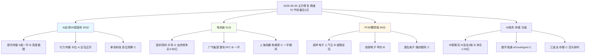

# 2026-09-30 · 🧬 个股画像（R5 六维）

> **数据源新鲜度**: 🟡 partial（仅质押维度缺失）
> **降级状态**: no
> **置信度**: 0.68

## 一句话结论
**三主线 12 只候选完成六维画像：国轩高科（A·78）居首、引力传媒（A·70）次之，电池链资金+龙虎榜双硬、AI应用逻辑硬但高标兑现压力极端；节前最后 1 日只做龙头分歧低吸/弱转强，不追一字、不碰补涨。**

## 候选池构成（12 只 · R2 eligible 6 + 观察/次级 6）

| 排名 | 代码 | 名称 | 主线 | 综合分 | 等级 | 龙头判定 | 关键信号 |
|:--:|:--|:--|:--|--:|:--:|:--|:--|
| 1 | 002074.SZ | 国轩高科 | 电池链(固态/锂电) | 78 | A | 龙头 | lhb_bull_trap_flagged |
| 2 | 600825.SH | 新华传媒 | AI应用/AI智能体 | 74 | B | 龙头 | - |
| 3 | 603598.SH | 引力传媒 | AI应用/AI智能体 | 70 | A | 龙头 | shareholder_reduce |
| 4 | 601238.SH | 广汽集团 | 电池链(固态/锂电) | 70 | B | 龙头 | profit_warning |
| 5 | 605058.SH | 澳弘电子 | PCB/覆铜板 | 67 | C | 补涨/跟风 | - |
| 6 | 000823.SZ | 超声电子 | PCB/覆铜板 | 67 | B | 龙头 | lhb_bull_trap_flagged,holder_num_surge |
| 7 | 002912.SZ | 中新赛克 | AI政务/AI安全 | 66 | B | 龙头 | holder_num_surge,shareholder_reduce,profit_warning,float_mv_caution |
| 8 | 603328.SH | 依顿电子 | PCB/覆铜板 | 64 | B | 龙头 | holder_num_surge,margin_shrink,profit_warning |
| 9 | 603533.SH | 掌阅科技 | AI应用/AI智能体 | 61 | C | 补涨/跟风 | - |
| 10 | 603200.SH | 上海洗霸 | 电池链(固态/锂电) | 60 | C | 补涨/跟风 | profit_warning |
| 11 | 300075.SZ | 数字政通 | AI政务/AI安全 | 54 | C | 未涨停 | - |
| 12 | 301308.SZ | 江波龙 | 存储/半导体测试 | 49 | C | 未涨停 | holder_num_surge |

## 详细分析

### 🥇 首推一：国轩高科 002074.SZ（A · 78 分 · 电池链容量中军）

- **大资金意图**: 9/29 龙虎榜净买 3.68 亿全场第一——国泰海通知春路 2.17 亿 + 南京太平南路 1.86 亿 + 深股通/机构多席位合力，机构席位净额同向 3.68 亿。固态电池+锂电池双概念三板块资金 top10（24.36/22.51/21.6 亿），主力在央行 PSL 降息 + 科技创新再贷款 1.4 万亿的科创成长大叙事下，把 498 亿流通的中军票当主攻方向。
- **为什么走强**: 位置——放量一字涨停突破 3 个月震荡区间创 20 日新高（28.68），60分/15分多头排列；催化——E002 央行组合拳硬政策 + 七部门全固态规模化 + 广汽 XFC；筹码——股东户数 -2.2% 集中、龙虎榜机构与游资合力。
- **逻辑够不够硬**: 硬。政策（PSL+再贷款）+ 产业（全固态 2030 规模化 + 广汽装车）+ 资金（三板块 top10 + 龙虎榜第一）三源独立共振；证伪路径——高标兑现（诱多 63/69 极值）下一字转弱、节后政策利好不延续。
- **买入理由**: ① 电池链容量中军承接确定，龙虎榜净买第一=合力明确；② 央行政策日首交易日直接催化。
- **风险点**: ① 一字板无参与度，竞价高开兑现=先手出货；② 资产负债率 71.7% + 周线 MA60（35 元）套牢盘压制。
- **止损条件**: 跌破 27.3（日K MA5）且不收回 → 离场；买入价 -5%~-8% 硬止损。
- **可验证假设**: 9/30 竞价不破 28.68 一字价、电池板块竞价资金维持 → 主升延续；竞价高开低走破 27.3 → 证伪离场。

### 🥈 首推二：引力传媒 603598.SH（A · 70 分 · AI应用卡位弹性核心）

- **大资金意图**: R4 E003 首推（0.92 分）——字节头部代理商（火山/巨量引擎 AI 合作·豆包 AI 广告 AI 短剧），在豆包 Muse 9/30 上会日做正宗映射。游资群 Sheng 强 call + 群内多模型受益逻辑（豆包+LightVela+可灵 4.0）。
- **为什么走强**: 位置——首板涨停激活 5 日 +11%、日K 多头排列；催化——豆包上会=硬时间锚；筹码——股东户数 -5.6% 集中但高管贾延广 9/8 减持 0.0044%（量小）。
- **逻辑够不够硬**: 硬（时间锚 9/30 上会日 + 字节合作官网实锤 + R4 首推 + 群聊强共振）；证伪路径——上会日高开无溢价=预期兑现、传媒板块高开低走一日游。
- **买入理由**: ① 豆包 Muse 上会日正宗映射、弹性核心；② 首板 + 量比 1.24 放量。
- **风险点**: ① 周线仍空头排列、20.86 前高压力；② 上会日高开兑现风险，R4 明确只做分歧低吸/弱转强。
- **止损条件**: 跌破 18.57（日K MA5）→ 离场；买入价 -5% 硬止损。
- **可验证假设**: 9/30 竞价传媒板块高开但引力红盘承接 → 弱转强可参与；高开低走破 MA5 → 证伪。

### 🥉 首推三：超声电子 000823.SZ（B · 67 分 · PCB 人气王）

- **大资金意图**: 深股通专用席位 + 国新北京 + 机构买入——PCB 行业资金 #1（+29.51 亿）驱动超跌反包人气王（surge 70→5）。R7 显示 PCB +25.77 亿 #4。
- **为什么走强**: 位置——0928 -9.4% 大跌 → 0929 反包涨停，日K 多头排列、周K 多头；催化——机构风向群研报级催化（杰普特金刚石钻针）；筹码——⚠️ 股东户数 +77.6% 暴增=筹码显著分散、换手 19.56% 充分换手、且被 R7 诱多标记（63/69 极值中在列）。
- **逻辑够不够硬**: 中偏硬。资金（行业 #1）+ 人气（热榜 #2）双硬，但 R4 无事件级催化、超跌反弹属性 + 诱多标记 + 机构席位净卖 4739 万 = 反证明确。
- **买入理由**: ① PCB 修复日人气王、深股通实买；② 行业资金 #1 确认。
- **风险点**: ① 股东户数暴增+机构净卖=出货风险；② 超跌反弹追高谨慎、R7 诱多标记。
- **止损条件**: 跌破 24.4 涨停价转弱即弃；买入价 -5% 硬止损。
- **可验证假设**: 9/30 PCB 板块资金维持 + 超声竞价红盘承接 → 反包延续；竞价低开破 24.4 → 离场。

### 其余候选速览

| 代码 | 名称 | 分 | 龙头判定 | 一句话 |
|:--|:--|--:|:--|:--|
| 601238.SH | 广汽集团 | 70 | 龙头 | 整车XFC容量·一字封死·竞价确认才做 |
| 605058.SH | 澳弘电子 | 67 | 补涨/跟风 | PCB晚封跟风·观察·弱转强才进 |
| 000823.SZ | 超声电子 | 67 | 龙头 | PCB人气王·超跌反包·深股通买·短线勿追高 |
| 002912.SZ | 中新赛克 | 66 | 龙头 | AI安全2连板·龙虎榜净买1.06亿·分歧(open 3)·竞价确认 |
| 603328.SH | 依顿电子 | 64 | 龙头 | PCB早封容量·低吸·板块资金维持才做 |
| 603533.SH | 掌阅科技 | 61 | 补涨/跟风 | 历史6板高位·R4观察级·不追高 |
| 603200.SH | 上海洗霸 | 60 | 补涨/跟风 | 固态电解质材料端·一字跟风·弱转强才考虑 |
| 300075.SZ | 数字政通 | 54 | 未涨停 | AI政务eGovaAgent·事件驱动·竞价资金确认才做 |
| 301308.SZ | 江波龙 | 49 | 未涨停 | 存储模组龙头·空头排列未修复·观察·等企稳 |

## 关键证据

- 证据 1: 国轩高科龙虎榜净买 3.68 亿全场第一（国泰海通知春路 2.17 亿/南京太平南路 1.86 亿/深股通/机构）· 来源 tushare top_list+top_inst 2026-09-29
- 证据 2: R7 龙虎榜诱多 63/69（91%·近期极值）· 超声电子/国轩高科在列 · 来源 R7_capital_flow lhb_bull_trap
- 证据 3: 电池链三板块主力净流入 top10（固态 24.36/电池技术 22.51/锂电池 21.6 亿）· 来源 R7 main_force
- 证据 4: 新华传媒 6 板一字 9:25 封 open=0 · 全场最高板 · 来源 tushare limit_list_d 2026-09-29
- 证据 5: 超声电子股东户数 +77.6% 暴增 + 机构席位净卖 4739 万 · 来源 tushare stk_holdernumber/top_inst
- 证据 6: 引力传媒 R4 E003 首推 0.92 分（字节头部代理·豆包 AI 广告）· 来源 R4_news

## 数据源审计

| 源 | 日期 | 状态 | 备注 |
|---|---|:--:|---|
| tushare:daily | 2026-09-29 | 🟢 | 900 条 |
| tushare:daily_basic | 2026-09-29 | 🟢 | 12 条 |
| tushare:limit_list_d | 2026-09-29 | 🟢 | 57 条 |
| tushare:top_list+top_inst | 2026-09-29 | 🟢 | 69 条 |
| tushare:block_trade | 2026-09-29 | 🟢 | 8 条 |
| tushare:margin_detail | 2026-09-28 | 🟢 | 10 条 |
| tushare:fina_indicator | 2026-09-29 | 🟢 | 12 条 |
| tushare:stk_holdernumber | 2026-09-29 | 🟢 | 12 条 |
| tushare:moneyflow | 2026-09-29 | 🟢 | 60 条 |
| tushare:stk_holdertrade | 2026-09-29 | 🟢 | 40 条 |
| canghai-charts:chart_vision_analyze | 2026-09-30 | 🟢 | 12 条 |
| R4_news | 2026-09-30 | 🟢 | 8 条 |
| R7_capital_flow | 2026-09-30 | 🟢 | - 条 |
| R2_main_sectors | 2026-09-30 | 🟢 | 3 条 |
| tushare:pledge_stat | - | 🔴 | 权限不可得·质押维度缺失 |

## 不确定性 / 反证

- 质押维度缺失（tushare pledge_stat 权限不可得）：F11 质押红旗无法检出，以财务红旗（F1/F3/F8）替代，质押风险存在盲区。
- 节前最后 1 个交易日 + 龙虎榜诱多 91% 极值：任何涨停票的次日溢价都需竞价验证，本画像的乐观信号（龙虎榜净买、资金 top10）在高标兑现日可能被一次性price-in。
- 江波龙/数字政通未涨停、空头排列：虽为 R4/R2 次级线首推，但技术形态与资金面未确认，默认只入 watch_pool。
- 股东户数披露滞后（多为 6/30 或 8/20 口径）：超声 +77.6% 为 H1 数据，可能未反映 9 月修复日的真实筹码变化。

## 与其他 R/D/E 的关系
- 依赖: R2_main_sectors（候选池）+ R4_news（催化背景）+ R7_capital_flow（资金验证）+ manifest（severity）
- 被消费: D1 execution_pool/watch_pool · R6 反证（hard_reject 校验 + 诱多标记交叉）· E1 observation_tracking T+N 回填

## Sub-Agent 元数据
- skill: analyze_stock_profile_v1@1.5
- artifact: data/research/20260930/R5_stock_profiles.json
- generated_at: 2026-09-30T08:33:21+08:00
- model: deepseek-v4-flash-ga-260731
