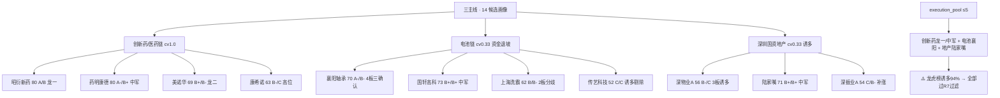

# 2026-10-01 · **个股画像**（R5 · 国庆休市口径·行情 0930 收盘）

> **数据源新鲜度**: partial
> **降级状态**: no（chart_vision 快照 26 票全命中·tushare 全量·质押字段降级以财务红旗替代）
> **置信度**: 0.68（0.75 × 0.97 × 0.93）

## 📌 一句话结论
**创新药/医药链是唯一四源确认主线（cv1.0）**：龙一昭衍新药 80 分 / 中军药明康德 80 分 / 龙二美诺华 69 分为进攻首选；电池链只做资金三确认的襄阳轴承（70 分）；深圳地产深物业A 3 板但龙虎榜诱多硬标记（distribution_alert → risk=C）不可碰。⚠️ 龙虎榜诱多 74/79=94% 极值，所有涨停票必须过 R7 过滤（R6 联动）。

## 🗺️ 候选池全景
| # | 代码 | 名称 | 板块 | 综合分 | 档位(α/risk) | 龙头认定 | 一句话 |
|---|------|------|------|------:|:----:|------|--------|
| 1 | 603127.SH | **昭衍新药** | 创新药/医药链(CRO) | **80** | A/B | 龙头 | CRO临床前龙一·唯一四源确认主线·首板10:49封·只做竞价弱转强 |
| 2 | 603259.SH | **药明康德** | 创新药/医药链(CRO中军) | **80** | A-/B+ | 中军 | CRO全球龙头容量中军·pe23低位·低吸主路径不做追高 |
| 3 | 002074.SZ | **国轩高科** | 电池链(固态/锂电中军) | **73** | B+/B+ | 中军 | 电池容量中军·昨日LHB净买3.68亿全场top1·低吸不追高 |
| 4 | 600663.SH | **陆家嘴** | 深圳国资地产/APEC(容量) | **71** | B+/B+ | 中军 | 地产容量中军·首板11:13封·AH股资金#6·低吸不追高 |
| 5 | 000678.SZ | **襄阳轴承** | 电池链(新能车) | **70** | A-/B- | 龙头 | 4板全场第2高标·新能车链涨停第一·资金三确认·节前高标兑现压力大 |
| 6 | 603538.SH | **美诺华** | 创新药/医药链(减肥药) | **69** | B+/B- | 龙头 | 减肥药正宗龙二·早封9:48·pe83偏高·只做竞价弱转强 |
| 7 | 688185.SH | **康希诺** | 创新药/医药链(疫苗/生物制品) | **63** | B-/C | 弹性 | 20cm弹性医药人气·30日翻倍高位·R2已降级观察·轻仓试错 |
| 8 | 603200.SH | **上海洗霸** | 电池链(固态电池) | **62** | B/B- | 龙头 | 固态电解质正宗2板·开板2次分歧·资金退坡期·只做竞价确认 |
| 9 | 605388.SH | **均瑶健康** | 创新药/医药链(减肥益生菌) | **57** | C/C | 跟风 🔶 | 减肥益生菌2板一字·float44亿小盘·机构净卖·只做开板弱转强 |
| 10 | 000011.SZ | **深物业A** | 深圳国资地产/APEC | **56** | B-/C | 龙头 ⚠️ | 3板深圳国资龙一·APEC时间锚·但龙虎榜诱多硬标记·只做竞价弱转强 |
| 11 | 000006.SZ | **深振业A** | 深圳国资地产/APEC(补涨) | **54** | C/B- | 补涨/跟风 | 深物业A比价补涨·未涨停资金未转正·观察不做左侧 |
| 12 | 600241.SH | **时代万恒** | 电池链(电池) | **53** | C/C | 跟风 🔶 | 3板一字电池小盘·float28.6亿·龙虎榜净卖·只做开板弱转强 |
| 13 | 002866.SZ | **传艺科技** | 电池链(固态电池) | **52** | C/C | 诱多 ⚠️ | 固态2板·龙虎榜诱多硬过滤(涨停净卖+机构净卖+疑似对倒)·剔除 |
| 14 | 300675.SZ | **建科院** | 深圳国资地产/APEC(城市更新) | **52** | C/C | 跟风 🔶 | 城市更新小盘·float21亿极低·未涨停·观察不做 |

## 🔬 推理深度三问（主线级）

### 创新药/医药链（唯一 cv1.0 主线）
- **大资金意图**: 医药防御轮动 + 礼来 E006 减重 23% 创纪录（美股 LLY +2.6% 新高）催化；R7 主力净流入 top11 全医药（创新药 +41.51 亿#1 / CRO +27.27 亿#3 / 减肥药 +15.4 亿#10）；热榜创新药登顶#1 + CRO 概念 5 家涨停#14。四源（资金/热榜/涨停/事件）全确认，是节前唯一'资金+热榜+涨停+事件'共振主线。
- **为什么走强**: 位置=医药指数 30 日刚转正（低位）+ 催化=E006 礼来硬事件（时间锚硬）+ 筹码=昭衍/美诺华股东户数大幅下降（↓10-16% 筹码集中）；但板块内连板高度仅 2 板（均瑶健康），加速确认 ≠ 新主线点火，若节后首板无溢价可能一日游。
- **逻辑够不够硬**: 硬（4 独立源一致 + E006 硬事件 + 资金 top11 全医药）。证伪路径: ①E008 美债 5.62% 创 24 年新高压制创新药估值（net_polarity=-0.7）；②龙虎榜诱多 94% 下所有涨停票（昭衍/美诺华/康希诺）必须过 R7 过滤；③高标断板则医药防御属性被抽离。

### 电池链（涨停潮第一但资金退坡）
- **大资金意图**: 电池排产 10 月环比 +5% 同比 40-50% 托底 + 固态电池产业化叙事；但 R7 资金 0929 固态 +24.36 亿#5 → 0930 未进 top15，资金明确从电池切向医药。涨停潮是情绪惯性，节后资金不回流则一日游概率大。
- **为什么走强**: 襄阳轴承 4 板=全场第 2 高标，龙虎榜净买 1.46 亿 + 主力 2.45 亿 + 超大单 2.15 亿三确认，是电池链唯一资金确认票；其余（上海洗霸/传艺）游资分歧或诱多。
- **逻辑够不够硬**: 半硬（涨停潮第一但资金退坡 cv0.33）。证伪: 节后竞价资金不回流电池链 → 只做龙一竞价确认，禁追高缩量一字。

### 深圳国资地产/APEC（政策脉冲·资金分歧）
- **大资金意图**: APEC 11 月峰会时间锚 + 深圳国资题材；AH 股 +21.43 亿#6 但深圳特区 -23.87 亿流出，资金分歧。深物业A 3 板但龙虎榜诱多（涨停净卖 -1.8 亿 + 机构净卖 -1.45 亿 + 疑似对倒）。
- **为什么走强**: 政策脉冲 + 题材发酵初期（age=2）；但资金未全面确认，纯题材驱动。
- **逻辑够不够硬**: 弱（cv0.33，无 R4 事件催化，APEC 是中期时间锚非节后首日催化）。深物业A risk=C 不可碰，只做陆家嘴容量中军低吸。

## 💎 首推票思维链（Top3）

### 昭衍新药（603127.SH · 综合 80 · A/B · 龙一·卡位CRO·资金+热榜+涨停三确认）
- **买入理由**: ① E006礼来减重23%创纪录(EASD·LLY+2.6%新高)+CRO资金#3 +27.27亿+创新药#1 +41.51亿+热榜first_entry#11·C；② CRO概念5家涨停#14领涨票·医药系龙虎榜霸榜(康希诺/泰诺麦博/近岸蛋白)·R7医药链top11全占·创新药主力净流入41.51亿全市场；③ 收盘49.3(+10%)·MA5/10/20多头46.7/46/44.6·突破20日新高49.3·30日+20.1%·量
- **风险点**: ① 龙虎榜诱多 94% 环境需 R7 过滤（R6 联动拦截）；② PE_TTM 37.5·PB 4.12·ROE 8.64%(中报扭亏 np_yoy+1126%·低基数)·or_yoy 5.27%·gm 2；③ 长假 8 天外盘风险（E008 美债 5.62%）
- **止损条件**: 依据快照 key_levels——短线交易者可在回踩47元附近低吸，触及49.7元前高压力时部分止盈；中长线持仓者可依托周K多头趋势继续持有
- **可验证假设**: 节后（1008）竞价资金确认；高开 >3% 兑现不追，低开弱转强=预期差买点；炸板率 >25% 则仓位降至 40% 以下

### 药明康德（603259.SH · 综合 80 · A-/B+ · CRO容量中军·机构票·低吸）
- **买入理由**: ① E006礼来减重+创新药/CRO板块共振·CRO全球龙头·R3点名'容量中军低吸'·未涨停+4.16%跟随板块；② CRO全球龙头·创新药#1资金41.51亿·医药链top11全占·港股+AH双地联动·机构票β；③ 收盘167.34(+4.16%)·四周期多头·逼近20日新高167.96·30日+30.2%·量比1.01·chart_
- **风险点**: ① 龙虎榜诱多 94% 环境需 R7 过滤（R6 联动拦截）；② PE_TTM 23.4低位·PB 6.09·ROE 13.6%(净利+29.4%)·or_yoy 38.9%·gm 53.9%·debt 2；③ 长假 8 天外盘风险（E008 美债 5.62%）
- **止损条件**: 依据快照 key_levels——未持仓投资者可等待股价回踩160元附近低吸布局，持仓者可在171元附近止盈部分仓位，若放量突破前高则可继续持有。
- **可验证假设**: 节后（1008）竞价资金确认；高开 >3% 兑现不追，低开弱转强=预期差买点；炸板率 >25% 则仓位降至 40% 以下

### 襄阳轴承（000678.SZ · 综合 70 · A-/B- · 高度龙·4板全场第2·资金三确认）
- **买入理由**: ① 新能车链10家涨停#1(4天4板)+4板全场第2高标(limit_step#2)·R7龙虎榜净买1.46亿+主力2.45亿+超大单2.15亿三确认·轴承/汽车零；② 新能车10家涨停#1·储能9#3/锂电7#8·电池链涨停潮全市场第一·4板高度=板块最高标·资金确认(唯一电池票三确认)；③ 收盘12.89(+9.98%)·4板(10:03封开板0)·MA多头10.8/9.8/9.5·30日+45.2%·5日+
- **风险点**: ① 龙虎榜诱多 94% 环境需 R7 过滤（R6 联动拦截）；② PE None(亏损)·PB 7.62偏高·ROE -2.6%·np_yoy -32.7%·or_yoy -11.7%·gm 14.4%·d；③ 长假 8 天外盘风险（E008 美债 5.62%）
- **止损条件**: 依据快照 key_levels——已持仓者可依托日KMA5支撑继续持有，未持仓者切勿盲目追高，等待回踩支撑位的低吸机会，触碰周级别前高时及时止盈
- **可验证假设**: 节后（1008）竞价资金确认；高开 >3% 兑现不追，低开弱转强=预期差买点；炸板率 >25% 则仓位降至 40% 以下

## 📊 关键证据
- 证据 1: 创新药 +41.51 亿#1 / CRO +27.27 亿#3 / 减肥药 +15.4 亿#10 · 来源 R7 moneyflow_ind_dc
- 证据 2: 昭衍股东户数 74389（↓10.07%）· 美诺华 44076（↓15.96%）筹码集中 · 来源 tushare stk_holdernumber
- 证据 3: 襄阳轴承 4 板 LHB 净买 +1.39 亿/+1.46 亿 + 主力 2.45 亿三确认 · 来源 tushare top_list + R7
- 证据 4: 深物业A/传艺科技 distribution_alert（涨停净卖 + 机构净卖 + 疑似对倒）→ risk=C · 来源 R7 lhb_bull_trap
- 证据 5: 快照 26 票全命中（chart_vision source=snapshot）· 昭衍 0.8/药明 0.85/康希诺 0.72 · 来源 chart_vision_snapshot

## 🗃️ 数据源审计
| 源 | 日期 | 状态 | 备注 |
|---|---|:--:|---|
| tushare/daily + daily_basic | 2026-09-30 | 🟢 | 14 票 × 42 日 K 线/量价/估值 |
| tushare/limit_list_d | 2026-09-30 | 🟢 | 首封时间/开板次数/连板高度 |
| tushare/top_list + top_inst | 2026-09-30 | 🟢 | 近 30 日 21 条候选龙虎榜 + 230 条机构席位 |
| tushare/block_trade | 2026-09-30 | 🟢 | 近 30 日大宗（药明 6 笔） |
| tushare/margin_detail | 2026-09-30 | 🟢 | 近 15 日两融趋势（13 票可查） |
| tushare/fina_indicator + stk_holdernumber | 2026-06-30 | 🟢 | 中报财务 + 股东户数变化 |
| tushare/anns_d + report_rc | 2026-09-30 | 🟢 | 公告时间线 + 研报（药明 161/昭衍 35/国轩 23） |
| chart_vision_snapshot | 2026-10-01 | 🟢 | 26 票全命中 · source=snapshot |
| R2/R4/R7 上游 | 2026-10-01 | 🟢 | 主线/催化/资金三源一致 |
| tushare/pledge_stat | - | 🔴 | 权限不可得 · 以财务红旗替代（F8/F3） |

## ⚖️ 不确定性 / 反证
- **龙虎榜诱多 94% 极值（74/79）**: 所有涨停候选（昭衍/美诺华/康希诺）都是'涨停净卖出/机构净卖/疑似对倒'的高危区间，R6 联动拦截是本日最强风控。
- **E008 美债 5.62% 创 24 年新高**: 对创新药/科技成长估值 medium-high 压制，长假 8 天外盘不可控，节后首日若美债续升则医药估值承压。
- **医药防御轮动非情绪扩散**: 创新药指数 30 日 -3.24% 刚转正，若节后高标断板，医药防御属性可能被资金抽离。
- **质押/股东减持数据部分缺失**（pledge_stat 权限不可得）: 用财务红旗替代，均瑶健康已标实控人质押展期公告（anns_d 证据）。

## 🔗 与其他 R/D/E 的关系
- 依赖: R2_main_sectors（候选池）· R4_news（催化）· R7_capital_flow（资金/诱多）· chart_vision_snapshot（形态）
- 被消费: D1（execution_pool 按 alpha/risk 分档）· R6（反证否决器，对 distribution_alert 票硬拦截）· E1（复盘观察池）

## 🤖 Sub-Agent 元数据
- skill: analyze_stock_profile_v1
- artifact: data/research/20261001/R5_stock_profiles.json
- 生成耗时: 0 秒
- model: deepseek-v4-flash-ga-260731

