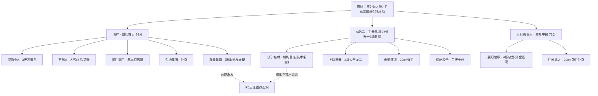

# 2026年10月08日 · 个股画像

> 数据源新鲜度: partial
> 降级状态: true（R1缺失 / 资金口径9-30错位 / vibe-trading未配置）
> 置信度: 0.62

## 一句话结论

🟡 **叙事/共振先行、资金待确认**：地产=情绪重启首日做前排，液冷=唯一3源共识但龙头技术偏空只做半路回封，机器人=围绕4板总龙做，中位杂毛一律不碰。

## 候选池总览（11只 · 全部来自R2 leaders/候补，未触发扩池）

| 代码 | 名称 | 板块 | 综合分 | 进攻档 | 风险档 | 态度 |
|---|---|---|---|---|---|---|
| 000011.SZ | 深物业A | 地产 | 72 | A | B- | 🟢 进（弱转强/卡位） |
| 000002.SZ | 万科A | 地产 | 70 | A- | B+ | 🟢 进（竞价封单确认） |
| 000678.SZ | 襄阳轴承 | 机器人 | 69 | A | C | 🟡 进（总龙，控仓） |
| 002244.SZ | 滨江集团 | 地产 | 68 | B+ | B | 🟢 进（分歧低吸/半路） |
| 603200.SH | 上海洗霸 | 液冷 | 64 | A- | B- | 🟡 进（卡位/弱转强） |
| 002130.SZ | 沃尔核材 | 液冷 | 63 | A- | B- | 🟡 半路/回封确认 |
| 301018.SZ | 申菱环境 | 液冷 | 60 | B+ | B- | ⚪ 放量日半路，不追高 |
| 002454.SZ | 松芝股份 | 液冷 | 57 | B | B | ⚪ 计划内首板试错 |
| 600383.SH | 金地集团 | 地产 | 57 | B- | B- | ⚪ 计划内补涨 |
| 688218.SH | 江苏北人 | 机器人 | 56 | B | B- | ⚪ 跟随总龙，不追20cm |
| 000560.SZ | 我爱我家 | 地产 | 48 | B- | C | 🔴 拦截低吸 / 仅弱转强试错 |

## 主线梯队与资金传导

## 首推票思维链

### 🥇 深物业A 000011.SZ — 地产3板高度龙

**大资金意图**：4个游资席位（华泰海口/国泰海通广州/平安嘉兴/开源西安）9/30协同买入，打的是深圳本地政策的弹性先手，假期消息发酵后要溢价兑现或继续卡位。
**为什么走强**：9/28启动日即首封（days_since_first_board=1），三日封板时间09:45/09:25/09:31全部早盘，开板仅1-2次，是标准的「早封+少分歧」龙头走法，板块内涨停≥5家有板块效应。
**逻辑够不够硬**：弹性催化够硬，但PB=2.20为板块最高、无机构席位，纯情绪定价——身位硬、估值无锚。

- **买入理由**：3连板高度龙 + 启动日带动性 + 深圳政策最直接映射
- **风险点**：小盘64亿流通、节前先手成本低，高开易被兑现；无机构承接
- **止损条件**：炸板不回封即放弃；低开破9/30涨停价12.24且无承接
- **可验证假设**：竞价封单量级与板块封板家数；弱转强上板=派发证伪

### 🥈 万科A 000002.SZ — 人气总龙/容量核心

**大资金意图**：机构专用+深股通+朱雀大街+三亚迎宾路4席位，是地产唯一机构/外资/游资合力的容量票，资金要的是政策博弈的板块β。
**为什么走强**：双平台人气avg_rank=1.5，辨识度全板块第一；9/29涨停后9/30+4.41%不破板，融资余额+4.6%温和加杠杆。
**逻辑够不够硬**：人气与资金结构硬，但R4无公告级硬事件、周线仍受60周线4.65压制，属反弹非反转。

- **买入理由**：人气总龙 + 4席位含机构/深股通 + 容量承接好
- **风险点**：贴近前高4.4无量突破易回落；政策不及预期
- **止损条件**：竞价无强封单不接无量高开；跌破MA5(3.95)
- **可验证假设**：竞价封单承接；分歧后能否回封

### 🥉 襄阳轴承 000678.SZ — 机器人4板总龙（资金证据最硬 / 高位风险最高）

**大资金意图**：机构专用+深股通+知春路等5席位协同、LHB 5日净买2.85亿，本批11只票中资金证据最硬；资金在给物理AI「总龙」定价。
**为什么走强**：9/24启动日09:37早封，四连板多为0开板，封板时间逐日09:37/09:30/09:25/10:03，换手充分；假期AMD收购World Labs+GR00T1.7续命。
**逻辑够不够硬**：资金最硬，但PB=7.62、融资余额+26.6%杠杆追涨，4板后炸板风险非线性上升——进攻A级、风险C级。

- **买入理由**：总龙 + 5席位机构/外资共振 + LHB净买2.85亿
- **风险点**：4板高位、老主线中段、杠杆资金集中；核按钮则全线下杀
- **止损条件**：只做换手5板/弱转强/分歧有承接低吸；缩量一字不追；竞价核按钮整条线降级
- **可验证假设**：5板封单与板块跟风家数；承接力度

## 关键证据

- 证据1: 液冷为R2∩R3∩R4唯一3源共识主线（composite 0.72），E003为high硬催化 · 来源 R2/R4
- 证据2: 襄阳轴承LHB净买2.85亿+5席位、4连板，全市场资金证据最硬 · 来源 R7
- 证据3: 我爱我家3连板后9/30转跌、R7 lhb_bull_trap派发标记、融资余额+41.7% · 来源 R7/tushare
- 证据4: 沃尔核材虽R4机构首推，但chart偏空贴20日低点、周线/60分空头 · 来源 chart_vision快照
- 证据5: 9/30科技为最大流出方（电子-150亿），与假期科技催化时点错位 · 来源 R7

## 数据源审计

| 源 | 状态 | 抓取时间 | 记录数 | 备注 |
|---|---|---|---|---|
| R2 主线 | 🟢 ok | 10-08 | 11候选 | 置信0.62 |
| R3 情绪 | 🟢 ok | 10-08 | 5共振主题 | L1热榜口径9-30 |
| R4 消息 | 🟢 ok | 10-08 | 8硬事件 | 地产无硬事件 |
| R7 资金 | 🟡 partial | 10-08 | 66 LHB | 口径9-30收盘错位 |
| chart快照 | 🟢 ok | 10-08 | 23票 | date校验=20261008通过 |
| vibe-trading | 🔴 error | — | 0 | 未配置，tushare主源兜底 |
| 两融明细 | 🟡 部分 | — | 9/11票 | 深物业/上海洗霸无覆盖（非利空） |

## 不确定性 / 反证

1. **资金维缺失是最大软肋**：三主线cross_validation分别仅0.33/0.67/0.33，若11:35 R7增量仍无流入，液冷/地产应降仓，候选砍半。
2. **催化与技术背离**：沃尔核材、申菱环境叙事强但chart偏空，本画像坚持「右侧放量反包才确认」，不做左侧抄底——若直接一字启动则放弃不追缩量。
3. **我爱我家**命中高位派发+杠杆追高双警示，已给risk=C并建议拦截低吸；其若领跌会损伤地产梯队，供R6模式跟踪。
4. emotion_cycle置信仅0.49、高位震荡0.39尾随，高标股（襄阳轴承/深物业）对情绪反转最敏感。

## 与其他 R/D/E 的关系

- 依赖: R2_main_sectors / R3_sentiment / R4_news / R7_capital_flow / chart_vision_snapshot
- 被消费: D1（execution_pool按alpha/risk双档+leader_verdict取池）、R6（fundamental_flags/bull_trap/背离项）、E1（档位准确性复盘）

## Sub-Agent 元数据

- skill: analyze_stock_profile_v1
- artifact: data/research/20261008/R5_stock_profiles.json
- model: ark-code-latest
- 候选池: 11只（r2_leader_pool=11，r2_expand_pool=0）
