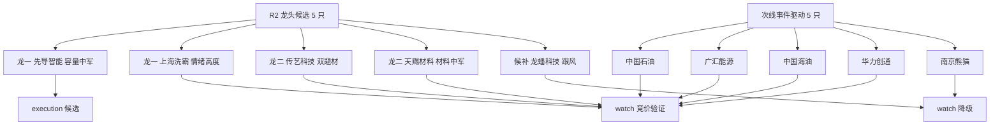

# 2026年10月9日 · 个股画像

> **数据源新鲜度**: partial
> **降级状态**: true
> **置信度**: 0.62
> **情绪段位**: 高位震荡(全场炸板率 42.7%,破退潮线)

## 一句话结论

独主线=固态电池链,首推容量中军**先导智能**;上海洗霸/传艺科技只做竞价弱转强;油气 3 票为隔夜事件驱动,须竞价封单硬验证,否则不做。

## 候选池结构

## 六维评分总表

| 代码 | 名称 | 身位 | 催化 | 筹码 | 联动 | 估值 | 技术 | 机构 | 综合 | alpha | risk |
|---|---|---|---|---|---|---|---|---|---|---|---|
| 300450 | 先导智能 | 龙一/中军 | 72 | 62 | 88 | 66 | 74 | 70 | **78** | A- | B+ |
| 601857 | 中国石油 | 次线首推 | 74 | 58 | 55 | 72 | 78 | 66 | 72 | B+ | A |
| 002866 | 传艺科技 | 龙二 | 66 | 60 | 80 | 60 | 78 | 55 | 72 | B+ | B |
| 603200 | 上海洗霸 | 龙一/高度 | 60 | 55 | 82 | 58 | 75 | 48 | 70 | B+ | B- |
| 600938 | 中国海油 | 次线跟推 | 74 | 58 | 52 | 72 | 74 | 64 | 70 | B+ | B+ |
| 600256 | 广汇能源 | 次线首推 | 80 | 58 | 55 | 70 | 62 | 58 | 68 | B+ | B+ |
| 002709 | 天赐材料 | 龙二 | 64 | 60 | 78 | 64 | 52 | 62 | 63 | B | B- |
| 603906 | 龙蟠科技 | 候补 | 55 | 55 | 66 | 60 | 60 | 50 | 58 | B- | B- |
| 300045 | 华力创通 | 次线首推 | 66 | 55 | 58 | 58 | 52 | 50 | 57 | B- | B- |
| 600775 | 南京熊猫 | 次线跟推 | 60 | 50 | 52 | 58 | 45 | 45 | 50 | B- | C |

## 首推票深度

### 先导智能 300450 · 独主线容量中军

**大资金意图**:R7 电池/电力设备/锂电专用设备三板块共同 lead_stock,是全场退潮日唯一逆势主线里资金方向最明确的容量票,机构+趋势资金承接,而非纯游资。

**为什么走强**:R4 排产 214.6GWh(同比 +57%)+ 十五五 2030 全固态规划双产业锚,1008 放量 +7.58%,日 K 仅差 0.18 元触及 20 日前高 37.77,60/15 分多头排列。

**逻辑够不够硬**:产业锚真实、非突发,但 R4 主线催化仅 medium 单源,持续性靠资金而非新消息。

- **买入理由**:独主线唯一性溢价 + 容量中军资金确认;破 37.8 前高或回踩 34 元低吸。
- **风险点**:周 K MA60≈47 压制,中长期未反转;主线竞价若不能弱转强则逻辑松动。
- **止损条件**:跌破 34 元(15 分 MA60/日支撑);主线退潮即出。
- **可验证假设**:今日电池板块继续主力净流入,且其抗住全场高波动放量上攻。

### 上海洗霸 603200 · 情绪高度龙一

**大资金意图**:固态电解质方向打板客+游资打造的情绪高标,R3 热榜首位;流通盘偏小,封单不实易炸。
**为什么走强**:E006 固态情绪发酵直接驱动,日 K 涨停破 20 日新高,短周期全多头。
**逻辑够不够硬**:纯题材、无官方硬催化、基本面支撑弱,风险度仅 B-。

- **买入理由**:竞价高开 3-7% 且封单承接=二板卡位。
- **风险点**:打板客核按钮、周 K MA60≈64 大量套牢盘。
- **止损条件**:低开无承接不接;跌破日 MA5≈42 走。
- **可验证假设**:固态板块竞价集体走强、封单持续。

### 中国石油 601857 · 事件驱动避险中军

**大资金意图**:E001 中东骤然升级(霍尔木兹爆炸+伊朗停装卸+三航母)驱动的避险+顺周期配置盘,全周期多头、risk=A 最安全。
**为什么走强**:收 11.59 临近 20 日前高 11.66,量能配合。
**逻辑够不够硬**:1008 收盘口径油气板块效应为零、资金未确认,纯隔夜事件;地缘双刃剑。

- **买入理由**:放量破 11.66 跟进或回踩 11.5 低吸。
- **风险点**:停火/油价见顶即证伪;全民皆知事件竞价可能被先手顶满。
- **止损条件**:11.00(约 -5.1%)。
- **可验证假设**:油气股集体高开且封单/主力净流入出现。

## 关键证据

- 证据 1: R7 电池 +32.75亿(#1)、电池化学品 +20.17亿(#2)、电力设备 +19.43亿(#3),全链霸榜 · 来源 R7
- 证据 2: R3 固态电池概念榜 3→1,热度 17307→99797,普跌日唯一逆势主线 · 来源 R3
- 证据 3: R4 E001/E002 双 high,广汇能源预增 167-177% · 来源 R4
- 证据 4: 9/10 票逐票 chart_vision 成功,短周期多头确认;天赐/华力周线仍空头 · 来源 canghai-charts

## 数据源审计

| 源 | 状态 | 抓取时间 | 记录数 | 备注 |
|---|---|---|---|---|
| R2 | 🟢 ok | 10-09 | 10 | 龙头+次线 |
| R4 | 🟢 ok | 10-09 | 8 | 主线催化仅 medium |
| R7 | 🟢 ok | 10-09 | - | 资金口径真实 |
| canghai-charts | 🟡 partial | 10-09 | 9/10 | 快照 DNS 全失败,逐票兜底 |
| tushare-chip | 🔴 error | - | 0 | 大宗/两融未取,degraded |

## 不确定性 / 反证

全场炸板率 42.7% 已破退潮线,八板高标新华传媒若核按钮(自身被 R7 检出涨停净卖 0.85 亿),情绪滑入主跌,所有接力候选须撤销。个股筹码维度(block_trades/margin)本轮为 null,按 v1.3 对综合分顶格扣 10;上海洗霸小盘高波动、天赐/华力周线空头,均不可因短线多头而高估。最终硬否决以 R6 为准,R5 仅分档。

## 与其他 R/D/E 的关系

- 依赖: R2_main_sectors、R4_news、R7_capital_flow、manifest
- 被消费: D1(main_decision execution_pool/watch 分档)、R6(反证,fundamental_flags + 技术/情绪证据)

## Sub-Agent 元数据

- skill: analyze_stock_profile_v1
- artifact: data/research/20261009/R5_stock_profiles.json
- 候选数: 10(主线 5 + 次线事件 5)
- model: ark-code-latest
