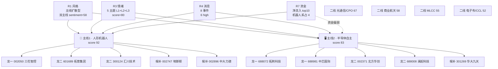

# 2026-07-06 · **主线研判**

> **数据源新鲜度**: partial(上游 artifact 全绿;实时行情待 filter_leader_v1 补齐)
> **降级状态**: false
> **置信度**: 0.80

## 一句话结论

📌 双主线 = 🤖 **人形机器人**(资金+叙事+共振三杀,score 92) + 🖥️ **半导体自主/韬定律**(叙事+共振双杀,资金偏弱,score 83);仓位上限 55-65% 只做龙一龙二。

## 主线全景 mermaid

## 五维打分总览

| 主线 | 热度 | 资金 | 涨停 | 叙事 | 共振 | 总分 | 评级 |
|---|---|---|---|---|---|---|---|
| 🤖 人形机器人 | 20 | 20 | 15 | 20 | 17 | **92** | ✅ 核心主线 |
| 🖥️ 半导体自主 | 18 | 12 | 15 | 20 | 18 | **83** | ✅ 核心主线 |
| 🌐 光通信/CPO | 15 | 10 | 12 | 18 | 12 | 67 | ⚠️ 二线 |
| 🚀 商业航天 | 12 | 14 | 10 | 12 | 10 | 58 | ⚠️ 二线 |
| ⚡ MLCC/被动 | 12 | 10 | 10 | 15 | 8 | 55 | ⚠️ 二线 |
| 🧵 电子布/CCL | 10 | 10 | 8 | 15 | 9 | 52 | ⚠️ 二线 |

## 详细分析

### 🤖 主线一 · 人形机器人(score 92)

**大资金意图**: R7 主力资金净流入榜前十里机器人系占 4 席 —— 机器人概念 +143.74亿(**第1**)、人形机器人 +113.78亿(第3)、特斯拉概念 +84.39亿(第4)、减速器 +61.04亿(第10)。四个细分同时上榜、总净流入 400+亿,说明主力不是散兵游勇的题材炒作,是真金白银的产业配置。

**为什么走强**: 周末双催化叠加 —— 证监会同意宇树科技科创板 IPO 注册(国产人形机器人第一股); 特斯拉副总裁陶琳表态 Optimus 2026 年底启动规模化量产、7 月周产从大几十台爬坡到 100-200 台。叙事从"预期"切换到"量产可见",这是产业周期第二阶段的典型资金进场信号。

**逻辑够不够硬**: 三源共振 L1+L2+L3 满贯,WeFlow 词频 depth=510/breadth=64 群,概念热榜 rank1 已持续数日,R1 打板梯队 883994/883997/883978 20 日累计 +19~34%,机器人系是本轮高动能簇的核心成员。逻辑硬度 = ⭐⭐⭐⭐⭐。

### 🖥️ 主线二 · 半导体自主(存储+先进封装+算力互联)(score 83)

**大资金意图**: R7 top10 没有独立的半导体细分入榜(先进制造风格 +68.95亿属混合口径),这是评分被压到 83 的唯一原因 —— 资金还没大规模进场。但 R1 显示 512480 半导体 20d +21.11%、512760 芯片 +19.10%、588000 科创50 +15.05%,说明中期资金已在场,短期观望等催化发酵。

**为什么走强**: 双 high 事件叠加 —— (1) 华为韬定律 V2 SoC 量产验证,LogicFolding 混合键合功耗 -41%/频率 +13%/密度 155→238 MTr/mm²,开辟 5-10 年国产算力新路径,7 家 KOL/公众号周末密集覆盖; (2) 存储涨价链共振,三星 Q3 DRAM 口头通知提价 20%、Meta 下单三星 10 万亿韩元 AI 芯片、美光 93 亿美元 CAPEX。

**逻辑够不够硬**: 叙事维度满分(20),共振维度 18(R3 rank2 存储 + rank3 先进封装均 L1+L2+L3),但资金维 12 分是短板 —— 需盘中观察主力是否真正接力。逻辑硬度 = ⭐⭐⭐⭐。

## 每票思维链(首推票)

### 🤖 龙一 · 002050 三花智控

- **买入理由**: 特斯拉产业链核心 + 机器人执行器龙头,R3 rank1 主题首推票,R7 特斯拉概念+机器人执行器双板块资金净流入榜细分票双重覆盖。
- **风险点**: 与拓普集团高度同步,若特斯拉产业链利好兑现回吐易被联动砸,前排热钱退潮氛围里高位股本身脆弱。
- **止损条件**: 破 20 日线且伴主力资金 3 日累计净流出 >5 亿 → 止损;单日跌幅 >7% 立即减半仓。
- **可验证假设**: 若 T+3 内特斯拉概念板块日均净流入维持 >30 亿且股价创新高,证伪回撤担忧,可加仓至上限。

### 🖥️ 龙一 · 688072 拓荆科技

- **买入理由**: R4 E001 首推-混合键合设备,韬定律 V2 SoC 量产验证的直接受益核心标的(全球混合键合设备国产化的唯一 A 股旗舰)。
- **风险点**: 高估值+订单能见度不透明,7 家 KOL 周末密集覆盖易形成一致预期,周一开盘容易 gap 一次性兑现。
- **止损条件**: 开盘涨幅 >7% 但盘中回落至 +3% 以下 → 减半仓;跌破 5 日线且成交萎缩 → 全出。
- **可验证假设**: 若韬定律叙事持续发酵到 T+5 且中报订单指引超预期,加仓至上限;若 T+2 半导体 ETF(512480) 未跟随创新高,减仓至底仓。

### 🖥️ 龙一 · 688981 中芯国际

- **买入理由**: 国产先进制程主赛道旗舰,韬定律 V2 长期利好其晶圆代工份额(28nm+高端制程订单),资金体量最大安全边际最高。
- **风险点**: 港股 ADR/H 股夜盘表现不透明,若周一港股先高开高走 A 股易形成"外资先跑"格局;业绩窗口临近有传言扰动风险。
- **止损条件**: 跌破 60 日线 → 止损;单日主力净流出 >10 亿 → 减半仓。
- **可验证假设**: 若 T+5 内北向资金流入榜进榜前 10 名,则中期趋势成立;否则以短线波段处理。

## 关键证据

- 证据 1: R7 主力资金榜机器人系四细分同时进 top10,总净流入 +403.55亿 · 来源 data/research/20260706/R7_capital_flow.json
- 证据 2: R3 rank1 人形机器人 L1+L2+L3 三源共振,WeFlow depth=510/breadth=64 群 · 来源 data/research/20260706/R3_sentiment.json
- 证据 3: R4 E001 韬定律 V2 论文 7 家 KOL/公众号共振覆盖,strength=high · 来源 data/research/20260706/R4_news.json
- 证据 4: R4 E003 宇树 IPO 注册 + 特斯拉 Optimus 量产表态,双 high 催化叠加 · 来源 R4_news.json
- 证据 5: R1 主线扩散型 + main_lines_count=2 · 硬约束今日主线上限 2 条 · 来源 R1_style.json

## 数据源审计

| 源 | 状态 | 抓取日期 | 记录数 | 备注 |
|---|---|---|---|---|
| R1_style | 🟢 ok | 2026-07-06 | 1 | complete conf=0.72 |
| R3_sentiment | 🟢 ok | 2026-07-06 | 5 主题 | complete conf=0.82 |
| R4_news | 🟢 ok | 2026-07-06 | 8 事件(6 high) | complete conf=0.78 |
| R7_capital_flow | 🟢 ok | 2026-07-06 | top10 板块 | complete conf=0.55 |
| tushare 实时行情 | 🔴 error | — | — | 主控禁 MCP,交 filter_leader_v1 |

## 不确定性 / 反证

1. **半导体资金维偏弱**: R7 top10 无独立半导体细分,先进制造风格 +68.95亿属混合口径,不排除资金实际集中在机器人系而半导体只靠情绪+叙事支撑。若周一开盘半导体 ETF 未跟涨,主线二应立即降级为二线。
2. **人形机器人霸榜出货尾部风险**: R3 hotlist 数日居首(hot=331004),尽管 distribution_alert=null,但由 R6 反证专项核查,若 R6 触发 hard_reject 则本主线仓位上限需下调至底仓。
3. **R1 顶部滞涨警示**: 半导体/芯片 ETF 5 日均值 -2.5~-3.5%,顶部簇 5 日环比归零,盘中若龙一失守情绪转震荡分化型,仓位应立即降档 40-50%。
4. **叙事重复兑现风险**: 宇树 IPO/特斯拉表态属于市场已经消化的重复叙事,盘中警惕"利好兑现即出货"格局。

## 与其他 R/D/E 的关系

- **依赖**: R1_style.json(风格+主线数量上限) · R3_sentiment.json(共振主题) · R4_news.json(催化事件) · R7_capital_flow.json(资金流)
- **触发**: `filter_leader_v1`(同文件原地更新龙头硬约束)
- **被消费**: D1(canghai-plan · execution_pool 构建) · R6(反证专项核查霸榜出货) · E1(每日复盘对齐主线判定)

## Sub-Agent 元数据

- skill: analyze_main_sectors_v1
- artifact: data/research/20260706/R2_main_sectors.json
- 生成模型: ark-code-latest
- 主控 profile: canghai-research
