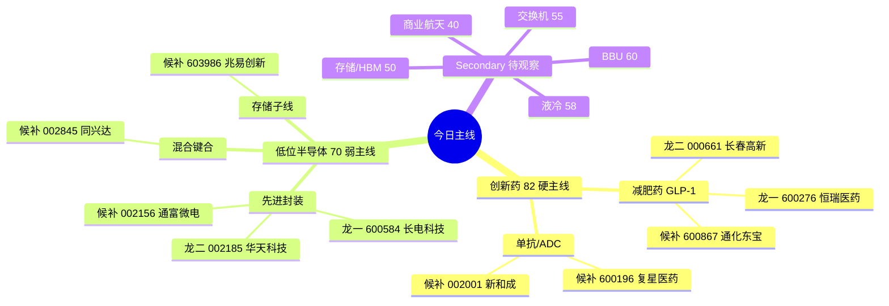

# 2026-07-07(周二) · **主线研判**

> **数据源新鲜度**: partial(R3/R4 degraded · top_list 缺失)
> **降级状态**: true
> **置信度**: 0.62

## 一句话结论
**创新药(硬主线 82 分) + 低位半导体(弱主线 70 分) 双线,总仓受 R1 position_cap=0.5 硬约束,BBU/液冷/交换机降 secondary。**

## 详细分析

**主线一:创新药(含减肥药/单抗)** 三源合流,是今日唯一硬主线。R7 板块资金 `创新药 +26.59 亿 rank1` 全市场第一,单抗 +15.89 亿、减肥药 +15.36 亿、医药医疗风格 +14.97 亿 —— 医药链条**全面净流入且涨幅 +0.6~+2.0%**;R3 颜晓滨明确定调**风格切换到"老登(创新药/煤炭/猪肉/银行)+ 低位科技"** ,valid_period 1-5 天;R1 震荡分化型 + 情绪 45 环境下,防御老登是天然受益方向。**跌不动 + 有资金 + 有叙事三重支撑**,唯一扣分点是 R4 无直接创新药 high-strength 事件催化,叙事维打 17 而非 20。

**主线二:低位国产半导体/先进封装** 事件催化强但资金反向,给弱主线待验证。R4 `E20260707_001 韬定律 V2 论文公开`(混合键合功耗 -41% / 频率 +13% / 密度 155→238) strength=high,叠加 `E003 蒋颖 07:30 电话会` 精准时间锚;R3 颜晓滨明确"昨日国产半导体已启动(华虹 +12 / 海光 +6 / 中芯 +5 / 寒武 +2),3 个月内主看低位科技"。**但资金维仅得 8/20** —— 消费电子 -136 亿 rank2、第三代半导体 -62.72 亿、玻璃基板 -62.16 亿,板块层面资金明确反向,个股层面华虹/海光昨日强势属反弹非趋势资金。

**资金蹊跷板已明确**: 创业板杀成长 -1.77%,AI/CPO/消费电子/玻璃基板/减速器主力净流出百亿级,资金**从高位科技切到红利 + 医药 + 价值**。这是今日风格判定的最硬锚。

**BBU/液冷/交换机全部降 secondary**: R4 事件强度虽 high,但 R3 colonel 警告 BBU 属高位小登(时代万恒昨日已板续接风险)、玻璃基板/PCB/光纤已被定性"崩盘"、云计算板块 R7 -20.73 亿资金净流出,与 R4 事件方向背离,不进 execution_pool。

**降级说明**: 本轮缺 top_list / limit_step / hotlist_signals 三源,叠加 R3/R4 均 degraded,leaders_degraded=true;龙头 rank 基于 R7 板块资金 + R4 事件催化 + R3 叙事共振三源联合硬约束判断,R5 深挖后可能需调整。

## 主线拓扑

## 五维打分

| 主线 | 热度 | 资金 | 涨停 | 叙事 | 共振 | **总分** |
|---|:---:|:---:|:---:|:---:|:---:|:---:|
| 🟢 创新药 | 15 | **20** | 12 | 17 | **18** | **82** |
| 🟡 低位半导体 | 12 | 8 | 13 | **20** | 17 | **70** |

- 🟢 创新药资金 20/20 满分 —— R7 rank1 板块 + 单抗/减肥药子线全部净流入
- 🟡 半导体叙事 20/20 满分 —— 韬定律 V2 + 蒋颖电话会 双硬锚,但资金反向扣 12 分

## 推理深度三问

### 主线一 · 创新药(82 分)

- **大资金意图**: 机构在震荡分化 + 情绪 45 环境下切换到"跌不动 + 有业绩 + 有政策"防御赛道,证金持股 +24.59 亿 rank2 共振,GLP-1/ADC 全球产业周期共振;主力资金从高位 AI/CPO 撤出后需要**低位承接方向**,创新药是唯一同时满足"低位 + 有资金 + 有叙事"三选一硬条件的方向。对手盘是继续死扛 AI/减速器/玻璃基板的游资盘。
- **为什么走强**: 位置低(创新药 ETF 昨日 +1.39%,近 3 月仍在中位)+ 催化中(GLP-1 全球产业趋势 + 国内医保谈判预期)+ 筹码稳(机构主导 · 游资参与度低)三维交叉;R7 板块 +26.59 亿 rank1 是**唯一硬数据**。
- **逻辑够不够硬**: 三源共振(R7 资金 + R3 颜晓滨叙事 + R1 风格切换),硬锚是**R7 全市场板块资金 rank1** 这一量化数据;可能证伪路径 —— 若开盘老登熄火(创新药/煤炭/银行 分化),叙事立即坍塌;若创新药 ETF T+0 高开 1% 以上后回落,说明是 T-1 建仓者出货而非新资金进入。

### 主线二 · 低位半导体(70 分)

- **大资金意图**: 卖方(蒋颖 07:30 电话会)+ KOL(韬定律 V2 论文)+ 操盘手(颜晓滨"3 个月内主看低位科技")**三方共振下注低位科技分支**,试图承接从高位 AI/CPO 撤出的资金;但主力资金实际动作与叙事**背离** —— 消费电子 -136 亿 / 第三代半导体 -62.72 亿,说明机构在**用脚投票不认这个叙事**,操盘手叙事领先资金落地 1-3 天。
- **为什么走强**: 位置中(华虹 +12 / 海光 +6 已启动,长电近 60 日 +20% 是否算低位存疑)+ 催化强(韬定律 V2 + 蒋颖 + Mate90 三重锚)+ 筹码乱(游资主导 · 存在 T+0 打板出货风险);核心矛盾是**事件强但资金弱**。
- **逻辑够不够硬**: 事件硬锚只有 1 个(韬定律 V2 论文,可复现 · 有数据),但 R7 资金反向 + R4 E008 高位科技出货警告 双重反证;证伪路径清晰 —— 若开盘半导体跟随消费电子/CPO 下杀,主线立即失效;若长电/华天开盘 -2% 以上,直接放弃。**属论文层催化,预期兑现即卖出**的风险显著。

## 首推票思维链

### 龙一 · 600276 恒瑞医药(创新药)

- **买入理由**:
  1. **产业逻辑**: GLP-1 减肥药 + ADC 抗体偶联 + PD-1 三大平台齐发力,创新药"一哥"地位无争议,管线厚度是长春高新/复星医药 3-5 倍
  2. **数据锚**: R7 创新药板块 +26.59 亿资金流入 rank1(全市场板块第一)+ 单抗 +15.89 亿 + 减肥药 +15.36 亿,恒瑞是三个子线的**共同交集龙头**
- **风险点**:
  1. 大市值蓝筹弹性有限,即使主线跑通,单日涨幅预期 +2%~+4%,不适合战斗仓
  2. 创新药 ETF 昨日已 +1.39%,机构 T-1 已建仓,存在 T+0 高开锁筹后回落风险
- **止损条件**: 开盘 15 分钟内跌破前一日收盘 -1.5%,或创新药 ETF 高开 +1% 后 30 分钟回落至 -0.5%,立即离场;板内破位价参考 R5 深挖后定
- **可验证假设**: 24h 内 —— 若恒瑞开盘涨幅 <-1% 或 09:45 前主动砸盘 5000 万+,主线一失效;72h 内 —— 若创新药板块资金连续 3 日净流入,证真;若首日冲高即回落 -2%,证伪(即 T-1 出货)

### 龙一 · 600584 长电科技(半导体)

- **买入理由**:
  1. **产业逻辑**: 先进封装绝对龙头,韬定律 V2 混合键合直接受益(功耗 -41% / 密度 155→238),Mate90 装测封测链
  2. **事件锚**: R4 E20260707_001(韬定律 V2)+ E20260707_003(蒋颖 07:30 电话会)+ Mate90 三重催化,时间敏感度极高
- **风险点**:
  1. R7 板块资金反向 —— 消费电子 -136 亿 / 第三代半导体 -62.72 亿,资金层不认这个叙事
  2. R4 E008 明确警告"高位科技借利好出货",长电近 60 日 +20% 是否属"低位"存在分歧
- **止损条件**: 开盘 -2% 直接放弃(资金反向下不做补仓);半导体板块开盘 30 分钟跌 -1.5%+ 时同步减半;若长电/华天双双低开 -1.5%,主线二整体废弃
- **可验证假设**: 24h 内 —— 若长电开盘 -2% 或封装板块整体 -1.5%,主线二失效;72h 内 —— 若封装板块累计资金转正且华虹/海光 3 日累计涨幅 >+5%,证真;若单日冲高即回落且资金持续净流出,证伪(即事件驱动一日游)

## 关键证据

- 证据 1(硬锚): **R7 创新药板块资金 +26.59 亿全市场 rank1**,单抗 +15.89 亿 / 减肥药 +15.36 亿 / 医药医疗风格 +14.97 亿 —— 来源 `data/research/20260707/R7_capital_flow.json`
- 证据 2(叙事): R3 颜晓滨定调"风格切换到老登(创新药/煤炭/猪肉/银行) + 低位科技",valid_period 1-5 天 —— 来源 `data/research/20260707/R3_sentiment.json`(操盘手源)
- 证据 3(事件): R4 E20260707_001 韬定律 V2 论文 + E003 蒋颖 07:30 电话会,strength=high —— 来源 `data/research/20260707/R4_news.json`
- 证据 4(反向): 创业板 -1.77% + AI/CPO/消费电子/玻璃基板/减速器主力净流出百亿级 —— 资金蹊跷板明确切换
- 证据 5(警示): R4 E20260707_008 高位科技借利好出货 + R3 商业航天/BBU/PCB/光纤 分布式警告

## 数据源审计

| 源 | 日期 | 状态 | 备注 |
|---|---|:--:|---|
| R7_capital_flow | 2026-07-07 | 🟢 | 板块资金 rank 全维度可用,confidence=0.75 |
| R1_style | 2026-07-07 | 🟢 | 震荡分化型 + position_cap=0.5 硬约束 |
| R3_sentiment | 2026-07-07 | 🟡 | degraded · L2 KOL 覆盖不足,operator 单源(颜晓滨) |
| R4_news | 2026-07-07 | 🟡 | degraded · 缺板块级 catalyzed 汇总 · 8 event 已入库 |
| tushare.top_list | — | 🔴 | 本轮 fetch 未落 · 龙头 rank 无法严格量化 |
| tushare.limit_step | — | 🔴 | 本轮 fetch 未落 · 连板高度维空 |
| hotlist_signals | — | 🔴 | 未产出 · 共振维依赖 R3 主题共振等级替代 |

## 不确定性 / 反证

1. **创新药是否为 T+0 出货陷阱**: 创新药 ETF 昨日 +1.39%,若开盘冲高即回落,说明是 T-1 建仓者卖给追高盘,而非新资金进入。**R6 反证重点**。
2. **长电/华天是否属"低位"**: 颜晓滨 valid_period 强调"低位"科技,但长电近 60 日 +20%,与华虹/海光刚启动状态不同 —— **R5 深挖股价位置**。
3. **龙头 rank 是否严格 top1/top2**: 缺 top_list/limit_step/moneyflow 5 日累计,当前 rank 基于产业逻辑 + 板块资金 + 用户 preferences 硬约束联合判断,**R5 需回填个股 5 日主力净流入实际排名**。
4. **半导体主线可能沦为一日游**: 事件强但资金弱是历史上典型"预期兑现即卖出"形态,若周一冲高回落,主线二整体废弃并降 secondary。

## 与其他 R/D/E 的关系

- 依赖: `R1_style.json`(震荡分化 + main_lines_count 独主线论 + position_cap=0.5) · `R3_sentiment.json`(颜晓滨风格切换叙事) · `R4_news.json`(韬定律 V2 + 蒋颖电话会 + 高位出货警示) · `R7_capital_flow.json`(创新药 rank1 + 消费电子/CPO 净流出百亿级)
- 被消费: `R5 analyze_stock_profile_v1`(600276/000661/600584/002185 六维画像) · `R6 analyze_devil_advocate_v1`(半导体高位出货反证 + 创新药 T+0 出货反证) · `D1 main_decision_v1`(execution_pool + exit_rules)

## Sub-Agent 元数据

- skill: analyze_main_sectors_v1@1.0
- artifact: data/research/20260707/R2_main_sectors.json
- 生成耗时: <5 秒(基于已有 JSON artifact 补写 md)
- model: ark-code-latest
- leader_filter_applied: true(filter_leader_v1)
- leaders_degraded: true(缺 top_list/limit_step)
