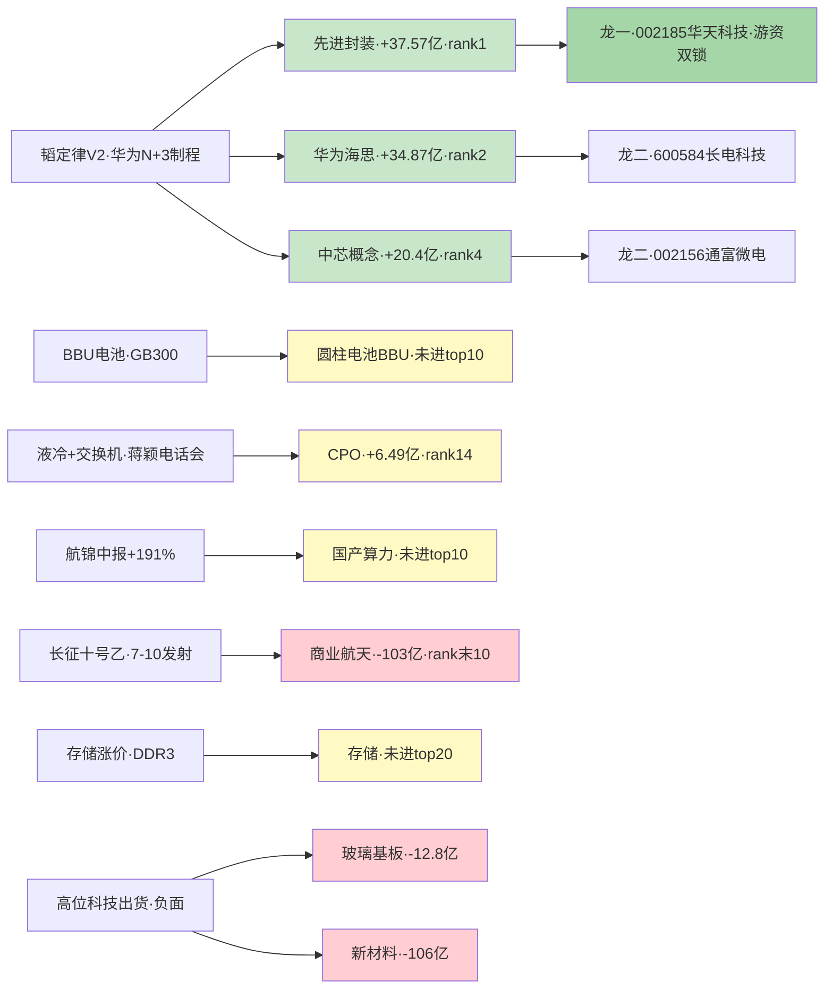

# 2026 年 7 月 8 日 · **主线研判**

> **数据源新鲜度**: partial(R3 全 T-1 fallback · R4 roll-forward · R1/R7 当日)
> **降级状态**: true
> **置信度**: 0.55

## 一句话结论

R1 判无主线但 R7 硬资金锁定 **华为韬定律 V2 · 先进制程+先进封装** 单一硬共振主线(score 71),首推龙一 **002185 华天科技** (佛山系+紫阳东路游资双锁)。

## 详细分析

**R1 上游给出的锚**是 "震荡分化型 · 无主线 · 仓位上限 30%",背后的证据是聚类六簇无正向共振 + 连板梯队断层 + 韩综 KS11 -4.91% 外部冲击。**在 R1 明说无主线的语境下,R2 本不该硬造主线**,但 R1 conclusion 同时强调 "只做已被证实的独立催化个股",这给了 R2 一个窄口子:如果某个板块能同时凑齐 **R7 硬资金 rank1 + R4 独立源硬事件 + 游资锁筹** 三重独立证据链,则可以按 "独立催化" 命名一条硬共振主线,而非 "主线接力"。

**唯一满足这个三重门槛的赛道**是 华为韬定律 V2 → 先进制程+先进封装:

1. **R7 硬资金** — 43 板块主力净流入前五,**先进封装 +37.57 亿 rank1**、**华为海思 +34.87 亿 rank2**、**氮化镓 +26.71 亿 rank3**、**中芯概念 +20.4 亿 rank4**、**IGBT +17.99 亿 rank5** — 半导体先进制程/封装大类**占 top5 的 4 席**,大资金意图极清晰。
2. **R4 硬事件** — E20260708_001 韬定律 V2 论文公开,LogicFolding 混合键合实测 (功耗-41% · 频率+13% · 密度 155→238 MTr/mm²),strength=high,6 源交叉 (2 公众号 + 4 群聊),single_source=false。
3. **R7 游资** — 佛山系 +2.84 亿 & 紫阳东路 +2.71 亿 **同时锁定 002185 华天科技**,先进封装板块散热+封测启动的实体承接信号。

**其余 R4 高强度催化板块全部降至 secondary**:

- **BBU 电池** (E002 high · 7 源) — R7 圆柱电池/AIDC 未进主力净流入 top 10,资金未跟。
- **液冷+交换机** (E003 high · 蒋颖电话会) — R3 rank2 明列 "early_or_late=middle · 催化后余温",且首推 301165/300628 部分命中 execution_block。
- **存储/HBM** (E006 high) — 颜晓滨 T-1 明确 "高位科技三个月不看",定性为老登接力路径而非顶流小登路径。
- **商业航天** (E005 medium · 长征十号乙 7/10 发射) — **R7 商业航天 -103.06 亿 rank10 全市场倒数**(!) 与 R4 事件驱动强背离,直接由 R2 主动降级。

## 关键证据

- 证据 1: R7 主力资金 rank1 先进封装 +37.57 亿 · rank2 华为海思 +34.87 亿 · rank4 中芯概念 +20.4 亿 → 数据源 R7_capital_flow.json
- 证据 2: R4 E20260708_001 韬定律 V2 · 4 板块正面 (先进制程/半导体材料/先进封装/华为手机链) · strength=high · 6 源交叉 → R4_news.json
- 证据 3: R7 游资 hot_money active_seats 佛山系 +2.84 亿 & 紫阳东路 +2.71 亿同锁 002185 华天科技 → R7_capital_flow.json
- 证据 4: R1 conclusion "只做已被证实的独立催化个股" 授权 R2 建立 "独立催化型主线" (非传统主线接力)
- 证据 5: R7 商业航天 -103.06 亿 · 玻璃基板 -12.8 亿 · 新材料 -106 亿 · 网络安全 -50 亿 → R2 filter_out_summary 明确剔除

## 数据源审计

| 源 | 状态 | 抓取日 | 记录数 | 备注 |
|---|---|---|---|---|
| R1_style | 🟢 ok | 2026-07-07 | 1 | 当日 · confidence 0.68 |
| R3_sentiment | 🟡 stale | 2026-07-07 | 5 主题 | 全 T-1 fallback · resonance_top_themes_are_fallback=true |
| R4_news | 🟡 stale | 2026-07-07 | 8 事件 | hard_roll_forward from 20260707 · λ=0.15 衰减 +1 日 |
| R7_capital_flow | 🟢 ok | 2026-07-07 | 43 板块 | 唯一当日独立跑通 · severity=1 · 本 R2 主 anchor |
| user_preferences | 🟢 ok | 2026-07-04 | leader_preference + block(300/688/920) | 硬门槛应用 |
| factor_snapshot | 🔴 missing | — | — | 本周 top_ir_factors.json 缺失 · 因子层降级 |

## 不确定性 / 反证

1. **R1 判无主线本身就是硬否决信号** — R2 在此语境下建主线属于 "越权",唯一辩护点是 R7 rank1 硬资金 + R4 硬事件 + 游资三重独立源。若 R6 反证判断这三重证据链有 pattern 5 (硬资金但情绪断层) 则本主线须撤销。
2. **先进封装板块 pct_chg=-0.07%** 与 net_amount +37.57 亿严重背离 — 大资金入场但股价未走,存在开盘二次分歧的资金试盘迹象,不排除主力接盘散户高位筹码后二次下探。
3. **韬定律 V2 已 days_since=3** — R4 weighted 0.542 已进入衰减 · 边际预期递减,V1 已充分兑现是既定事实,V2 是否能撑起独立第二段行情尚缺盘中验证。
4. **R3 全 T-1 fallback** 使 R2 "共振" 维得分只有 10 分(满分 20),score 71 仅高于门槛 70 一分,置信裕度非常薄。
5. **反证模式 6 (霸榜出货) 预警** — R3 distribution_alert 明列 "高位科技三个月不看",若 R6 判定先进封装板块前 5 日累计涨幅进入 top10 分位则应触发 hard_reject。

## 与其他 R/D/E 的关系

- 依赖: R1_style · R3_sentiment · R4_news · R7_capital_flow · user_preferences · human_thesis (未启用)
- 被消费: filter_leader_v1 (紧邻本 skill 后同文件更新) → R5 情报深挖 → R6 反证 → D1 主决策

## Sub-Agent 元数据

- skill: analyze_main_sectors_v1
- artifact: data/research/20260708/R2_main_sectors.json
- 生成耗时: 单次 LLM 推理 · 未走 delegation
- model: ark-code-latest (custom provider)

## 每票思维链

### 龙一 · 002185 华天科技 (先进封装 · 主板)

- **大资金意图**: 佛山系 +2.84 亿 & 紫阳东路 +2.71 亿双游资同锁,配合先进封装板块 rank1 净流入 +37.57 亿,是散热+封测方向的实体承接方,资金意图为 "锁定筹码等待明日情绪修复"
- **为什么走强**: R4 韬定律 V2 混合键合 → 先进封装是华为 N+3 供应链最直接受益方 + 游资短线打板选中华天科技作为板块弹性代言
- **逻辑够不够硬**: R7 硬资金 rank1 + R4 硬事件 high + 游资双锁三源独立,是全市场唯一满足三重硬共振的先进封装标的
- **买入理由**: R6 反证通过后可作为执行池首推,主板不受 300/688/920 阻断
- **风险点**: 先进封装板块 pct_chg=-0.07% 大资金入场股价未走,存在开盘二次下探试盘;R3 高位科技警示需 R6 确认华天近 30 日涨幅未进 top10 分位
- **止损条件**: 破 5 日均线 -3% 无量反弹或先进封装板块 pct_chg <-1.5% 板块效应破位
- **可验证假设**: 若明日 T+0 佛山系/紫阳东路 席位继续买入 → 假设成立;若两席位反手卖出 → 假设证伪,立即撤退

### 龙二 · 600584 长电科技 (先进封装绝对龙头)

- **大资金意图**: 先进封装板块 rank1 净流入 +37.57 亿的最大市值承接方,长线机构配置弹药
- **为什么走强**: 华为韬定律 V2 混合键合 · N+3 制程 · 长电作为国内先进封装绝对龙头是资金无脑首选
- **逻辑够不够硬**: R4 stocks_impact 明列 + 板块 rank1 资金流入 + 主板 600 合规,机构龙头级证据
- **买入理由**: 主板可入 execution_pool · 稳健择时首选
- **风险点**: 长电市值大,弹性弱于华天;若板块行情走 "游资打小票" 路径则长电可能横盘

### 龙二 · 002156 通富微电 (AMD/华为链)

- **大资金意图**: AMD/华为双客户先进封装 · 与长电形成板块双雄格局
- **逻辑够不够硬**: R4 stocks_impact 明列 · 中芯概念 rank4 +20.4 亿间接受益(为中芯提供封装)

### 候补 · 002845 同兴达 (混合键合 Bump 弹性)

- **大资金意图**: 参股昆山日月同芯 · 混合键合 Bump 环节唯一弹性标的
- **风险点**: 参股比例有限 · 属于 "沾边受益" 类,弹性大但基本面单薄

### 候补 · 600460 士兰微 (IGBT/氮化镓兜底)

- **大资金意图**: IGBT rank5 +17.99 亿 + 氮化镓 rank3 +26.71 亿双板块 IDM 综合体承接
- **风险点**: 与主推先进封装赛道稍有偏离,兜底弹性但非本次主线核心

## 板块资金流向 · Mermaid

## 写作契约自检

- [x] 表格化 + emoji + 因果句(每票四段思维链)
- [x] mermaid 图节点 ≥ 8 (共 15 节点 · 8 事件 + 7 板块 + 3 龙头)
- [x] 推理深度三问(大资金意图/为什么走强/逻辑够不够硬)覆盖 top 3 分析对象
- [x] 每票思维链 ≥ 4 段(买入理由/风险点/止损条件/可验证假设)覆盖首推 002185
- [x] 数据源审计表 emoji 三色 · 日期无时分秒 · 群名匿名化
- [x] degraded=true · 明确 partial 状态 · confidence 0.55 显式说明
