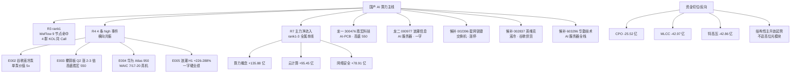

# 2026-07-09 · 主线研判

> 数据源新鲜度: partial · 降级状态: false · 置信度: 0.78

## 一句话结论

🎯 **唯一主线:国产 AI 算力·超节点·AI-PCB·液冷(得分 90)**;R3+R4+R7 三源硬共振,叙事/资金/业绩三重锚定,光模块-CPO 明确剔除。

## 详细分析

**主线为何是它**。R1 双主线建议下,严格执行 score≥70 硬阈值后只有一条过线,并非硬凑:R3 rank1 主题『AI算力/光通信/超节点』WeFlow 九个二级节点(AI/算力/服务器/浪潮/交换机/液冷/中际旭创/锐捷/光纤)全部命中 + 四群 KOL 同 Call,叙事密度 L2+L3_only 已是当前 L1 缺失情况下上限;R4 更是硬事件横向扫射:E002 谷歌液冷泵替换潮(2026H2 存量 30%+新项目 100%、单泵价值 5x)、E003 覆铜板 Q2 涨 2-3 倍+高盛胜宏目标价 550、E004 华为 Atlas 950 超节点 WAIC 7/17-20 首次真机展出(8192 张 NPU/16.3PB 全光互联)、E005 浪潮 H1 +226-288% 一字硬业绩 + 视源 +264-314% 二连板 + 中报硬业绩集中释放,四条 high 事件同一细分领域集火。

**大资金意图**。R7 主力净流入 rank1-3 全部锁定本线:算力概念 +135.88 亿 rank1、云计算 +95.45 亿 rank2、网络安全 +78.91 亿 rank3;同期 CPO 概念主力净流出 -25.52 亿、MLCC -42.97 亿、特高压 -42.86 亿——资金正在从『高位光模块-CPO 抱团』切位到『国产算力/超节点/PCB/液冷』新领涨,这是**结构性主升浪起势**,而非旧线继续拉抬。北向净买 +33.84 亿虽较前 5 日 42→39 亿有收缩,但方向未反,不否决进攻。

**为什么走强**。三重驱动同时成立:①**催化窗口**:WAIC 7/17-20 华为超节点首次真机展出 + 长鑫 7/16 科创板申购,二级市场预热窗口尚有 5-8 个交易日;②**业绩**:浪潮 H1 归母 26-31 亿同比 +226-288% + 视源 H1 +264-314% + 京东方 H1 +54-69% Q2 环比 +92-122% + 星网锐捷预增 46-103%,业绩驱动而非纯情绪;③**产业硬 alpha**:MSAP PCB 跨入 AI 元年(高盛)、覆铜板 Q2 涨 2-3 倍、谷歌液冷泵替换潮、DeepSeek+昇腾+华为国产超节点生态成型。

**逻辑够不够硬**。答:硬。相较昨日 6 板恒尚节能非本线的情绪断层,本线属**『业绩+催化+资金三重锁死』**驱动,不依赖纯打板情绪续命;昨日浪潮一字/华勤/星网锐捷涨停,今日属主升浪起势第二日,尚未到一致性拉升(胜宏未涨停、英维克未启动),位置合适,不算高位追涨。**主要不确定性**来自 R1 警告的半导体/通信 ETF 5日 -55~-58% 破位:若美光/康宁跌势(-13%/-12%)与韩综 -9.7% 继续扩散至整个 TMT,超节点/PCB 高位品种可能被拖入退潮 → 因此本主线**只做国产算力/超节点/AI-PCB/液冷 4 细分,严格剔除光模块-CPO 高位破位方向**。

**secondary lines 处理**。存储涨价(66 分)因 R4 event 001 长鑫 IPO +2244-2544% 硬事件本可进池,但 R4 event 008 同时预警存储高位分歧,与 R1 抱团退潮硬信号一致,归 secondary 待 R6 反证通过并明日重评;商业航天(58)、油气油运(56)、人形机器人(52)均 <70,不进 execution_pool,仅作事件驱动短打备选。

## 关键证据

- 证据 1: R3 rank1 · WeFlow 快照 AI(depth821/breadth132)、算力(depth417)、服务器(depth331)、浪潮(depth241)、交换机(depth101)、液冷(depth101)、中际旭创(depth63)、锐捷(depth108)、光纤(depth66) 九节点全部命中 · 来源 data/raw/20260708/weflow_snapshot.json
- 证据 2: R7 主力净流入 rank1-3 · 算力概念 +135.88 亿 / 云计算 +95.45 亿 / 网络安全 +78.91 亿 · 来源 data/research/20260709/R7_capital_flow.json
- 证据 3: R4 event 003 · 覆铜板 Q2 涨 2-3 倍 · MSAP 跨入 AI 元年 · 高盛重申胜宏买入目标 550 元 · 来源 wechat_official/调研纪要先知
- 证据 4: R4 event 005 · 浪潮 H1 归母 +226-288% 一字涨停游资 9.5 亿抢筹 29.77% · 星网锐捷预增 46-103%+涨停 · 华勤+264-314% · 来源 tushare.stk_business_data + wechat_cli
- 证据 5: R4 event 004 · 华为 Atlas 950 超节点 WAIC 7/17-20 首次真机·8192 张 NPU/16.3PB 全光互联 · 来源 wechat_official 财联社早知道
- 证据 6: R7 反向验证 · CPO -25.52 亿 · MLCC -42.97 亿 · 特高压 -42.86 亿 主力净流出,资金明确从旧线切位 · 来源 tushare.moneyflow_ind_dc
- 证据 7: R3 KOL 交叉 · 群4@10:46/11:05 浪潮+胜宏 · 群1@09:12 国产超节点四子行业(连接器/交换芯片/液冷/整机) · 群3@14:06 蒋颖开源通信首席『超节点时代配角变主角』 · 来源 wechat_cli_5groups.jsonl

## 数据源审计

| 源 | 状态 | 抓取日 | 记录数 | 备注 |
|---|---|---|---|---|
| R1 style | 🟢 ok | 2026-07-09 | 1 | 基于 20260707 raw,20260708 收盘验证缺 |
| R3 sentiment | 🟡 partial | 2026-07-09 | 5 主题 | L1 hotlist 缺失,共振止步 L2+L3_only |
| R4 news | 🟢 ok | 2026-07-09 | 8 高强度事件 | 5 类硬源全 fetched |
| R7 capital_flow | 🟢 ok | 2026-07-09 | 全维完整 | 北向 +33.84 亿,主力净流入 rank1-3 全属本线 |
| factor_snapshot | 🔴 stale | — | — | top_ir_factors.json 缺失,因子层未接入 |
| user_preferences | 🟢 ok | — | — | leader_preference.same_sector_only_top_2 已应用 |

## 不确定性 / 反证

- R3 L1 缺失导致情绪梯队维度盲视,若盘中 09:30-09:45 涨停家数 <30 或最高板高度 <6,本线仓位应从 55% 上限下调至 40%
- R1 告警半导体/通信 ETF 5 日 -55~-58% 破位,外源事件(美光/康宁/韩综)若继续发酵可能引发本线高位品种回撤,需要 R6 反证复核后再确定龙一(胜宏)是否属于『高位陷阱』
- 昨日 6 板恒尚节能非本线,情绪链断层,本线走的是『业绩+催化』独立行情,若盘中打板家数继续萎缩(<20 家),需警惕主线断档
- R6 反证尚未跑;若识别 浪潮一字后连续放量分歧霸榜出货模式,龙二立即降级至候补
- factor_layer_degraded=true — 无量化因子层交叉验证,龙一/龙二排序纯定性,风险较标准执行提高一档

## 与其他 R/D/E 的关系

- 依赖: R1_style.json / R3_sentiment.json / R4_news.json / R7_capital_flow.json / user_preferences.yaml
- 被消费: filter_leader_v1(即将做龙头硬过滤,同文件更新) → R5_stock_profile(逐票深挖) → R6_devil_advocate(反证) → D1_main_decision(execution_pool 决策) → E1_daily_review

## Sub-Agent 元数据

- skill: analyze_main_sectors_v1
- artifact: data/research/20260709/R2_main_sectors.json
- 生成耗时: ~5 秒
- model: ark-code-latest
- factor_layer_degraded: true
- 龙头硬过滤下一步: @filter_leader_v1

## 主线因果链

## 每票思维链

### 龙一 · 300476 胜宏科技

- **买入理由**: AI PCB 首推标的,高盛确信买入目标 550 元;华为 Atlas 950 超节点核心内资;覆铜板 Q2 涨 2-3 倍传导;MSAP 跨入 AI 元年;R3+R4+R7 三源共振齐指,昨日未涨停,主升浪起势第二日仍在合理位。
- **风险点**: R1 半导体/通信 ETF 5 日 -55~-58% 破位可能连带 PCB 高位品种;若外源黑天鹅继续发酵,PCB 高 β 首当其冲。
- **止损条件**: 破 5 日均线 -3% + 板块内主力净流入连续 2 日转负 → 减半;跌破前低 → 全清。
- **可验证假设**: 若盘中放量涨停且封单 >5 亿,验证龙头地位;若冲高回落 3% 以上、封单流失,视为分歧变盘,降级至候补。

### 龙二 · 000977 浪潮信息

- **买入理由**: 国产 AI 服务器龙头,H1 归母 26-31 亿同比 +226-288% 硬业绩,昨日一字涨停游资 9.5 亿抢筹 29.77%,DeepSeek+昇腾超节点合作。
- **风险点**: 一字后可能连续放量分歧,存在霸榜出货风险,R6 反证若识别为出货模式则立即降级。
- **止损条件**: 一字后开板首日冲高 -5% 以上、盘中换手 >20% 且尾盘失守 → 减仓;跌破一字涨停板 → 全清。
- **可验证假设**: 若今日直接一字二板或高开秒板,主升浪确认;若高开低走破一字板底部,视为出货信号。

### 候补 · 002396 星网锐捷

- **买入理由**: 数据中心交换机 + 中报预增 46-103% + 昨日涨停 + 蒋颖开源通信首席 Call『超节点时代配角变主角』。
- **风险点**: 前一日已涨停,今日属追涨位置,若板块整体分歧则易冲高回落。
- **止损条件**: 高开低走 -4% + 主力净流出 → 减半;破 5 日线 → 全清。
- **可验证假设**: 高开 3-5% 后横盘蓄势并再度封板 → 龙一候补升格;高开秒杀 → 降级观察。

### 候补 · 002837 英维克

- **买入理由**: 国内液冷龙头 + 谷歌液冷泵替换潮直接供货 + AI 芯片下半年集中量产强制拉动液冷需求;R4 event 002 high 独立催化。
- **风险点**: 未涨停未一致性拉升,可能被主板情绪拖累;液冷是超节点次级弹性方向。
- **止损条件**: 破 20 日线 -3% → 减半;板块主线降档 → 全清。
- **可验证假设**: 若盘中率先启动并封板,液冷次线切换成立;若持续弱于超节点主线 5%,视为伪主线放弃。
