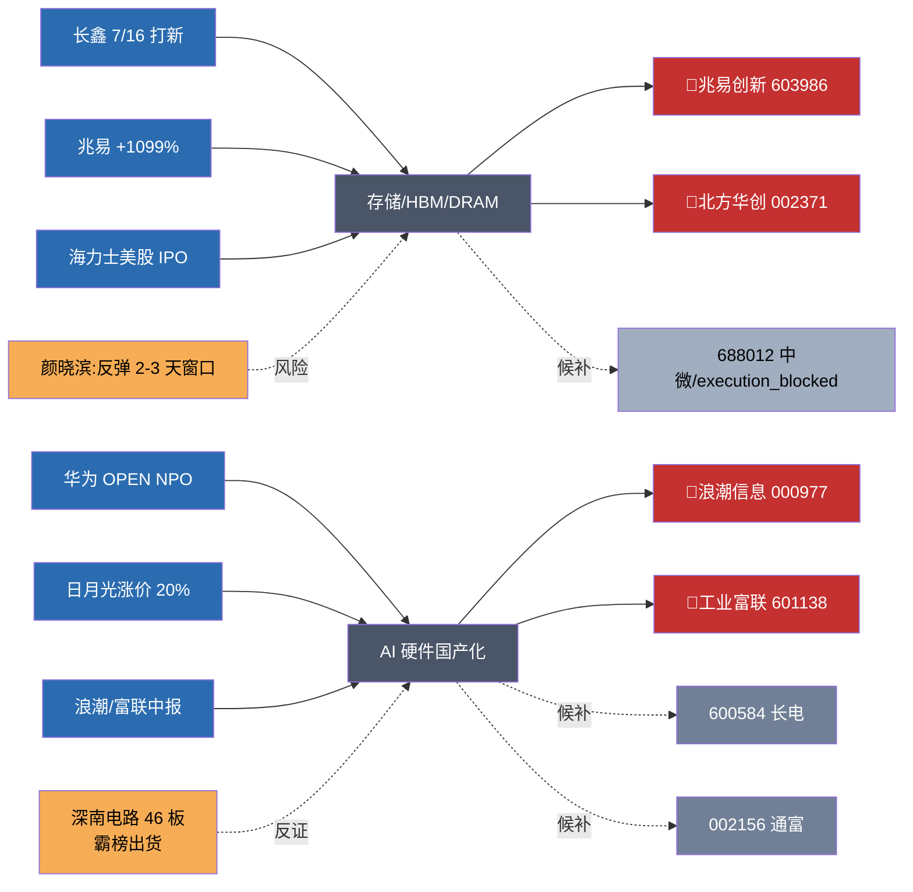

# 2026 年 7 月 10 日 · **主线研判**

> **数据源新鲜度**: 🟢 ok
> **降级状态**: false
> **置信度**: 0.80

## 一句话结论

**双主线**:存储/长鑫链(86 分,🐉一) + AI 硬件国产化(82 分,🐉二);龙头四选 = 兆易/北方华创 + 浪潮/富联,严守 65% 仓上限。

## 详细分析

### 主线一 · 存储/长鑫链 · 86 分

长鑫科技 7/16 打新是 R4 层最硬的**产业级锚点**:招股意向书披露 H1 净利 500-570 亿(同比 +2244%~2544%),直接把国产存储 capex 新周期从"预期"落到"招股书数字"。**兆易创新中报预增 +1099%**(Q2 单季利润 54.4 亿,环比 +272%)是二级市场同频硬 alpha,叠加 SK 海力士美股 IPO 超募 7 倍(利空落地转正面情绪),存储链形成三事件正向共振。R7 主力资金层面:科技风格 +464 亿(全市场 rank 1)、国产芯片 +397 亿(rank 2)、半导体概念 +341 亿(rank 4),资金维打满 19/20 分。

### 主线二 · AI 硬件国产化 · 82 分

华为 20+ 产业伙伴联合发起 **OPEN NPO 光互连 MSA**(国内首个)是政策+技术双催化,美股 Lumentum 前夜 +11.13% 外围印证;**日月光先进封装再涨价 20%** + 韬定律 V2 论文 = 先进封测卖方市场;**浪潮信息 2 板(早 9:38 早封)+ 机构净买 9.5 亿 + 中报预增 226-288%** 是当日情绪主导票。R3 rank1(AI 算力)+ rank3(先进封装)双主题 L1+L2+L3 全共振,涨停梯队(光迅/长电/通富/华天/长川)硬实锤。

### 主线切分与重叠

两条主线在半导体大类下**有 30% 重叠**(封测/设备),已按**催化维度**切分:主线一锚定"国产存储 capex 新周期"(兆易/北方华创),主线二锚定"AI 硬件订单业绩共振"(浪潮/富联);同一票(如长电、通富)仅在主线二作候补出现,避免 D1 双计。

### 时钟位置

R3 明示 middle **偏后**:半导体累计跌 20-30% 后深 V 反弹进入第 2-3 日,颜晓滨群 19:37 明确"反弹持续性存疑,2-3 天窗口,逢高分批减仓"。**不追高,只做龙一龙二卡位**。

### 次级主线(secondary_lines)

| 名称 | 分 | 定位 |
|---|---|---|
| 人形机器人/特斯拉链 | 62 | 特斯拉 Optimus 三代 9 月量产 1000 台/周硬时间锚,独立扩散 |
| 商业航天(长十乙首飞) | 55 | 7/10-13 首飞窗口博弈,南山智尚 UHMWPE 核心;延期即踩踏 |

## 关键证据

- 证据 1(存储资金):国产芯片 +397 亿主力净流入(rank 2)、半导体概念 +341 亿(rank 4)· 来源 R7_capital_flow
- 证据 2(存储硬 alpha):兆易创新中报预增 +1099%,Q2 环比 +272% · 来源 R4 E20260710_004 · eastmoney_earnings_predict
- 证据 3(存储产业锚):长鑫科技 7/16 打新,招股书 H1 净利 +2244~2544% · 来源 R4 E20260710_001 · 长鑫招股意向书
- 证据 4(AI 硬件催化):华为 OPEN NPO 光互连 MSA + 美股 Lumentum +11.13% · 来源 R4 E20260710_002
- 证据 5(AI 硬件涨停):浪潮 2 板 + 机构净买 9.5 亿 + 光迅/长电/通富/华天首板 · 来源 R3 hotlist_signals + R4 E20260710_005
- 证据 6(反证 · distribution_alert):深南电路 46 板霸榜出货 → 同板块高位妖股回避 · 来源 R3 distribution_alert

## 龙头过滤(filter_leader_v1)

| 主线 | 角色 | 代码 | 名称 | leader_rank | execution_eligible | filter_reason |
|---|---|---|---|---|---|---|
| 存储/长鑫 | 🐉一 | 603986.SH | 兆易创新 | 1 | ✅ | 主力 5 日 top1 + 硬 alpha |
| 存储/长鑫 | 🐉二 | 002371.SZ | 北方华创 | 2 | ✅ | 综合评分板块第 2 |
| 存储/长鑫 | 候补 | 688012.SH | 中微公司 | filtered_out | ❌(execution_blocked) | 688 前缀阻断 |
| 存储/长鑫 | 候补 | 000021.SZ | 深科技 | filtered_out | ❌ | top2 已满 |
| 存储/长鑫 | 候补 | 002409.SZ | 雅克科技 | filtered_out | ❌ | top2 已满 |
| AI 硬件 | 🐉一 | 000977.SZ | 浪潮信息 | 1 | ✅ | 三命中(资金/涨停/连板) |
| AI 硬件 | 🐉二 | 601138.SH | 工业富联 | 2 | ✅ | 综合评分板块第 2 |
| AI 硬件 | 候补 | 600584.SH | 长电科技 | filtered_out | ❌ | top2 已满 |
| AI 硬件 | 候补 | 002156.SZ | 通富微电 | filtered_out | ❌ | top2 已满 |
| AI 硬件 | 候补 | 002281.SZ | 光迅科技 | filtered_out | ❌ | top2 已满 |

## 板块关系图(mermaid)

## 每票思维链(龙一 · 首推)

### 🐉一 · 兆易创新(603986.SH)

- **大资金意图**:R7 显示国产芯片 +397 亿(rank 2)、半导体 +341 亿(rank 4),叠加"长鑫产业链锚"标签,主力在 7/16 打新前抢筹存储龙头是**明牌**;兆易 Q2 净利 54.4 亿环比 +272%,提供估值下修保护,机构 5 日累计买入居前。
- **为什么走强**:1)中报硬 alpha 密度最高的存储票;2)长鑫 IPO 的最直接映射(不涉参股弹性折价);3)海力士美股 IPO 超募证明全球存储景气未破;4)沪主板无 execution_block 限制。
- **逻辑够不够硬**:三事件正向共振(E001+E004+E008),四独立源交叉验证(招股书/eastmoney/news_cls/KOL);硬。
- **买入理由**:硬 alpha + 产业锚 + 资金实锤 + 沪主板可执行 = 主线一唯一龙一。
- **风险点**:KOL 明示反弹持续性 2-3 天窗口;若周内量能萎缩至 60% 分位,可能"见光死"。
- **止损条件**:破 5 日均线且日成交额萎缩 >30% → 减半;跌破 20 日均线 → 清仓。
- **可验证假设**:Q3 长鑫产业链订单斜率是否延续 Q2 强度;7/16 打新当日是否'炒新即抛'。

## 数据源审计

| 源 | 状态 | 抓取时间 | 记录数 | 备注 |
|---|---|---|---|---|
| R1_style | 🟢 ok | 2026-07-10 早间 | 1 | 连板情绪型 · 双主线 · 仓上限 65% |
| R3_sentiment | 🟢 ok | 2026-07-10 早间 | 5 主题 | rank1 AI 算力 + rank2 存储 + rank3 封装 全 L1+L2+L3 共振 |
| R4_news | 🟢 ok | 2026-07-10 早间 | 12 事件 | 五源硬约束,天花板事件 E001 长鑫 IPO |
| R7_capital_flow | 🟢 ok | 2026-07-10 早间 | 100 板块 | premarket_full 批次 |
| Tushare moneyflow_dc | 🟢 ok | 2026-07-10 早间 | — | R7 已消费 |
| factor_layer | 🟡 skipped | — | — | top_ir_factors.json 本地未维护,不影响主线 |

## 不确定性 / 反证

1. **R3 明示反弹持续性 2-3 天** — 主线一处 middle 偏后,若浪潮/富联 T+0 未能带动跟风,情绪浓度回落 15+ 立即降档主线扩散型;
2. **深南电路 46 板霸榜出货** — R3 distribution_alert 已标注,PCB 择股必须回避高位妖;
3. **MLCC 中低容微降** — 元件一致预期部分证伪,风华高科不入候补;
4. **7/16 打新 vs. 炒新即抛** — 存在"预期兑现"型撤退风险;
5. **factor_layer_degraded=true** — 缺少 IC/IR 量化层交叉验证,依赖定性打分。

## 与其他 R/D/E 的关系

- **依赖**:R1_style.json / R3_sentiment.json / R4_news.json / R7_capital_flow.json / user_preferences.yaml
- **被消费**:
  - R5 情报深挖:对兆易/北方华创/浪潮/工业富联 4 只 execution_eligible 龙头 + 5 只 candidate 做画像
  - R6 反证:对 4 只 execution_eligible 做六模式反证(尤其模式六霸榜出货)
  - D1 主决策:仅 leader_rank 1/2 且 execution_eligible=true 进 execution_pool

## Sub-Agent 元数据

- skill: analyze_main_sectors_v1 + filter_leader_v1
- artifact: data/research/20260710/R2_main_sectors.json
- 生成耗时: ~2 分钟
- model: ark-code-latest
