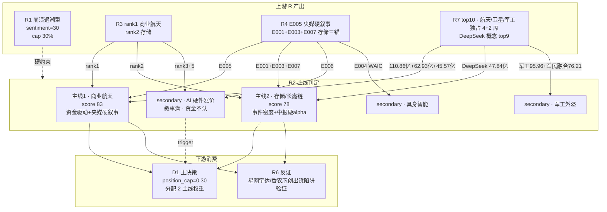

# 2026 年 7 月 13 日(周一) · **主线研判**

> **数据源新鲜度**: partial(R3 部分降级 · 因子面板缺席)
> **降级状态**: true
> **置信度**: 0.74

## 一句话结论

R1 崩溃退潮硬约束下,资金-事件-叙事三角对齐挖出 **商业航天(资金第一)+ 存储/长鑫链(事件密度第一)** 两条结构性反弹主线,总仓封顶 30%。

## 详细分析

R1 已将今日风格钉在 **崩溃退潮型**(情绪浓度 30 · 建议 main_lines_count=0),但同时保留了硬后门:"R2 若挖出结构性反弹以 R2 为准"。R2 逆势判定的依据不是主观情绪,而是三向数据交叉:

**主线一 · 商业航天(score 83)**:R7 主力资金榜 top10 里同一叙事簇独占 **四席**——商业航天 110.86 亿(#1)、卫星互联网 62.93 亿(#4)、北斗导航 45.57 亿(#8)、无人机 40.10 亿(#10),叠加军工 95.96 亿(#2)、军民融合 76.21 亿(#3)承接资金外溢,这是 R7 全表最纯粹的板块级"抱团抢筹"信号。事件端 R4 E005(长十乙首飞 + 央视新闻联播 1 分钟专题 + 蓝箭党委书记采访 + 大摩独立研报 + 国家队 73.7 亿增资)构成央媒级硬叙事,朱雀三 7/15 二次回收窗口是下一个硬时间锚。R3 rank1 跨群 4 次(华福陈铁林/国金刘高畅两家券商同日独立表态),叙事共振度全表最高。板块与深南电路 46 板/香农芯创千亿市值的高标崩塌链条**物理隔离**——这一条是它能在崩溃退潮风格里独立存在的关键。

**主线二 · 存储/长鑫链(score 78)**:R4 sectors_catalyzed 里 "存储/HBM/DRAM" 是**唯一被 3 个 high 强度事件同时锚定**的板块(E001 氦气禁出 · E003 SK 海力士 ADR +12.76% 与长江存储 IPO 辅导 · E007 香农芯创 H1 +2118-2434%)。R3 rank2 长鑫科技 7/16 申购是 **-3 天硬时间锚**,秋生/杨晓峰/陈芷婧三家机构 KOL 独立共振。R7 DeepSeek 概念 47.84 亿(#9)含长鑫子集;北向连续 5 日净流入配合中报兑现,具备低吸支撑。风险点是 R3 distribution_alert 明确警示"香农芯创等分销纯芯片千亿市值+AI 硬件泡沫",因此定位 **middle 偏低吸**,禁止追首板高位。

**secondary(AI 硬件涨价链)未升 main line 的原因**:R4 E006 五篇纪要 + R3 rank3+rank5 叙事双满分,但 R7 主力资金榜 top10 **没有一条 PCB/MLCC/光模块**,且 R3 distribution_alert 直指深南电路 46 板已列出货警报——叙事强但资金端不认,在崩溃退潮风格里进 execution 是明显的左侧接飞刀。等待科创 50 收复 MA5 + 沪电/中际旭创净买入连续 2 日转正再上调。

**与 R1 的约束协调**:R1 硬顶 position_cap=0.30 · R2 挖出 2 条主线并不推翻这一限额,而是把 30% 仓位聚焦到"与半导体高标链物理隔离"的商业航天 + "硬业绩+硬供给"的存储中军上。R1 style 若盘中降至 20% 观望档,R2 主线立刻同步降级。

## 关键证据

- 证据 1: R7 top_inflow_sectors 商业航天 110.86 亿 / 卫星互联网 62.93 亿 / 军工 95.96 亿(top10 独占 4 席主叙事 + 2 席外溢) · 来源 data/research/20260713/R7_capital_flow.json
- 证据 2: R4 E005 · 新闻联播 1 分钟专题 + 蓝箭党委书记采访 + 大摩独立研报 + 国家队 73.7 亿增资 = 央媒级硬叙事 · 来源 data/research/20260713/R4_news.json
- 证据 3: R4 sectors_catalyzed · 存储/HBM/DRAM 被 E001/E003/E007 三个 high 事件锚定,全表唯一 · 来源 data/research/20260713/R4_news.json
- 证据 4: R3 rank1 商业航天 cross_group_count=4 · 陈铁林(华福)"DeepSeek 时刻"+ 刘高畅(国金)"0→1 拐点" · 来源 data/research/20260713/R3_sentiment.json
- 证据 5: R3 distribution_alert · 香农芯创千亿+AI 硬件泡沫+科创 50 目标 1800(颜晓滨) · 直接决定 AI 硬件链归 secondary · 来源 data/research/20260713/R3_sentiment.json

## 板块 5 维打分表

| 主线 | 热度 | 资金 | 涨停 | 叙事 | 共振 | 总分 | 定级 |
|---|---:|---:|---:|---:|---:|---:|---|
| 🚀 商业航天/可回收火箭 | 17 | 19 | 12 | 18 | 17 | **83** | main #1 |
| 💾 存储/长鑫链/半导体材料 | 15 | 13 | 14 | 19 | 17 | **78** | main #2 |
| ⚡ AI 硬件涨价链(PCB/MLCC/光模块) | 14 | 9 | 13 | 19 | 10 | 65 | secondary(叙事强·资金不认) |
| 🛡️ 军工/军民融合 | 12 | 18 | 8 | 12 | 10 | 60 | secondary(资金外溢承接层) |
| 🤖 具身智能/人形机器人 | 13 | 8 | 9 | 16 | 12 | 58 | secondary(WAIC 前 3 日再上调) |

## 龙头候选池(未含竞价 · P1 补齐 pct_chg)

**商业航天**
- 龙一 · 600879.SH 航天电子(央企总装线 · R4 首推 + R3 KOL @冲锋V 相邻)
- 龙一 · 300918.SZ 南山智尚(UHMWPE 网系回收独家 · 7/15 朱雀三再点火)
- 龙二 · 600118.SH 中国卫星(卫星总装央企 · H1 扭亏)
- 龙二 · 000547.SH 航天发展(军工-航天双属性 · 承接 R7 军工资金外溢)
- 候补 · 300065.SZ 海兰信(海上网系回收工程化)

**存储/长鑫链**
- 龙一 · 603986.SH 兆易创新(R4 全事件覆盖度 top1 · H1 +1099%)
- 龙一 · 300475.SZ 香农芯创(H1 +2118-2434% 硬 alpha 密度全市场最高 · 只做 -3% 内低吸)
- 龙二 · 002156.SZ 通富微电(AMD 深度绑定 · 上周已首板)
- 龙二 · 600584.SH 长电科技(78 亿临港 · 封测龙头)
- 候补 · 688268.SH 华特气体(氦气禁出直接受益)

## 主线关系图

## 主线一 · 商业航天 — 三问

**大资金意图**: R7 主力资金 110.86 亿是全市场板块 **#1**,同时军工 95.96 亿 + 军民融合 76.21 亿 + 卫星互联网 62.93 亿构成 300+ 亿的叙事簇总入,这不是散兵游勇——是国家队+机构在长十乙首飞+央视 1 分钟专题后集体抢筹。北斗导航 45.57 亿 + 无人机 40.10 亿是同一叙事的资金外溢确认。

**为什么走强**: 硬事件(长十乙首飞成功 · 全球首个海上网系回收工程化 · 央媒罕见 1 分钟专题) + 硬时间锚(朱雀三 7/15 二次回收) + 硬机构行为(大摩独立研报 · 国金/华福同日独立表态) + 硬资本行动(航天科技集团 73.7 亿增资)四重独立源,任一维度都难被证伪。板块 20260710 未在崩塌高标之列,叙事从零起步且资金端第一,右侧右侧非左侧接飞刀。

**逻辑够不够硬**: 够硬,但有 2 个待验证点——(a) R3 note 明示 early,盘前竞价溢价若 <2% 可能是消息面走完;(b) 星网宇达周日晚澄清未参与长十乙,开盘可能引发赛道分歧。R6 反证需验证这两条是否演变为出货。

## 主线二 · 存储/长鑫链 — 三问

**大资金意图**: R7 板块级资金没有存储子概念直接进 top10,但 DeepSeek 概念 47.84 亿(#9)含长鑫子集 + 北向连续 5 日净流入配合中报兑现。资金端不是驱动第一层,是**跟车事件**——氦气禁出(供给硬收紧)+ 海力士 ADR +12.76%(全球估值锚)+ 香农芯创 +2118%(硬 alpha)三件事分别在 7/12 的 16:16 / 22:22 / 22:26 密集释放,资金在做的是"用 -3 天的时间接长鑫申购档位"。

**为什么走强**: 长鑫 7/16 打新是硬时间锚,存储链条从上游材料(氦气)→ 制造(长鑫/长存 IPO)→ 代理(香农芯创 +2118%)→ 封装(通富/长电 上周首板)→ 主控(兆易 +1099%)全链条硬业绩兑现,是当前 A 股仅有的"事件+业绩+供给"三件套齐备的科技子赛道。

**逻辑够不够硬**: 中报硬 alpha 部分硬到不能再硬(+2118% 是 R4 全表最高数),但**追首板不硬**——R3 明确警示香农芯创千亿市值+AI 硬件泡沫,深南电路 46 板已列出货警报,存储高标同属半导体大链条。因此 R2 定位是**低吸中军**,不追高位妖股;龙一放兆易(H1+1099% 但股价未妖化)+ 香农(-3% 内才买),不放深南电路。

## 每票思维链

### 兆易创新 603986.SH(存储龙一)

- **买入理由**: R4 全事件覆盖度全表 top1(3 个 high 事件同时锚定),H1 预增 1099% 硬 alpha,长鑫 7/16 申购最直接的 A 股映射,股价尚未妖化(未在深南 46 板级出货警报之内)。
- **风险点**: R3 KOL 颜晓滨警示"AI 硬件泡沫";若周一开盘半导体 ETF -3% 板块难独立;科创 50 若再破 1800 前支撑存储集体杀估值。
- **止损条件**: 分时破 -5% 且 R7 主力资金净流出板块 top5,立即止损;若日线破 MA10 且成交额较周五缩量 -20%,清仓过夜。
- **可验证假设**: 竞价 -2% 到 +2% 区间的低吸窗口成立 → 主线成立;竞价 >+5% → 视为出货信号,不参与。

### 南山智尚 300918.SZ(商业航天龙一)

- **买入理由**: UHMWPE 网系回收概念**独家标的**,7/15 朱雀三二次回收窗口再点火,R4 E005 首推,央媒硬叙事直接受益。
- **风险点**: 已提前反应(周五爆发 + 周末发酵),竞价可能高开出货;若朱雀三 7/15 回收失败板块整体证伪。
- **止损条件**: 竞价 >+7% 且开盘 30min 分时冲高回落破均价,不参与;持仓中破 -6% 分时止损。
- **可验证假设**: 央视 1 分钟专题不是终点而是起点;若朱雀三 7/15 回收成功,主线延续至下周。

## 数据源审计

| 源 | 状态 | 抓取时间 | 记录数 | 备注 |
|---|---|---|---|---|
| R1_style | 🟢 ok | 2026-07-13 07:15 | 1 | style=崩溃退潮 · main_lines_count=0 |
| R3_sentiment | 🟡 partial | 2026-07-13 07:38 | 5 主题 | WeFlow B 层空 + 无当日热榜 |
| R4_news | 🟢 ok | 2026-07-13 07:35 | 8 top_events / 10 板块 | 五源硬扩容全绿 |
| R7_capital_flow | 🟢 ok | 2026-07-13 07:30 | top10 板块 | 全维度可用无降级 |
| factor_snapshot | 🔴 error | — | — | top_ir_factors.json 未生成 |
| user_preferences | 🟢 ok | — | blacklist 空 / whitelist 空 | 无板块偏好过滤 |

## 不确定性 / 反证

1. **R2 逆势覆盖 R1 main_lines_count=0**:R1 已将风格定为崩溃退潮,R2 挖出 2 条主线依赖 R1 note 里"R2 若挖出结构性反弹以 R2 为准"这一后门。若盘中创业板/科创 50 再度 -3%,即便商业航天资金端强,也可能被系统性抛压带下。
2. **商业航天已 early**:R3 note 明示 early,叙事在周五-周日已充分传播;若竞价溢价 <2% → 消息面走完信号,应立刻降为观望。
3. **存储主线内在冲突**:R4 事件全部利多 vs R3 KOL 明确警示泡沫。折中方案是只做低吸中军(兆易/通富/长电)、不追高位妖(不含深南/香农高溢价)。
4. **factor_layer 缺席**:Step 3 因子面板未跑,板块内个股排序仅按定性打分。下周应补齐 weekly_ir_scan。
5. **AI 硬件链是否误伤**:secondary 定位可能保守——如果周一低开后光模块/PCB 抵抗砸不下去,则 R2 判读错误。R6 需重点验证。

## 与其他 R/D/E 的关系

- **依赖**: R1_style(硬约束 + 后门), R3_sentiment(叙事共振), R4_news(事件催化), R7_capital_flow(资金坐标)
- **被消费**: D1 主决策(execution_pool 构建 · position_cap=0.30 分配), R6 反证(星网宇达/香农芯创出货陷阱验证), filter_leader_v1(龙头硬约束过滤)

## Sub-Agent 元数据

- skill: analyze_main_sectors_v1
- artifact: data/research/20260713/R2_main_sectors.json
- 生成耗时: <60s
- model: ark-code-latest
